# خواننده تلگرام

<!-- TOP_NAV START -->

<a href="https://github.com/Dex316/aio-downloader/blob/main/telegram/content/archive_1.md" style="display:inline-block; padding:6px 12px; margin:0 4px; background-color:#2ea44f; color:white; text-decoration:none; border-radius:4px; font-weight:bold;">صفحه بعد</a>

<!-- TOP_NAV END -->

<!-- MSG START -->

---
📅 بروزرسانی: 1405/03/08 12:16
---

## VahidOOnLine — post 242714

  

♦️شبکه خبری العربیه، روز جمعه هشتم خرداد ماه، به نقل از منابع «آگاه» گزارش کرد که جمهوری اسلامی ایران در چارچوب مذاکرات با آمریکا خواستار انتقال ذخایر اورانیوم غنی‌شده به چین شده و از پکن خواسته است تا تضمین دهد که این مواد در اختیار ایالات متحده قرار نخواهد گرفت.

این ادعا در حالی مطرح می‌شود که دونالد ترامپ، رئیس جمهوری آمریکا دو روز پیش صراحتا با انتقال اورانیوم غنی‌شده ایران به چین یا روسیه مخالفت کرده بود.

منابع العربیه گفته‌اند، بخش قابل توجهی از اختلافات و مسائل مورد مناقشه در پرونده هسته‌ای ایران در جریان مذاکرات اخیر حل‌وفصل شده و طرف‌ها در بسیاری از موضوعات به پیشرفت دست یافته‌اند.

العربیه به نقل از منابع خود همچنین گزارش کرد که جمهوری اسلامی با هدف جلوگیری از برچیده‌شدن تاسیسات  هسته‌ای ایران و حفظ زیرساخت‌های موجود، با نظارت بین‌المللی بر تاسیسات هسته‌ای خود موافقت کرده است.

این گزارش در حالی منتشر می‌شود که مقام‌های جمهوری اسلامی همچنان به حفظ  ذخایر اورانیوم غنی‌شده در ایران تاکید می‌کنند. رئیس کمیسیون امنیت ملی مجلس، ساعاتی پیش در گفتگو با خبرگزاری روسی ریانووستی اعلام کرده بود اورانیوم غنی‌شده ایران به کشور ثالث منتقل نخواهد شد.
‌🇸🇦 Indypersian

🤖 @VahidOOnLine

## VahidOOnLine — post 242713

  

شبکه العربیه به نقل از منابع آگاه گزارش داد جمهوری اسلامی می‌خواهد اورانیوم غنی‌سازی‌شده خود را به چین منتقل کند، مشروط بر آن‌که چین تضمین دهد این مواد را به آمریکا تحویل نخواهد داد.

به گفته این منابع، بسیاری از نکات مرتبط با برنامه هسته‌ای جمهوری اسلامی در مذاکرات جاری حل‌وفصل شده است.

بر اساس این گزارش، جمهوری اسلامی با نظارت بین‌المللی بر تاسیسات هسته‌ای خود برای جلوگیری از تعطیل‌شدن آن‌ها موافقت کرده است.
‌🏁 🇬🇧 IranintlTV

🤖 @VahidOOnLine

## VahidOOnLine — post 242712

🗣روایت شما از زندگی در دوران پس از انقلاب ملی و جنگ - جمعه ۸ خرداد ۱۴۰۵

🔹وضعیت اقتصادی داغونه. قیمت‌ها لحظه‌ای بالا می‌رن، یه وعده ناهار برای یک نفر شده نیم میلیون.

🔹از اردبیل پیام می‌دم، وضعیت داروها خیلی وخیمه. رفتم دو ورق استامینوفن‌کدئین بگیرم، گفت فقط یک ورق می‌تونم بدم چون دستور جیره‌بندی به همه داروخانه‌ها داده شده.

🔹خطاب به آموزش و پرورش؛ من یه دانش‌آموز ششمی‌ام که ۲۱ روز دیگه امتحان تیزهوشان داریم. ما هیچی نه از درس فهمیدیم نه از تیزهوشان. این تصمیم رو هم یهویی گرفتن و گفتن به‌دلیل شرایط جنگی. لطفاً رسیدگی کنید. از شهرستان بناب.

🔹اپلیکیشن دولینگو چی داره که از اون هم می‌ترسن؟ من باهاش زبان می‌خوندم ولی الان با این اینترنتی که می‌گن باز شده، هنوز کار نمی‌کنه.

🔹یک کیلو زیره چناران خریدم پنج میلیون تومان. چرا این‌قدر همه‌چیز گرونه؟ خسته شدیم.

🔹من دانش‌آموز پایه دوازدهمم. به‌خاطر نبود مدرسه و رشته مورد علاقه‌ام مجبور شدم برم مدرسه غیردولتی. امسال هیچی از مدرسه نفهمیدیم، حالا هم تهدید می‌کنن اگه شهریه رو تسویه نکنید دیپلم نمی‌دیم. از کجا بیاریم؟

🔹همه‌چی گرون شده، مرغ کیلویی ۵۰۰ شده. واقعاً دیگه نمی‌دونم چیکار کنم.

🔹کار به جایی رسیده که فوق‌لیسانس و دکترا هم کار نظافتی و ظرف‌شویی و خدماتی می‌کنن.

🔹کرج؛ کسایی که می‌گن اینترنت وصل شده و خوشحالیم، از چی خوشحالید؟ از اینترنت قطره‌چکانی به‌اصطلاح بین‌الملل؟ ۱۸ و ۱۹ دی رو فراموش کردید؟ پنج ماهه اینترنت نداریم، پنج ماه.

🔹ما تو ایران هر روز که شروع می‌کنیم، چه تو اقتصاد و تورم و معیشت، یک پله عقب‌تر از دیروز زندگی می‌کنیم.

🔹من ۱۸ سالمه و امسال کنکور دارم. پدرم بازنشسته تأمین اجتماعی هست و حقوقش از پارسال اضافه نشده. هر ماه پول کم میاریم، با این اوضاع زندگی واقعاً خیلی سخت شده.

🔹از خرم‌آباد اینجا وضعیت خیلی داغونه. گرونی و فقر کمر خیلی‌ها رو شکسته، نمی‌دونم تا کجا قراره این وضعیت ادامه پیدا کنه.
‌🏁 🇬🇧 IranintlTV

🤖 @VahidOOnLine

## VahidOOnLine — post 242711

  

♦️دادستان‌های فدرال آمریکا یک مهندس نرم‌افزار گوگل را به استفاده از اطلاعات محرمانه این شرکت برای کسب بیش از ۱.۲">۱.۲ میلیون دلار سود از طریق پلتفرم پیش‌بینی «پلی‌مارکت» متهم کردند.
بر اساس اسناد قضایی، «میکله اسپانیولو» ۳۶ ساله، شهروند ایتالیا و ساکن سوئیس، با دسترسی به داده‌های محرمانه گوگل درباره فهرست پرجست‌وجوترین افراد سال ۲۰۲۵، در بازارهای پیش‌بینی پلی‌مارکت شرط‌بندی کرده و از اطلاعاتی استفاده کرده که هنوز در اختیار عموم قرار نگرفته بود.
به گزارش ان‌بی‌سی، دادستانی منطقه جنوبی نیویورک اعلام کرد اسپانیولو با استفاده از اطلاعات داخلی گوگل درباره فهرست سالانه « مرور سال در جستجو» (Year in Search) در چندین بازار پیش‌بینی فعالیت کرده و از این طریق بیش از ۱.۲">۱.۲ میلیون دلار سود به دست آورده است.
یکی از مهم‌ترین شرط‌بندی‌های مورد اشاره در این پرونده به خواننده «دی‌فورد» (D4vd) مربوط می‌شود. در حالی که بسیاری از کاربران پلی‌مارکت احتمال کمی برای قرار گرفتن نام او در میان پرجست‌وجوترین افراد سال قائل بودند، اسپانیولو به داده‌های داخلی گوگل دسترسی داشت و بر اساس آن شرط‌بندی کرده بود.
وزارت دادگستری آمریکا او را به کلاهبرداری در معاملات کالا، کلاهبرداری اینترنتی و پول‌شویی متهم کرده است. همزمان کمیسیون معاملات آتی کالای آمریکا نیز شکایتی مدنی علیه وی مطرح کرده است.
گوگل اعلام کرده استفاده از اطلاعات محرمانه شرکت برای شرط‌بندی یا کسب منفعت شخصی نقض جدی سیاست‌های این شرکت محسوب می‌شود. پلی‌مارکت نیز گفته است پس از شناسایی فعالیت مشکوک این معامله‌گر، موضوع را به مقام‌های آمریکایی گزارش کرده و با تحقیقات همکاری کرده است.
این پرونده از نخستین مواردی است که مقام‌های آمریکایی استفاده از اطلاعات نهانی در بازارهای پیش‌بینی را تحت پیگرد قضایی قرار داده‌اند.
‌🇸🇦 Indypersian

🤖 @VahidOOnLine

## VahidOOnLine — post 242710

  <a href="telegram/content/VahidOOnLine_242710_1780044402.mp4" target="_blank">🎬 Download video</a>

⭕️رئیس کمیسیون امنیت ملی مجلس: ایران اورانیوم غنی‌شده را به کشور ثالث منتقل نمی‌کند

♦️ابراهیم عزیزی، رئیس کمیسیون امنیت ملی و سیاست خارجی مجلس شورای اسلامی، در گفتگو با خبرگزاری ریانووستی روسیه تاکید کرد که ایران قصد ندارد اورانیوم غنی‌شده خود را به کشور ثالث منتقل کند.
عزیزی با اشاره به روند مذاکرات میان تهران و واشنگتن گفت آمریکا باید در رفتار خود تجدیدنظر کند، در غیر این صورت دستیابی به نتیجه در مذاکرات ممکن نخواهد بود.
عزیزی در ادامه با رد احتمال انتقال ذخایر اورانیوم غنی‌شده ایران به خارج از کشور تصریح کرد که تهران چنین برنامه‌ای را دنبال نمی‌کند. این اظهارات در حالی مطرح می‌شود که موضوع سرنوشت ذخایر اورانیوم غنی‌شده ایران یکی از محورهای مورد بحث در مذاکرات جاری میان ایران و آمریکا به شمار می‌رود.
ابراهیم عزیزی، روز پنجشنبه نیز با انتشار متنی در شبکه اجتماعی اکس گفته بود جمهوری اسلامی هرگز از خطوط قرمز خود از جمله «حق غنی‌سازی و حفظ اورانیوم غنی‌شده»، «مدیریت تنگه هرمز» و «لغو تحریم‌ها» عقب‌نشینی نخواهد کرد.
‌🇸🇦 Indypersian

🤖 @VahidOOnLine

## VahidOOnLine — post 242709

  

♦️در پی اصابت یک پهپاد روسی به یک ساختمان مسکونی در خاک رومانی در بامداد جمعه هشتم خرداد ماه، موجی از واکنش‌ها از سوی مقام‌های اروپایی و ناتو شکل گرفت و این حادثه به‌عنوان نشانه‌ای از گسترش خطرات جنگ اوکراین به کشورهای عضو ناتو توصیف شد.
اورسولا فون در لاین، رئیس کمیسیون اروپا، روز جمعه هشتم خرداد ماه اعلام کرد که «جنگ تجاوزکارانه روسیه یک بار دیگر از خط قرمز دیگری عبور کرده است.» او با اعلام همبستگی کامل اتحادیه اروپا با رومانی گفت که بروکسل به تقویت امنیت و بازدارندگی خود، به‌ویژه در مرزهای شرقی، ادامه خواهد داد و فشارها بر مسکو را افزایش می‌دهد.
آلیسون هارت، سخنگوی ناتو نیز با محکوم کردن «بی‌ملاحظگی روسیه» در شبکه‌های اجتماعی نوشت: «ناتو به تقویت دفاع خود در برابر همه تهدیدها، از جمله پهپادها، ادامه خواهد داد.» او همچنین اعلام کرد که مارک روته، دبیرکل ناتو، در تماس با مقام‌های رومانی قرار دارد.
ژان-نوئل بارو، وزیر امور خارجه فرانسه، نیز این حادثه را «اقدامی غیرمسئولانه» توصیف کرد و اعلام کرد که سفیر روسیه را در ارتباط با این رویداد احضار کرده است.
رادوسلاو سیکورسکی، وزیر امور خارجه لهستان، در گفتگو با رویترز ضمن اعلام همبستگی با بخارست گفت: «صرف‌نظر از اینکه این حادثه عمدی بوده یا نتیجه بی‌کفایتی، روسیه همچنان خطرناک است و ما باید از خود در برابر آن دفاع کنیم.»
نیکوشور دان، رئیس‌جمهوری رومانی، نیز با اشاره به «بی‌سابقه بودن» این حادثه تاکید کرد که این رویداد مستلزم «پاسخی قاطع، هماهنگ و مشترک در سطح ملی و بین‌المللی» است.
رومانی که عضو اتحادیه اروپا و ناتو است، با اوکراین مرز مشترک دارد و در ماه‌های گذشته نیز چندین بار بقایای پهپادهای روسی در خاک این کشور کشف شده بود.
‌🇸🇦 Indypersian

🤖 @VahidOOnLine

## VahidOOnLine — post 242708

  <a href="telegram/content/VahidOOnLine_242708_1780044405.mp4" target="_blank">🎬 Download video</a>

تصویر ارسالی یک شهروند ایرانی به ایران اینترنشنال نشان می‌دهد تصاویر جان‌باختگان اعتراضات انقلاب ملی در دی‌ماه در لندن روی دیوار جاویدنامان نمایش داده شده و ایرانیان در این منطقه حاضر می‌شوند.
‌🏁 🇬🇧 IranintlTV

🤖 @VahidOOnLine

## VahidOOnLine — post 242707

  

جلال دهقانی فیروزآبادی، دبیر شورای راهبردی روابط خارجی جمهوری اسلامی، با اشاره به مذاکرات جاری تهران و واشینگتن، چین را «ضامن تفاهم احتمالی» معرفی کرد و گفت برای دونالد ترامپ، رییس‌جمهوری آمریکا، «تفاهم نسبت به تشدید تنش در اولویت است».

او مذاکرات را «بسیار سخت» و موضوع مطرح‌شده در آن را «بسیار پیچیده و گسترده» خواند و افزود: «پیشنهاد می‌شود تیم حقوقی پشتیبان مذاکره تقویت شود.»
‌🏁 🇬🇧 IranintlTV

🤖 @VahidOOnLine

## VahidOOnLine — post 242706

  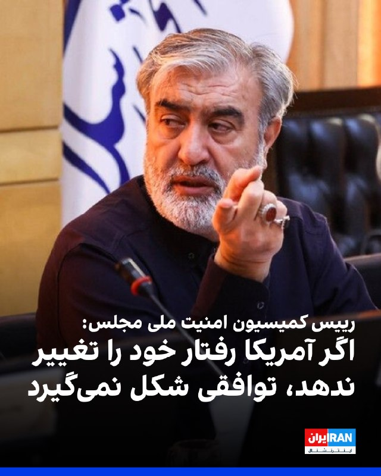

ابراهیم عزیزی، رییس کمیسیون امنیت ملی مجلس، در مصاحبه با رسانه روسی اسپوتنیک گفت: «آمریکا در مذاکرات قابل اعتماد نبوده و اگر رفتار خود را تغییر ندهد، توافقی شکل نخواهد گرفت.»

او ادامه داد جمهوری اسلامی «مدیریت تنگه هرمز را به‌صورت دائمی دنبال می‌کند و این سیاست مقطعی نیست».

رییس کمیسیون امنیت ملی مجلس افزود حکومت ایران قصد ندارد ذخایر اورانیوم غنی‌شده خود را به کشور ثالث منتقل کند.
‌🏁 🇬🇧 IranintlTV

🤖 @VahidOOnLine

## VahidOOnLine — post 242705

‏بر اساس اسناد وزارت دادگستری آمریکا، محمد باقر سعد داوود الساعدی با قاسم سلیمانی و ابومهدی المهندس ارتباط نزدیک داشته است.

‏در گزارش آمده او تصاویر و اطلاعات مراکز یهودی و اهداف آمریکایی را برای فردی فرستاد که در واقع مامور مخفی آمریکا بود. در صورت محکومیت، ممکن است به حبس ابد محکوم شود

‏گفت‌وگو با عرفان قانعی‌فرد، تحلیلگر خاورمیانه
‌🏁 🇬🇧 IranintlTV

🤖 @VahidOOnLine

## VahidOOnLine — post 242704

  

♦️جلال دهقانی فیروزآبادی، دبیر شورای راهبردی روابط خارجی جمهوری اسلامی ایران، روز جمعه هشتم خرداد ماه در گفتگویی با روزنامه شرق گفت چین به‌طور غیرمستقیم از پاکستان در مذاکرات مشارکت داشته و «یکی از بازیگرانی است تفاهم احتمالی میان آمریکا و ایران را تضمین می‌کند.»
دبیر شورای راهبردی روابط خارجی با اشاره به نقش پاکستان در مذاکرات گفت اسلام‌آباد به دلیل روابط مناسب با ایران، آمریکا و عربستان سعودی و همچنین انگیزه‌های ملی خود، توانسته نقش موثری در میانجی‌گری ایفا کند. به گفته او، انگیزه‌های شخصی و ملی پاکستان، از جمله نقش عاصم منیر فرمانده ارتش این کشور و ارتباطات او با دونالد ترامپ، می‌تواند به پیشبرد مذاکرات کمک کند.
دهقانی فیروزآبادی همچنین افزود منازعه ایران و آمریکا یکی از پیچیده‌ترین و طولانی‌ترین اختلافات در عرصه بین‌المللی است و با وجود نقش‌آفرینی اسلام‌آباد، محدودیت‌هایی در این روند وجود داشته که موجب شده چین نیز به‌صورت غیرمستقیم در مذاکرات حضور داشته باشد.
به ادعای این مقام جمهوری اسلامی، به نظر می‌رسد از دیدگاه دونالد ترامپ، گزینه تفاهم و مذاکره بر تشدید تنش برتری یافته است
‌🇸🇦 Indypersian

🤖 @VahidOOnLine

## VahidOOnLine — post 242703

  <a href="telegram/content/VahidOOnLine_242703_1780044409.mp4" target="_blank">🎬 Download video</a>

♦️مقام‌های رومانی اعلام کردند در پی حمله پهپادی روسیه در نزدیکی مرز اوکراین، یک ساختمان مسکونی در شهر گالاتسی هدف قرار گرفت و دو نفر زخمی شدند. مجروحان برای درمان به بیمارستان منتقل شده‌اند.

این حادثه در حالی رخ داده که حملات روسیه به مناطق مرزی اوکراین ادامه دارد و چندین بار بقایای پهپادها و موشک‌ها به خاک کشورهای عضو ناتو در همسایگی اوکراین سقوط کرده است.
‌🇸🇦 Indypersian

🤖 @VahidOOnLine

## VahidOOnLine — post 242702

‏وال‌استریت ژورنال از شبکه‌ای متشکل از نفتکش‌های موسوم به «ناوگان سایه» پرده برداشت که با انتقال‌های مخفیانه در دریا، منشا نفت ایران را پنهان می‌کنند. این تجارت سالانه ده‌ها میلیارد دلار درآمد برای جمهوری اسلامی به همراه دارد

‏گفت‌وگو با علیرضا محبی، خبرنگار ایران‌اینترنشنال
‌🏁 🇬🇧 IranintlTV

🤖 @VahidOOnLine

## VahidOOnLine — post 242701

  

به گزارش حال‌وش، با گذشت ۸۱ روز از ناپدید شدن دو صیاد بلوچ به نام‌های انس ایراندوست و صمد ایراندوست که با یک قایق موتوری برای صیادی راهی آب‌های آزاد دریای عمان شده بودند، همچنان هیچ اطلاعی از سرنوشت آنان در دست نیست و خانواده‌هایشان در نگرانی و بی‌خبری به‌سر می‌برند.
انس ایراندوست ۲۷ ساله و پدر دو فرزند و صمد ایراندوست ۴۰ ساله و پدر پنج فرزند است و هر دو شهروند ساکن روستای پُزم از توابع شهرستان کنارک بوده‌اند. این دو شهروند بلوچ روز ۱۷ اسفندماه ۱۴۰۴، هم‌زمان با آغاز تنش‌ها و درگیری‌های نظامی در منطقه پس از عزیمت برای صیادی ناپدید شدند.
به گفته منابع آگاه، خانواده‌های این دو صیاد در این مدت بارها پیگیری کرده‌اند اما هیچ نهاد رسمی پاسخ روشنی درباره سرنوشت آنان نداده است.
در هفته‌ها و ماه‌های اخیر، گزارش‌های متعددی درباره ناپدید شدن ملوانان و صیادان بلوچ در آب‌های دریای عمان، تنگه هرمز و مسیرهای اقیانوسی منتشر شده است.

‌🏁 🇬🇧 IranintlTV

🤖 @VahidOOnLine

## VahidOOnLine — post 242700

♦️شرکت فناوری سرگرمی «گلکسی کورپوریشن» کره جنوبی روز پنجشنبه هشتم خرداد در سئول نمایش مدی برگزار کرد که در آن ربات‌ها و انسان‌ها با لباس‌های یکسان روی صحنه حاضر شدند: رویدادی که با هدف به تصویر کشیدن همزیستی انسان و ربات‌ها در آینده طراحی شده بود.

به گزارش رویترز، این نمایش با عنوان «نمایش مد هوش مصنوعی فیزیکی ماخ ۳۳» (MACH33: Physical AI Fashion Show) در «پارک ربات گلکسی» در سئول برگزار شد و ربات‌ها در کنار مدل‌های انسانی با پوشش‌های هماهنگ در برابر تماشاگران ظاهر شدند.

در بخشی از این برنامه، ربات‌هایی که شنل بر تن داشتند روی صحنه رفتند وسپس دو مدل زن شنل‌ها را از تن آن‌ها برداشتند تا لباس‌های اصلی نمایان شود.

پس از آن، مدل‌های انسانی با همان لباس‌ها وارد صحنه شدند و در کنار ربات‌ها ژست گرفتند.

ربات‌ها و انسان‌ها همچنین در اجرایی که آمیزه‌ای از مد، فناوری رباتیک و هنرهای نمایشی بود، برنامه هماهنگی را روی صحنه به نمایش گذاشتند.
‌🇸🇦 Indypersian

🤖 @VahidOOnLine

## VahidOOnLine — post 242699

  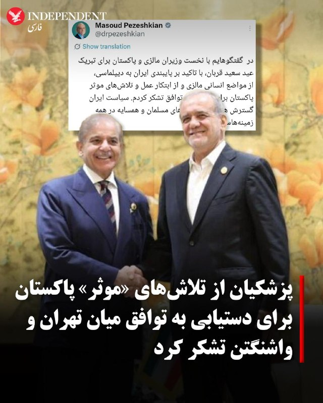

♦️مسعود پزشکیان، رئیس جمهوری اسلامی ایران روز جمعه هشتم خرداد با انتشار پیامی در اکس از تلاش‌های پاکستان برای «رسیدن به توافق» تشکر کرد و نوشت: «سیاست ایران گسترش همکاری با کشورهای مسلمان و همسایه در همه زمینه‌هاست. »

این پیام یک روز پس از یک دور جدید از تشدید تنش‌ها در خلیج فارس منتشر می‌شود. سپاه پاسداران روز پنجشنبه اعلام کرد در پاسخ به حمله آمریکا به محلی در بندرعباس، «مبدا حمله را هدف قرار داده است.» همزمان کویت اعلام کرد با حملات موشکی و پهپادی مقابله کرده است. کویت، عربستان سعودی، امارات، قطر و اتحادیه عرب، حمله به کویت را به‌شدت محکوم کردند.

پزشکیان نوشت: «در گفتگوهایم با نخست وزیران مالزی و پاکستان برای تبریک عید سعید قربان، با تاکید بر پایبندی ایران به دیپلماسی، از مواضع انسانی مالزی و از ابتکار عمل و تلاش‌های موثر پاکستان برای رسیدن به توافق تشکر کردم. سیاست ایران گسترش همکاری با کشورهای مسلمان و همسایه در همه زمینه‌هاست.»
‌🇸🇦 Indypersian

🤖 @VahidOOnLine

## VahidOOnLine — post 242698

  

پزشکیان در ایکس با اشاره به گفتگوهایش با نخست‌وزیران مالزی و پاکستان، بر پایبندی جمهوری اسلامی به دیپلماسی تاکید کرد و گفت: «سیاست حکومت ایران گسترش همکاری با کشورهای مسلمان و همسایه در همه زمینه‌هاست.»
‌🏁 🇬🇧 IranintlTV

🤖 @VahidOOnLine

## VahidOOnLine — post 242697

  

اسرائیل هیوم در گزارشی نوشت موساد در سال‌های اخیر شاخه‌ای محرمانه برای نزدیک‌تر کردن سقوط جمهوری اسلامی ایجاد کرده است. به گفته منابع آگاه، رییس موساد متقاعد شده است که اگر ترامپ با تهران توافق نکند و محاصره دریایی را ادامه دهد، جمهوری اسلامی تا پایان سال ۲۰۲۶ سقوط می‌کند.
به نوشته اسرائیل هیوم، ماموریت ابتدایی این شاخه که در سال ۲۰۲۱ و پس از آغاز ریاست داوید بارنیا بر موساد ایجاد شد، عملیات‌ هدفمند برای کنار زدن مقام‌های ارشد جمهوری اسلامی بود، اما به‌تدریج به بخشی از راهبرد گسترده‌تر موساد برای «تغییر رژیم» تبدیل شد.
رییس پیشین این شاخه به اسرائیل هیوم گفت موساد در گذشته بیشتر از طریق ترور افراد را حذف می‌کرد، اما اکنون افشای اطلاعات شرم‌آور یا آسیب‌زننده درباره مقام‌ها می‌تواند آن‌ها را از حلقه قدرت خارج کند؛ روشی که به گفته او «ارزان‌تر و ساده‌تر از عملیات ترور» است.
به نوشته اسرائیل هیوم، مقام‌های موساد معتقدند عملیات‌های اخیر علیه ایران فقط یک مرحله در مسیر سقوط جمهوری اسلامی بوده است. رئیس پیشین شاخه نفوذ گفت این واحد اکنون با شدت بیشتری فعالیت می‌کند و هدف آن «سریع‌تر کردن ساعت شنی پایان حکومت است».
‌🏁 🇬🇧 IranintlTV

🤖 @VahidOOnLine

## WithYashar — post 12845

خب این متن را مینویسم که همه حتما ببینند. امروز و فردا روز بسیار مهمی هست. ما هر دو شب را بیدار خواهیم ماند برای گزارش و برای دوشنبه آخر شب هم در صورتی که حمله نبود میخواهیم یک پیام برای شاهزاده بفرستیم ساعت ۱۱:۱۱ دقیقه . در نتیجه از همه شما دعوت میکنم خیلی رسمی و محترمانه صحبتهای خود را بنویسید و امروز بر روی متن تمرکز کنید و فردا از ساعت ۱۰ صبح تا ۱۰ شب برای من ارسال کنید تا چکیده ای از تمام آنها را ارسال کنم و فقط کلام من نباشد. حتی شده یک کلمه از پیام هر شخص را برمیداریم و متنی باهم میسازیم که در خور باشد. پس از شما دعوت میکنم به این کمپین بپیوندید ،لطفا امروز و فردا از فرستادن دایرکتهای غیرمعمول بپرهیزید سوال بیشتری را نمیتوانم پاسخ بدهم متن کامل است هر صحبتی که دارید در همان متن بنویسید تا همه با هم متن پایانی را استوری، کامنت ، دایرکت و ایمیل کنیم 🙌🏾. شروع ارسال فردا ۱۰ صبح و آخرین مهلت ارسال برای من فردا ۱۰ شب است.
@withyashar

## WithYashar — post 12844

تحلیل عوستاد رائفی پور :
آمریکایی‌ها نیروهای بیگانه فضایی هم کمک گرفتن
@withyashar

## WithYashar — post 12843

شبکه العربیه به نقل از منابع آگاه گزارش داد جمهوری اسلامی می‌خواهد اورانیوم غنی‌سازی‌شده خود را به چین منتقل کند، مشروط بر آن‌که چین تضمین دهد این مواد را به آمریکا تحویل نخواهد داد.
@withyashar

## WithYashar — post 12842

اسرائیل هیوم در گزارشی نوشت موساد در سال‌های اخیر شاخه‌ای محرمانه برای نزدیک‌تر کردن سقوط جمهوری اسلامی ایجاد کرده است. به گفته منابع آگاه، رییس موساد متقاعد شده است که اگر ترامپ با تهران توافق نکند و محاصره دریایی را ادامه دهد، جمهوری اسلامی تا پایان سال ۲۰۲۶ سقوط می‌کند.
ماموریت ابتدایی این شاخه که در سال ۲۰۲۱ و پس از آغاز ریاست داوید بارنیا بر موساد ایجاد شد، عملیات‌ هدفمند برای کنار زدن مقام‌های ارشد جمهوری اسلامی بود، اما به‌تدریج به بخشی از راهبرد گسترده‌تر موساد برای «تغییر رژیم» تبدیل شد.
رییس پیشین این شاخه به اسرائیل هیوم گفت موساد در گذشته بیشتر از طریق ترور افراد را حذف می‌کرد، اما اکنون افشای اطلاعات شرم‌آور یا آسیب‌زننده درباره مقام‌ها می‌تواند آن‌ها را از حلقه قدرت خارج کند؛ روشی که به گفته او «ارزان‌تر و ساده‌تر از عملیات ترور» است.، مقام‌های موساد معتقدند عملیات‌های اخیر علیه ایران فقط یک مرحله در مسیر سقوط جمهوری اسلامی بوده است. رئیس پیشین شاخه نفوذ گفت این واحد اکنون با شدت بیشتری فعالیت می‌کند و هدف آن «سریع‌تر کردن ساعت شنی پایان حکومت است».
@withyashar

## WithYashar — post 12841

سنتکام : ادعا: تلویزیون دولتی ایران ادعا کرد که نیروهای ایرانی یک هواپیمای آمریکایی را در نزدیکی بوشهر سرنگون کرده‌اند. نادرست.
حقیقت: هیچ هواپیمای آمریکایی سرنگون نشده است. تمام دارایی‌های هوایی ایالات متحده در نظر گرفته شده است.
@withyashar

## WithYashar — post 12840

  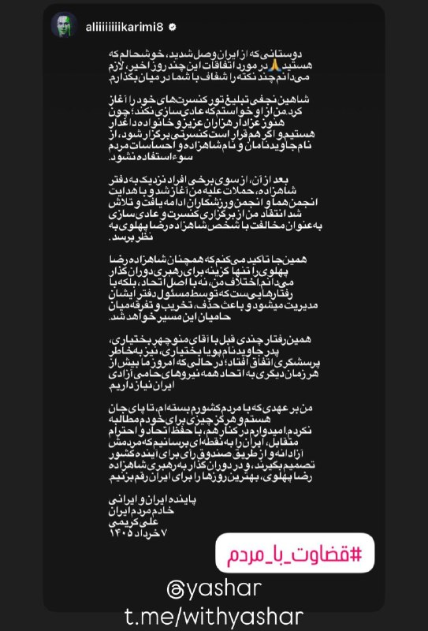

استوری جدید علی کریمی و حمایت از شاهزاده رضا پهلوی
@withyashar

## WithYashar — post 12839

ابراهیم عزیزی رئیس کمیسیون امنیت ملی مجلس: آنچه امروز جمهوری ایران دنبال می‌کند، مدیریت هوشمند تنگه هرمز است.
اعمال کنترل و ترتیبات ایران در تنگه هرمز ماهیت دائمی دارد و بی‌تردید مقطعی نیست.
ایران قصد ندارد اورانیوم غنی شده خود را به کشور ثالث منتقل کند.
@withyashar

## WithYashar — post 12838

رویترز: ترامپ در شرایطی به دنبال پایان دادن به جنگ با ایران است که همزمان با دو فشار متضاد مواجه شده است. از یک سو افزایش قیمت انرژی و نگرانی از تبعات اقتصادی جنگ، کاخ سفید را به سمت دستیابی به توافق سوق می‌دهد و از سوی دیگر بخشی از جمهوری‌خواهان و متحدان سیاسی ترامپ خواهان ادامه فشار نظامی و جلوگیری از هرگونه امتیازدهی به جمهوری اسلامی هستند.
@withyashar

## WithYashar — post 12837

  <a href="telegram/content/WithYashar_12837_1780044414.mp4" target="_blank">🎬 Download video</a>

ونس: دستاوردهای ما علیه ایران قابل توجه بوده است

جی‌ دی ونس، معاون رئیس‌جمهور آمریکا: اگر به آنچه تاکنون به دست آورده‌ ایم نگاه کنید ،در صورتی که بتوانیم به یک توافق نهایی برسیم ،در حال بازگشایی تنگه هرمز هستیم.

ما پیش‌تر توان نظامی متعارف آنها( ایران) را به‌ شدت تضعیف کرده‌ ایم و در موقعیتی قرار داریم که میتوانیم برنامه هسته‌ ای‌ شان را به‌ طور قابل توجهی عقب بیندازیم،نه فقط در دوره این رئیس‌ جمهور، بلکه در بلندمدت.

این یک اتفاق بسیار، بسیار خوب برای مردم آمریکا است.
@withyashar

## WithYashar — post 12836

یه مقام ایرانی به وال استریت ژورنال: تهران نگرانه که اسرائیل، آمریکا رو از مذاکرات خارج کنه
@withyashar

## WithYashar — post 12835

  <a href="telegram/content/WithYashar_12835_1780044416.mp4" target="_blank">🎬 Download video</a>

پودر شدن موشلی ۹۰ روزه شد
@withyashar

## mwarmonitor — post 9876

🔸«اوایل صبح امروز، در جریان حملات روسیه به زیرساخت‌های اوکراین در نزدیکی مرز، یک ساختمان مسکونی در رومانی هدف یک پهپاد قرار گرفت. دبیرکل ناتو، مارک روته، با مقام‌های رومانی در تماس است. ما بی‌پروایی روسیه را محکوم می‌کنیم و ناتو به تقویت پدافندهای خود در برابر…

## mwarmonitor — post 9875

🔸«اوایل صبح امروز، در جریان حملات روسیه به زیرساخت‌های اوکراین در نزدیکی مرز، یک ساختمان مسکونی در رومانی هدف یک پهپاد قرار گرفت. دبیرکل ناتو، مارک روته، با مقام‌های رومانی در تماس است. ما بی‌پروایی روسیه را محکوم می‌کنیم و ناتو به تقویت پدافندهای خود در برابر همه تهدیدها، از جمله پهپادها، ادامه خواهد داد.»
— سخنگوی ناتو

@mwarmonitor

## mwarmonitor — post 9874

  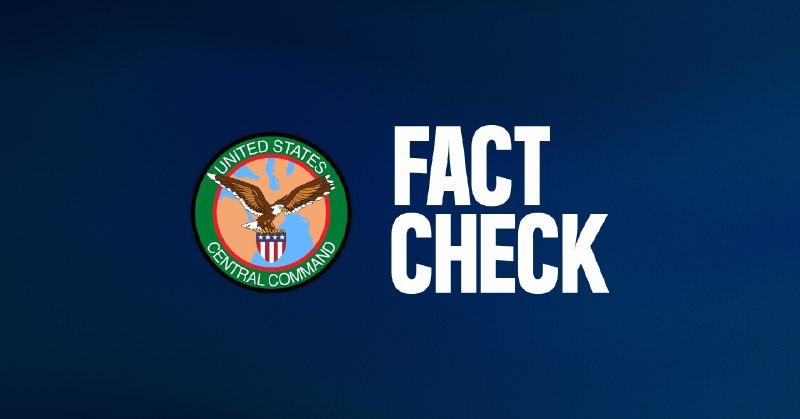

🚫 ادعا: تلویزیون دولتی ایران مدعی شد نیروهای ایرانی یک هواپیمای آمریکایی را در نزدیکی بوشهر سرنگون کرده‌اند — نادرست.

✅ حقیقت: هیچ هواپیمای آمریکایی سرنگون نشده است. تمامی دارایی‌ها و هواگردهای هوایی ایالات متحده سالم بوده و همگی شناسایی و حسابرسی شده‌اند.

@mwarmonitor

## mwarmonitor — post 9873

🔴وزیر خارجه پاکستان جمعه ساعت ۱۰ صبح به وقت شرق آمریکا (ET) با مارکو روبیو، وزیر خارجه ایالات متحده، دیدار خواهد کرد؛ این در حالی است که دونالد ترامپ در حال بررسی پیش‌نویس توافقی است که بر اساس آن تنگه هرمز دوباره بازگشایی شود و گفت‌وگوهای هسته‌ای با ایران آغاز گردد—مشروط به اینکه آمریکا محاصره بنادر ایران را کنار بگذارد. نیویورک پست

@mwarmonitor

## mwarmonitor — post 9872

🔴ونس می‌گوید ایالات متحده و ایران به یک توافق «بسیار نزدیک» هستند

📝باراک راوید AXIOS

🔰چرا این موضوع اهمیت دارد: امضای این یادداشت تفاهم، بزرگ‌ترین گشایش دیپلماتیک از زمان آغاز جنگ خواهد بود، اما دستیابی به یک توافق نهایی که خواسته‌های هسته‌ای رئیس‌جمهور ترامپ را برآورده کند، نیازمند مذاکرات فشرده بیشتری است.

🔸ترامپ و مشاورانش در مراحل قبلی جنگ نیز چندین بار فکر می‌کردند به توافق نزدیک شده‌اند، اما مذاکرات بارها با بن‌بست مواجه شد.

تحولات جدید در خبر
بنا بر گزارش قبلی اکسیوس در روز پنجشنبه، مذاکره‌کنندگان آمریکایی و ایرانی روی یک یادداشت تفاهم ۶۰ روزه به توافق رسیده‌اند، اما ترامپ هنوز موافقت نهایی خود را اعلام نکرده است.
مقامات آمریکایی ادعا کردند همتایان ایرانی آن‌ها از طریق واسطه‌ها به آن‌ها گفته‌اند که تاییدیه لازم را دارند و آماده امضا هستند. یک مقام رسمی از یکی از کشورهای میانجی نیز این موضوع را تایید کرد.
مذاکره‌کنندگان آمریکایی جزئیات توافق نهایی را به اطلاع ترامپ رساندند، اما او بلافاصله آن را تایید نکرد. یک مقام آمریکایی گفت: «رئیس‌جمهور به واسطه‌ها اعلام کرد که برای فکر کردن در این باره به چند روز زمان نیاز دارد.»
حکومت ایران هنوز به طور علنی در مورد این خبر اظهار نظر نکرده است، اما خبرگزاری تسنیم، وابسته به سپاه پاسداران انقلاب اسلامی، به نقل از یک منبع ادعا کرد که این یادداشت تفاهم هنوز نهایی نشده است.
آخرین وضعیت (وضعیت موجود)
مقامات ارشد آمریکایی گفتند که تا بعدازظهر پنجشنبه، ترامپ تمایل به امضای این توافق داشته، اما هنوز این کار را انجام نداده است.
ترامپ بعدازظهر پنجشنبه با شیخ تمیم بن حمد آل ثانی، امیر قطر، گفت‌وگو کرد تا درباره توافق با ایران رایزنی کند. قطر یکی از میانجی‌های کلیدی بین دو کشور است.
یک مقام آمریکایی گفت یکی از دلایلی که ترامپ می‌خواهد چند روز دیگر صبر کند، این است که مطمئن شود مقامات ایرانی توافق را امضا می‌کنند و از آن عقب‌نشینی نخواهند کرد.
این مقام آمریکایی افزود دلیل دیگر این است که ترامپ می‌خواهد پیش از تصمیم‌گیری نهایی، ببیند بحث‌های سیاسی داخلی پیرامون این توافق چگونه پیش می‌رود.
اظهارات ونس
ونس که رهبری تیم مذاکره‌کننده ایالات متحده در گفتگوها با ایران در اسلام‌آبادِ پاکستان در ماه آوریل را بر عهده داشت و از آن زمان به شدت درگیر این موضوع بوده است، روز پنجشنبه گفت دشوار است بگوییم ترامپ چه زمانی یا آیا اصلاً این یادداشت تفاهم با ایران را امضا خواهد کرد یا خیر.
«ما روی چند نکته نگارشی و زبانی در حال رفت‌وبرگشت (بحث) هستیم. ما در اینجا پیشرفت‌های زیادی داشته‌ایم.»
ونس افزود: «امیدواریم به پیشرفت خود ادامه دهیم و رئیس‌جمهور در موقعیتی قرار گیرد که بتواند توافقنامه را تایید کند، اما مشخصاً این موضوع هنوز مشخص نیست (TBD).»
او در پایان گفت: «نمی‌توانم تضمین کنم که به آنجا (توافق) خواهیم رسید... اما در حال حاضر حس خوبی نسبت به آن دارم.»

@mwarmonitor

## FoxNewsTwitter — post 342392

  

Fox News (Twitter/X)

WATCH LIVE: Hegseth holds bilateral meeting with Vietnam's president
https://twitter.com/i/broadcasts/1dGYllpbnmYKX

## pm_afshaa — post 91807

  

علیرضا فیروز جا قهرمان شرنج دنیا عکس شیر و خورشید پست کرد

💧 Rainbet.com the #1 Non-KYC Crypto Casino & Sportsbook @rainbetcom

😁 @Pm_Afshaa

## pm_afshaa — post 91806

🔴سنتکام:ادعـا تلویزیون دولتی ایران که گفته بود نیروهای ایرانی یک هواپیمای آمریکایی را نزدیک بوشهر سرنگون کردن غلطه

💧 Rainbet.com the #1 Non-KYC Crypto Casino & Sportsbook @rainbetcom

😁 @Pm_Afshaa

## pm_afshaa — post 91805

یه مقام ایرانی به وال استریت ژورنال: تهران نگرانه که اسرائیل، آمریکا رو از مذاکرات خارج کنه

💧 Rainbet.com the #1 Non-KYC Crypto Casino & Sportsbook @rainbetcom

😁 @Pm_Afshaa

## pm_afshaa — post 91804

🔴سی‌ان‌ان:حداقل 50 تونل دسترسی به شهرهای موشکی در ایران پس از حملات اسرائیل که آنها را مسدود کرده بود، پاکسازی و تعمیر شدن

💧 Rainbet.com the #1 Non-KYC Crypto Casino & Sportsbook @rainbetcom

😁 @Pm_Afshaa

## DEJradio — post 5084

  <a href="telegram/content/DEJradio_5084_1780044419.mp4" target="_blank">🎬 Download video</a>

🤡
🔺 عقل ولایتمدار؛ قالیباف مذاکره می‌کند، ماکت ظریف را آتش‌ می‌زنند!

مذاکره با آمریکا هواداران حکومت را خشمگین کرده است، اما می‌کوشند "نفهمند" پشت مذاکرات، دیگر روحانی و ظریف نیستند بلکه سرداران‌اند که برای بقای خودشان تن به مذاکره با قاتلان خامنه‌ای داده‌اند.

#موشعلی #مذاکرات
@DEJradio

## DEJradio — post 5083

  <a href="telegram/content/DEJradio_5083_1780044421.mp4" target="_blank">🎬 Download video</a>

🔺🎥 با توجه به اینکه دسترسی بخشی از شهروندان در داخل کشور به اینترنت به‌صورت نسبی برقرار شده است ویدیوهایی از حواشی جنگ ۴۰ روزه به اشتراک گذاشته می‌شود.

یکی از این ویدیوها مربوط به شادی هموطنان بعد از اعلام کشته‌شدن علی خامنه‌ای در بمباران است.

#موشعلی #جنگ۴۰روزه
@DEJradio

## DEJradio — post 5082

  <a href="telegram/content/DEJradio_5082_1780044423.webm" target="_blank">🎬 Download video</a>

🔺📷 شبکه الحدث با استناد به تصاویر ماهواره‌ای گزارش داد جمهوری اسلامی در حال بیرون کشیدن دوباره ذخایر موشکیِ دفن‌شده‌اش از سایت‌های زیرزمینی است.

تصاویر ماهواره‌ای تازه نشان می‌دهند که سـ.ـپاه پاسداران در حال بازیابی شمار زیادی موشک است که در تأسیسات زیرزمینی پنهان شده بودند؛ هم‌زمان ماشین‌آلات سنگین و بولدوزرها نیز مشغول پاک کردن آثار حملات اخیر اسرائیل و آمریکا هستند.

#ذخایر_موشکی #جنگ
@DEJradio

## DEJradio — post 5081

  <a href="telegram/content/DEJradio_5081_1780044423.webm" target="_blank">🎬 Download video</a>

🔺📢 به گزارش «حال‌ وش» شامگاه پنجشنبه ۷ خرداد ماه ۱۴۰۵، یک مامور نیروی انتظامی در پی تیراندازی افراد مسلح در شهرستان ایرانشهر کشته شد.

استوار دوم عیسی عباسی در محدوده چهارراه بـ.ـسیج و تقاطع خیابان حافظ ایرانشهر، زمانی که با یک دستگاه موتورسیکلت در حال عزیمت به محل کار خود بوده، هدف تیراندازی افراد مسلح قرار گرفت.

تا لحظه تنظیم این گزارش، هیچ فرد یا گروهی مسئولیت این حمله را برعهده نگرفته و مقام‌های امنیتی نیز جزئیات بیشتری درباره مهاجمان یا انگیزه احتمالی این تیراندازی منتشر نکرده‌اند.

#ایرانشهر #جنگ
@DEJradio

## DEJradio — post 5080

  <a href="telegram/content/DEJradio_5080_1780044424.webm" target="_blank">🎬 Download video</a>

🚨📢 بر اساس گزارش منابع داخلی و محلی، پدافند در شهر ایران از جمله بندرعباس، جم (بوشهر) و بیدگنه در جنوب تهران فعال شد.
مردم در شهر جم صدای چند انفجار شنیدند. مسئولان محلی ادعا کردند علت انفجارها مقابله با «پهپاد‌های متخاصم» بود اما منابع غیررسمی گزارش دادند تاسیسات موشکی سـ.ـپاه پاسداران هدف حمله قرار گرفته است.

طی هفته گشته جنگنده‌های آمریکا دست‌کم دو قایق تندرو سـ.ـپاه و فرودگاه بندرعباس و چند سایت موشکی را هدف قرار دادند.
یک منبع آگاه به دژ می‌گوید علت حمله آمریکا به فرودگاه بندرعباس استقرار لانچر یا پهپاد در نزدیک باند بود. با این لانچرها چند مشوشک [یا پهپاد] به امارات پرتاب شد.

مردم به اطلاع‌رسانی جمهوری اسلامی بی‌اعتمادند. به گزارش خبرگزاری مهر، در پی شنیده شدن صدای انفجار در منطقه ۷ چاه شهرستان جم واقع در استان بوشهر، مشخص شد که این رخداد ناشی از عملکرد پدافند دفاعی بوده است.

پیش‌تر، خبرگزاری تسنیم گزارش داده بود صداهای شنیده‌شده احتمالا به شلیک‌های اخطار نیروی دریایی ایران به برخی شناورها مرتبط است. خبرگزاری فارس نیز اعلام کرد نیروهای مسلح جمهوری اسلامی پنجشنبه شب از مناطق جنوبی کشور به‌سمت اهدافی نامشخص موشک شلیک کرده‌اند.

#پدافند #جنگ
@DEJradio

## IranIntlTV — post 339535

  

شبکه سی‌ان‌ان با استناد به تحلیل تصاویر ماهواره‌ای گزارش داد جمهوری اسلامی با سرعت در حال بازسازی زرادخانه موشکی و پهپادی خود است و روند بازیابی توان نظامی، گسترده و سریع ارزیابی می‌شود.

بر اساس این گزارش، سی‌ان‌ان ۶۹ تونل در ۱۸ پایگاه موشکی زیرزمینی را بررسی کرده است. تصاویر نشان می‌دهد از زمان آغاز آتش‌بس، دست‌کم ۵۰ ورودی مسدودشده بازگشایی شده و بسیاری از ورودی‌های دیگر نیز در حال تعمیر هستند.

سی‌ان‌ان در ادامه به نمونه‌ای در غرب ایران اشاره کرد و نوشت تاسیسات زیرزمینی باختران در کرمانشاه چند هفته پیش هدف حمله قرار گرفت و هر چهار ورودی آن تخریب شد. با این حال، تصاویر جدید نشان می‌دهد دو ورودی اکنون کاملا باز به نظر می‌رسد و جاده‌های لازم برای انتقال پرتابگرهای موشکی نیز بازسازی شده است.

به گزارش سی‌ان‌ان، جمهوری اسلامی همچنین در حال پاک‌سازی دو ورودی دیگر این مجموعه است و برخی از بیش از ۱۰ دهانه ایجادشده بر اثر اصابت مهمات آمریکایی را نیز ترمیم کرده است.
https://iranintl.com/202605294719

## IranIntlTV — post 339534

  <a href="telegram/content/IranIntlTV_339534_1780044425.mp4" target="_blank">🎬 Download video</a>

مسعود بهمنی شامگاه ۱۸ دی ۱۴۰۴ در جریان اعتراضات شهریار و هنگام کمک به مجروحان در علی‌آباد، با حمله مسلحانه ماموران دو انگشت خود را از دست داد و در همان حال بازداشت شد.

خانواده بهمنی چند روز پس از بازداشت مسعود، پیکر شکنجه‌شده و بی‌جانش را در کهریزک شناسایی کردند. بر اساس گزارش‌ها ماموران برای تحویل پیکر، خانواده را به پرداخت مبلغی سنگین وادار کردند. زیر فشارهای امنیتی، خانواده جاویدنام مسعود بهمنی، او را در زادگاهش اندیمشک به خاک سپردند.

## IranIntlTV — post 339533

  <a href="telegram/content/IranIntlTV_339533_1780044427.mp4" target="_blank">🎬 Download video</a>

عدی محسن الحلفی، فرمانده ارشد در سازمان حشدالشعبی عراق، پنجشنبه در جریان انفجار ناشی از بمب کارگذاشته‌شده در خودروی شخصی‌اش کشته شد. گروه انصارالله الاوفیاء، وابسته به سپاه پاسداران، در بیانیه‌ای اعلام کرد این فرمانده از سوی «عوامل عراقی مرتبط با آمریکا و اسرائیل» کشته شده است.

تروسکه صادقی، خبرنگار ایران‌اینترنشنال، گزارش می‌دهد
@iranintltv

## IranIntlTV — post 339532

🔻سازمان ملل متحد، تجاوز و خشونت جنسی طالبان علیه زنان افغان را تایید کرد

سازمان ملل گزارش داد مقامات و نیروهای طالبان، مرتکب خشونت جنسی علیه زنان شده‌اند. در این گزارش آمده است که هیات معاونت سازمان ملل متحد در افغانستان (یوناما)، ۲۱ مورد خشونت جنسی از جمله تجاوز جنسی گروهی علیه ۱۵ زن و شش دختر افغان را در سال ۲۰۲۵ مستند کرده است.
به گزارش یوناما، مقام‌ها و نیروهای طالبان به این زنان افغان، تجاوز جنسی یا تجاوز گروهی کرده‌اند. برخی از آن‌ها هم برهنه یا وادار به ازدواج اجباری شده‌اند.
در این گزارش تاکید شده است که با وجود ممنوعیت ازدواج اجباری، مقامات طالبان از عاملان ازدواج‌های اجباری‌اند.
در بخش دیگری از این گزارش آمده است رژیم طالبان، زنان معترض را به گونه خودسرانه بازداشت کرده و هدف شکنجه، بدرفتاری و خشونت جنسی قرار داده‌ است.
با وجود این یافته‌ها، سازمان ملل از طالبان خواسته است که به خشونت جنسی پایان دهند و حقوق زنان و دختران را تضمین کنند.
در بخش دیگری از این گزارش آمده است که مقامات کنونی طالبان پیگیر سیاست‌های سرکوب‌گرانه‌ای علیه زنان و دختران افغان بوده‌اند.
گفته شده این خشونت‌ها در بستری از نیازهای شدید بشردوستانه و مصونیت کامل از مجازات رخ داده است.
ریچارد بنت، گزارشگر ویژه حقوق بشر سازمان ملل در امور افغانستان، نیز تاکید کرد زنان و دختران افغانستانی به‌دلیل اعتراض یا چالش با سیاست‌های جنسیتی طالبان، با شکنجه، بدرفتاری و خشونت جنسی در بازداشتگاه‌ها مواجه بوده‌اند.
علی‌رغم ممنوعیت اعلام‌شده ازدواج اجباری در سال ۲۰۲۱، مقامات طالبان هم در ارتکاب و هم در تداوم این ازدواج‌ها دخیل بوده‌اند.

محدودیت‌های شدید خدمات حمایتی

بر اساس یکی از بندهای گزارش سازمان ملل، ارائه‌دهندگان خدمات خط مقدم در افغانستان همچنان به مدیریت پرونده‌ها و کمک حقوقی ادامه می‌دهند، اما دسترسی کلی به خدمات به‌دلیل کمبود بودجه و محدودیت‌های شدید اعمال شده بر کارکنان و فعالان حقوق بشر زن، به طور قابل توجهی کاهش یافته است.
طبق این گزارش، تا ماه ژوئیه ۲۰۲۵، بیش از ۴۰۰ مرکز بهداشتی در افغانستان تعطیل شده و صدها نقطه خدماتی مرتبط با خشونت جنسی مبتنی بر جنسیت، غیرفعال شده‌اند.
مقام‌های طالبان همچنین مانع ورود زنان افغان شاغل در سازمان ملل به ساختمان‌های این سازمان شده‌اند.

نبود عدالت و پاسخگویی

گزارش سازمان ملل به نبود چارچوب قانونی روشن برای دسترسی زنان به عدالت اشاره دارد.
شکایت‌های مربوط به خشونت جنسی عمدتا به‌وسیله مقامات مرد بررسی می‌شوند.
در ماه اکتبر سال ۲۰۲۵، مکانیسم تحقیقاتی مستقل برای افغانستان از سوی شورای حقوق بشر سازمان ملل ایجاد شد تا شواهد جنایات بین‌المللی و نقض‌های جدی حقوق بشر علیه زنان و دختران را جمع‌آوری و تحلیل کند.

توصیه‌های دبیرکل سازمان ملل

در بند دیگری از گزارش سازمان ملل، آنتونیو گوترش، دبیرکل این سازمان، از مقامات طالبان خواسته است تا فورا تمام اعمال خشونت جنسی را متوقف کنند.
گوترش همچنین تاکید کرده است تمام قوانین، سیاست‌ها و رویه‌هایی که حقوق و آزادی‌های اساسی زنان و دختران را محدود می‌کنند، باید لغو شوند.
او از مقامات طالبان خواسته است تا خود را با تعهدات بین‌المللی افغانستان و قطعنامه‌های شورای امنیت، از جمله قطعنامه ۲۶۸۱ (۲۰۲۳)، کاملا تطبیق دهند و ممنوعیت اشتغال زنان افغان در سازمان ملل متحد و سازمان‌های غیردولتی را نیز بردارند.
به گزارش افغانستان‌اینترنشنال، طالبان تاکنون به این گزارش سازمان ملل واکنش رسمی نشان نداده است.
پیش از این نیز اتهامات متعددی در مورد خشونت جنسی نیروهای طالبان علیه زنان افغان مطرح شده بود.
این گزارش بخشی از سندی جامع‌تر است که افزایش شدید خشونت جنسی مرتبط با درگیری در سطح جهانی را در سال ۲۰۲۵ ثبت کرده است.
وضعیت افغانستان به عنوان نمونه‌ای از ترکیب تبعیض جنسیتی نهادینه‌ شده با خشونت مستقیم، برجسته شده است.

🔗وب‌سایت ایران‌اینترنشنال

@iranintltv

## IranIntlTV — post 339531

  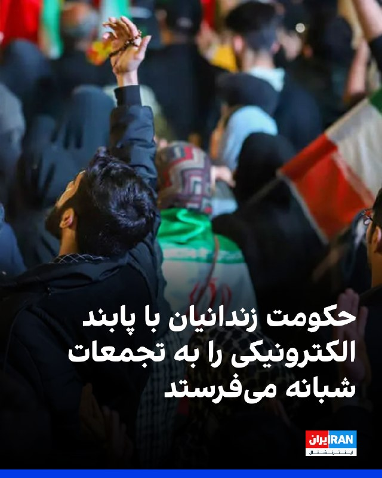

پیام‌های رسیده به ایران اینترنشنال حاکی از استفاده مقام‌های جمهوری اسلامی از زندانیان در تجمعات حکومتی شبانه است. طبق این اطلاعات،‌ شماری از زندانیان در شهرهای مختلف با پابند در تجمعات حاضر شده‌اند. یک مخاطب در پیامی نوشته است: «زندانیان جوان و نوجوان را با پابند الکترونیکی برای شرکت در تجمعات حکومتی آزاد کرده‌اند.»
پیشتر نیز شهروندان در پیام‌های متعددی اشاره کردند که برای شرکت در این تجمعات مبالغی پرداخت شده و حاضران از امتیازاتی از جمله کالاهای خوراکی، شامل روغن و برنج، بهره‌مند شدند.
https://iranintl.com/202605293755

## IranIntlTV — post 339530

  <a href="telegram/content/IranIntlTV_339530_1780044429.mp4" target="_blank">🎬 Download video</a>

یک شهروند با ارسال ویدیویی به ایران اینترنشنال اشاره می‌کند که ماموران لباس شخصی حکومت در خیابان‌های این شهر به زنان و دختران به دلیل پوشش تذکر می‌دهند و آن‌ها را تحت فشار می‌گذارند.

## IranIntlTV — post 339529

  

شبکه العربیه به نقل از منابع آگاه گزارش داد جمهوری اسلامی می‌خواهد اورانیوم غنی‌سازی‌شده خود را به چین منتقل کند، مشروط بر آن‌که چین تضمین دهد این مواد را به آمریکا تحویل نخواهد داد.

به گفته این منابع، بسیاری از نکات مرتبط با برنامه هسته‌ای جمهوری اسلامی در مذاکرات جاری حل‌وفصل شده است.

بر اساس این گزارش، جمهوری اسلامی با نظارت بین‌المللی بر تاسیسات هسته‌ای خود برای جلوگیری از تعطیل‌شدن آن‌ها موافقت کرده است.
https://iranintl.com/202605292911

## IranIntlTV — post 339528

🗣روایت شما از زندگی در دوران پس از انقلاب ملی و جنگ - جمعه ۸ خرداد ۱۴۰۵

🔹وضعیت اقتصادی داغونه. قیمت‌ها لحظه‌ای بالا می‌رن، یه وعده ناهار برای یک نفر شده نیم میلیون.

🔹از اردبیل پیام می‌دم، وضعیت داروها خیلی وخیمه. رفتم دو ورق استامینوفن‌کدئین بگیرم، گفت فقط یک ورق می‌تونم بدم چون دستور جیره‌بندی به همه داروخانه‌ها داده شده.

🔹خطاب به آموزش و پرورش؛ من یه دانش‌آموز ششمی‌ام که ۲۱ روز دیگه امتحان تیزهوشان داریم. ما هیچی نه از درس فهمیدیم نه از تیزهوشان. این تصمیم رو هم یهویی گرفتن و گفتن به‌دلیل شرایط جنگی. لطفاً رسیدگی کنید. از شهرستان بناب.

🔹اپلیکیشن دولینگو چی داره که از اون هم می‌ترسن؟ من باهاش زبان می‌خوندم ولی الان با این اینترنتی که می‌گن باز شده، هنوز کار نمی‌کنه.

🔹یک کیلو زیره چناران خریدم پنج میلیون تومان. چرا این‌قدر همه‌چیز گرونه؟ خسته شدیم.

🔹من دانش‌آموز پایه دوازدهمم. به‌خاطر نبود مدرسه و رشته مورد علاقه‌ام مجبور شدم برم مدرسه غیردولتی. امسال هیچی از مدرسه نفهمیدیم، حالا هم تهدید می‌کنن اگه شهریه رو تسویه نکنید دیپلم نمی‌دیم. از کجا بیاریم؟

🔹همه‌چی گرون شده، مرغ کیلویی ۵۰۰ شده. واقعاً دیگه نمی‌دونم چیکار کنم.

🔹کار به جایی رسیده که فوق‌لیسانس و دکترا هم کار نظافتی و ظرف‌شویی و خدماتی می‌کنن.

🔹کرج؛ کسایی که می‌گن اینترنت وصل شده و خوشحالیم، از چی خوشحالید؟ از اینترنت قطره‌چکانی به‌اصطلاح بین‌الملل؟ ۱۸ و ۱۹ دی رو فراموش کردید؟ پنج ماهه اینترنت نداریم، پنج ماه.

🔹ما تو ایران هر روز که شروع می‌کنیم، چه تو اقتصاد و تورم و معیشت، یک پله عقب‌تر از دیروز زندگی می‌کنیم.

🔹من ۱۸ سالمه و امسال کنکور دارم. پدرم بازنشسته تأمین اجتماعی هست و حقوقش از پارسال اضافه نشده. هر ماه پول کم میاریم، با این اوضاع زندگی واقعاً خیلی سخت شده.

🔹از خرم‌آباد اینجا وضعیت خیلی داغونه. گرونی و فقر کمر خیلی‌ها رو شکسته، نمی‌دونم تا کجا قراره این وضعیت ادامه پیدا کنه.

## IranIntlTV — post 339527

🔻انفجار موشک بلو اوریجین در سکوی آزمایش؛ ضربه‌ای به تلاش بزوس برای رقابت با اسپیس‌ایکس

موشک «نیو گلن» متعلق به شرکت بلو اوریجین در جریان یک آزمایش زمینی روی سکوی پرتاب منفجر شد. حادثه‌ای که می‌تواند ضربه‌ای جدی به تلاش‌های جف بزوس برای کاهش فاصله با اسپیس‌ایکس، شرکت فضایی متعلق به ایلان ماسک، وارد کند.

ویدیوهای منتشرشده از محل حادثه نشان می‌دهد موتورهای موشک حدود ساعت ۹ شب پنج‌شنبه هفتم خرداد به وقت شرق آمریکا روشن شدند، اما لحظاتی بعد موشک در سکوی پرتاب با انفجاری شدید روبه‌رو شد و حجم عظیمی از آتش و دود به آسمان برخاست.

بلو اوریجین در بیانیه‌ای اعلام کرد در جریان آزمایش با یک «ناهنجاری» مواجه شده است. اصطلاحی که شرکت‌های فضایی معمولا برای توصیف انفجار یا شکست در عملیات پرتاب به کار می‌برند.

این شرکت در شبکه اجتماعی ایکس نوشت: «در آزمایش روشن‌سازی موتور امروز با یک ناهنجاری مواجه شدیم. همه کارکنان در سلامت کامل هستند. با روشن‌تر شدن ابعاد حادثه، اطلاعات بیشتری منتشر خواهیم کرد.»

آزمایش «هات‌فایر» مرحله‌ای است که در آن موتور موشک در حالی که هنوز روی زمین مهار شده، روشن و آزمایش می‌شود.

ناسا: توسعه موشک‌های سنگین بسیار دشوار است

جرد آیزاکمن، مدیر ناسا، اعلام کرد این سازمان از وقوع حادثه مطلع است و در بررسی آن مشارکت خواهد داشت.
او در شبکه اجتماعی ایکس نوشت: «پرواز فضایی عرصه‌ای بی‌رحم است و توسعه توانایی‌های جدید برای پرتاب‌های سنگین، فوق‌العاده دشوار است. ما همراه با شرکای خود درباره این حادثه تحقیق خواهیم کرد، پیامدهای کوتاه‌مدت آن را بررسی می‌کنیم و سپس به برنامه پرتاب‌ها باز خواهیم گشت.»
آیزاکمن افزود ناسا در صورت تاثیر این حادثه بر برنامه‌های «آرتمیس» و «پایگاه ماه» جزییات بیشتری منتشر خواهد کرد.
این حادثه تنها چند روز پس از آن رخ داد که ناسا قراردادی به ارزش ۱۸۸ میلیون دلار به بلو اوریجین اعطا کرد تا با استفاده از فرودگر بدون سرنشین «مارک-۱»، ماه‌نوردها را در چارچوب برنامه آرتمیس به سطح ماه منتقل کند.

واکنش جف بزوس
جف بزوس، بنیان‌گذار بلو اوریجین، گفت که هنوز برای مشخص شدن علت اصلی حادثه زود است.
او نوشت: «روز بسیار سختی بود، اما هر آنچه لازم باشد را بازسازی می‌کنیم و دوباره به پرواز بازمی‌گردیم. ارزشش را دارد.»
بلو اوریجین و اسپیس‌ایکس در سال‌های اخیر رقابتی فشرده برای مشارکت در بازگرداندن انسان به ماه پیش از ماموریت برنامه‌ریزی‌شده دارای سرنشین‌ چین در سال ۲۰۳۰ داشته‌اند.
دو شرکت در حال توسعه فرودگرهایی هستند که ناسا قصد دارد در ماموریت‌های آینده خود به ماه از آن‌ها استفاده کند.

🔗متن کامل گزارش را اینجا بخوانید
@iranintltv

## IranIntlTV — post 339526

  

🔻تیم بسکتبال سان‌آنتونیو اسپرز با درخشش ستاره خود، ویکتور ومبانیاما، با نتیجه قاطع ۱۱۸ بر ۹۱ تیم اوکلاهماسیتی تاندر را در شکست داد. با این پیروزی مقتدرانه، سرنوشت فینال کنفرانس غرب به بازی سرنوشت‌ساز هفتم کشیده شد.

🔹اسپرز که پس از شکست قبلی در آستانه حذف قرار داشت، از همان ابتدا با دفاعی خفه‌کننده و پرتاب‌های سه‌امتیازی دقیق بر بازی مسلط شد. ومبانیاما با کسب ۲۸ امتیاز و ۱۰ ریباند، ستاره اصلی زمین بود و در کنار بازیکنانی چون استفون کسل و دیلن هارپر، شکست سنگینی را به حریف تحمیل کرد. در سمت مقابل، مدافعان سان‌آنتونیو موفق شدند شای گیلجوس‌الکساندر، ستاره نامدار تاندر را کاملاً مهار کنند. شای تنها ۱۵ امتیاز کسب کرد.

🔹برنده این نبرد جذاب یک‌شنبه دهم خرداد در زمین اوکلاهما مشخص می‌شود.

@iranintltvsport

## IranIntlTV — post 339525

  <a href="telegram/content/IranIntlTV_339525_1780044431.mp4" target="_blank">🎬 Download video</a>

جاویدنامان انقلاب ملی ایرانیان
«پرستو جراحیان» ۱۸ دی‌ماه در جریان اعتراضات مردمی، در میدان شورای شهر اراک با شلیک مستقیم نیروهای سرکوب جمهوری اسلامی از ناحیه پهلو هدف قرار گرفت. نامش در حافظه‌ این سرزمین می‌ماند و یادش چراغ راه آزادی‌خواهان است.
@iranintltv

## IranIntlTV — post 339524

  <a href="https://t.me/IranintlTV/339524" target="_blank">📎 Download file</a>

🎧نسخه صوتی اخبار بامدادی | جمعه ۸ خرداد
@iranintlTV

## IranIntlTV — post 339523

  <a href="telegram/content/IranIntlTV_339523_1780044433.mp4" target="_blank">🎬 Download video</a>

تصویر ارسالی یک شهروند ایرانی به ایران اینترنشنال نشان می‌دهد تصاویر جان‌باختگان اعتراضات انقلاب ملی در دی‌ماه در لندن روی دیوار جاویدنامان نمایش داده شده و ایرانیان در این منطقه حاضر می‌شوند.

## IranIntlTV — post 339522

  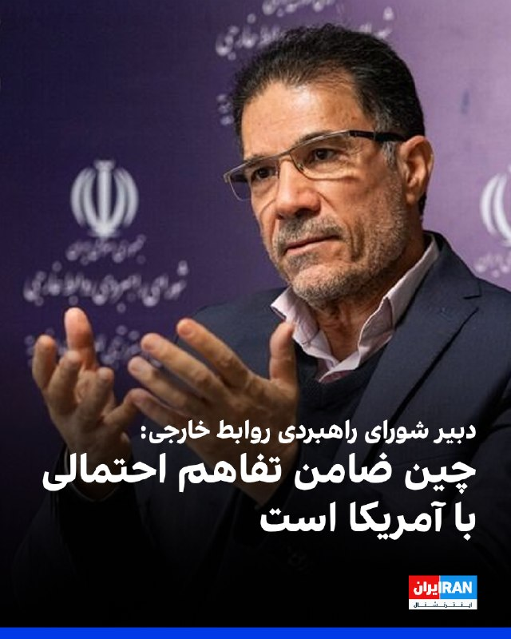

جلال دهقانی فیروزآبادی، دبیر شورای راهبردی روابط خارجی جمهوری اسلامی، با اشاره به مذاکرات جاری تهران و واشینگتن، چین را «ضامن تفاهم احتمالی» معرفی کرد و گفت برای دونالد ترامپ، رییس‌جمهوری آمریکا، «تفاهم نسبت به تشدید تنش در اولویت است».

او مذاکرات را «بسیار سخت» و موضوع مطرح‌شده در آن را «بسیار پیچیده و گسترده» خواند و افزود: «پیشنهاد می‌شود تیم حقوقی پشتیبان مذاکره تقویت شود.»
https://iranintl.com/202605290032

## IranIntlTV — post 339521

  <a href="telegram/content/IranIntlTV_339521_1780044436.mp4" target="_blank">🎬 Download video</a>

پنجمین دوره برنامه «شبی با بودا» در استکهلم برگزار شد؛ رویدادی فرهنگی که امسال بر نقش زنان در حفظ میراث فرهنگی و هویت افغانستان تمرکز داشت.

گزارش نجوا عالمی، خبرنگار ایران‌اینترنشنال
@iranintltv

## IranIntlTV — post 339520

  

ابراهیم عزیزی، رییس کمیسیون امنیت ملی مجلس، در مصاحبه با رسانه روسی اسپوتنیک گفت: «آمریکا در مذاکرات قابل اعتماد نبوده و اگر رفتار خود را تغییر ندهد، توافقی شکل نخواهد گرفت.»

او ادامه داد جمهوری اسلامی «مدیریت تنگه هرمز را به‌صورت دائمی دنبال می‌کند و این سیاست مقطعی نیست».

رییس کمیسیون امنیت ملی مجلس افزود حکومت ایران قصد ندارد ذخایر اورانیوم غنی‌شده خود را به کشور ثالث منتقل کند.
https://iranintl.com/202605299285

## IranIntlTV — post 339519

🔻مقام پیشین موساد: «کار ما با ایران تمام نشده؛ تازه شروع کرده‌ایم»

یک مقام ارشد پیشین موساد در گفت‌وگویی کم‌سابقه با روزنامه یدیعوت آحرونوت گفت که این سازمان از سال ۲۰۲۱ شاخه‌ای ویژه برای عملیات نفوذ، جنگ روانی و تاثیرگذاری بر افکار عمومی در ایران ایجاد کرده و هدف نهایی آن، تضعیف و در نهایت سقوط جمهوری اسلامی بوده است.
روزنامه یدیعوت آحرونوت در گزارشی مفصل برای نخستین بار از فعالیت شاخه‌ای مخفی در موساد پرده برداشته است که ماموریت آن نه ترور و عملیات‌های کلاسیک اطلاعاتی، بلکه جنگ روانی، عملیات نفوذ و تاثیرگذاری بر افکار عمومی در ایران بوده است.
بر اساس این گزارش، این واحد در سال ۲۰۲۱ و همزمان با آغاز ریاست داوید (دادی) بارنئا بر موساد تاسیس شد. مسئول پیشین این شاخه که تنها با نام مستعار «او» معرفی شده، مدعی است که ماموریت این واحد ایجاد شکاف میان جامعه و حکومت ایران، تضعیف مشروعیت جمهوری اسلامی و فراهم کردن زمینه‌های تغییر سیاسی در ایران بوده است.
او در این گفت‌وگو می‌گوید تا پیش از روی کار آمدن بارنئا، حتی استفاده از عبارت «تغییر رژیم» در موساد موضوعی حساس و تقریباً ممنوع بود، اما طی سال‌های بعد، سرنگونی جمهوری اسلامی به یکی از اهداف محوری فعالیت‌های این سازمان تبدیل شد.

از افشای عکس رستم قاسمی تا حذف مقام‌های جمهوری اسلامی

یکی از ادعاهای مطرح‌شده در این گزارش به رستم قاسمی، فرمانده پیشین سپاه پاسداران و وزیر راه دولت ابراهیم رئیسی، مربوط می‌شود.
بر اساس روایت یدیعوت آحرونوت، موساد در سال ۲۰۲۲ تصویری را که سال‌ها پیش در جریان سفر قاسمی به مالزی ثبت شده بود، در اختیار رسانه‌های مخالف جمهوری اسلامی قرار داد. در این تصویر، قاسمی در حال در آغوش گرفتن زنی دیده می‌شد که همسر او نبود و حجاب نیز نداشت.

این عکس در بحبوحه اعتراضات پس از کشته شدن مهسا امینی منتشر شد و به سرعت در شبکه‌های اجتماعی بازنشر شد. چند روز بعد، قاسمی از سمت خود کناره‌گیری کرد؛ استعفایی که مقام‌های جمهوری اسلامی آن را به وضعیت جسمی و بیماری او نسبت دادند.
مقام پیشین موساد گفت که انتشار این تصویر بخشی از راهبرد جدید این سازمان برای حذف مقام‌های جمهوری اسلامی بدون توسل به عملیات ترور بوده است.
او می‌گوید: «گاهی افشای یک پرونده یا اطلاعات شرم‌آور باعث می‌شود یک مقام از دایره قدرت حذف شود. این کار بسیار ارزان‌تر و ساده‌تر از اجرای عملیات ترور است.»
به گفته او، موساد طی سال‌های اخیر از این شیوه برای کنار زدن چندین مقام ارشد جمهوری اسلامی استفاده کرده است.

«ماشین سم» موساد در شبکه‌های اجتماعی

یکی از بخش‌های این گزارش به آنچه موساد «ماشین سم» می‌نامد مربوط است؛ شبکه‌ای متشکل از حساب‌های کاربری جعلی، صفحات ناشناس و سامانه‌های انتشار محتوا که به گفته این مقام سابق برای انتشار اطلاعات و روایت‌هایی با هدف بی‌ثبات کردن جمهوری اسلامی به کار گرفته شده است.
او مدعی است این شبکه در سال‌های اخیر با استفاده از فناوری‌های نوین و در برخی موارد با کمک هوش مصنوعی گسترش یافته و حتی شخصیت‌ها و اینفلوئنسرهای مجازی ساختگی برای انتشار پیام‌های مورد نظر ایجاد شده‌اند.

به نوشته یدیعوت آحرونوت، این شاخه همچنین ارتباطاتی با فعالان و چهره‌های تاثیرگذار در فضای مجازی برقرار کرده بود تا پیام‌های مدنظر خود را در میان افکار عمومی ایران گسترش دهد.

🔗متن کامل گزارش را اینجا بخوانید
@iranintltv

## IranIntlTV — post 339518

‏بر اساس اسناد وزارت دادگستری آمریکا، محمد باقر سعد داوود الساعدی با قاسم سلیمانی و ابومهدی المهندس ارتباط نزدیک داشته است.

‏در گزارش آمده او تصاویر و اطلاعات مراکز یهودی و اهداف آمریکایی را برای فردی فرستاد که در واقع مامور مخفی آمریکا بود. در صورت محکومیت، ممکن است به حبس ابد محکوم شود

‏گفت‌وگو با عرفان قانعی‌فرد، تحلیلگر خاورمیانه

## IranIntlTV — post 339517

🔻رویترز: ترامپ میان توافق با حکومت ایران و فشار جمهوری‌خواهان گرفتار شده است

به گزارش رویترز، در حالی که آمریکا و جمهوری اسلامی به چارچوب یک توافق برای تمدید آتش‌بس و بازگشایی تنگه هرمز نزدیک می‌شوند، دونالد ترامپ با یک معضل سیاسی و راهبردی روبه‌رو شده است: کاهش تنش با تهران و مهار قیمت انرژی یا ادامه فشار برای نابودی کامل برنامه هسته‌ای جمهوری اسلامی.

به گزارش رویترز، ترامپ در شرایطی به دنبال پایان دادن به جنگ با ایران است که همزمان با دو فشار متضاد مواجه شده است. از یک سو افزایش قیمت انرژی و نگرانی از تبعات اقتصادی جنگ، کاخ سفید را به سمت دستیابی به توافق سوق می‌دهد و از سوی دیگر بخشی از جمهوری‌خواهان و متحدان سیاسی ترامپ خواهان ادامه فشار نظامی و جلوگیری از هرگونه امتیازدهی به جمهوری اسلامی هستند.

بر اساس اطلاعاتی که منابع آگاه در اختیار رویترز قرار داده‌اند، واشینگتن و تهران به چارچوبی برای یک توافق نزدیک شده‌اند که می‌تواند آتش‌بس فعلی را تمدید کند، محدودیت‌های اعمال‌شده بر تردد کشتی‌ها در تنگه هرمز را برطرف سازد و تصمیم‌گیری درباره موضوعات حساس هسته‌ای را به دور بعدی مذاکرات موکول کند.

در صورت نهایی شدن این توافق و تایید آن از سوی ترامپ و رهبران جمهوری اسلامی، این توافق مهم‌ترین گام برای کاهش تنش‌ها از زمان آغاز عملیات نظامی آمریکا و اسرائیل علیه [حکومت] ایران در ۹ اسفند خواهد بود و می‌تواند به کاهش قیمت‌های جهانی انرژی که در نتیجه جنگ افزایش یافته‌اند، کمک کند.

با این حال، این توافق با مخالفت بخشی از حامیان ترامپ روبه‌رو شده است. گروهی از جمهوری‌خواهان معتقدند که دولت آمریکا نباید پیش از نابودی کامل ظرفیت هسته‌ای ایران یا بستن مسیر دستیابی تهران به سلاح هسته‌ای، امتیازی به جمهوری اسلامی بدهد.

سناتورهای جمهوری‌خواه از جمله لیندسی گراهام، تد کروز و راجر ویکر از جمله چهره‌هایی هستند که از ترامپ خواسته‌اند در مذاکرات با حکومت ایران انعطاف نشان ندهد. برخی منتقدان نیز هشدار داده‌اند که توافق در حال شکل‌گیری ممکن است دستاوردی فراتر از توافق هسته‌ای سال ۲۰۱۵ دوران باراک اوباما نداشته باشد؛ توافقی که ترامپ در دوره نخست ریاست‌جمهوری خود از آن خارج شد.

ترامپ در واکنش به این انتقادها اعلام کرده است که برای دستیابی به توافق عجله‌ای ندارد و تنها یک «توافق عالی» را خواهد پذیرفت.

به نوشته رویترز، مفاد اولیه توافق نشان می‌دهد که بسیاری از مهم‌ترین اختلافات هنوز حل نشده‌اند. از جمله سرنوشت نهایی تنگه هرمز، نحوه برخورد با ذخایر اورانیوم غنی‌شده ایران، آینده برنامه هسته‌ای جمهوری اسلامی و جزئیات هرگونه کاهش تحریم‌ها همچنان به مذاکرات بعدی موکول شده است.

این موضوع باعث شده برخی تحلیلگران و منتقدان توافق هشدار دهند که چارچوب پیشنهادی فاصله زیادی با اهداف اولیه اعلام‌شده از سوی ترامپ دارد؛ اهدافی که شامل «تسلیم بی‌قید و شرط» جمهوری اسلامی و برچیدن کامل برنامه هسته‌ای ایران می‌شد.

جیسون برادسکی، مدیر سیاست‌گذاری سازمان «اتحاد علیه ایران هسته‌ای»، در واکنش به گزارش‌ها درباره توافق احتمالی نوشت که اگر مفاد منتشرشده دقیق باشد، جمهوری اسلامی ممکن است در این توافق بیش از آمریکا امتیاز دریافت کند. او نسبت به موکول شدن موضوع هسته‌ای به مذاکرات بعدی هشدار داد و خواستار احتیاط در ارزیابی توافق شد.

🔗متن کامل گزارش را اینجا بخوانید

@iranintltv

## IranIntlTV — post 339514

‏وال‌استریت ژورنال از شبکه‌ای متشکل از نفتکش‌های موسوم به «ناوگان سایه» پرده برداشت که با انتقال‌های مخفیانه در دریا، منشا نفت ایران را پنهان می‌کنند. این تجارت سالانه ده‌ها میلیارد دلار درآمد برای جمهوری اسلامی به همراه دارد

‏گفت‌وگو با علیرضا محبی، خبرنگار ایران‌اینترنشنال

## FarsiVOA — post 218959

  

شرکت وُرتکسا می‌گوید در ماه جاری بیش از ۶۵ درصد نفتکش‌ها با خاموش کردن سیستم شناسایی خودکار از تنگه هرمز عبور کرده‌اند.

پیش از انسداد تنگه هرمز و حملات گسترده جمهوری اسلامی به کشتی‌ها، تنها نفتکش‌های قاچاق کننده نفت خود ایران برای پرهیز از ردیابی، سیستم شناسایی خودکار را خاموش می‌کردند، اما اکنون بخش بزرگی از نفتکش‌های منطقه برای پنهان ماندن از ردگیری و حملات رژیم ایران با سیگنال خاموش حرکت می‌کنند.

دامنه خاموشی سیستم شناسایی خودکار نفتکش‌ها حتی به بیرون از تنگه هرمز نیز رسیده و ورتکسا می‌گوید ۹۰ درصد از کشتی‌های حامل نفت و محصولات نفتی بندر فجیره امارات در دریای عمان نیز با سیگنال خاموش بارگیری و تردد می‌کنند.

طبق برآورد سازمان اطلاعات دریانوردی بریتانیا، از زمان آغاز جنگ جمهوری اسلامی و آمریکا، ۲۸ کشتی در آب‌های منطقه مورد هدف قرار گرفته است.
@FarsiVOA

## FarsiVOA — post 218958

🔺واکنش‌های گسترده در اروپا به نقض حریم هوایی رومانی توسط پهپاد روسی

▪️پس از آن که یک پهپاد روسی در جریان حمله شبانه به اوکراین، به یک ساختمان مسکونی در رومانی برخورد کرد و غیرنظامیان را مجروح ساخت، مقامات اروپایی این اقدام را محکوم کردند.

▪️مسئول سیاست خارجی اتحادیه اروپا، گفت: «پس از حادثه پهپاد در رومانی، نباید به مسکو اجازه داده شود که حریم هوایی اروپا را بدون مجازات نقض کند.»

▪️سخنگوی ناتو نیز نوشت: «بی‌ملاحظگی روسیه را محکوم می‌کنیم و ناتو به تقویت دفاع‌های خود در برابر همه تهدیدها، از جمله پهپادها، ادامه خواهد داد.»

▪️رومانی همزمان با احضار سفیر روسیه، اعلام کرد که طی چند ساعت آینده قراردادی برای استفاده از توانمندی‌های دفاع ضدپهپادی اتحادیه اروپا امضا خواهد کرد.

⬇️ بیشتر بخوانید:
https://ir.voanews.com/a/widespread-reactions-in-europe-to-violation-of-romanian-airspace-by-russian-drone/8155255.html

## FarsiVOA — post 218957

🔺یک مرکز نگهداری کودکان معلول به دلیل «آسیب به کودکان» تعطیل شد

▪️افشای سوختگی شدید یک کودک معلول و بستن دیگر کودکان به تخت، منجر به تعطیلی موقت مرکز نگهداری کودکان معلول در تهران شد.

▪️انتقال دوباره یک کودک به بیمارستان که پس از سوختگی با آب داغ پیش از طی مراحل درمان مرخص شده بود، موضوع بدرفتاری با کودکان تحت پوشش این مرکز را برجسته کرد.

▪️روابط عمومی سازمان بهزیستی با تأیید این گزارش مدعی است که علیه مسئول فنی و صاحب امتیاز مرکز اعلام جرم صورت گرفته و منتظر دستور قضایی برای تعطیلی دائم ‌مرکز است.

▪️آزار و آسیب‌ رساندن به کودکان در مراکز تحت پوشش بهزیستی طی سال‌های گذشته به صورت متعدد از سوی رسانه‌های داخلی گزارش شده است.

⬇️ بیشتر بخوانید:
https://ir.voanews.com/a/8155253.html

## FarsiVOA — post 218956

Farsi VOA pinned an audio file

## FarsiVOA — post 218955

  <a href="https://t.me/farsivoa/218955" target="_blank">📎 Download file</a>

🔴📢‌ نسخه صوتی اخبار ساعت ۲۰ پنجشنبه ۷ خرداد ۱۴۰۵

🛜در صورتی که با مشکل اینترنت مواجه هستید میتوانید اخبار صدای آمریکا را از نسخه‌های پادکست خبری ما روزانه دنبال کنید همچنین می‌توانید از نسخه سبک وب‌سایت ما پیگیر باشید:
https://ir.voanews.com/lite

📡بروزترین فرکانسهای ماهواره‌ای را نیز میتوانید از صفحه زیر پیگیری کنید:
https://ir.voanews.com/satellite

🔔دیگر شبکه‌های اجتماعی ما را هم دنبال کنید:
https://linktr.ee/voafarsi

ما را به اشتراک بگذارید
@voafarsi

## FarsiVOA — post 218954

  

وزارت خارجه پاکستان اعلام کرد که محمد اسحاق دار، وزیر خارجه این کشور وارد واشنگتن شده و قرار است با مارکو روبیو، همتای آمریکایی خود دیدار کند.

بر اساس اعلام وزارت خارجه پاکستان، اسحاق دار در این دیدار درباره «موضوعات دارای اهمیت دوجانبه و منطقه‌ای» گفت‌وگو خواهد کرد.

پاکستان میانجی مذاکرات میان آمریکا و جمهوری اسلامی است؛ مذاکراتی که به گفته مقامات آمریکایی پیشرفت‌هایی داشته، اما دونالد ترامپ، رئیس‌جمهوری آمریکا هنوز درباره تفاهم میان دو کشور تصمیم نگرفته است.
@FarsiVOA

## FarsiVOA — post 218953

  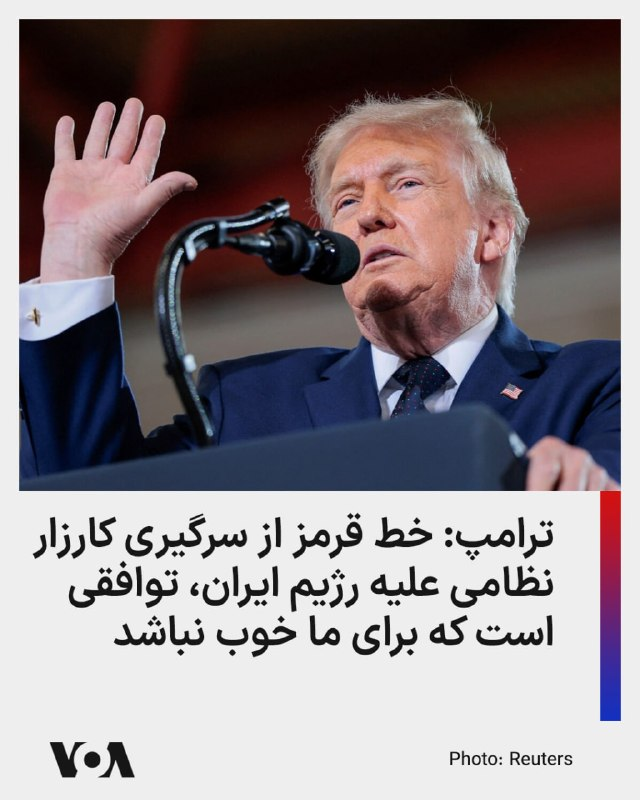

دونالد ترامپ، رئیس‌جمهوری آمریکا، درباره خط قرمزی که رژیم ایران برای ازسرگیری کارزار نظامی تهاجمی آمریکا نباید از آن عبور کند، گفت: «در نهایت خط قرمز، توافقی است که برای ما خوب نباشد. من دارم اوضاع را پیش می‌برم و خواهیم دید چه می‌شود.»

ترامپ در گفت‌وگو با فاکس نیوز هشدار داد عبور ایران از این خط، باعث آغاز دوباره کارزار نظامی تهاجمی آمریکا خواهد شد.

نسخه کامل این مصاحبه شنبه ساعت ۹ شب به وقت شرق آمریکا از شبکه فاکس نیوز پخش خواهد شد.

ترامپ به فاکس نیوز گفت که هرچند مقامات جمهوری اسلامی مذاکره‌کنندگانی «بسیار خوب» هستند، اما نیروی نظامی نابودشده آن‌ها به ایالات متحده اهرمی می‌دهد تا شرایط مطلوب خود را تحمیل کند؛ مهم‌ترین آن‌ها عدم دسترسی جمهوری اسلامی به سلاح هسته‌ای است.

رئیس‌جمهور گفت: «آن‌ها زیرک هستند، اما در نهایت همه برگ‌ها دست ماست، چون ما آن‌ها را از نظر نظامی شکست داده‌ایم.»

⬇️ بیشتر بخوانید:
https://ir.voanews.com/a/trump-reveals-the-line-iran-has-to-cross/8155213.html

## FarsiVOA — post 218952

  

آژانس بین‌المللی انرژی می‌گوید به رغم جنگ خاورمیانه، سرمایه‌گذاری‌های در حوزه انرژی جهان در سال جاری نسبت به ۲۰۲۵ حدود پنج درصد رشد خواهد داشت.

بر اساس این گزارش، انتظار می‌رود ۳.۴ تریلیون دلار در بخش انرژی جهان طی سال جاری سرمایه‌گذاری شود و بخش اعظم آن در حوزه انرژی‌های پاک خواهد بود.

بر اساس این گزارش، انتظار نمی‌رود مناقشات نظامی جمهوری اسلامی و آمریکا تاثیری بر سرمایه‌گذاری‌های حوزه نفت، گاز و زغال‌سنگ داشته باشد. امسال حدود ۱.۲ تریلیون دلار در این بخشها سرمایه‌گذاری خواهد شد.

این گزارش همچنین از آسیب به ۳۰ تاسیسات انرژی و پتروشیمی منطقه در جریان مناقشات جمهوری اسلامی و آمریکا خبر داده و گفته است بازسازی این تاسیسات نیازمند «چندین سال زمان و دهها میلیارد دلار سرمایه‌گذاری» است.

⬇️ بیشتر بخوانید:
https://ir.voanews.com/a/8155254.html

## FarsiVOA — post 218951

  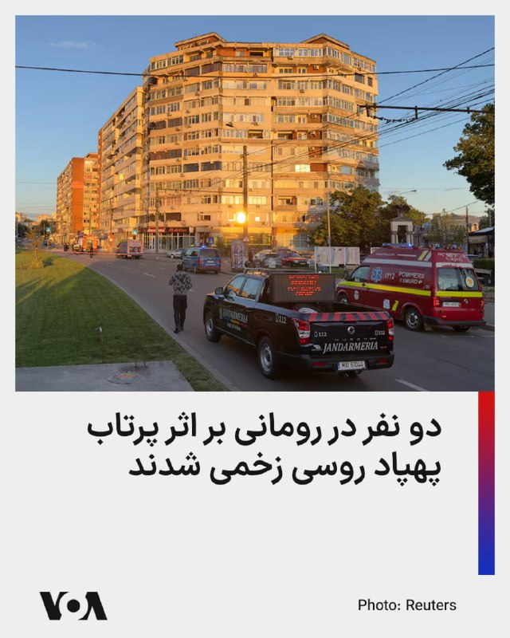

وزارت دفاع رومانی، عضو ناتو، گزارش داد که پس از برخورد یک پهپاد روسی به یک ساختمان آپارتمانی، ۲ نفر زخمی شدند.

وزارت دفاع رومانی روز جمعه اعلام کرد: «در طول شب ۲۸ تا ۲۹ مه، فدراسیون روسیه حملات پهپادی به اهداف غیرنظامی و زیرساختی در اوکراین، در نزدیکی مرز رودخانه‌ای با رومانی، را از سر گرفت.»

این وزارتخانه افزود: «یکی از این پهپادها وارد حریم هوایی رومانی شد، توسط رادار تا بخش جنوبی شهر گالاتی ردیابی شد و بر روی سقف یک ساختمان آپارتمانی سقوط کرد که برخورد آن باعث آتش‌سوزی شد».

اداره خدمات اضطراری رومانی نیز اعلام کرد که دو نفر زخمی شده‌اند.
@FarsiVOA

## DW_Farsi — post 125266

  

🔶 نخست‌وزیر جدید عراق خواستار انحلال گروه‌های مسلح شد
 
علی الزیدی، نخست‌وزیر جدید عراق از همه گروه‌های مسلح شیعه در این کشور خواسته است که تحت نظر دولت و نهادهای رسمی آن  فعالیت کنند و در ساختارهای رسمی کشور ادغام شوند.
 
این موضع‌گیری بعد از فشارهای آمریکا بر بغداد برای محدود کردن نفوذ گروه‌های شبه‌نظامی وابسته به ایران اتخاذ شده است.
 
دفتر اطلاع‌رسانی نخست‌وزیر عراق اعلام کرده است که تمامی گروه‌های مسلح باید تحت چارچوب دولت عمل کنند.
 
این تحولات پس از آن صورت گرفت که مقتدی صدر، رهبر جریان صدر و روحانی برجسته شیعه در عراق خبر داد که گروه مسلح "سرایا السلام" خود را از "جنبش ملی شیعه" جدا و در نهادهای دولتی ادغام می‌کند.
 
مقتدی صدر پیش‌تر نیز از گروه‌های مسلح مورد حمایت ایران انتقاد کرده و خواستار خلع سلاح آن‌ها شده بود. صدر در بیانیه‌ای از نیروهای "حشد الشعبی" و دیگر گروه‌های مسلح شیعه خواست سلاح خود را به دولت عراق  تحویل دهند.
 
بر اساس گزارش‌ها این رویکرد بخشی از فشارهای فزاینده واشنگتن بر دولت عراق است تا نفوذ گروه‌های شبه‌نظامی خارج از کنترل دولت کاهش یابد.
@dw_farsi

## DW_Farsi — post 125265

  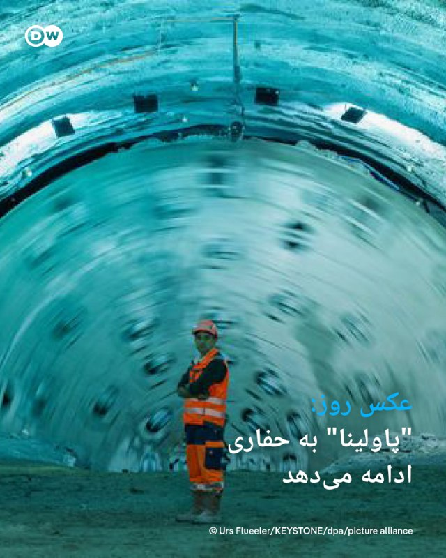

📸 عکس روز: "پاولینا" به حفاری ادامه می‌دهد

پس از نزدیک به یک سال توقف اجباری، دستگاه غول‌پیکرحفاری تونل با نام "پاولینا" اکنون دوباره در تونل گوتارد سوئیس به کار افتاده است. این دستگاه که توسط شرکت هرن‌کنشت در شهر شواناو آلمان ساخته شده، در ژوئن ۲۰۲۵ به دلیل برخورد با یک ناحیه مشکل‌دار در سنگ‌ها متوقف شده بود. در گوتارد سوئیس، یک تونل جاده‌ای در حال ساخت است. قرار است این تونل در سال ۲۰۳۰ افتتاح شود.
@dw_farsi

## DW_Farsi — post 125264

  

🔶 یک مامور انتظامی در پی حمله افراد مسلح در ایرانشهر کشته شد
 
به گزارش گروه رسانه‌ای "حال‌ وش" که اخبار سیستان و بلوچستان را پوشش می‌دهد، شامگاه پنج‌شنبه ۷ خردادماه (۲۸ مه) در پی تیراندازی افراد مسلح در شهرستان ایرانشهر، یکی از نیروهای انتظامی جان خود را از دست داد.
 
پس از انتشار خبر این حادثه، تصویری از این مامور نظامی که نامش عیسی عباسی عنوان شده توسط رسانه‌های حکومتی و کانال‌های وابسته به نهادهای امنیتی منتشر شد.
 
حال‌وش می‌نویسد بر اساس اطلاعات دریافتی، این نیروی نظامی شامگاه دیروز در محدوده چهار راه بسیج و تقاطع خیابان حافظ ایرانشهر، هنگامی که با یک دستگاه موتورسیکلت در حال عزیمت به محل کار خود بوده، هدف تیراندازی افراد مسلح قرار گرفته و بر اثر اصابت گلوله کشته شده است.
 
حال‌وش همچنین از امنیتی‌شدن فضای ایرانشهر و تلاش نیروهای امنیتی برای شناسایی عاملان حمله خبر داده است.
 
طبق گزارش‌ها تا کنون هیچ فرد یا گروهی مسئولیت این حمله را برعهده نگرفته و مقام‌های امنیتی نیز جزئیات بیشتری درباره مهاجمان یا انگیزه احتمالی این تیراندازی منتشر نکرده‌اند.
@dw_farsi

## DW_Farsi — post 125263

🔶 آزادسازی دارایی‌ها؛ مرهمی ناکافی بر زخم‌های اقتصاد جنگ‌زده

🔻گزارشی از امید برین
 
بحث بر سر آزادسازی دارایی‌های بلوکه‌شده ایران در خارج از کشور، بار دیگر به یکی از محورهای اصلی چانه‌زنی‌های دیپلماتیک بدل شده است.

در شرایطی که مقامات تهران به دنبال دسترسی به حدود ۱۲ میلیارد دلار از این منابع هستند، این پرسش مطرح می‌شود که آیا تزریق این وجوه می‌تواند راهگشای بحران‌های ساختاری اقتصاد باشد؟
 
برای واکاوی این موضوع، دویچه‌ وله فارسی نظرات کارشناسان بهزاد احمدی‌نیا، روزنامه‌نگار حوزه نفت و انرژی، اشکان نظام‌آبادی، روزنامه‌نگار اقتصادی و احمد علوی، اقتصاددان را جویا شده است.
@dw_farsi

## DW_Farsi — post 125262

  

🔶 ترامپ: در صورت شکست مذاکرات با ایران، گزینه نظامی روی میز است
 
دونالد ترامپ، رئیس‌جمهور آمریکا در ویدیوی کوتاهی که به‌عنوان پیش‌نمایش مصاحبه کامل او با شبکه "فاکس‌نیوز" در روز پنجشنبه ۷ خرداد (۲۸ مه) منتشر شد، اعلام کرده است که هر گونه توافق با ایران اگر برای آمریکا مناسب و مطلوب نباشد، قابل قبول نخواهد بود.
 
او همچنین گفته است که در نهایت روند را ارزیابی کرده و نتیجه را بررسی خواهد کرد و بر اساس آن تصمیم می‌گیرد.
 
ترامپ در ادامه خاطرنشان کرده است که مذاکرات در حال انجام است و طرف مقابل نیز در حال گفت‌وگو و تدوین متن توافق است و آن‌ها را مذاکره‌کنندگانی "بسیار خوب" توصیف کرده است. با این حال او تاکید کرده است که در نهایت ایالات متحده در موقعیت برتر قرار دارد، زیرا طرف مقابل از نظر نظامی شکست خورده است.
 
این اظهارات در حالی مطرح شده است که هم‌زمان درباره آینده آتش‌بس شکننده و مذاکرات متوقف‌شده میان دو طرف بحث‌هایی جریان دارد.
 
ترامپ در ادامه برنامه هسته‌ای ایران را یکی از محورهای اصلی اختلافات دانسته و بر ضرورت جلوگیری از دستیابی ایران به توانمندی هسته‌ای تاکید کرده است.
 
@dw_farsi

## DW_Farsi — post 125261

  

🔶 سنتکام: هیچ هواپیمای آمریکایی در نزدیکی بوشهر سرنگون نشده است
 
سنتکام صبح روز جمعه ۸ خرداد (۲۹ مه) در شبکه اجتماعی ایکس اعلام کرد که گزارش منتشرشده از سوی تلویزیون دولتی ایران درباره سرنگونی یک هواپیمای آمریکایی در نزدیکی بوشهر نادرست است.
 
در بیانیه سنتکام آمده است: «ادعای رسانه دولتی ایران مبنی بر اینکه نیروهای مسلح ایران یک هواپیمای آمریکایی را در نزدیکی بوشهر سرنگون کرده‌اند، صحت ندارد.»
 
سنتکام همچنین تاکید کرده است که هیچ هواپیمای آمریکایی سرنگون نشده و تمامی تجهیزات و دارایی‌های هوایی آمریکا در سلامت و امنیت کامل قرار دارند.
 
مسعود تنگستانی، فرماندار جم بوشهر پیش از این در گفت‌وگو با صداوسیما مدعی شده بود که در آسمان جم "یک هواگرد متخاصم هدف قرار گرفته" اما هیچ تلفات یا خسارتی نداشته و اوضاع "آرام" است.
@dw_farsi

## DW_Farsi — post 125260

  

🔶 ونس: آمریکا و ایران به توافق نزدیک شده‌اند، اما نهایی نشده است
 
جی‌دی ونس، معاون رئیس جمهور آمریکا شامگاه پنجشنبه ۷ خرداد (۲۸ مه) تائید کرد که در خصوص "تفاهم‌نامه" با ایران پیشرفت‌های زیادی میان ایالات متحده و ایران حاصل شده، اما هنوز روی برخی موضوعات کار می‌شود.
 
ونس به خبرنگاران گفت که هنوز به نتیجه قطعی نرسیده‌اند، اما به آن بسیار نزدیک شده‌اند و روند کار همچنان ادامه دارد. او همچنین تاکید کرد که هنوز مشخص نیست آیا دونالد ترامپ این توافق را تائید خواهد کرد یا خیر و او این موضوع را تضمین نمی‌کند.
 
معاون دونالد ترامپ تاکید کرد که دشوار است بتوان گفت دقیقا چه زمانی یا حتی آیا رئیس‌جمهور این تفاهم‌نامه را امضا خواهد کرد یا خیر. او همچنین افزود که ایران در حال حاضر با "نیت خوب" در حال مذاکره است و ابراز امیدواری کرده که روند پیشرفت ادامه یابد.
 
پیش از این روزنامه "نیویورک تایمز" به نقل از سه مقام آمریکایی گزارش داد که توافق بسیار نزدیک است. این توافق می‌تواند آتش‌بس ۸ آوریل را تمدید کند، به بازگشایی تنگه هرمز منجر شود و مسیر را برای مذاکرات گسترده‌تر هموار کند.
 
@dw_farsi

## DW_Farsi — post 125259

🔶 جام ۱۹۹۴ روبرتو باجو؛ "دم اسبی آسمانی" عالم فوتبال
 
🔻 گزارشی از شهرام احدی
 
«باجو، رافائل (نقاش بزرگ ایتالیایی) عالم فوتبال است؛ بازیکنان دیگر در مقایسه با او رنگرزی بیش نیستند.» این سخنی است که جیانی آنیلی ، رئیس شرکت فیات و رئیس افتخاری باشگاه یوونتوس تورین، با توجه به خلاقیت و ذوق باجو بر زبان آورده بود.
 
لئوناردو داوینچی، یکی از نوابغ بزرگ تاریخ بشریت، از شخصت‌هایی است که روبرتو باجو او را می‌ستاید و او را fantasista می‌خواند؛ کسی که از قوه تخیل و نیروی لازم برخوردار است تا حرف را به عمل تبدیل کند.
 
در ایتالیا ورزش فوتبال از لحاظ عظمت، زیبایی و لذت توان برابری با هنرهای سنتی را دارد. فوتبال‌دوستان این کشور نیز عاشق آنند که ستارگانی چون باجو را همطراز با هنرمندانی چون داوینچی و رافائل بدانند و خلاقیت آنان بستایند.
 
لفظ fantasista در فرهنگ فوتبال برای مهاجمی بازی‌ساز یا یک بازی‌ساز تهاجمی به کار می‌رود. سخن از مهره‌ای است که میان خط میانی و حمله در جنبش است؛ مرزهای شعاع بازی او مشخص نیست و هیچ تاکتیکی را نمی‌توان بر او دیکته کرد، چرا که در غیر این صورت محاسبه‌ناپذیری خود را از دست می‌دهد و بدین ترتیب تمامی هنرش را.
 
روبرتو باجو در طول فعالیت حرفه‌ای خود که در سن ۳۷ سالگی به پایان رساند، فراز و نشیب‌های زیادی را پشت سر گذاشت و در تیم‌هایی بزرگی چون یونتوس تورین، آ ث میلان، اینتر میلان، فلورانس و بولونیا توپ زد، اما در همه‌ی این باشگاه معضلی کم و بیش یکسان را تجربه کرد.
@dw_farsi

## Persian_Trend_Official — post 15227

  <a href="telegram/content/Persian_Trend_Official_15227_1780044445.mp4" target="_blank">🎬 Download video</a>

وزیر جنگ آمریکا: ایران یا توافق می‌کند یا با نیروی نظامی مواجه می‌شود.

پیت هگست در جمع سربازان آمریکایی: همانطور که رئیس جمهور در جلسه کابینه گفت، ایران یا می‌تواند با یک توافق از طریق مذاکره، کار را به روش درست انجام دهد یا می‌تواند با شخص من در سمت چپ معامله کند. که اتفاقاً من بودم اما این من نیستم. شماها هستید.

📝 Amir

📌 @persian_trend_official
پرشین ترند | متفاوت‌ترین کانال نظامی

## Persian_Trend_Official — post 15224

  <a href="telegram/content/Persian_Trend_Official_15224_1780044447.webm" target="_blank">🎬 Download video</a>

حضور پدافند موشکی برد کوتاه مجید ایرانی در رژه ارتش ارمنستان چند روز پیش در پی جابه‌جایی ادوات نظامی توسط ارتش ارمنستان در سطح شهر ایروان برای برگزاری رژه روز جمهوری ارمنستان، تصاویری از سیستم پدافندی برد کوتاه مجید با نام صادراتی AD-08 در خیابان های این…

## Persian_Trend_Official — post 15223

  <a href="telegram/content/Persian_Trend_Official_15223_1780044447.mp4" target="_blank">🎬 Download video</a>

روز گذشته با حضور زلنسکی در پایگاه هوایی اوپسالا، قرار شد سوئد 16 فروند جنگنده Saab JAS 39 Gripen C/D را به اوکراین اهدا کند.

📝 Amir

📌 @persian_trend_official
پرشین ترند | متفاوت‌ترین کانال نظامی

## Persian_Trend_Official — post 15222

  <a href="telegram/content/Persian_Trend_Official_15222_1780044449.mp4" target="_blank">🎬 Download video</a>

لحظه اصابت یک بمب از نمای نزدیک مربوط به جنگ اخیر

👺Phantom

📌 @persian_trend_official
پرشین ترند | متفاوت‌ترین کانال نظامی

## Persian_Trend_Official — post 15221

شکست آزمایش راکت شرکت آمازون با انفجار شدید

⚔️راکت «نیو گلن» متعلق به شرکت Blue Origin، بامداد پنجشنبه در جریان یک آزمایش زمینی موتور در سکوی پرتاب «ال‌سی-۳۶» واقع در کیپ کاناورال ایالت فلوریدا دچار انفجار شد؛ حادثه‌ای که می‌تواند برنامه‌های فضایی این شرکت برای ماه‌های آینده را با تأخیر جدی روبه‌رو کند.

⚔️این انفجار حدود ساعت ۹ شب به وقت محلی فلوریدا و در جریان آزمایش «هات‌فایر» رخ داد؛ آزمایشی که طی آن موتورهای مرحله نخست راکت در حالی که روی زمین ثابت هستند، روشن می‌شوند تا عملکرد سامانه‌ها پیش از پرتاب واقعی بررسی شود.

⚔️آزمایش انجام‌شده بخشی از آماده‌سازی مأموریت «NG-۴» بود؛ مأموریتی که قرار بود ۴۸ ماهواره پروژه «کوئیپر» متعلق به شرکت آمازون را به مدار زمین منتقل کند.

⚔️تصاویر منتشرشده از محل حادثه نشان می‌دهد انفجار بسیار شدید بوده و یک گلوله عظیم آتش در سکوی پرتاب ایجاد شده است. همچنین گفته می‌شود برج صاعقه‌گیر سکوی پرتاب فرو ریخته و بخش‌هایی از زیرساخت‌های پایگاه نیز آسیب جدی
دیده‌اند.

👺Phantom

📌 @persian_trend_official
پرشین ترند | متفاوت‌ترین کانال نظامی

## Persian_Trend_Official — post 15220

  <a href="https://t.me/persian_trend_official/15220" target="_blank">📎 Download file</a>

فایل صوتی لایو دیشب
نسخه کم حجم - 6.78 مگابایت

اتاق جنگ پنجشنبه 7 خرداد | نقض آتش بس یا توافق ایران و آمریکا در برزخ !

📝 Nick

📌 @persian_trend_official
پرشین ترند | متفاوت‌ترین کانال نظامی

## RadioFarda — post 157685

ایران و آمریکا برای پایان جنگ «به توافق رسیده‌اند»؛ در انتظار تأیید دونالد ترامپ

🔸رسانه‌های آمریکایی به نقل از «منابع آگاه» از مذاکرات ایران و آمریکا می‌گویند که تهران و واشینگتن به «توافق اولیه» برای تمدید آتش‌بس و رفع محدودیت‌های کشتیرانی در تنگه هرمز دست یافته‌اند.

🔸خبرگزاری رویترز به نقل از این منابع آگاه آمریکایی که به نام آن‌ها اشاره‌ نکرده است، نوشته که دونالد ترامپ، رئیس‌جمهور آمریکا، هنوز این توافق را تأیید نکرده و رسانه‌های دولتی ایران نیز اعلام کرده‌اند که توافق نهایی نشده است.

🔸بر اساس این گزارش، این توافق روز پنج‌شنبه هفتم خرداد به‌دست آمده است.

🔸بر اساس اظهارات چهار منبع آگاه در گفت‌وگو با این خبرگزاری، این توافق، آتش‌بس را برای ۶۰ روز دیگر تمدید می‌کند و اجازه می‌دهد رفت‌وآمد کشتی‌ها در تنگه هرمز ادامه یابد، همزمان تیم‌های مذاکره‌کننده دوطرف بر سر مسائل دشواری مانند برنامه هسته‌ای ایران مذاکره می‌کنند.

🔸این منابع تأکید کرده‌اند که ترامپ هنوز این توافق را تأیید نکرده است. ایران نیز تاکنون درباره گزارش‌های مربوط به این توافق، که نخستین‌بار توسط وب‌سایت آکسیوس منتشر شد، اظهار نظر رسمی نکرده است.

🔸یک مقام آمریکایی به اکسیوس گفته بود که رئیس‌جمهور آمریکا به میانجی‌ها اطلاع داده که «می‌خواهد چند روز برای فکر کردن درباره آن زمان داشته باشد».

🔸جی‌دی ونس، معاون رئیس‌جمهور آمریکا، در همین رابطه به خبرنگاران در واشینگتن گفت: «هنوز به نتیجه نهایی نرسیده‌ایم، اما خیلی نزدیک هستیم و به تلاش ادامه می‌دهیم».

🔸او افزود: «نمی‌توانم تضمین کنم که حتماً به توافق می‌رسیم، اما در حال حاضر احساس خوبی نسبت به آن دارم.»

🔸شبکه خبری سی‌ان‌ان نیز به نقل از مقام‌های آمریکایی نوشته که روز پنج‌شنبه و در جریان مذاکرات میان ایالات متحده و ایران، یک توافق اولیه حاصل شده است.

🔸این شبکه نیز تأیید کرده که این توافق اولیه کماکان در انتظار امضا و تأیید دونالد ترامپ است و وضعیت منطقه همچنان پرتنش باقی مانده است.

🔸نسخه کامل این گزارش را در وب‌سایت رادیوفردا بخوانید.

@RadioFarda

## RadioFarda — post 157683

🔸کیهان کلهر، استاد شناخته شده موسیقی ایران شامگاه پنجشنبه اعلام کرد که در راستای حمایت از کسب‌وکارهای فرهنگی و هنری آسیب‌دیده از قطع اینترنت در ایران،‌ صفحه‌ اینستاگرام خود را به تبلیغات آنها اختصاص می‌دهد.

🔸این موسیقیدان برجسته ایرانی روز پنجشنبه هفتم خرداد با انتشار متنی در استوری اینستاگرام خود اعلام کرد که صفحه‌اش را به مدت ۸۸ روز - مطابق با تعداد روز قطع اینترنت در ایران- به «تبلیغ و حمایت از کسب‌وکار اهالی فرهنگ و هنر» که به گفته او در ماه‌های اخیر به دلیل قطع اینترنت دچار خسارت شده‌اند، اختصاص خواهد داد.

🔸او از هنرمندان و فعالان فرهنگی خواسته است پست‌های تبلیغی خود را برای انتشار ارسال کنند و تأکید کرده که صفحات با تعداد دنبال‌کنندگان کمتر، در اولویت معرفی قرار خواهند گرفت.

🔸کیهان کلهر تاکید کرده است که این فراخوان تنها شامل کسب‌وکارهای داخل ایران می‌شود و انتشار تبلیغ‌ها نیز صرفا بر اساس زمان دریافت پیام‌ها انجام خواهد شد.

🔸پیشتر افشین کلاهی، رئیس کمیسیون اقتصاد دانش‌بنیان اتاق بازرگانی ایران، خسارت مستقیم ناشی از اختلال اینترنت را روزانه ۳۰ تا ۴۰ میلیون دلار برآورد کرده بود.

@RadioFarda

## RadioFarda — post 157682

🔸یک موشک «نیو گلن» شرکت بلو اوریجین که بدون سرنشین بود، روز پنج‌شنبه هفتم خرداد در جریان یک آزمایش روی سکوی پرتابی در ایالت فلوریدا منفجر شد.

🔸این رویداد ضربه‌ای جدی به پروژه فضایی جف بزوس محسوب می‌شود، در حالی که این شرکت تلاش می‌کند فاصلهٔ خود را با اسپیس‌ایکسِ ایلان ماسک، که در آستانه عرضهٔ اولیه سهام است، کاهش دهد.

🔸ویدئویی که توسط «ناسا‌اسپیس‌فلایت» منتشر شد، که پرتاب‌ها از فلوریدا را به‌صورت زنده پخش می‌کند، نشان داد که موشک عظیم نیو گلن حدود ساعت ۹ شب به وقت شرق آمریکا (یک بامداد جمعه به وقت گرینویچ) روی سکو روشن می‌شود و سپس به یک گلوله آتش عظیم تبدیل می‌شود که شعله‌ها و دود غلیظ را به ارتفاع بالا می‌فرستد.

🔸این انفجار تازه‌ترین شکست در مسیر طولانی و پرتاخیر پروژهٔ نیو گلن است؛ موشکی که قرار است نقش کلیدی در انتقال فرودگرهای ماه و محموله‌ها در برنامه آرتمیس ناسا ایفا کند.

🔸نسخه کامل این گزارش را در وب‌سایت رادیوفردا بخوانید.

@RadioFarda

## RadioFarda — post 157681

  

🔸آمریکا اعلام کرد در حال انجام اقداماتی هماهنگ برای قطع دسترسی حکومت ایران به منابع مالی است که به گفته واشینگتن، موجب تقویت اقدامات تهاجمی منطقه‌ای و تروریسم جهانی می‌شوند.

🔸در همین راستا وزارت خارجه آمریکا روز پنج‌شنبه هفتم خرداد، چندین نهاد، فرد و کشتی را که «ستون فقرات اقتصاد غیرقانونی نفت ایران» نامیده، تحریم کرد.

🔸در بیانیه این وزارتخانه آمده که با این تحریم‌های تازه، آمریکا «به‌طور مستقیم شریان‌های مالی سپاه پاسداران انقلاب اسلامی و ساختار نظامی ایران را هدف قرار داده است.»

🔸در چارچوب این اقدامات، وزارت خارجه آمریکا هشت نهاد را تحریم و هشت کشتی را به عنوان اموال توقیف‌شده معرفی کرده است؛ این کشتی‌ها به‌دلیل مشارکت در حمل نفت یا محصولات پتروشیمی ایران هدف قرار گرفته‌اند. همچنین سه نهاد و یک فرد نیز در ارتباط با تجارت محصولات پتروشیمی با منشأ ایرانی تحریم شده‌اند.

🔸هم‌زمان، وزارت خزانه‌داری آمریکا نیز اعلام کرد که بازیگران کلیدی یک شبکه فروش نفت را تحریم کرده که ده‌ها میلیون بشکه نفت ایران به ارزش میلیاردها دلار را جابه‌جا کرده است.

@RadioFarda

## RadioFarda — post 157680

دیدگاه سیاستمداران و تحلیل‌گران اسرائیلی دربارۀ توافق احتمالی آمریکا و ایران

🔸توافق آمریکا- ایران هنوز نه به دار است و نه به بار. اما از حالا معلوم است که سرنوشت سیاسی بنیامین نتانیاهو، نخست‌وزیر اسرائیل، را در انتخابات پارلمانی اکتبر آینده رقم خواهد زد.

🔸در میانۀ موج گسترده انتقادهای داخلی از او به‌دلیل آنچه عدم موفقیتش در دستیابی به اهداف جنگ‌های سه سال اخیر در غزه، لبنان و ایران می‌خوانند، تنها معدودی از وزیران از جمله الی کوهن، وزیر انرژی که به حمایت حزب لیکود نیاز دارند، ادعا می‌کنند که توافق واشینگتن- تهران برای اسرائیل الزام‌آور نخواهد بود. ‌

🔸از سوی دیگر سیما شاین، مسئول پیشین میز ایران در موساد، به رادیو ارتش اسرائیل گفته که هر گونه توافق ایران با آمریکا، ایران برای اسرائیل هم الزام‌آور است.

🔸داوید بیتان، سیاستمدار بانفوذ حزب لیکود و رئیس کمیسیون اقتصادی کنست، این هفته خطاب به اسرائیلی‌های منتقدی که می‌گویند کشورشان در مذاکرات آمریکا- ایران دور زده شده، گفت چرا متوجه نمی‌شوید که «در موضوع هسته‌ای، نمی‌توانیم به تنهایی با ایران مقابله کنیم».

🔸آقای بیتان هم‌زمان در گفت‌وگویی رادیویی گفت مهم نیست در توافق واشینگتن با تهران چه نوشته شود. باید آماده باشیم که از این بعد هر یکی دو سال یک بار، جنگ با ایران داشته باشیم.

🔸روزنامۀ یدیعوت آحرونوت نوشته که بنیامین نتانیاهو در یازده سال گذشته، از زمان دستیابی آمریکا و پنج قدرت دیگر به توافق هسته‌ای موسوم به برجام با ایران، اصرار کرده بود که باید توافق بهتری شکل می‌گرفت.

🔸این روزنامه در ادامه این پرسش را مطرح می‌کند که آیا توافقی که در حال حاضر کاخ سفید آن را بدون مشورت اسرائیل تنظیم می‌کند، به راستی برای اسرائیل بهتر از برجام خواهد بود؟

🔸نسخه کامل این گزارش را در وب‌سایت رادیوفردا بخوانید.

@RadioFarda

## RadioFarda — post 157679

🔸تصاویر منتشر شده از جزیره هون یکی از جزایر حفاظت شده در دریاچه ارومیه بازگشت پرندگان به این جزیره را نشان می‌دهد.

🔸این تصاویر که با موسیقی منتشر شده، روز پنجم خرداد ثبت شده است.

🔸رضا رحمانی، دبیر کارگروه نجات دریاچه ارومیه روز سه‌شنبه ۲۲ اردیبهشت گفت کهه تراز دریاچه ارومیه به بالاترین سطح خود در ۶ سال گذشته رسیده و موجب احیای حیات دوباره آن و بازگشت پرندگان مهاجر شده است.

🔸بر اساس گزارش‌ها در پی بارش‌های اخیر وضعیت دریاچه ارومیه در مقایسه زمان‌های مشابه سال‌های گذشته بهتر شده است.

🔸کاوه مدنی، مدیر مؤسسه آب، محیط‌زیست و سلامت دانشگاه سازمان ملل، در هفته‌های گذشته با انتشار یک گزارش تصویری از وضعیت دریاچه ارومیه طی یک دهه گذشته گفته بود: «وضعیت دریاچه در فروردین امسال بهتر از چند سال اخیر است اما در صورت عدم تداوم بارندگی‌ها، با شروع فصل گرما، آب دریاچه دوباره تبخیر و دریاچه دوباره خشک خواهد شد.»

🔸کاهش تراز آبی و خشکی دریاچه ارومیه در سال‌های اخیر سبب نگرانی کارشناسان و فعالان محیط زیست شده و بحران محیط زیستی پیرامون دریاچه ایجاد کرده بود.

@RadioFarda

## RadioFarda — post 157678

  

🔸فرماندهی مرکزی آمریکا، سنتکام، روز جمعه هشتم خرداد این ادعای تلویزیون جمهوری اسلامی را رد کرد که گفته بود ایران یک هواپیمای آمریکایی را در نزدیکی بوشهر سرنگون کرده‌ است.

🔸به گفتهٔ سنتکام، هیچ هواپیمای آمریکایی سرنگون نشده است. تمام تجهیزات هوایی ایالات متحده تحت کنترل و قابل حسابرسی هستند.

🔸در پی انتشار گزارش‌هایی درباره شنیدن صدای انفجار و شلیک در جنوب ایران، رسانه‌های نزدیک به سپاه پاسداران شامگاه پنجشنبه از شلیک به سمت برخی شناورها در تنگه هرمز خبر دادند.

🔸برخی رسانه‌ها بامداد جمعه به نقل از مسعود تنگستانی، فرماندار جم، گزارش داده بودند که یک «هواگرد» آمریکایی در آسمان این شهرستان هدف قرار گرفته است.

@RadioFarda

## RadioFarda — post 157677

  

🔸وزارت دادگستری آمریکا علیه محمدباقر سعد داوود السعدی شهروند دوتابعیتی عراقی-ایرانی و عضو کتائب حزب‌الله کیفرخواستی هشت بندی صادر و او را به مشارکت در توطئه‌های تروریستی از جمله برنامه‌ریزی برای بمب‌گذاری در اروپا و آمریکا متهم کرد.

🔸مقام‌های آمریکا می‌گویند السعدی به عنوان مامور کتائب حزب‌الله و سپاه پاسداران فعالیت داشته و در نزدیک به ۲۰ حمله و تلاش برای حمله در سراسر اروپا و ایالات متحده دست داشته است.

🔸به گفته دادستان کل ایالات متحده «السعدی مستقیماً در عملیات تروریستی برای حمله به منافع ایالات متحده و اسرائیل در سراسر جهان دست داشته و با دیگران برای برنامه‌ریزی حملات مرگبار در خاک آمریکا همکاری کرده است.»

🔸تصاویر منتشر شده در شبکه‌های اجتماعی السعدی را در کنار قاسم سلیمانی فرمانده پیشین نیروی قدس سپاه نشان می‌دهد.

🔸وزارت دادگستری آمریکا اعلام کرد که او به تازگی در عراق بازداشت و به آمریکا منتقل شده است.

@RadioFarda

## RadioFarda — post 157676

  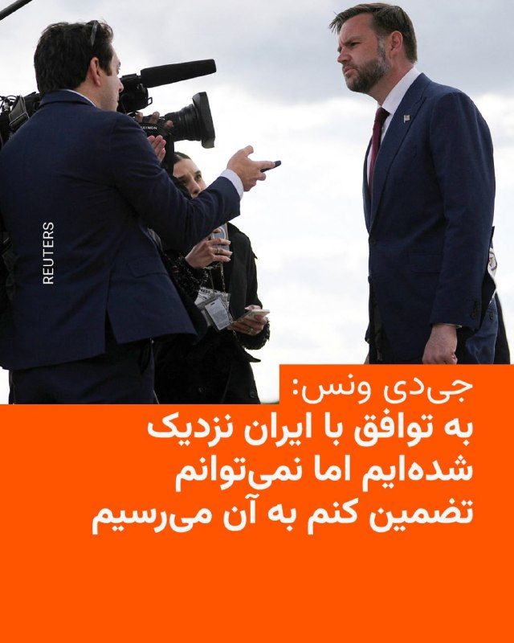

🔸معاون رئیس‌جمهور آمریکا می‌گوید واشینگتن هنوز با ایران به توافق نهایی نرسیده است، اما طرف‌ها به آن نزدیک شده‌اند.

🔸جی‌دی ونس روز پنجشنبه هفتم خرداد به خبرنگاران گفت: «نمی‌توانم تضمین کنم که به توافق می‌رسیم، اما در حال حاضر احساس نسبتاً مثبتی دارم».

🔸به گفته منابعی که با سایت اکسیوس و خبرگزاری رویترز صحبت کرده‌اند، ایالات متحده و ایران روز پنج‌شنبه به توافقی دست یافتند تا آتش‌بس میان خود را تمدید کرده و محدودیت‌های مربوط به کشتیرانی در تنگه هرمز را لغو کنند؛ این توافق منوط به تأیید دونالد ترامپ، رئیس‌جمهور آمریکا، است.

🔸آقای ونس گفت در مذاکرات با تهران چند موضوع اختلافی وجود دارد، از جمله ذخایر اورانیوم غنی‌شدهٔ ایران و مسئلهٔ غنی‌سازی.

🔸او افزود: «دقیقاً نمی‌توان گفت رئیس‌جمهور چه زمانی یا حتی آیا یادداشت تفاهم را امضا خواهد کرد یا نه. ما بر سر چند نکته در متن همچنان در حال رفت‌وبرگشت هستیم».

🔸معاون رئیس‌جمهور آمریکا افزود ایالات متحده در موقعیتی است که می‌تواند برنامه هسته‌ای تهران را به‌طور قابل‌توجهی عقب بیندازد.

@RadioFarda

## IranianMinds — post 20999

  <a href="https://t.me/IranianMinds/20999" target="_blank">📎 Download file</a>

سرور فوق العاده پرسرعت و قوی مخصوص اینستا و یوتیوب سرعت فضایی

متصل تمام اینترنت ها

آموزش اتصال در اندروید

آموزش اتصال در آیفون

حتما شیر بدید بقیه هم متصل شن لطفا دانلود سنگین هم نزنید ❤️‍🔥

@IranianMinds

## IranianMinds — post 20998

  <a href="telegram/content/IranianMinds_20998_1780044454.mp4" target="_blank">🎬 Download video</a>

ویدئویی که به تازگی منتشر شده
از لحظه اصابت موشک اسرائیلی به یه پایگاه نظامی تو جنگ ۴۰ روزه.

@IranianMinds

## IranianMinds — post 20997

  <a href="https://t.me/IranianMinds/20997" target="_blank">📎 Download file</a>

سرور فوق العاده پرسرعت و قوی مخصوص اینستا و یوتیوب سرعت فضایی مخصوص ایرانسل و مخابرات

آموزش اتصال در اندروید

آموزش اتصال در آیفون

حتما شیر بدید بقیه هم متصل شن لطفا دانلود سنگین هم نزنید ❤️‍🔥

@IranianMinds

## IranianMinds — post 20996

  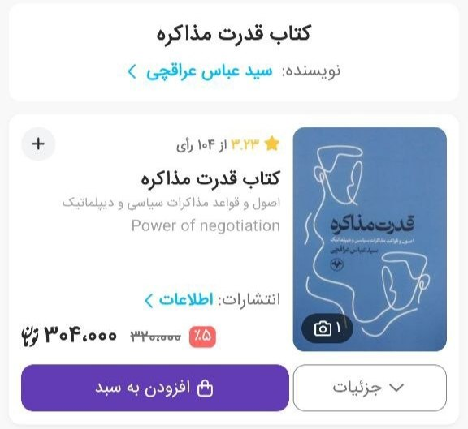

🔴کتاب قدرت مذاکره ی پرفسور عراقچی وزیر امورخارجه ی مقتدر کشورمون بعد درخواستای فراوان مردم ایران تخفیف براش در نظر گرفته شد و میتونید الان با قیمت کمتر بخونیدش و بعد از هر مذاکره جنگ به راه بندازید.

@IranianMinds

## IranianMinds — post 20995

🔴 ابراهیم عزیزی، رییس کمیسیون امنیت ملی مجلس، در مصاحبه با رسانه روسی اسپوتنیک گفت: «آمریکا در مذاکرات قابل اعتماد نبوده و اگر رفتار خود را تغییر ندهد، توافقی شکل نخواهد گرفت.»

@IranianMinds

## IranianMinds — post 20994

کسی اگر دامنه کلودفلر قدیمی داره بیاد پیوی روش کانفیگ بزنیم
هر دامنه ای باشه مشکلی نیست فقط باید قدیمی باشه داخل کلودفلر
هزینه هم بخواد میدم

@AmirrPower

## IranianMinds — post 20993

  <a href="telegram/content/IranianMinds_20993_1780044457.mp4" target="_blank">🎬 Download video</a>

🔴 فوری تایید شده :

گویا سید علی خامنه ای زندس و اولین سخنرانیش بعد از جنگ رو منتشر کرد

@IranianMinds

## IranianMinds — post 20992

شرمنده کردید اینترنت رو وصل کردید.
ما عادت نداریم به این‌همه امکانات.
حداقل به جاش برق رو قطع کنید

@IranianMinds

## IranianMinds — post 20991

🔴 جی دی ونس:

تا الآن به توافقی با ایران دست نیافته‌ایم اما بسیار نزدیک شده‌ایم.

@IranianMinds

## IranianMinds — post 20990

🔴 مقام ایرانی به وال استریت ژورنال: تهران نگرانه که اسرائیل، آمریکا رو از مذاکرات خارج کنه.

@IranianMinds

## BBCPersian — post 282329

  

‌🔻مسعود پزشکیان، رئیس‌جمهور ایران، در پستی در شبکه اجتماعی ایکس از تماس تلفنی با شهباز شریف، نخست وزیر پاکستان خبر داد و گفت از تلاش‌های «موثر» پاکستان برای رسیدن به توافق قدردانی کرده است.

آقای پزشکیان در این پست نوشته است برای تبریک عید قربان با نخست وزیران مالزی و پاکستان تماس گرفته است. او نوشت که در این تماس «با تاکید بر پایبندی ایران به دیپلماسی، از مواضع انسانی مالزی و از ابتکار عمل و تلاش‌های موثر پاکستان برای رسیدن به توافق تشکر کردم.»

پاکستان میانجی اصلی مذاکرات ایران و آمریکا بر پایان دادن به جنگ است.

به گفته آقای پزشکیان، «سیاست ایران گسترش همکاری با کشورهای مسلمان و همسایه در همه زمینه‌هاست.»

این اظهارات آقای پزشکیان در حالی بیان می‌شود که جی دی ونس، معاون رئيس جمهوری آمريکا ایران و آمریکا به توافق «خیلی نزدیک» شده‌اند اما هنوز «نهایی نشده» است.

📷Reuters
https://trib.al/RhFFr0t

@BBCPersian

## BBCPersian — post 282328

🔻پیت هگست سخنران اصلی کنفرانس امنیتی شانگری‌لا

🔻پیت هگست، وزیر دفاع آمریکا، از سخنرانان اصلی نشست دفاعی و امنیتی شانگری‌لا در سنگاپور خواهد بود. با این حال گمان می‌رود مقام‌های ارشد چین در این نشست شرکت نکنند.

این در حالی است که اختلاف آمریکا و چین بر سر تایوان و همچنین جنگ با ایران بر این نشست سایه انداخته است.

بنابر گزارش خبرگزاری فرانسه، این دومین سال پیاپی است که وزیر دفاع چین در «گفت‌وگوی شانگری‌لا» در سنگاپور شرکت نخواهد کرد، اقدامی که برخی کارشناسان آن را نشانه‌ای از افزایش قدرت و اعتمادبه‌نفس چین ارزیابی کرده‌اند.

گفته شده مقام‌های ارشد حدود ۴۵ کشور در این نشست شرکت خواهند کرد.

شانگری‌لا در گذشته نشستی برای بحث‌های سیاسی و همچنین گفت‌وگوهای دیپلماتیک، پشت‌پرده و سطح بالا بوده است.

غیبت دنگ جون، وزیر دفاع چین عملا به این معناست که دیداری میان او و آقای هگست برنامه‌ریزی نشده است.

https://trib.al/ApOfpZW
@BBCPersian

## BBCPersian — post 282319

🔻رئیس‌جمهور آمریکا، دونالد ترامپ، از «همه کشورها» خواسته است «فورا توافق‌های ابراهیم را امضا کنند»؛ اقدامی که ممکن است به‌عنوان یکی از شروط دستیابی به توافق صلح با ایران مطرح شود.

توافق‌نامه ابراهیم مجموعه‌ای از توافق‌ها برای عادی‌سازی روابط دیپلماتیک میان اسرائیل و چند کشور عربی است که در سال ۲۰۲۰ و در دوره نخست ریاست‌جمهوری آقای ترامپ امضا شد.

دونالد ترامپ در پیامی در شبکه اجتماعی تروث سوشال نوشت: «من به‌طور الزامی درخواست می‌کنم که همه کشورها فورا توافق‌نامه ابراهیم را امضا کنند و اگر ایران توافق خود را با من، به‌عنوان رئیس‌جمهور ایالات متحده آمریکا امضا کند، باعث افتخار خواهد بود که آن‌ها نیز بخشی از این ائتلاف بی‌نظیر جهانی باشند.»

این پیام پس از تماس تلفنی آقای ترامپ با رهبران عربستان سعودی، امارات متحده عربی، قطر، پاکستان، ترکیه، اردن، بحرین و مصر منتشر شد.

لینک خبر کامل:
https://bbc.in/4ofkPYd
📸GettyImages/ Reuters/ Bloomberg via Getty Images/ EPA/ Universal Images Group via Getty Images/ AFP via Getty Images

@BBCPersian

## BBCPersian — post 282318

  <a href="https://t.me/bbcpersian/282318" target="_blank">📎 Download file</a>

🔻این هفته در پرگار: گرایش سیاسی ما چگونه شکل می‌گیرد؟

🔻عقاید سیاسی ما چگونه شکل می‌گیرند؟ چطور تغییرمی‌کنند؟ چرا دیگرانی که تا دیروز همفکر می‌پنداشتیم را ممکن است امروز ناقص‌العقل بنامیم؟ آنها ما را چطور می‌بینند؟

میهمان‌ها:
پویا قدوسی، استاد جغرافیای انسانی
مانی منجمی، روان‌پزشک

@BBCPersian

## BBCPersian — post 282317

🔻نخست‌وزیر لبنان: هیچ چیز حملات اسرائیل و تخلیه گسترده جنوب کشور را توجیه نمی‌کند

🔻نواف سلام، نخست‌وزیر لبنان، گفته است هیچ چیز حملات اسرائیل و هشدارهای تخلیه گسترده در جنوب این کشور را توجیه نمی‌کند.

او گفته است اقدامات اسرائیل، از جمله تخریب بناهای تاریخی، مصداق «مجازات جمعی» است، اقدامی که به گفته او در تمام قواعد و قوانین بین‌المللی حاکم بر جنگ‌ها، انجام آن محکوم شده است.

در روزهای اخیر، با گسترش عملیات نظامی اسرائیل ده‌ها نفر در لبنان کشته شده‌اند.

حملات اسرائیل روز پنجشنبه به بیروت پایتخت لبنان هم کشید.

اسرائیل می‌گوید هدفش، حزب‌اللهِ لبنان است.

ارتش اسرائیل همچنین از ساکنان حدود یک‌هشتم خاک لبنان خواسته است تا خانه‌هایشان را به سمت مناطق شمالی‌تر ترک کنند.

https://bbc.in/4ef8C15
@BBCPersian

## BBCPersian — post 282308

🖊نوربرتو پاردس
بی‌بی‌سی موندو

🔻رید برودی، ۷۲ ساله و ساکن نیویورک، از همان سال‌های جوانی آموخت که عدالت تنها یک آرمان نیست، بلکه مبارزه‌ای جسورانه و مداوم علیه فراموشی است.

او که در سال ۱۹۵۳ در نیویورک به دنیا آمد، فرزند خانواده‌ای یهودی بود که از نازیسم جان سالم به در برده بودند. خانواده او از اردوگاه‌های کار اجباری گریختند و بعدها در آزادسازی بوداپست نقش داشتند. همین پیشینه باعث شد از کودکی با این باور بزرگ شود که جنایت‌هایی با چنین ابعادی نباید بی‌پاسخ بمانند.

دهه‌ها بعد، همین باور او را به یکی از بانفوذترین وکلای حقوق بشر در جهان تبدیل کرد و لقب «شکارچی دیکتاتورها» را گرفت.

او از آمریکای لاتین تا آفریقا، در کنار قربانیان ایستاده، روایت‌های دفن‌شده را بازسازی کرده و به محاکمه رهبرانی کمک کرده که سال‌ها دست‌نیافتنی به نظر می‌رسیدند.

متن کامل خبر را از لینک زیر بخوانید:

https://bbc.in/4dCT8ER

📷GettyImages/ Isabel Coixet/ Courtesy of Reed Brody/ AFP via Getty Images/ Star Max/GC Images

@BBCPersian

## idfinfarsi — post 11658

در یک حمله دقیق برای رفع یک تهدید فوری در شمال نوار غزه: ارتش اسرائیل و شاباک جانشین فرمانده تیپ شهر غزه در شاخه نظامی سازمان تروریستی حماس را به هلاکت رساندند

نیروهای ارتش اسرائیل و شاباک، دو روز پیش (چهارشنبه) تروریست عماد حسن حسین اسلیم، جانشین فرمانده تیپ شهر غزه و فرمانده گردان زیتون در شاخه نظامی این سازمان را هدف قرار داده و به هلاکت رساندند؛ فردی که فرماندهی یورش به خاک اسرائیل در کشتار ۷ اکتبر را بر عهده داشت.

در سال‌های اخیر و به‌ویژه در دوره اخیر، این تروریست ده‌ها طرح تروریستی علیه نیروهای ارتش اسرائیل در نوار غزه را پیش برده بود و از این رو تهدیدی فوری محسوب می‌شد.

در زیرساختی که مورد حمله قرار گرفت، یک فرمانده دیگر از سازمان تروریستی حماس نیز حضور داشت؛ نتایج این حمله در دست بررسی است.

نیروهای ارتش اسرائیل تحت فرماندهی جنوب در منطقه مطابق توافق مستقر هستند و به فعالیت برای رفع هرگونه تهدید فوری ادامه خواهند داد.

## Dirty_Kids — post 390449

  <a href="telegram/content/Dirty_Kids_390449_1780044459.mp4" target="_blank">🎬 Download video</a>

قیاسی رفته کنسرت کینگ‌رام
سیاوش اردلان پست کرده نوشته تهران واقعی اینجاس همه درحال شادی

@Dirty_Kids 👻

## Dirty_Kids — post 390448

عرزشیا دیگه چرا دارن هشتگ میزنن وقتی شما نبودید؟
تنها دلیل اینکه ما نبودیم شما مادرجنده‌هایید

@Dirty_Kids 👻

## Dirty_Kids — post 390447

  

کاشکی نت این وصل نمیشد

@Dirty_Kids 👻

## Dirty_Kids — post 390446

شبی که انبار نفت رو زدن فرداش دوستم نوشته بود چقدر همه جا تاریکه. خورشید هم زدن؟

@Dirty_Kids 👻

## Dirty_Kids — post 390445

  <a href="telegram/content/Dirty_Kids_390445_1780044461.mp4" target="_blank">🎬 Download video</a>

لعنت به جمهوری اسهالی که شرایطی به وجود آورده که من نتونم زن بگیرم ظرف شستنش رو ببینم

#نه_به_ماشین‌ظرفشویی

@Dirty_Kids 👻

## Dirty_Kids — post 390444

طولانی‌ترین قطعی اینترنت در عصر معاصر
بزرگترین قتل‌عام معترضان در تاریخ معاصر
یکی از بالاترین نرخ‌های تورم در جهان
یکی از بی‌ارزش‌ترین پول‌های جهان
یکی از کم اعتبارترین پاسپورت‌های جهان

دستاوردهای گنده‌ گوزترین حکومت جهان...

@Dirty_Kids 👻

## Dirty_Kids — post 390443

  

بنده در حال ورود به سوشال مدیا با jump jump vpn:

@Dirty_Kids 👻

## Dirty_Kids — post 390442

  <a href="telegram/content/Dirty_Kids_390442_1780044462.mp4" target="_blank">🎬 Download video</a>

یکی از نفس‌گیر ترین ویدیوهای جنگ!
چه گزارشی می‌کنه طرف!
مکان یه جایی تو خیابون شریعتی!

@Dirty_Kids 👻

## Hranews — post 113219

  

نهاله شهیدی یزدی، شهروند بهائی جهت اجرای حکم حبس احضار شد

❗️
❗️
❗️
❗️
❗️– نهاله شهیدی یزدی، شهروند #بهائی ساکن کرج، با دریافت ابلاغیه‌ای جهت اجرای حکم حبس به شعبه اجرای احکام دادگاه انقلاب کرمان احضار شد.

به گزارش خبرگزاری هرانا، ارگان خبری مجموعه فعالان حقوق بشر در ایران، نهاله شهیدی یزدی، شهروند بهائی احضار شد.

بر اساس اطلاعات دریافتی هرانا، شعبه اجرای احکام دادگاه انقلاب کرمان ابلاغیه ای برای خانم شهیدی یزدی صادر کرده است. در این ابلاغیه از وی خواسته شده، در تاریخ ۱۲ خردادماه، جهت اجرای حکم شش سال حبس خود در این شعبه قضایی حاضر شود.
لازم به ذکر است؛ علی‌رغم درخواست دادگاه از وکیل نهاله شهیدی یزدی برای مراجعه و رویت رای، نسخه‌ای از حکم در اختیار وی قرار نگرفت. متعاقبا، درخواست اعاده دادرسی او در دیوان عالی کشور به دلیل عدم ضمیمه شدن رای دادگاه تجدیدنظر مورد پذیرش واقع نشد. این در حالی است که با وجود پیگیری‌های بعدی توسط وکیل دیگر وی، دادگاه از تحویل نسخه رای خودداری کرده و صرفا امکان رویت آن را، بدون اجازه یادداشت‌برداری، تصویربرداری یا دریافت رونوشت، فراهم کرده است؛ امری که عملا امکان طرح و پیگیری درخواست اعاده دادرسی را از وی سلب کرده است.

#نهاله_شهیدی_یزدی

ادامه مطلب

↘️
@hranews_bot تماس ✉️ - @Hranews کانال هرانا 🆑

## Hranews — post 113218

به دلیل استفاده از اینترنت استارلینک؛ تشکیل پرونده قضایی برای ۴۰ شهروند در شمیرانات

❗️
❗️
❗️
❗️
❗️– فرمانده ناحیه بسیج الغدیر بخش لواسان و رودبار قصران شمیرانات اعلام کرد که از ابتدای فروردین ماه تاکنون، ۴۰ دستگاه اینترنت ماهواره‌ای استارلینک در این شهرستان کشف و برای صاحبان آنها پرونده قضایی تشکیل شده است.

ادامه مطلب

↘️
@hranews_bot تماس ✉️ - @Hranews کانال هرانا 🆑

## Hranews — post 113217

گزارشی از بازداشت حمیرا و شلیر امین‌پور در بوکان

❗️
❗️
❗️
❗️
❗️– حمیرا امین‌پور و شلیر امین‌پور، دو خواهر ساکن شهرستان بوکان، روز چهارشنبه ۶ خردادماه، توسط نیروهای امنیتی بازداشت و به مکان نامعلومی منتقل شدند.

#حمیرا_امین‌پور #شلیر_امین‌پور

ادامه مطلب

↘️
@hranews_bot تماس ✉️ - @Hranews کانال هرانا 🆑

## alonews — post 123457

  <a href="telegram/content/alonews_123457_1780044464.webm" target="_blank">🎬 Download video</a>

👈کانال ۱۲ اسرائیل : ارتش اسرائیل خود را برای افزایش حملات هوایی و عملیات زمینی با استفاده از تاکتیک‌های یورش در خارج از خط زرد در لبنان آماده می‌‌کند

✅ @AloNews خبر جنگ

## alonews — post 123456

  <a href="telegram/content/alonews_123456_1780044464.mp4" target="_blank">🎬 Download video</a>

👈پیت هگزث در جمع سربازان آمریکایی:
"همانطور که رئیس جمهور در جلسه کابینه گفت... ایران یا می‌تواند با یک توافق از طریق مذاکره، کار را به روش درست انجام دهد - یا می‌تواند با شخص من در سمت چپ معامله کند. که اتفاقاً من بودم - اما این من نیستم. شماها هستید."

✅ @AloNews خبر جنگ

## alonews — post 123455

  <a href="telegram/content/alonews_123455_1780044466.mp4" target="_blank">🎬 Download video</a>

👈ورزشِ پیت هگست، تو سنگاپور

✅ @AloNews خبر جنگ

## alonews — post 123454

  <a href="telegram/content/alonews_123454_1780044468.webm" target="_blank">🎬 Download video</a>

👈 ویدیوی حزب‌الله از هدف گرفتن دو تانک مرکاوا در جنوب لبنان با کوادکوپترهای انفجاری ابابیل

✅ @AloNews خبر جنگ

## alonews — post 123453

  

بهترین سرعت با بهترین قیمت با God Vpn🔵
تخفیف ویژه برای امشب فقط✅😍

10 گیگ فقط 280,000 تومن😍
متصل حتی در شرایط جنگی به خاطر اختصاصی بودن✅❤️😍

کانفیگ اقتصادی در ربات دوم 20 گیگ 290,000 تومن😍

برای نمایندگان پنل نمایندگی فعال میشه👍❤️

✅تضمین بدون قطعی
🌐 اتصال با تمامی دستگاه
🔻🏪پشتیبانی ۲۴ ساعته
✔️ دور زدن نت ملی
🔘 بالاترین سرعت با تمام اپراتورها
⭐با کیفیت عالی و ضمانت بازگشت وجه
🌐🌐🌐🌐🌐🌐⭐️
➖➖➖➖➖➖➖➖➖➖
جهت خرید کانفیگ اختصاصی در این ربات:
@GodVpnV2_Bot

خرید کانفیگ اقتصادی در این ربات:
@v2raypc1bot

ایدی کانال:
t.me/God_of_Vpn
پشتیبانی و خرید عمده:
@Mmkhh00
@Pc_V2ray

## alonews — post 123452

  <a href="telegram/content/alonews_123452_1780044469.webm" target="_blank">🎬 Download video</a>

👈اسحاق دار، وزیر امورخارجه پاکستان برای گفت‌وگو درباره مذاکرات ایران و آمریکا، وارد واشنگتن شد تا روبیو، همتای خود دیدار کند

✅ @AloNews خبر جنگ

## alonews — post 123451

  <a href="telegram/content/alonews_123451_1780044469.mp4" target="_blank">🎬 Download video</a>

👈تصاویری از عبور موشک های تاماهاوک از عراق در روز اول جنگ

✅ @AloNews خبر جنگ

## alonews — post 123450

  <a href="telegram/content/alonews_123450_1780044470.webm" target="_blank">🎬 Download video</a>

👈 بسته بودن تنگه هرمز برای عربستان بد نشده، چون درآمدهای نفتیش قبل از این ماجراها ماهی ۱۸میلیارد دلار بود، اما بعد از جنگ به ۲۴میلیارد دلار رسیده

🔴عربستان داره نفت بالای ۹۰دلار رو با خط لوله می‌بره دریای سرخ و از اون جا صادر می‌کنه

✅ @AloNews خبر جنگ

## alonews — post 123448

  <a href="telegram/content/alonews_123448_1780044470.webm" target="_blank">🎬 Download video</a>

👈حملات هوایی اسرائیل در جنوب لبنان ادامه دارد

✅ @AloNews خبر جنگ

## alonews — post 123447

  <a href="telegram/content/alonews_123447_1780044471.webm" target="_blank">🎬 Download video</a>

👈عوستاد رائفی پور:
آمریکایی‌ها نیروهای بیگانه فضایی هم کمک گرفتن

✅ @AloNews خبر جنگ

## alonews — post 123446

  <a href="telegram/content/alonews_123446_1780044471.webm" target="_blank">🎬 Download video</a>

👈حمله حمید رسایی به مجتبی خامنه‌ای با داستانی از پسر نوح
‼️ 
✅ @AloNews خبر جنگ

## alonews — post 123445

  <a href="telegram/content/alonews_123445_1780044471.webm" target="_blank">🎬 Download video</a>

👈حمله حمید رسایی به مجتبی خامنه‌ای با داستانی از پسر نوح
‼️

✅ @AloNews خبر جنگ

## alonews — post 123444

  <a href="telegram/content/alonews_123444_1780044471.webm" target="_blank">🎬 Download video</a>

👈دمای اهواز به ۴۸ درجه رسید و به عنوان گرم‌ترین مرکز استان ثبت شد

✅ @AloNews خبر جنگ

## alonews — post 123443

👈جهت رزرو تبلیغات در کانال #الونیوز به کانال زیر مراجعه کنید👇

📃https://t.me/ads_alonews

📃https://t.me/ads_alonews

## alonews — post 123442

  <a href="telegram/content/alonews_123442_1780044471.mp4" target="_blank">🎬 Download video</a>

👈 لحظه اصابت یک بمب اسرائیلی از نمای نزدیک در جنگ رمضان

🔴ترکش های این بمب بعد ترکیدن به صورت واضح معلوم است

✅ @AloNews خبر جنگ

## alonews — post 123441

  <a href="telegram/content/alonews_123441_1780044473.webm" target="_blank">🎬 Download video</a>

👈کانال ۱۲ عبری: ارتش اسرائیل خود را برای افزایش حملات هوایی و عملیات زمینی با استفاده از تاکتیک‌های یورش در خارج از خط زرد در لبنان آماده می‌‌کند

🔴 نهاد امنیتی اسرائیل نگران است آمریکایی‌ها به‌زودی برای توقف حملات بر آن‌ها فشار وارد کنند

✅ @AloNews خبر جنگ

## alonews — post 123440

  <a href="telegram/content/alonews_123440_1780044473.mp4" target="_blank">🎬 Download video</a>

👈ترافیک دریایی پشت تنگه هرمز

✅ @AloNews خبر جنگ

## alonews — post 123439

  <a href="telegram/content/alonews_123439_1780044475.webm" target="_blank">🎬 Download video</a>

👈ایران تهدیدهای آمریکا علیه عمان را محکوم کرد!

✅ @AloNews خبر جنگ

## alonews — post 123438

  <a href="telegram/content/alonews_123438_1780044475.webm" target="_blank">🎬 Download video</a>

👈رئیس کمیسیون امنیت ملی: ایران قصد ندارد اورانیوم غنی شده خود را به کشور ثالث منتقل کند

✅ @AloNews خبر جنگ

<!-- MSG END -->

<!-- NAV START -->

<a href="https://github.com/Dex316/aio-downloader/blob/main/telegram/content/archive_1.md" style="display:inline-block; padding:6px 12px; margin:0 4px; background-color:#2ea44f; color:white; text-decoration:none; border-radius:4px; font-weight:bold;">صفحه بعد</a>

<!-- NAV END -->
