# خواننده تلگرام

<!-- TOP_NAV START -->

<a href="https://github.com/Dex316/aio-downloader/blob/main/telegram/content/archive_1.md" style="display:inline-block; padding:6px 12px; margin:0 4px; background-color:#2ea44f; color:white; text-decoration:none; border-radius:4px; font-weight:bold;">صفحه بعد</a>

<!-- TOP_NAV END -->

<!-- MSG START -->

---
📅 بروزرسانی: 1405/03/03 09:34
---

## VahidOOnLine — post 241868

⭕️ پنج پدیده کم‌نظیر طبیعی ایران؛ از گرم‌ترین بیابان‌ها تا جنگل‌های ۵۰ میلیون ساله

📌ایران یکی از مهم‌ترین مناطق جهان از نظر فراوانی گنبدهای نمکی است

♦️ایران، به دلیل موقعیت خاص زمین‌شناسی و اقلیمی خود، میزبان برخی از کم‌نظیرترین پدیده‌های طبیعی در جهان است که می‌تواند بخش بزرگی از گردشگران علمی جهان را به‌ سوی خود جذب کند. گستره‌ای که از بیابان‌های فوق‌گرم تا جنگل‌های باستانی و تالاب‌های رنگی را در برمی‌گیرد، این سرزمین را به آزمایشگاهی طبیعی برای زمین‌شناسان، زیست‌شناسان و اقلیم‌شناسان تبدیل کرده است. بسیاری از این مناطق نه‌تنها از نظر زیبایی طبیعی برای گردشگران جذاب‌اند، بلکه از دیدگاه علمی نیز ارزش بالایی دارند و در برخی موارد، در مقیاس جهانی کم‌نظیر یا بسیار نادر به شمار می‌روند.

بیشتر بخوانید...
‌🇸🇦 Indypersian

🤖 @VahidOOnLine

## VahidOOnLine — post 241867

  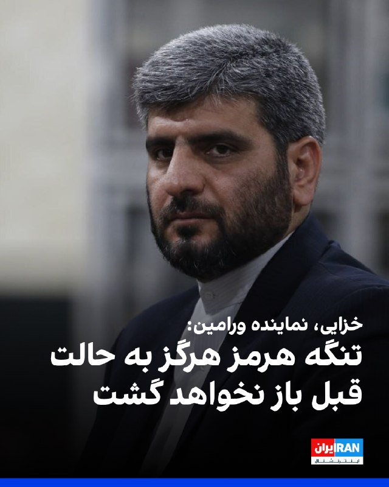

علی خزایی، نماینده ورامین در مجلس گفت: «تنگه هرمز به هیچ‌وجه و تحت هیچ شرایطی به حالت قبل باز نخواهد گشت و هیچ شناور و کشتی متعلق به آمریکا، اسرائیل و همپیمانان آنها، حق تردد از تنگه هرمز را ندارد. هر کشتی تجاری یا غیرتجاری دیگر برای عبور باید از ملت ایران مجوز بگیرد.»

او ادامه داد: «جمهوری اسلامی اگر صلاح بداند، از تنگه‌های دیگر از جمله باب‌المندب نیز برای ذلیل کردن دشمن استفاده خواهد کرد.»
‌🏁 🇬🇧 IranintlTV

🤖 @VahidOOnLine

## VahidOOnLine — post 241866

  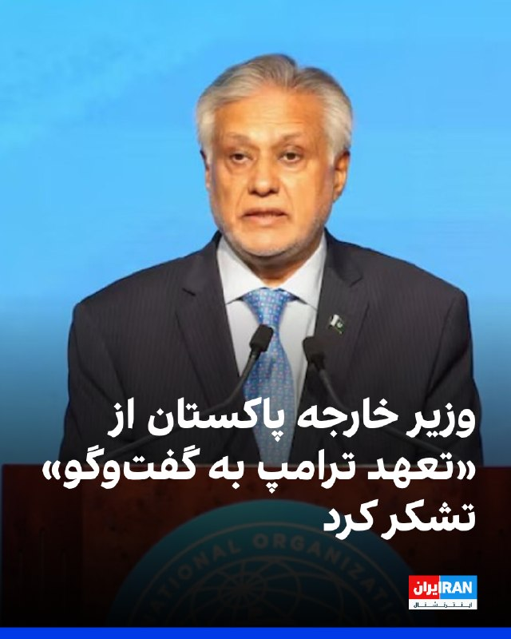

محمد اسحاق دار، وزیر خارجه پاکستان در حساب ایکس خود نوشت که از تعهد ترامپ به گفت‌وگو و دیپلماسی و تعامل سازنده رهبر و مقامات جمهوری اسلامی تشکر می‌کند و افزود: «تماس تلفنی مهم ترامپ با رهبران پاکستان، عربستان سعودی، ترکیه، قطر، مصر، امارات متحده عربی و اردن، گامی مهم به سوی هدف مشترک صلح منطقه‌ای و دستیابی زودهنگام به یک نتیجه دیپلماتیک بود.»
‌🏁 🇬🇧 IranintlTV

🤖 @VahidOOnLine

## VahidOOnLine — post 241865

  

حسین شریعتمداری، نماینده رهبر جمهوری اسلامی در روزنامه کیهان، نوشت: «تنگه هرمز بخشی از آب‌های سرزمینی ایران است و این حق قانونی برای ما محفوظ است که از کشتی‌ها و شناورهای عبورکننده از آب‌های سرزمینی خود عوارض عبور بگیریم، آمریکا هم از گلوگاه‌های دریایی عوارض دریافت می‌کند.»

او افزود: «باید از اظهارات برخی دیپلمات‌ها و تیم مذاکره‌کننده گلایه کرد که انگار قرار است بعد از پایان جنگ، شرایط و قوانین حاکم بر تنگه هرمز به حالت پیش از جنگ بازگردد، و انگار نه انگار که حاکمیت ما بر تنگه هرمز، حق قانونی و قطعی کشورمان است.»

او ادامه داد: «مگر مصر در کانال سوئز، ترکیه در داردانل و بسفر، پاناما در کانال پاناما و آلمان در کانال کیل از شناورهای عبوری عوارض نمی‌گیرند؟»
‌🏁 🇬🇧 IranintlTV

🤖 @VahidOOnLine

## VahidOOnLine — post 241864

  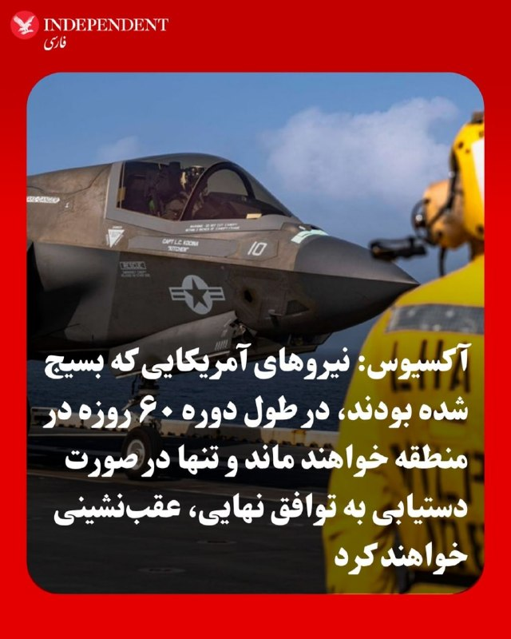

♦️آکسیوس به نقل از یک مقام رسمی ایالات متحده گزارش داد نیروهای آمریکایی که در ماه‌های اخیر بسیج شده بودند، در طول دوره ۶۰ روزه در منطقه خواهند ماند و تنها در صورت دستیابی به توافق نهایی، عقب‌نشینی خواهند کرد.
یک مقام رسمی ایالات متحده در گفتگو با آکسیوس جزئیات کلیدی از پیش‌نویس یادداشت تفاهمی را فاش کرد که دونالد ترامپ به امضای آن با ایران نزدیک شده است.
به گفته او دو طرف وارد یک دوره آتش‌بس ۶۰ روزه خواهند شد و طی آن نیروهای نظامی بسیج‌شده آمریکا تا زمان حصول توافق نهایی در منطقه باقی خواهند ماند و در صورت صلاحدید واشنگتن مبنی بر عدم جدیت ایران در مذاکرات هسته‌ای، این توافق حتی پیش از پایان ۶۰ روز ملغی خواهد شد.
در این مدت تهران متعهد می‌شود بدون دریافت هیچ‌گونه حق عوارضی، نسبت به پاک‌سازی مین‌های مستقر در تنگه هرمز اقدام کرده و مسیر کشتیرانی آزاد را بازگشایی کند و در مقابل، آمریکا محاصره بنادر ایران را لغو و معافیت‌های تحریمی را برای فروش آزادانه نفت ایران صادر خواهد کرد.
‌🇸🇦 Indypersian

🤖 @VahidOOnLine

## VahidOOnLine — post 241863

  

احمد وحیدی، فرمانده کل سپاه پاسداران در پیامی مکتوب، اعلام کرد: «نیروهای مسلح در بالاترین سطح آمادگی و بازدارندگی فعال در همه ابعاد موشکی، هوایی، دریایی، زمینی، فضایی و سایبری قرار دارند و بر این اساس بدیهی است هرگونه تعرض مجدد دشمن، پاسخی ویرانگر و جهنمی در ابعاد منطقه‌ای و فرامنطقه‌ای در پی خواهد داشت.»

او ادامه داد: «فتح خرمشهر، الگویی ماندگار برای پیروزی در خرمشهرهای پیش رو و آزادی قدس و نابودی اسرائیل به‌دست محور مقاومت و مجاهدان جهان اسلام است.»
‌🏁 🇬🇧 IranintlTV

🤖 @VahidOOnLine

## VahidOOnLine — post 241862

  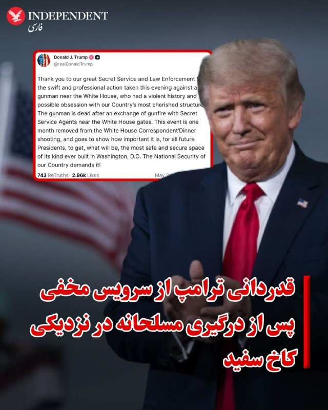

♦️دونالد ترامپ با انتشار پیامی در تروث سوشال از اقدام سریع و حرفه‌ای نیروهای سرویس مخفی و مجریان قانون در مقابله با یک فرد مسلح در نزدیکی کاخ سفید قدردانی کرد.
به گفته ترامپ، این فرد مهاجم که دارای سابقه خشونت‌آمیز بوده، پس از تبادل آتش با مأموران سرویس مخفی در نزدیکی دروازه‌های کاخ سفید کشته شده است. او با اشاره به اینکه این حادثه تنها یک ماه پس از تیراندازی در مراسم شام خبرنگاران کاخ سفید رخ داده، بر اهمیت ایجاد امن‌ترین فضای ممکن در واشنگتن دی‌سی برای تمامی رؤسای جمهور آینده تأکید کرد و آن را لازمه امنیت ملی کشور دانست.
رسانه‌های آمریکایی هویت عامل تیراندازی عصر شنبه در مجاورت کاخ سفید را «نصیر بست»، جوان ۲۱ ساله اهل مریلند، معرفی کردند که به عنوان فردی با اختلالات روانی و عاطفی شدید برای ماموران امنیتی شناخته‌شده بوده است.
‌🇸🇦 Indypersian

🤖 @VahidOOnLine

## VahidOOnLine — post 241861

  

آکسیوس به نقل از یک مقام آمریکایی گزارش داد پیش‌نویس یادداشت تفاهم احتمالی تهران و واشینگتن شامل تعهد جمهوری اسلامی به پیگیری نکردن ساخت سلاح هسته‌ای و مذاکره درباره تعلیق برنامه غنی‌سازی اورانیوم و کنار گذاشتن ذخایر اورانیوم با غنای بالا است.

بر اساس گفته دو منبع آگاه، حکومت ایران از طریق میانجی‌ها تعهدات شفاهی درباره دامنه امتیازهایی که حاضر است در زمینه تعلیق غنی‌سازی و واگذاری مواد هسته‌ای بدهد، به آمریکا ارائه کرده است.

طبق این گزارش، آمریکا موافقت خواهد کرد در طول دوره ۶۰ روزه درباره رفع تحریم‌ها و آزادسازی دارایی‌های ایران مذاکره کند، اما اجرای این اقدامات تنها در قالب یک توافق نهایی که به‌طور قابل راستی‌آزمایی اجرا شود، انجام خواهد شد.

همچنین نیروهای آمریکایی که در ماه‌های اخیر بسیج شده‌اند، در طول این ۶۰ روز در منطقه باقی خواهند ماند و تنها در صورت دستیابی به توافق نهایی عقب‌نشینی خواهند کرد.

پیش‌نویس یادداشت تفاهم همچنین تصریح می‌کند جنگ میان اسرائیل و حزب‌الله در لبنان پایان خواهد یافت.
‌🏁 🇬🇧 IranintlTV

🤖 @VahidOOnLine

## VahidOOnLine — post 241860

  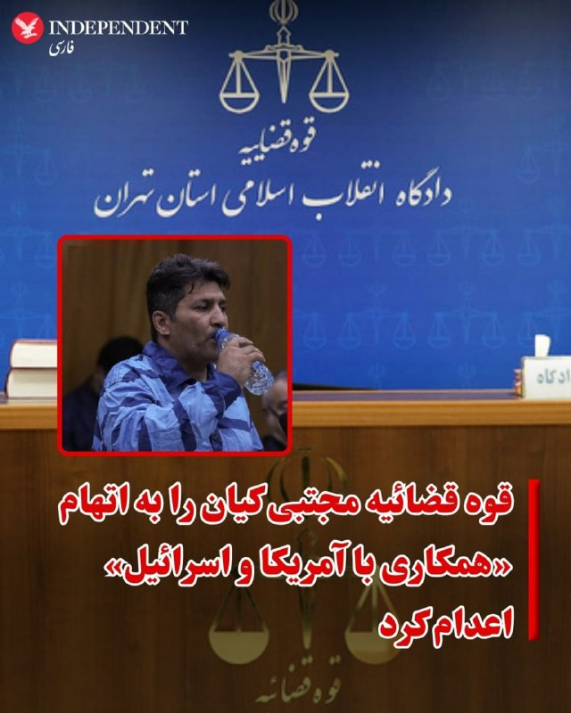

♦️خبرگزاری میزان، وابسته به قوه قضائیه روز یکشنبه سوم خرداد از اعدام مجتبی کیان به اتهام «ارسال اطلاعات مراکز تولید صنایع دفاعی به دشمن» در جنگ ۴۰ روزه خبر داد.

این خبرگزاری مجتبی کیان را «عناصر همکار دشمن» در طول جنگ خوانده و اعلام کرده است که پس از تشکیل پرونده و رسیدگی قضایی در دادگستری استان البرز، بامداد روز یکشنبه پس از تأیید حکم از سوی دیوان عالی کشور و طی روال قانونی، به دار آویخته شد.

قوه قضائیه ادعا کرده است که مجتبی کیان در طول جنگ ۴۰ روزه «پیام‌های متعددی را به شبکه‌های معاند وابسته به دشمن اسرائیلی ـ آمریکایی ارسال می‌کرد که از جمله آن‌ها، مختصات و اطلاعات محل واحدهای تولید قطعات مرتبط با صنایع دفاعی کشور بود.»

جمهوری اسلامی از زمان آغاز جنگ روند اعدام مخالفان سیاسی را تشدید کرده است. گزارشگر ویژه حقوق بشر سازمان ملل ماه گذشته اعلام کرد دست‌کم ۲۱ نفر تنها در ماه مارس به‌اتهام ارتکاب جرایم امنیتی و سیاسی اعدام شده‌اند.
‌🇸🇦 Indypersian

🤖 @VahidOOnLine

## VahidOOnLine — post 241859

  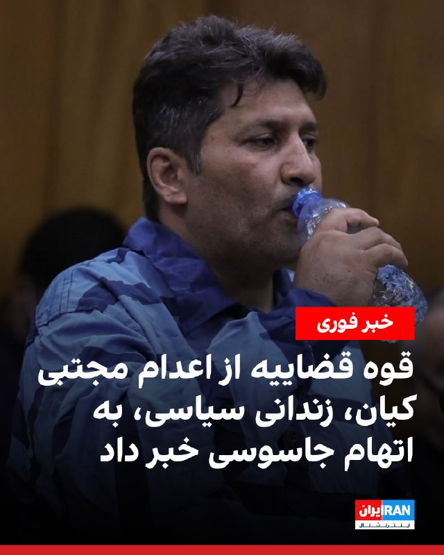

خبرگزاری قوه قضاییه، میزان، اعلام کرد مجتبی کیان، زندانی سیاسی، پس از تشکیل پرونده در دادگستری استان البرز به اتهام ارسال اطلاعات صنایع نظامی ایران به «دشمن» در جنگ اخیر، اعدام شد. طبق این گزارش، مجتبی کیان این پیام‌ها را به «یک شبکه ماهواره‌ای» و «معاند» ارسال کرده بود.
این شهروند به اتهام فعالیت اطلاعاتی برای اسرائیل و آمریکا، به اعدام و مصادره کلیه اموال محکوم شده بود.
طبق اعلام قوه قضاییه، از زمان بازداشت مجتبی کیان تا اجرای مجازات او در ۳ خرداد ۱۴۰۵، کمتر از ۵۰ روز زمان صرف شد.

‌🏁 🇬🇧 IranintlTV

🤖 @VahidOOnLine

## VahidOOnLine — post 241858

  

آکسیوس به نقل از یک مقام آمریکایی، جزییاتی از توافق احتمالی جمهوری اسلامی و آمریکا را که ممکن است یک‌شنبه اعلام شود، منتشر کرد. این توافق شامل تمدید ۶۰ روزه آتش‌بس است که در طی آن تنگه هرمز بازگشایی می‌شود،‌ تهران می‌تواند آزادانه نفت بفروشد و مذاکرات هسته‌ای برگزار خواهد شد.
به گفته این مقام آمریکایی، این تفاهم ۶۰ روز اعتبار دارد و در صورت توافق دو طرف قابل تمدید خواهد بود.
دو طرف یک یادداشت تفاهم امضا خواهند کرد که ۶۰ روز اعتبار دارد و با رضایت متقابل قابل تمدید است.
در طول این دوره ۶۰ روزه، تنگه هرمز بدون دریافت عوارض باز خواهد بود و ایران موافقت خواهد کرد مین‌هایی را که در این آبراه مستقر کرده پاک‌سازی کند تا کشتی‌ها آزادانه عبور کنند.
در مقابل، ایالات متحده محاصره بنادر ایران را لغو خواهد کرد. این مقام گفت هرچه جمهوری اسلامی سریع‌تر مین‌ها را پاک‌سازی و عبور و مرور دریایی را از سر بگیرد، محاصره نیز سریع‌تر لغو خواهد شد. او افزود اصل کلیدی دونالد ترامپ در این توافق «کاهش فشار در برابر اقدام» است.
‌🏁 🇬🇧 IranintlTV

🤖 @VahidOOnLine

## VahidOOnLine — post 241857

  

نیویورک‌تایمز به نقل از مقام‌های آمریکایی گزارش داد جمهوری اسلامی تنها پس از دستیابی به توافق نهایی هسته‌ای به بخش عمده دارایی‌های مسدود شده خود که آمریکا و متحدانش در صندوق بازسازی قرار خواهند داد، دسترسی خواهد یافت.
آزادسازی میلیاردها دلار از دارایی‌های مسدودشده ایران در خارج از کشور یکی از مولفه‌های کلیدی هر توافقی خواهد بود و به جمهوری اسلامی انگیزه می‌دهد در مذاکرات باقی بماند و به توافق برسد.

‌🏁 🇬🇧 IranintlTV

🤖 @VahidOOnLine

## VahidOOnLine — post 241856

  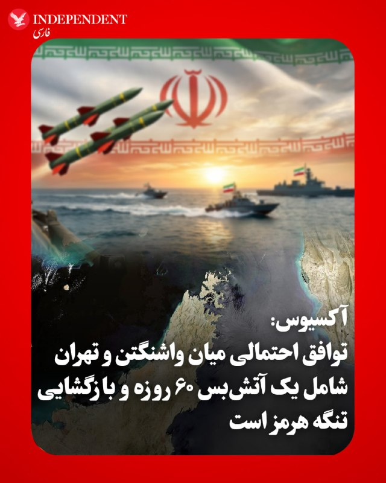

♦️یک مقام رسمی ایالات متحده در گفتگو با آکسیوس جزئیات کلیدی از پیش‌نویس یادداشت تفاهمی را فاش کرد که دونالد ترامپ به امضای آن با ایران نزدیک شده است؛ بر اساس این طرح، دو طرف وارد یک دوره آتش‌بس ۶۰ روزه خواهند شد که طی آن تهران متعهد می‌شود بدون دریافت هیچ‌گونه حق عوارضی، نسبت به پاک‌سازی مین‌های مستقر در تنگه هرمز اقدام کرده و مسیر کشتیرانی آزاد را بازگشایی کند و در مقابل، آمریکا محاصره بنادر ایران را لغو و معافیت‌های تحریمی را برای فروش آزادانه نفت ایران صادر خواهد کرد. این مقام آمریکایی با تاکید بر این‌که اصل کلیدی ترامپ در این توافق «امتیاز در برابر عملکرد» است، تصریح کرد که با وجود خواست تهران برای آزادسازی فوری دارایی‌ها، هرگونه رفع دائمی تحریم‌ها و آزادسازی اموال بلوکه‌شده تنها به فاز نهایی موکول شده است؛ با این حال، پیش‌نویس این تفاهم حاوی تعهد کتبی ایران برای عدم پیگیری سلاح هسته‌ای و توافق شفاهی برای مذاکره بر سر تعلیق غنی‌سازی و واگذاری ذخایر اورانیوم با غنی‌سازی بالا در دور بعدی گفتگوها است. در همین حال، نیروهای نظامی بسیج‌شده آمریکا تا زمان حصول توافق نهایی در منطقه باقی خواهند ماند و در صورت صلاحدید واشنگتن مبنی بر عدم جدیت ایران در مذاکرات هسته‌ای، این توافق حتی پیش از پایان ۶۰ روز ملغی خواهد شد.
براساس این گزارش، پیش‌نویس کنونی صراحتا بر پایان جنگ میان اسرائیل و حزب‌الله در لبنان دلالت دارد؛ موضوعی که اواخر روز شنبه با واکنش و ابراز نگرانی محترمانه بنیامین نتانیاهو در تماس تلفنی با ترامپ مواجه شد، هرچند یک مقام آمریکایی خاطرنشان کرد که ترامپ در کنار ملاحظات داخلی نتانیاهو، باید به منافع آمریکا و اقتصاد جهانی بیندیشد و در صورت تسلیح مجدد یا حمله حزب‌الله، اسرائیل حق اقدام متقابل را خواهد داشت. این تفاهم بزرگ پس از آن به مرحله نهایی نزدیک شد که ترامپ روز شنبه در یک کنفرانس تلفنی مشترک با رهبران عربستان سعودی، امارات، قطر، مصر، ترکیه و پاکستان، حمایت کامل آن‌ها را دریافت کرد؛ رویدادی که در آن عاصم منیر، فرمانده ارتش پاکستان، به عنوان میانجی اصلی نقشی کلیدی در رایزنی‌های فشرده تهران ایفا کرد. مشاوران ترامپ می‌گویند با وجود نوسان چند روز گذشته رئیس‌جمهوری آمریکا میان گزینه دیپلماتیک و راه‌اندازی موج عظیمی از حملات نظامی، او اکنون به گزینه اول متمایل شده و کاخ سفید امیدوار است با حل آخرین اختلافات در ساعات پیش‌رو، این توافق روز یکشنبه رسماً اعلام شود تا در صورت تغییر رفتار تهران، مسیر برای بازتعریف روابط و شکوفایی پتانسیل اقتصادی ایران هموار گردد.
‌🇸🇦 Indypersian

🤖 @VahidOOnLine

## VahidOOnLine — post 241855

  

رسانه‌های آمریکا هویت مرد مظنون به تیراندازی نزدیک کاخ‌سفید را که با گلوله ماموران کشته شد، نصیر بست، ۲۱ ساله‌ و اهل مریلند، اعلام کردند. طبق این گزارش‌ها، بست پیش‌تر نیز با سرویس مخفی آمریکا برخوردهایی داشته است و سوابق نشان می‌دهد که او پیش‌تر خود را «عیسی مسیح» و «پسر خدا» خوانده بود.
در همین حال، در شبکه‌های اجتماعی منتسب به بست، پستی دیده می‌شود که به نظر می‌رسد تهدیدی علیه ترامپ مطرح کرده و در پستی دیگر نوشته بود: «من در واقع پسر خدا هستم.»
در یک مورد به‌طور اجباری در یک بیمارستان روان‌پزشکی بستری شده بود و در موردی دیگر، زمانی که مدعی شده بود «او عیسی مسیح است»، از سوی پلیس محلی بازداشت شد.
بر اساس یک اظهارنامه دادگاهی، ماموران تابستان گذشته چندین بار در نزدیکی کاخ سفید با بست مواجه شده بودند. در این سند آمده است او به دلیل «پرسه زدن در محوطه کاخ سفید و پرس‌وجو درباره نحوه دسترسی از نقاط مختلف ورودی» برای سرویس مخفی شناخته‌شده بود.
بر اساس اسناد دادگاه، او در ۲۶ ژوئن ۲۰۲۵ به دلیل «ممانعت از ورود خودروها» به بخشی از محوطه کاخ سفید، به‌طور اجباری بستری شد.

‌🏁 🇬🇧 IranintlTV

🤖 @VahidOOnLine

## VahidOOnLine — post 241854

  

♦️رسانه‌های آمریکایی هویت عامل تیراندازی عصر شنبه در مجاورت کاخ سفید را «نصیر بست»، جوان ۲۱ ساله اهل مریلند، معرفی کردند که به عنوان فردی با اختلالات روانی و عاطفی شدید برای ماموران امنیتی شناخته‌شده بوده است؛ بر اساس گزارش‌ها، این فرد که پیش از این در ژوئن ۲۰۲۵ با ادعای این‌که «خدا» است یک مسیر ورودی کاخ سفید را مسدود کرده و پس از آن به یک مرکز روان‌پزشکی منتقل شده بود، به دلیل تلاش مجدد برای ورود به حریم کاخ سفید در ژوئیه همان سال، حکم دادگاه مبنی بر «ممنوعیت ورود و نزدیکی به این عمارت» را داشته است. گزارش‌های تکمیلی نشان می‌دهد که «نصیر بست» دست‌کم در یک پست رسانه‌های اجتماعی تمایل خود را برای آسیب رساندن به دونالد ترامپ ابراز کرده بود؛ او سرانجام پس از نقض حکم دادگاه، نزدیک شدن به ایست بازرسی خیابان هفدهم و پنسیلوانیا و گشودن آتش به سمت ماموران، در تبادل آتش متقابل با نیروهای سرویس مخفی هدف قرار گرفت و در بیمارستان جان باخت.
‌🇸🇦 Indypersian

🤖 @VahidOOnLine

## VahidOOnLine — post 241853

  

هم‌زمان با احتمال نزدیک شدن توافق جمهوری اسلامی و آمریکا، سخنگوی وزارت خارجه جمهوری اسلامی با انتشار تصویر سنگ‌نگاره نقش رستم که پیروزی شاپور بر امپراتور روم را نشان می‌دهد، نوشت: «در ذهن رومیان، روم مرکز بی‌چون‌وچرای جهان بود. اما ایرانیان این تصور را در هم شکستند.»
اسماعیل بقایی افزود: «هنگامی که مارکوس ژولیوس فیلیپوس به سوی شرق و علیه ایران لشکر کشید، این کارزار به پیروزی روم منجر نشد، بلکه به صلحی انجامید که بر اساس شروط ساسانیان برقرار شد: امپراتور ناچار شد با شرایط آنان کنار بیاید.»

‌🏁 🇬🇧 IranintlTV

🤖 @VahidOOnLine

## VahidOOnLine — post 241852

  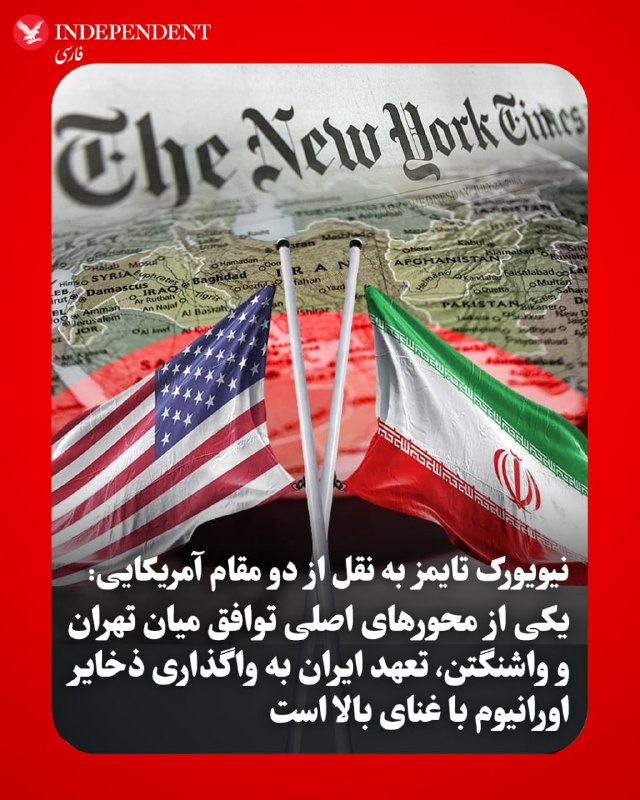

♦️نیویورک تایمز به نقل از دو مقام آمریکایی گزارش داد، یکی از عناصر کلیدی توافق پیشنهادی میان واشنگتن و تهران، تعهد آشکار ایران به واگذاری ذخایر اورانیوم با غنی‌سازی بالای خود است؛ اگرچه مقامات کاخ سفید هنوز به درخواست‌ها برای اظهارنظر پاسخ نداده‌اند، دونالد ترامپ روز شنبه اعلام کرد که واشنگتن به دستیابی به توافقی با تهران برای پایان دادن به جنگ و بازگشایی تنگه هرمز نزدیک شده است. با این حال، او جزئیاتی در این زمینه ارائه نکرد و مشخص نیست چه موانعی ممکن است برای نهایی شدن این توافق باقی مانده باشد. مقامات آمریکایی تصریح کردند که این پیشنهاد هنوز جزئیات دقیق نحوه واگذاری این ذخایر را تعیین نکرده و حل این مسئله را به دور بعدی گفتگوها درباره برنامه هسته‌ای ایران موکول کرده است، اما یک بیانیه کلی که ایران را متعهد به این کار کند، که هدف دیرینه ایالات متحده بوده، برای توافق بسیار حیاتی است، به‌ویژه اگر این توافق کلی با بدبینی جمهوری‌خواهان در کنگره مواجه شود. تا این لحظه، ایران هیچ بیانیه‌ عمومی درباره توافقی که ترامپ اعلام کرده، صادر نکرده است.
تهران در ابتدا با گنجاندن هرگونه توافقی درباره ذخایر اورانیوم غنی‌شده خود در این مرحله اولیه مخالفت کرده و خواستار موکول شدن آن به مرحله دوم گفتگوها بود، اما مذاکره‌کنندگان آمریکایی از طریق واسطه‌ها به صراحت اعلام کردند که بدون دستیابی به توافقی بر سر این ذخایر در فاز اولیه، میز مذاکره را ترک کرده و کارزار نظامی خود را از سر خواهند گرفت. این هشدار در حالی مطرح شد که برنامه‌ریزان نظامی در روزهای اخیر گزینه‌هایی را برای بمباران ذخایر اورانیوم ایران، که گمان می‌رود بیشتر آن در سایت هسته‌ای اصفهان باشد، به ترامپ ارائه داده بودند؛ سایتی که ژوئن گذشته هدف حمله آمریکا قرار گرفت و اورانیوم غنی‌شده در آن مدفون شد. در میان گزینه‌های بحث‌شده، حمله به اصفهان با بمب‌های سنگرشکن برای نابودی این ذخایر در زیر زمین مطرح بود و حتی پس از دسترسی مجدد تهران به اورانیوم پس از حملات تابستان گذشته، ترامپ اجازه یک عملیات مشترک تکاوری میان آمریکا و اسرائیل را برای بازپس‌گیری این ذخایر بررسی کرد؛ مأموریت خطرناکی که به دلیل احتمال تلفات سنگین نیروها هرگز توسط ترامپ تایید نشد. بر اساس اعلام آژانس بین‌المللی انرژی اتمی، ایران هم‌اکنون ذخیره‌ای در حدود ۹۷۰ پوند (حدود ۴۴۰ کیلوگرم) اورانیوم غنی‌شده تا سطح ۶۰ درصد در اختیار دارد.
براساس این گزارش، بخش دیگری از این توافق محتمل شامل آزادسازی میلیاردها دلار از دارایی‌های بلوکه‌شده ایران در خارج از کشور است؛ اما به گفته مقامات آمریکایی، ایران تنها زمانی به بخش عمده این دارایی‌ها که قرار است توسط ایالات متحده و متحدانش در یک صندوق بازسازی قرار گیرد دسترسی پیدا خواهد کرد که با یک توافق هسته‌ای نهایی موافقت کند؛ امری که انگیزه‌ای برای تهران ایجاد می‌کند تا پای میز مذاکره بماند.
‌🇸🇦 Indypersian

🤖 @VahidOOnLine

## VahidOOnLine — post 241851

  

نیویورک تایمز به نقل از دو مقام آمریکایی گزارش داد جمهوری اسلامی موافقت کرده است از اورانیوم غنی‌شده خود صرف‌نظر کند. جزییات دقیق این تفاهم هنوز روشن نیست، اما مقام‌ها گفتند آمریکا در چارچوب هر توافق اولیه، از حکومت ایران تعهدی درباره اورانیوم مطالبه کرده است.
مقام‌های کاخ سفید به درخواست‌ها برای اظهار نظر پاسخ ندادند. ترامپ روز شنبه گفت ایالات متحده به دستیابی به توافقی با ایران برای پایان دادن به جنگ و بازگشایی تنگه هرمز نزدیک شده است. اما او جزییاتی ارائه نکرد و مشخص نیست چه موانعی برای نهایی شدن توافق باقی مانده است.
مقام‌های آمریکایی گفتند این پیشنهاد موضوع چگونگی دقیق واگذاری ذخایر را حل‌وفصل نکرده و جزییات را به دور بعدی گفت‌وگوها درباره برنامه هسته‌ای ایران موکول کرده است.

‌🏁 🇬🇧 IranintlTV

🤖 @VahidOOnLine

## WithYashar — post 12282

  <a href="telegram/content/WithYashar_12282_1779602652.webm" target="_blank">🎬 Download video</a>

🎬 Video

## FoxNewsTwitter — post 342178

Fox News (Twitter/X)

The White House was placed on lockdown after shots were fired near a checkpoint. President Trump was at the White House during the incident.

The suspect, identified as 21-year-old Nasire Best of Maryland, was shot by Secret Service and died on the way to GW Medical Center. One civilian bystander was injured in the shooting.

Officials said the suspect had previous encounters with Secret Service, including making threats, and also had a history of mental health issues.

No injuries were sustained by Secret Service personnel.

## pm_afshaa — post 91357

  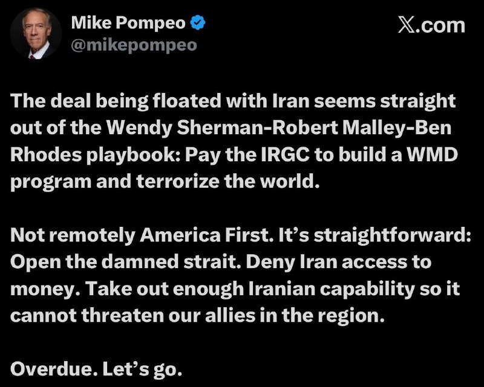

هشدار پمپئو به ترامپ:به نظر می‌رسد توافقی که با ایران در حال انجام است، به‌طور مستقیم از روی نقشه وندی شرمن-رابرت مالی-بن رودز بیرون آمده: به سپاه پاسداران پول بدهید تا یک برنامه سلاح‌های کشتار جمعی بسازد و جهان را ترور کند.
‏این اصلا ربطی به شعار «اول آمریکا» ندارد.
‏موضوع خیلی ساده است:
‏تنگه را باز کنید.
‏دسترسی ایران به پول را قطع کنید.
‏و آن‌قدر توانایی‌های ایران را هدف قرار دهید که دیگر نتواند متحدان ما در منطقه را تهدید کند خیلی دیر شده.
‏وقتشه اقدام کنن

💧 Rainbet.com the #1 Non-KYC Crypto Casino & Sportsbook @rainbetcom

😁 @Pm_Afshaa

## pm_afshaa — post 91355

🔴نیویورک تایمز: ایران موافقت کرده است که ذخیره اورانیوم غنی‌شده خود را به عنوان بخشی از توافق برای پایان دادن به جنگ واگذار کند

💧 Rainbet.com the #1 Non-KYC Crypto Casino & Sportsbook @rainbetcom

😁 @Pm_Afshaa

## pm_afshaa — post 91353

  <a href="telegram/content/pm_afshaa_91353_1779602653.webm" target="_blank">🎬 Download video</a>

🔴ان‌بی‌سی نیوز: هم‌اکنون بیرون کاخ سفید حدود 20 تا 30 تا تیر شلیک شده! سرویس مخفی آمریکا خبرنگارهایی که تو محوطه کاخ سفید بودن رو جمع کرده و برده داخل اتاق کنفرانس خبری تا ازشون محافطت کنه. 
💧 Rainbet.com the #1 Non-KYC Crypto Casino & Sportsbook @rainbetcom…

## mamlekate — post 103575

📝 نیویورک پست از طرح ترور دختر ترامپ توسط سپاه خبر داد

به گزارش نیویورک پست، ایوانکا ترامپ هدف طرح ترور منتسب به فردی آموزش‌دیده از سوی سپاه پاسداران انقلاب اسلامی بوده است. طبق گزارش، هدف از این طرح، انتقام‌گیری به خاطر کشته شدن قاسم سلیمانی بوده است.

@mamlekate

## mamlekate — post 103574

  <a href="telegram/content/mamlekate_103574_1779602654.mp4" target="_blank">🎬 Download video</a>

📝 گزارش‌ها از تیراندازی در نزدیکی کاخ سفید

رسانه‌های آمریکایی از گزارش‌های مربوط به تیراندازی احتمالی در عصر شنبه در نزدیکی چمن شمالی کاخ سفید خبر دادند.

⚡️ ماموران امنیتی و خبرنگاران در خیابان ۱۸ام و پنسیلوانیا (شمال غربی) در واشنگتن دی‌سی، در پی تیراندازی شنبه عصر در نزدیکی کاخ سفید، در منطقه حضور دارند. فرد مظنون در این تیراندازی کشته شد.

farsivoa
@mamlekate

## mamlekate — post 103573

📝 دونالد ترامپ می‌گوید جزئیات یک «یادداشت تفاهم صلح» با جمهوری اسلامی به زودی اعلام می‌شود

دونالد ترامپ، رئيس‌جمهوری آمریکا، شنبه‌ عصر گفت با شماری از رهبران منطقه از جمله مقامات عربستان، قطر، امارات درباره یک یادداشت تفاهم مربوط به صلح ایران صحبت کرده است.

@mamlekate

## VahidOnline — post 75672

  

آکسیوس: جزئیات توافقی که ترامپ در آستانه امضای آن با ایران است

ترجمه ماشین:
توافقی که آمریکا و ایران در آستانه امضای آن هستند، شامل تمدید ۶۰ روزه آتش‌بس است؛ دوره‌ای که طی آن تنگه هرمز دوباره باز خواهد شد، ایران می‌تواند نفت خود را آزادانه بفروشد و مذاکراتی برای محدود کردن برنامه هسته‌ای ایران برگزار خواهد شد؛ این را یک مقام آمریکایی گفته است.

🔻چرا مهم است: این توافق از تشدید جنگ جلوگیری می‌کند و فشار بر عرضه جهانی نفت را کاهش می‌دهد. با این حال روشن نیست که آیا به یک توافق صلح پایدار منجر خواهد شد یا نه؛ توافقی که هم‌زمان خواسته‌های هسته‌ای رئیس‌جمهور ترامپ را نیز پوشش دهد.
▪️وضعیت فعلی: هم ترامپ و هم میانجی‌ها گفته‌اند ممکن است این توافق روز یکشنبه اعلام شود، هرچند هنوز نهایی نشده و همچنان ممکن است از هم بپاشد.
▪️این مقام آمریکایی طرح کلی مفصلی از پیش‌نویس فعلی ارائه کرده که بخش عمده آن را منابع دیگر نزدیک به مذاکرات نیز تأیید کرده‌اند.

🔻چه چیزهایی در توافق آمده است؟
دو طرف یک یادداشت تفاهم امضا خواهند کرد که ۶۰ روز اعتبار دارد و با رضایت متقابل قابل تمدید است.
▪️در این دوره ۶۰ روزه، تنگه هرمز بدون عوارض باز خواهد بود و ایران موافقت می‌کند مین‌هایی را که در این تنگه کار گذاشته پاکسازی کند تا کشتی‌ها آزادانه عبور کنند.
▪️در مقابل، آمریکا محاصره بنادر ایران را لغو می‌کند و برخی معافیت‌های تحریمی صادر خواهد کرد تا ایران بتواند نفت خود را آزادانه بفروشد.
▪️این مقام آمریکایی اذعان کرد که این موضوع به سود اقتصاد ایران خواهد بود اما گفت در عین حال کمک قابل توجهی برای بازار جهانی نفت خواهد بود.

🔻این مقام آمریکایی گفت هرچه ایرانی‌ها سریع‌تر مین‌ها را پاکسازی کنند و اجازه دهند کشتیرانی از سر گرفته شود، محاصره هم سریع‌تر لغو خواهد شد.
▪️اصل کلیدی ترامپ در این توافق «امتیازدهی در برابر عملکرد» است.
▪️طبق گفته این مقام، ایران خواستار آزادسازی فوری منابع مالی مسدودشده و لغو دائمی تحریم‌ها بود، اما طرف آمریکایی گفت این موارد فقط پس از ارائه امتیازهای ملموس اجرا خواهد شد.

🔻مسائل هسته‌ای هنوز باید مذاکره شوند
▪️به گفته مقام آمریکایی، پیش‌نویس یادداشت تفاهم شامل تعهد ایران به این است که هرگز به دنبال سلاح هسته‌ای نرود و درباره تعلیق برنامه غنی‌سازی اورانیوم و خارج کردن ذخایر اورانیوم با غنای بالای خود مذاکره کند.
▪️به گفته دو منبع مطلع، ایران از طریق میانجی‌ها تعهدات شفاهی درباره دامنه امتیازهایی که حاضر است در زمینه تعلیق غنی‌سازی و واگذاری مواد هسته‌ای بدهد، به آمریکا ارائه کرده است.
▪️آمریکا موافقت خواهد کرد که در دوره ۶۰ روزه درباره لغو تحریم‌ها و آزادسازی منابع مالی ایران مذاکره کند؛ هرچند این اقدامات فقط در چارچوب توافق نهایی و پس از اجرای قابل راستی‌آزمایی آن عملی خواهند شد.
▪️نیروهای آمریکایی که در ماه‌های اخیر در منطقه مستقر شده‌اند، در دوره ۶۰ روزه در منطقه باقی خواهند ماند و فقط در صورتی خارج می‌شوند که توافق نهایی حاصل شود.

🔻نکته قابل توجه: پیش‌نویس یادداشت تفاهم همچنین تصریح می‌کند که جنگ میان اسرائیل و حزب‌الله در لبنان پایان خواهد یافت.
▪️یک مقام اسرائیلی گفت بنیامین نتانیاهو، نخست‌وزیر اسرائیل، در تماس تلفنی روز شنبه با ترامپ درباره این شرط ابراز نگرانی کرد. او همچنین درباره جنبه‌های دیگر توافق نیز نگرانی‌هایی مطرح کرد، اما به گفته یک مقام آمریکایی، دیدگاه خود را با احترام و لحنی محتاطانه بیان کرد.
▪️مقام آمریکایی گفت این یک «آتش‌بس یک‌طرفه» نخواهد بود و اگر حزب‌الله برای مسلح شدن دوباره یا تحریک حملات تلاش کند، اسرائیل اجازه خواهد داشت برای جلوگیری از آن اقدام کند.
...

🔻چه باید دید: به گفته مقام آمریکایی، کاخ سفید امیدوار است اختلافات نهایی در ساعات آینده حل‌وفصل شود و توافق روز یکشنبه اعلام شود.
▪️این مقام گفت ممکن است توافق حتی کل ۶۰ روز هم دوام نیاورد، اگر آمریکا به این نتیجه برسد که ایران درباره مذاکرات هسته‌ای جدی نیست. از سوی دیگر، آمریکا معتقد است فشار اقتصادی بر ایران انگیزه‌ای برای رسیدن به توافق کامل به‌منظور رفع تحریم‌ها و آزادسازی منابع مالی این کشور ایجاد می‌کند.
▪️این مقام آمریکایی گفت: «دیدنی خواهد بود که ایران واقعا تا کجا حاضر است پیش برود؛ اما اگر آن‌ها توانایی و تمایل تغییر مسیر خود را داشته باشند، این مرحله بعدی آن‌ها را وادار خواهد کرد تصمیم‌های حیاتی درباره این بگیرند که می‌خواهند چه نوع کشوری باشند.»
▪️مشاوران ترامپ می‌گویند اگر خواسته‌های او درباره برنامه هسته‌ای ایران برآورده شود، رئیس‌جمهور آماده است برای بازتنظیم روابط با ایران و دادن فرصت به این کشور برای دنبال کردن ظرفیت کامل اقتصادی‌اش، که به نظر ترامپ «عظیم» است، اقدامات بسیار گسترده‌ای انجام دهد.
axios

📡 @VahidOnline

## VahidOnline — post 75670

اسماعیل بقائی، سخنگوی وزارت امور خارجه، در پیامی در شبکه اجتماعی ایکس با درج تصویر سنگ‌نگاره پیروزی شاپور اول ساسانی بر امپراتور روم، نوشت: «وقتی ایرانیان مهاجمان متوهم را ناکام گذاشتند.»

او در این پیام که کنایه‌ای است به محاصره دریایی بنادر ایران توسط آمریکا نوشت: «رومیان تصور می‌کردند که رم مرکز عالم است؛ اما ایرانیان این توهم را در هم شکستند.»

پیام آقای بقایی که به نحو گسترده‌ای در کانال‌های تلگرامی رسانه‌های حکومتی ایران بازنشر شده است به نظر می‌رسد که با استفاده از سنگ‌نگاره پیروزی شاپور بر امپراتوران روم در نقش رستم استان فارس بازنقش شده است.

آقای بقایی که اخیرا با حکم محمدباقر قالیباف به عنوان سخنگوی هیئت مذاکره‌کننده ایران هم منصوب شده است با اشاره به لشگرکشی مارکوس یولیوس فیلیپوس معروف به فیلیپ عرب، امپراتور روم، علیه امپراتوری ساسانیان، نوشت که لشگرکشی او «منجر به پیروزی رومیان نشد بلکه به صلحی با شروط شاپور اول ختم شد؛ امپراتور ناچار شد با واقعیت کنار بیاید.»
@VahidHeadline

📡 @VahidOnline

## VahidOnline — post 75669

  

نیویورک تایمز به نقل از دو مقام آمریکایی گزارش داد، یکی از عناصر کلیدی توافق پیشنهادی میان واشنگتن و تهران، تعهد آشکار ایران به واگذاری ذخایر اورانیوم با غنی‌سازی بالای خود است؛

مقامات آمریکایی تصریح کردند که این پیشنهاد هنوز جزئیات دقیق نحوه واگذاری این ذخایر را تعیین نکرده و حل این مسئله را به دور بعدی گفتگوها درباره برنامه هسته‌ای ایران موکول کرده است، اما یک بیانیه کلی که ایران را متعهد به این کار کند، که هدف دیرینه ایالات متحده بوده، برای توافق بسیار حیاتی است، به‌ویژه اگر این توافق کلی با بدبینی جمهوری‌خواهان در کنگره مواجه شود. تا این لحظه، ایران هیچ بیانیه‌ عمومی درباره توافقی که ترامپ اعلام کرده، صادر نکرده است.

تهران در ابتدا با گنجاندن هرگونه توافقی درباره ذخایر اورانیوم غنی‌شده خود در این مرحله اولیه مخالفت کرده و خواستار موکول شدن آن به مرحله دوم گفتگوها بود، اما مذاکره‌کنندگان آمریکایی از طریق واسطه‌ها به صراحت اعلام کردند که بدون دستیابی به توافقی بر سر این ذخایر در فاز اولیه، میز مذاکره را ترک کرده و کارزار نظامی خود را از سر خواهند گرفت.

براساس این گزارش، بخش دیگری از این توافق محتمل شامل آزادسازی میلیاردها دلار از دارایی‌های بلوکه‌شده ایران در خارج از کشور است؛ اما به گفته مقامات آمریکایی، ایران تنها زمانی به بخش عمده این دارایی‌ها که قرار است توسط ایالات متحده و متحدانش در یک صندوق بازسازی قرار گیرد دسترسی پیدا خواهد کرد که با یک توافق هسته‌ای نهایی موافقت کند؛ امری که انگیزه‌ای برای تهران ایجاد می‌کند تا پای میز مذاکره بماند.
@VahidOOnLine

📡 @VahidOnline

## IranIntlTV — post 338696

  <a href="telegram/content/IranIntlTV_338696_1779602655.mp4" target="_blank">🎬 Download video</a>

دونالد ترامپ، رییس‌جمهوری آمریکا، اعلام کرد که با رهبران و مقام‌های ارشد چند کشور منطقه درباره صلح با جمهوری اسلامی گفت‌وگو کرده و اکنون تنها نهایی‌سازی متن توافق باقی مانده است. او همچنین گفت که تنگه هرمز باز خواهد شد.

گفت‌وگو با امیر گیتی، عضو تحریریه ایران‌اینترنشنال
@iranintltv

## IranIntlTV — post 338695

  

علی خزایی، نماینده ورامین در مجلس گفت: «تنگه هرمز به هیچ‌وجه و تحت هیچ شرایطی به حالت قبل باز نخواهد گشت و هیچ شناور و کشتی متعلق به آمریکا، اسرائیل و همپیمانان آنها، حق تردد از تنگه هرمز را ندارد. هر کشتی تجاری یا غیرتجاری دیگر برای عبور باید از ملت ایران مجوز بگیرد.»

او ادامه داد: «جمهوری اسلامی اگر صلاح بداند، از تنگه‌های دیگر از جمله باب‌المندب نیز برای ذلیل کردن دشمن استفاده خواهد کرد.»
https://iranintl.com/202605245053

## IranIntlTV — post 338694

  

محمد اسحاق دار، وزیر خارجه پاکستان در حساب ایکس خود نوشت که از تعهد ترامپ به گفت‌وگو و دیپلماسی و تعامل سازنده رهبر و مقامات جمهوری اسلامی تشکر می‌کند و افزود: «تماس تلفنی مهم ترامپ با رهبران پاکستان، عربستان سعودی، ترکیه، قطر، مصر، امارات متحده عربی و اردن، گامی مهم به سوی هدف مشترک صلح منطقه‌ای و دستیابی زودهنگام به یک نتیجه دیپلماتیک بود.»
https://iranintl.com/202605243075

## IranIntlTV — post 338693

  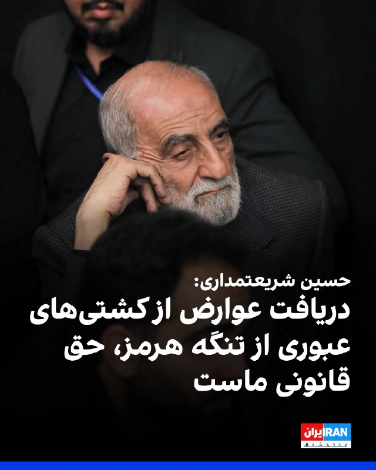

حسین شریعتمداری، نماینده رهبر جمهوری اسلامی در روزنامه کیهان، نوشت: «تنگه هرمز بخشی از آب‌های سرزمینی ایران است و این حق قانونی برای ما محفوظ است که از کشتی‌ها و شناورهای عبورکننده از آب‌های سرزمینی خود عوارض عبور بگیریم، آمریکا هم از گلوگاه‌های دریایی عوارض دریافت می‌کند.»

او افزود: «باید از اظهارات برخی دیپلمات‌ها و تیم مذاکره‌کننده گلایه کرد که انگار قرار است بعد از پایان جنگ، شرایط و قوانین حاکم بر تنگه هرمز به حالت پیش از جنگ بازگردد، و انگار نه انگار که حاکمیت ما بر تنگه هرمز، حق قانونی و قطعی کشورمان است.»

او ادامه داد: «مگر مصر در کانال سوئز، ترکیه در داردانل و بسفر، پاناما در کانال پاناما و آلمان در کانال کیل از شناورهای عبوری عوارض نمی‌گیرند؟»
https://iranintl.com/202605247106

## IranIntlTV — post 338692

  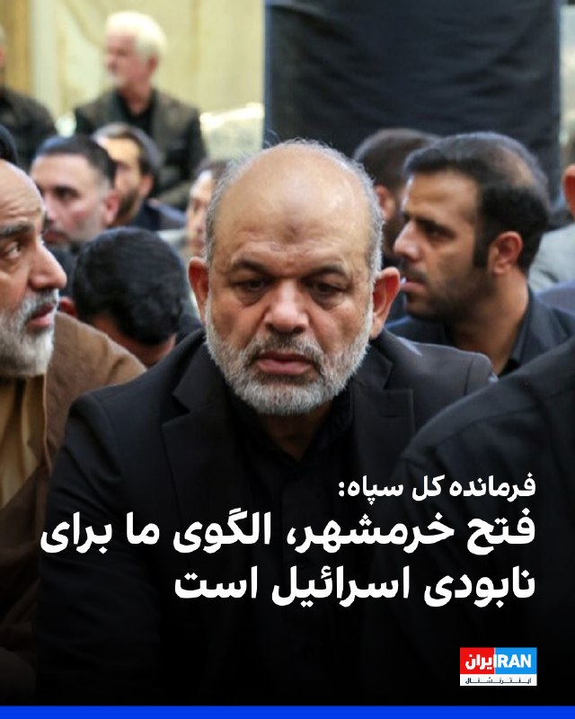

احمد وحیدی، فرمانده کل سپاه پاسداران در پیامی مکتوب، اعلام کرد: «نیروهای مسلح در بالاترین سطح آمادگی و بازدارندگی فعال در همه ابعاد موشکی، هوایی، دریایی، زمینی، فضایی و سایبری قرار دارند و بر این اساس بدیهی است هرگونه تعرض مجدد دشمن، پاسخی ویرانگر و جهنمی در ابعاد منطقه‌ای و فرامنطقه‌ای در پی خواهد داشت.»

او ادامه داد: «فتح خرمشهر، الگویی ماندگار برای پیروزی در خرمشهرهای پیش رو و آزادی قدس و نابودی اسرائیل به‌دست محور مقاومت و مجاهدان جهان اسلام است.»
https://iranintl.com/202605240611

## IranIntlTV — post 338691

  <a href="telegram/content/IranIntlTV_338691_1779602658.mp4" target="_blank">🎬 Download video</a>

سرخط خبرهای یکشنبه ۳ خرداد
@iranintltv

## IranIntlTV — post 338690

  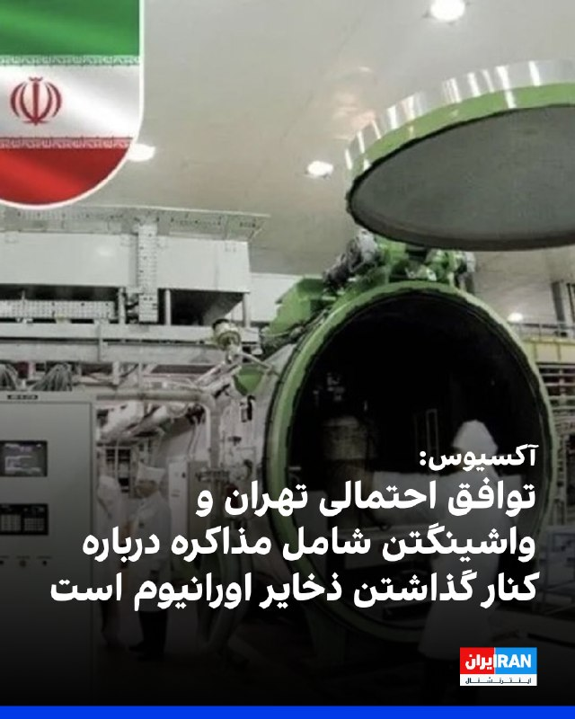

آکسیوس به نقل از یک مقام آمریکایی گزارش داد پیش‌نویس یادداشت تفاهم احتمالی تهران و واشینگتن شامل تعهد جمهوری اسلامی به پیگیری نکردن ساخت سلاح هسته‌ای و مذاکره درباره تعلیق برنامه غنی‌سازی اورانیوم و کنار گذاشتن ذخایر اورانیوم با غنای بالا است.

بر اساس گفته دو منبع آگاه، حکومت ایران از طریق میانجی‌ها تعهدات شفاهی درباره دامنه امتیازهایی که حاضر است در زمینه تعلیق غنی‌سازی و واگذاری مواد هسته‌ای بدهد، به آمریکا ارائه کرده است.

طبق این گزارش، آمریکا موافقت خواهد کرد در طول دوره ۶۰ روزه درباره رفع تحریم‌ها و آزادسازی دارایی‌های ایران مذاکره کند، اما اجرای این اقدامات تنها در قالب یک توافق نهایی که به‌طور قابل راستی‌آزمایی اجرا شود، انجام خواهد شد.

همچنین نیروهای آمریکایی که در ماه‌های اخیر بسیج شده‌اند، در طول این ۶۰ روز در منطقه باقی خواهند ماند و تنها در صورت دستیابی به توافق نهایی عقب‌نشینی خواهند کرد.

پیش‌نویس یادداشت تفاهم همچنین تصریح می‌کند جنگ میان اسرائیل و حزب‌الله در لبنان پایان خواهد یافت.
https://iranintl.com/202605247525

## IranIntlTV — post 338689

  

خبرگزاری قوه قضاییه، میزان، اعلام کرد مجتبی کیان، زندانی سیاسی، پس از تشکیل پرونده در دادگستری استان البرز به اتهام ارسال اطلاعات صنایع نظامی ایران به «دشمن» در جنگ اخیر، اعدام شد. طبق این گزارش، مجتبی کیان این پیام‌ها را به «یک شبکه ماهواره‌ای» و «معاند» ارسال کرده بود.
این شهروند به اتهام فعالیت اطلاعاتی برای اسرائیل و آمریکا، به اعدام و مصادره کلیه اموال محکوم شده بود.
طبق اعلام قوه قضاییه، از زمان بازداشت مجتبی کیان تا اجرای حکم او در ۳ خرداد ۱۴۰۵، کمتر از ۵۰ روز زمان صرف شد.

https://iranintl.com/202605244860

## IranIntlTV — post 338688

  

آکسیوس به نقل از یک مقام آمریکایی، جزییاتی از توافق احتمالی جمهوری اسلامی و آمریکا را که ممکن است یک‌شنبه اعلام شود، منتشر کرد. این توافق شامل تمدید ۶۰ روزه آتش‌بس است که در طی آن تنگه هرمز بازگشایی می‌شود،‌ تهران می‌تواند آزادانه نفت بفروشد و مذاکرات هسته‌ای برگزار خواهد شد.
به گفته این مقام آمریکایی، این تفاهم ۶۰ روز اعتبار دارد و در صورت توافق دو طرف قابل تمدید خواهد بود.
دو طرف یک یادداشت تفاهم امضا خواهند کرد که ۶۰ روز اعتبار دارد و با رضایت متقابل قابل تمدید است.
در طول این دوره ۶۰ روزه، تنگه هرمز بدون دریافت عوارض باز خواهد بود و ایران موافقت خواهد کرد مین‌هایی را که در این آبراه مستقر کرده پاک‌سازی کند تا کشتی‌ها آزادانه عبور کنند.
در مقابل، ایالات متحده محاصره بنادر ایران را لغو خواهد کرد. این مقام گفت هرچه جمهوری اسلامی سریع‌تر مین‌ها را پاک‌سازی و عبور و مرور دریایی را از سر بگیرد، محاصره نیز سریع‌تر لغو خواهد شد. او افزود اصل کلیدی دونالد ترامپ در این توافق «کاهش فشار در برابر اقدام» است.
https://iranintl.com/202605245382

## IranIntlTV — post 338687

  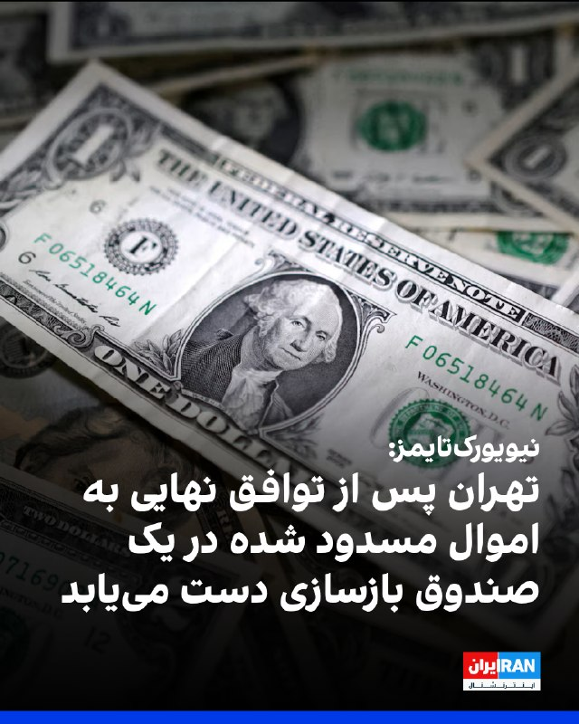

نیویورک‌تایمز به نقل از مقام‌های آمریکایی گزارش داد جمهوری اسلامی تنها پس از دستیابی به توافق نهایی هسته‌ای به بخش عمده دارایی‌های مسدود شده خود که آمریکا و متحدانش در صندوق بازسازی قرار خواهند داد، دسترسی خواهد یافت.
آزادسازی میلیاردها دلار از دارایی‌های مسدودشده ایران در خارج از کشور یکی از مولفه‌های کلیدی هر توافقی خواهد بود و به جمهوری اسلامی انگیزه می‌دهد در مذاکرات باقی بماند و به توافق برسد.

https://iranintl.com/202605242976

## IranIntlTV — post 338686

  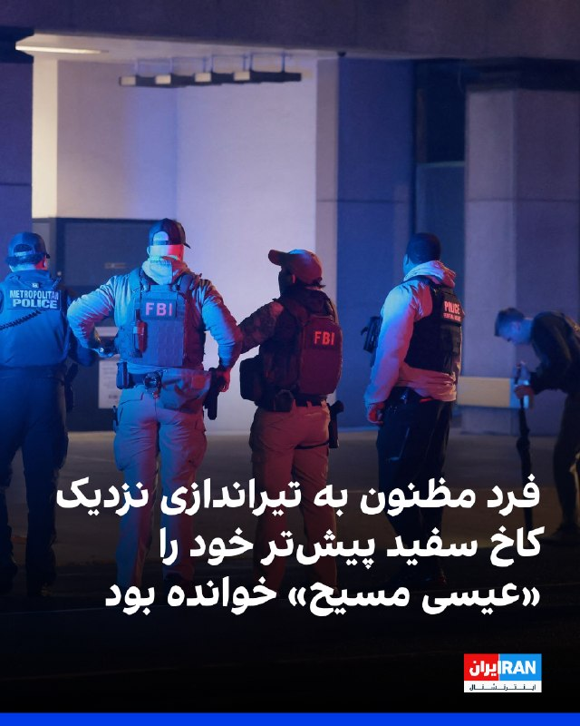

رسانه‌های آمریکا هویت مرد مظنون به تیراندازی نزدیک کاخ‌سفید را که با گلوله ماموران کشته شد، نصیر بست، ۲۱ ساله‌ و اهل مریلند، اعلام کردند. طبق این گزارش‌ها، بست پیش‌تر نیز با سرویس مخفی آمریکا برخوردهایی داشته است و سوابق نشان می‌دهد که او پیش‌تر خود را «عیسی مسیح» و «پسر خدا» خوانده بود.
در همین حال، در شبکه‌های اجتماعی منتسب به بست، پستی دیده می‌شود که به نظر می‌رسد تهدیدی علیه ترامپ مطرح کرده و در پستی دیگر نوشته بود: «من در واقع پسر خدا هستم.»
در یک مورد به‌طور اجباری در یک بیمارستان روان‌پزشکی بستری شده بود و در موردی دیگر، زمانی که مدعی شده بود «او عیسی مسیح است»، از سوی پلیس محلی بازداشت شد.
بر اساس یک اظهارنامه دادگاهی، ماموران تابستان گذشته چندین بار در نزدیکی کاخ سفید با بست مواجه شده بودند. در این سند آمده است او به دلیل «پرسه زدن در محوطه کاخ سفید و پرس‌وجو درباره نحوه دسترسی از نقاط مختلف ورودی» برای سرویس مخفی شناخته‌شده بود.
بر اساس اسناد دادگاه، او در ۲۶ ژوئن ۲۰۲۵ به دلیل «ممانعت از ورود خودروها» به بخشی از محوطه کاخ سفید، به‌طور اجباری بستری شد.

https://iranintl.com/202605243058

## IranIntlTV — post 338685

  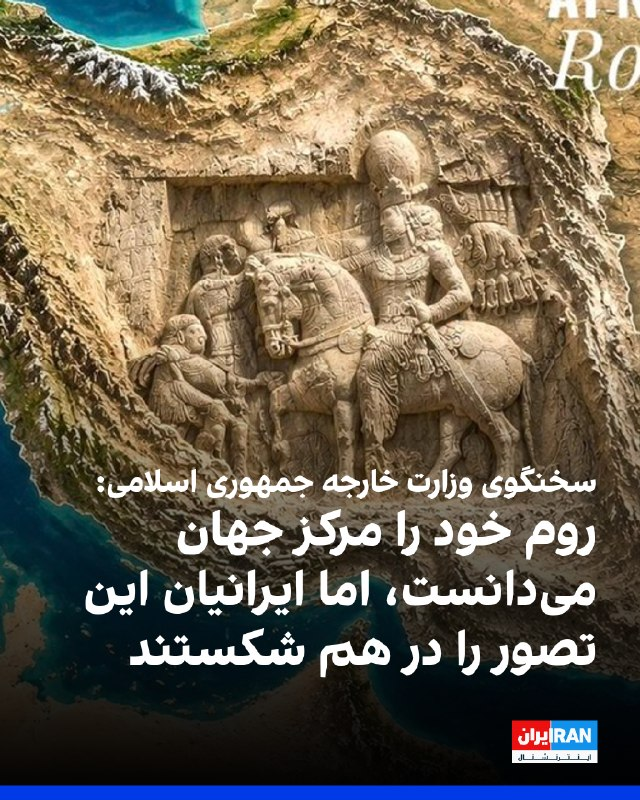

هم‌زمان با احتمال نزدیک شدن توافق جمهوری اسلامی و آمریکا، سخنگوی وزارت خارجه جمهوری اسلامی با انتشار تصویر سنگ‌نگاره نقش رستم که پیروزی شاپور بر امپراتور روم را نشان می‌دهد، نوشت: «در ذهن رومیان، روم مرکز بی‌چون‌وچرای جهان بود. اما ایرانیان این تصور را در هم شکستند.»
اسماعیل بقایی افزود: «هنگامی که مارکوس ژولیوس فیلیپوس به سوی شرق و علیه ایران لشکر کشید، این کارزار به پیروزی روم منجر نشد، بلکه به صلحی انجامید که بر اساس شروط ساسانیان برقرار شد: امپراتور ناچار شد با شرایط آنان کنار بیاید.»

https://iranintl.com/202605244465

## IranIntlTV — post 338684

  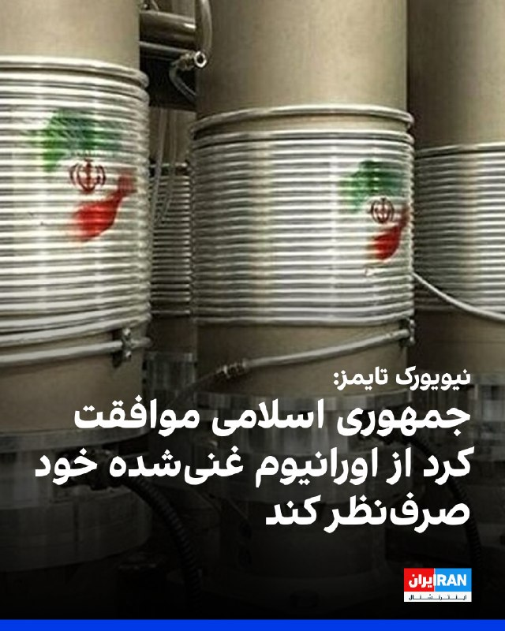

نیویورک تایمز به نقل از دو مقام آمریکایی گزارش داد جمهوری اسلامی موافقت کرده است از اورانیوم غنی‌شده خود صرف‌نظر کند. جزییات دقیق این تفاهم هنوز روشن نیست، اما مقام‌ها گفتند آمریکا در چارچوب هر توافق اولیه، از حکومت ایران تعهدی درباره اورانیوم مطالبه کرده است.
مقام‌های کاخ سفید به درخواست‌ها برای اظهار نظر پاسخ ندادند. ترامپ روز شنبه گفت ایالات متحده به دستیابی به توافقی با ایران برای پایان دادن به جنگ و بازگشایی تنگه هرمز نزدیک شده است. اما او جزییاتی ارائه نکرد و مشخص نیست چه موانعی برای نهایی شدن توافق باقی مانده است.
مقام‌های آمریکایی گفتند این پیشنهاد موضوع چگونگی دقیق واگذاری ذخایر را حل‌وفصل نکرده و جزییات را به دور بعدی گفت‌وگوها درباره برنامه هسته‌ای ایران موکول کرده است.

https://iranintl.com/202605248261

## FarsiVOA — post 218492

🔺از توافق احتمالی تهران-واشنگتن چه می‌دانیم؟

▪️پس از آن که دونالد ترامپ، از «یک یادداشت تفاهم» مربوط به پایان دادن جنگ با جمهوری اسلامی خبر داد، رسانه‌ها گزارش‌های تاییدنشده‌ای از محتوای این توافق منتشر کرده‌اند.

▪️دو مقام آمریکایی به نیویورک تایمز گفته‌اند که حکومت ایران به عنوان بخشی از توافق با ایالات متحده برای پایان دادن به جنگ، پذیرفته است ذخیره اورانیوم با غنای بالای خود را واگذار کند.

▪️همچنین آکسیوس به نقل از یک مقام آمریکایی گزارش داد که ایالات متحده و حکومت ایران به امضای توافقی نزدیک شده‌اند که شامل تمدید آتش‌بس به مدت ۶۰ روز است و در این مدت، تنگه هرمز باز خواهد شد.

▪️این توافق همچنین شامل آتش‌بس میان حزب‌الله و اسرائیل خواهد بود.

⬇️ بیشتر بخوانید:
https://ir.voanews.com/a/8153265.html

## FarsiVOA — post 218491

🔺محاصره آمریکا علیه جمهوری اسلامی به «نقطه عطف» تغییر مسیر ۱۰۰ کشتی رسید

▪️سنتکام، می‌گوید در چهارچوب محاصره دریایی جمهوری اسلامی شمار کشتی‌های مرتبط با جمهوری اسلامی که وادار به تغییر مسیر شده‌اند، به «نقطه عطف» ۱۰۰ فروند رسیده است.

▪️بر اساس این اعلام، پس از شش هفته محاصره دریایی جمهوری اسلامی، بیش از ۱۵ هزار سرباز، ملوان، تفنگدار دریایی و نیروی هوایی آمریکا ۱۰۰ کشتی را تغییر مسیر داده و چهار فروند را از کار انداخته است.

▪️نیروهای نظامی آمریکا در عین حال به ۲۶ کشتی حامل کمک‌های بشردوستانه اجازه عبور به ایران را داده‌اند.

▪️ایالات متحده از اواخر فروردین ۱۴۰۵، محاصره دریایی علیه جمهوری اسلامی ایران را در واکنش به اقدام رژیم ایران در بستن تنگه هرمز آغاز کرده است.

⬇️ بیشتر بخوانید:
https://ir.voanews.com/a/8153263.html

## FarsiVOA — post 218490

  

شهباز شریف، نخست‌وزیر پاکستان، به دونالد ترامپ، رئیس‌جمهوری آمریکا، «به خاطر تلاش‌های فوق‌العاده‌اش برای پیگیری صلح» در میانه تلاش‌ها برای نهایی کردن توافقی جهت پایان دادن به جنگ آمریکا و اسرائیل با ایران، تبریک گفت.

شریف در بیانیه‌ای در شبکه ایکس نوشت که تماس تلفنی «بسیار مفید و سازنده» ترامپ با رهبران منطقه در روز شنبه، «فرصت مفیدی برای تبادل نظر درباره وضعیت کنونی منطقه و چگونگی پیشبرد تلاش‌های جاری برای صلح به منظور برقراری صلحی پایدار در منطقه فراهم کرد.»

او افزود: «پاکستان با نهایت صداقت به تلاش‌های صلح خود ادامه خواهد داد و امیدواریم که خیلی زود میزبان دور بعدی مذاکرات باشیم.»

رئيس‌جمهوری آمریکا، عصر شنبه‌ دوم خرداد به وقت واشنگتن گفت جزئیات نهایی یک یادداشت تفاهم صلح با جمهوری اسلامی «به‌زودی اعلام خواهد شد.»
@FarsiVOA

## FarsiVOA — post 218489

🔺اعدام یک شهروند بازداشت‌شده در ایام جنگ؛ دادرسی شتاب‌زده و اعدام در ۵۰ روز

▪️قوه قضائیه از اعدام مجتبی کیان، به اتهام ارسال اطلاعات مراکز تولید صنایع دفاعی به «دشمن آمریکایی ـ صهیونیستی» خبر داد.

▪️ادعا شده کیان در جریان جنگ اخیر، اطلاعات و مختصات واحدهای مرتبط با تولید قطعات صنایع دفاعی را از طریق پیام به «شبکه‌های وابسته به اسرائیل و آمریکا» ارسال کرده بود.

▪️مجتبی کیان علاوه بر اعدام، به مصادره کلیه اموال محکوم شده بود، و از زمان بازداشت تا اجرای حکم کمتر از ۵۰ روز زمان گذشته است.

▪️عفو بین‌الملل پیشتر هشدار داده بود که نگرانی از اعدام‌های بیشتر افزایش یافته، زیرا مقام‌های جمهوری اسلامی پس از آغاز جنگ خواستار رسیدگی سریع‌تر و مجازات‌های «شدید» برای بازداشت‌شدگان شده‌اند.

⬇️ بیشتر بخوانید:
https://ir.voanews.com/a/8153262.html

## FarsiVOA — post 218488

  <a href="telegram/content/FarsiVOA_218488_1779602664.mp4" target="_blank">🎬 Download video</a>

⚡️گزارش مایکل لیپین، خبرنگار صدای آمریکا از تیراندازی شنبه عصر در اطراف کاخ سفید
@FarsiVOA

## Persian_Trend_Official — post 14822

  <a href="telegram/content/Persian_Trend_Official_14822_1779602665.mp4" target="_blank">🎬 Download video</a>

تصاویر ثبت شده لحظه اصابت موشک کروز روسی اسکندر-ک به کی‌یف در صبح امروز .

👩‍💻@PhantomDirective

🆔 @persian_trend_official
پرشین ترند | متفاوت‌ترین کانال نظامی

## Persian_Trend_Official — post 14821

بولتن خبری۲۴ ساعت گذشته پرشین ترند

🇮🇷 ایران

◾️ فرمانده ارتش پاکستان عاصم منیر پس از دیدار دوم با عراقچی، همچنین با قالیباف و پزشکیان دیدار کرد؛ وی روند مذاکرات مثبت خواند؛ سپس تهران را ترک کرد.

◾️ الجزیره: تهران و پاکستان بر سر یک «یادداشت تفاهم» به توافق رسیده‌اند؛ شامل پایان جنگ، بازگشایی تنگه هرمز و خروج نیروهای آمریکایی از منطقه؛ موضوع هسته‌ای به مذاکرات ۳۰ روزه بعدی موکول شده.

◾️ ایران دو پیشنهاد به میانجی پاکستانی ارائه کرده؛ خواستار بحث درباره تحریم‌ها و آزادسازی دارایی‌های مسدودشده پیش از امضای توافق شده است.

◾️ منبع نزدیک به تیم مذاکره‌کننده به فارس: سه موضوع اختلافی هنوز پابرجاست؛ پرونده هسته‌ای، آزادسازی پول‌های بلوکه‌شده، و مدیریت ایران بر تنگه هرمز
◾️ سخنگوی وزارت خارجه: تنگه هرمز به آمریکا ربطی ندارد؛ سازوکار مدیریت آن باید میان ایران و عمان تعریف شود
◾️ عضو کمیسیون امنیت ملی مجلس: در هر توافقی ایران باید غرامت جنگ دریافت کند؛ از مدیریت تنگه هرمز عقب‌نشینی نخواهد شد

◾️ ایران نماینده دائم خود نزد سازمان ملل را مأمور کرد مسئولیت بین‌المللی کشورهای خلیج فارس در تسهیل تجاوز علیه ایران را رسماً مطرح کند

◾️ حزب‌الله: عراقچی بر حمایت «قاطع و تزلزل‌ناپذیر» ایران از این گروه تأکید کرده؛ تهران خواستار گنجانده‌شدن لبنان در هرگونه توافق آتش‌بس است

◾️ جمهوری اسلامی مقر گروه کومله در اربیل عراق را با موشک و پهپاد هدف قرار داد

◾️ نیروی دریایی سپاه: ۲۵ کشتی در شبانه‌روز گذشته با مجوز سپاه از تنگه هرمز عبور کردند؛ تصاویر ماهواره‌ای از توقف ۲۴۰ کشتی در انتظار مجوز عبور خبر می‌دهد
◾️ پروازهای فرودگاه‌های اهواز و ماهشهر از سر گرفته شد.

◾️ مقامات ایران اعلام کردند اینترنت بین‌المللی در حال حاضر بازگشایی نخواهد شد؛ شورای عالی امنیت ملی قطع اینترنت را به دلایل امنیتی تأیید کرده.

◾️ راننده کنسول جمهوری آذربایجان در تبریز در سانحه رانندگی در اتوبان جلفا-تبریز جان باخت.

خبرگزاری قوه قضائیه: مجتبی کیان به اتهام ارسال اطلاعات در جنگ پس از تأیید حکم دیوان عالی کشور اعدام شد.

🇮🇱اسرائیل و خاورمیانه

◾️ اکسیوس: نتانیاهو از توافق در دست بررسی شدیداً نگران است و از ترامپ خواسته دور جدیدی از حملات به ایران آغاز شود؛ اسرائیل در حال اعمال فشار برای مختل کردن توافق است.

◾️ رسانه‌های اسرائیلی: اسرائیل سطح آماده‌باش را کاهش داده؛ برآوردها حاکی از عدم وقوع حمله قریب‌الوقوع به ایران است.

◾️ کانال ۱۳ اسرائیل: اسرائیل اطلاعاتی دریافت کرده که توافق آمریکا با ایران ممکن شده است.

◾️ فرانسه از ورود بن‌گویر، وزیر امنیت داخلی اسرائیل، به خاک خود جلوگیری کرد
◾️ نفتکشی در ۲۰۰ مایل دریایی غرب سوکوترا توسط یک قایق کوچک مورد تهدید قرار گرفت؛ با استقرار تیم امنیتی مسلح، قایق مسیر خود را تغییر داد.

🇺🇸
🇺🇳 آمریکا و جهان

◾️ ترامپ در پست توییتری اعلام کرد با رهبران عربستان، امارات، قطر، پاکستان، ترکیه، مصر، اردن و بحرین درباره ایران گفتگو کرده؛ توافق «تا حد زیادی» نهایی شده و به‌زودی اعلام می‌شود؛ تنگه هرمز بازگشایی خواهد شد.

◾️ اکسیوس: واشنگتن و تهران یادداشت تفاهم ۶۰ روزه امضا خواهند کرد؛ شامل پایان جنگ با حزب‌الله، امکان فروش نفت ایران و توقف محاصره بنادر؛ کاخ سفید امیدوار است توافق امروز یکشنبه اعلام شود.

◾️ نیویورک‌تایمز: یادداشت تفاهم ۲۵ میلیارد دلار از دارایی‌های مسدودشده ایران را آزاد می‌کند؛ مسائل هسته‌ای ظرف ۳۰ تا ۶۰ روز مذاکره خواهد شد.

◾️ فایننشال تایمز: موانع اصلی درخواست ترامپ برای تحویل ۴۴۰ کیلوگرم اورانیوم نزدیک به درجه تسلیحاتی و برچیدن سه سایت هسته‌ای نطنز، فردو و اصفهان است.

◾️ روبیو: ممکن است ایران توافق را در اوایل یکشنبه بپذیرد؛ امروز یا فردا خبری اعلام شود.

◾️ ترامپ با اکسیوس: شانس توافق یا حمله را «۵۰-۵۰» ارزیابی می‌کند؛ امروز با ویتکاف، کوشنر و ونس درباره آخرین پاسخ ایران دیدار خواهد کرد.

◾️ لیندزی گراهام هشدار داد هر توافقی که به بقای حکومت ایران و بازگشت نفوذ منطقه‌ای آن منجر شود خاورمیانه را بی‌ثبات‌تر خواهد کرد.

◾️ وزیر جنگ آمریکا هگست: نیروی هوایی آمریکا برای اعزام به خاورمیانه در آماده‌باش است.

◾️ دن اسکاوینو، معاون دفتر کاخ سفید، ویدیویی از بمب‌افکن‌های مخفی‌کار B-2 منتشر کرد؛ آخرین بار چنین پستی چند ساعت پیش از حمله به ایران منتشر شده بود.

◾️ تیراندازی مقابل کاخ سفید؛ مهاجم با ۳ گلوله به سمت ساختمان توسط سرویس مخفی کشته شد؛ یک عابر مجروح شد؛ ترامپ در سلامت کامل است؛ مهاجم فردی با سابقه اختلال روانی شناخته‌شده بود.

◾️ روسیه با بیش از ۳۰ موشک بالستیک از جمله اورشنیک کی‌یف اوکراین را بمباران کرد؛ این حمله از هفته گذشته برنامه‌ریزی شده بود.

🆔@persian_trend_official
پرشین ترند | متفاوت‌ترین کانال نظامی

## Persian_Trend_Official — post 14820

در این تماس، رهبران عربستان سعودی، قطر، مصر، ترکیه و پاکستان نیز حضور داشتند؛ کشورهایی که همگی در تلاش‌های میانجی‌گرانه نقش داشته‌اند.
پاکستانی‌ها میانجی اصلی بودند؛ با محوریت فیلدمارشال عاصم منیر که روزهای جمعه و شنبه در تهران بود تا تلاش کند این توافق را به مرحله نهایی برساند.
ترامپ در روزهای اخیر میان دو گزینه مردد بود: پیش بردن توافق یا آغاز موج گسترده‌ای از حملات علیه ایران. تا شنبه‌شب، او بیشتر به سمت راه‌حل دیپلماتیک متمایل شده بود.
مرحله بعد چیست؟
کاخ سفید امیدوار است اختلافات باقی‌مانده در ساعات آینده حل شود و توافق روز یکشنبه اعلام گردد. این را مقام ارشد آمریکایی گفته است.
او همچنین گفت ممکن است توافق حتی تمام ۶۰ روز دوام نیاورد، اگر آمریکا به این نتیجه برسد که ایران در مذاکرات مربوط به برنامه هسته‌ای جدی نیست.
از سوی دیگر، آمریکا معتقد است بحران اقتصادی در ایران انگیزه‌ای برای حکومت ایجاد کرده تا برای دستیابی به توافق کامل، رفع تحریم‌ها و آزادسازی دارایی‌ها وارد مسیر جدی‌تری شود.
این مقام آمریکایی گفت:
«جالب خواهد بود ببینیم ایران واقعاً تا چه اندازه حاضر است جلو برود؛ اما اگر ایران توانایی و اراده تغییر مسیر خود را داشته باشد، این مرحله بعدی آن را مجبور خواهد کرد تصمیم‌های بسیار مهمی بگیرد؛ اینکه می‌خواهد به‌عنوان یک کشور چه باشد.»
به گفته مشاوران ترامپ، اگر خواسته‌های او درباره برنامه هسته‌ای ایران برآورده شود، رئیس‌جمهور آمریکا آماده است برای بازتنظیم روابط با ایران بسیار جلو برود و به ایران فرصت دهد ظرفیت کامل اقتصادی خود را آزاد کند؛ ظرفیتی که ترامپ آن را «عظیم» می‌داند.

باراک راوید

## Persian_Trend_Official — post 14819

جزئیات توافق در حال شکل‌گیری میان آمریکا و ایران برای پایان جنگ

توافقی که آمریکا و ایران به امضای آن نزدیک شده‌اند، شامل تمدید ۶۰ روزه آتش‌بس است؛ دوره‌ای که در آن تنگه هرمز دوباره باز خواهد شد، ایران خواهد توانست نفت خود را آزادانه بفروشد و مذاکراتی درباره محدودسازی برنامه هسته‌ای ایران برگزار خواهد شد. این مطلب را یک مقام ارشد آمریکایی اعلام کرده است.
چرا مهم است؟
این توافق می‌تواند مانع تشدید جنگ شود و فشار بر بازار جهانی نفت را کاهش دهد. با این حال، هنوز روشن نیست که آیا این توافق به یک صلح پایدار منجر خواهد شد یا نه؛ صلحی که همزمان بتواند خواسته‌های رئیس‌جمهور ترامپ درباره برنامه هسته‌ای ایران را هم تأمین کند.
وضعیت فعلی
هم ترامپ و هم میانجی‌ها اشاره کرده‌اند که اعلام توافق ممکن است امروز، یکشنبه، انجام شود؛ هرچند توافق هنوز نهایی نشده و همچنان ممکن است فروبپاشد.
این مقام ارشد آمریکایی چارچوبی دقیق از پیش‌نویس فعلی ارائه کرده که بخش زیادی از آن توسط منابع دیگر نزدیک به مذاکرات نیز تأیید شده است.
این جزئیات از سوی طرف ایرانی تأیید نشده، هرچند تهران نیز نشانه‌هایی داده که توافق نزدیک است.
مفاد توافق چیست؟
دو طرف یک یادداشت تفاهم ۶۰ روزه امضا خواهند کرد که با توافق متقابل قابل تمدید خواهد بود.
در طول این ۶۰ روز، تنگه هرمز بدون دریافت عوارض باز خواهد بود و ایران موافقت می‌کند مین‌هایی را که در تنگه کار گذاشته، جمع‌آوری کند تا عبور آزاد کشتی‌ها ممکن شود.
در مقابل، آمریکا محاصره بنادر ایران را برمی‌دارد و برخی معافیت‌های موقت تحریمی صادر می‌کند تا ایران بتواند به مدت ۶۰ روز نفت خود را آزادانه بفروشد.
این مقام آمریکایی پذیرفته که این موضوع برای اقتصاد ایران یک مزیت خواهد بود، اما گفته این اقدام همچنین فشار قابل‌توجهی را از بازار جهانی نفت برمی‌دارد.
او گفت هرچه ایرانی‌ها سریع‌تر مین‌ها را جمع‌آوری کنند و امکان ازسرگیری کشتیرانی در تنگه هرمز را فراهم کنند، محاصره دریایی نیز سریع‌تر برداشته خواهد شد.
به گفته این مقام آمریکایی، اصل کلیدی ترامپ در این توافق این است: «امتیاز در برابر عملکرد».
ایران می‌خواست دارایی‌های مسدودشده فوراً آزاد شود و آمریکا نیز بلافاصله همه تحریم‌ها را به‌صورت دائمی بردارد، اما طرف آمریکایی گفته این اقدامات فقط پس از امتیازدهی ملموس ایران درباره برنامه هسته‌ای انجام خواهد شد.
مسائل هسته‌ای که هنوز باید حل‌وفصل شوند
پیش‌نویس یادداشت تفاهم شامل تعهداتی از سوی ایران است مبنی بر اینکه هرگز برای دستیابی به سلاح هسته‌ای تلاش نکند و درباره تعلیق برنامه غنی‌سازی اورانیوم و خارج کردن ذخایر اورانیوم با غنای بالا از کشور مذاکره کند. این را همان مقام ارشد آمریکایی گفته است.
به گفته دو منبع مطلع، ایران از طریق میانجی‌ها به آمریکا تعهدات شفاهی داده که نشان می‌دهد حاضر است در موضوع تعلیق غنی‌سازی و واگذاری ذخایر اورانیوم غنی‌شده تا چه حد امتیاز بدهد.
آمریکا موافقت خواهد کرد که در طول دوره ۶۰ روزه درباره رفع تحریم‌ها و آزادسازی دارایی‌های ایران مذاکره کند؛ هرچند این اقدامات فقط به‌عنوان بخشی از توافق نهایی و پس از اجرای قابل راستی‌آزمایی آن عملی خواهد شد.
نیروهای آمریکایی که در ماه‌های اخیر به خاورمیانه اعزام شده‌اند، در طول این ۶۰ روز در منطقه باقی خواهند ماند و فقط در صورت دستیابی به توافق نهایی عقب‌نشینی خواهند کرد.
پشت پرده
پیش‌نویس یادداشت تفاهم همچنین روشن می‌کند که جنگ میان اسرائیل و حزب‌الله در لبنان پایان خواهد یافت.
به گفته یک مقام اسرائیلی، بنیامین نتانیاهو، نخست‌وزیر اسرائیل، در تماس تلفنی روز شنبه با ترامپ نسبت به این شرط ابراز نگرانی کرده است. او همچنین درباره بخش‌های دیگر توافق نیز نگرانی‌هایی مطرح کرده، اما موضع خود را محترمانه بیان کرده و در نهایت موضوع را با نوعی تسلیم پذیرفته است؛ این را مقام آمریکایی گفته است.
این مقام آمریکایی تأکید کرد که این یک «آتش‌بس یک‌جانبه» نخواهد بود و اگر حزب‌الله تلاش کند دوباره مسلح شود یا حملاتی را آغاز کند، اسرائیل حق خواهد داشت برای جلوگیری از آن اقدام کند.
او گفت:
«اگر حزب‌الله درست رفتار کند، اسرائیل هم درست رفتار خواهد کرد.»
این مقام آمریکایی همچنین گفت:
«بی‌بی ملاحظات داخلی خودش را دارد، اما ترامپ باید به منافع آمریکا و اقتصاد جهانی فکر کند.»
این توافق چگونه شکل گرفت؟
رئیس‌جمهور ترامپ روز شنبه در یک تماس کنفرانسی، دیدگاه چند رهبر عرب و مسلمان را درباره این توافق جویا شد و همه آن‌ها گفتند از آن حمایت می‌کنند. این را سه منبع آشنا با این تماس اعلام کرده‌اند.
این رهبران شامل محمد بن زاید، رئیس امارات متحده عربی، نیز بودند؛ کسی که به گفته مقام آمریکایی، سخت‌گیرانه‌ترین موضع را در قبال ایران دارد.

## Persian_Trend_Official — post 14818

فرمانده ارتش پاکستان، ایران را ترک کرد تا در روزِ یکشنبه جواب آمریکا را به ایران منتقل و «یادداشت تفاهمِ مشترک» برای «دورانِ سختِ مذاکره هسته‌ای» نوشته و پذیرفته شود؛

محورهای مشترک مورد توافق ایران و آمریکا:
۱. پایانِ جنگ در تمامیِ جبهه‌ها
۲. بازگشایی تنگه توسط ایران در ازای رفع محاصره تنگه از طرف آمریکا
۳. آزادسازیِ بخشی از اموال بلوکه شده ایران (۱۲ میلیارد دلار از ۲۵ میلیارد دلارِ بحث شده)
۴. کم‌رنگ شدن حضور نظامی آمریکا در اطرافِ ایران (مبهم)
۵. فرصت ۳۰ روزه برای مذاکره در باب هسته‌ای

در موردِ محورهای گفته شده نکاتی مطرح است؛
۱. قرار بر این شده که اگر ساز و کار آزادسازی اموال بلوکه شده ایران زمان ببرد، قطر سریعا ۱۲ میلیارد دلار (با ۶ میلیارد دلار کُره که در بانک‌های قطر بلوکه شده) را بپردازد تا فرآیند آزادسازی بطور کامل طی شود.
۲. برخی منابع می‌گویند آمریکا ممکن است رفع محاصره تنگه را با یک پروتکل پذیرفته باشد بدین منظور که کشتی‌هایی که مبدا و مقصدشان ایران است هر روز بصورتِ لیستی چک شوند و در صورت تایید می‌توانند از تنگه هرمز تردد کنند!
۳. آیا آمریکا قصد دارد شریک ایران در مدیریت تنگه هرمز باشد؟! آیا قرار است پایگاهی در عمان تاسیس کند برای مدیریت بر تنگه؟! نقش عمان در مدیریت تنگه چه می‌شود؟! تقسیم‌کار تنگه هرمز میان ایران، عمان و آمریکا چگونه است و با چه درصدی از منافعِ آن؟!
۴. تا کنون کشتی‌هایی که از تنگه عبور کردند عموما از مسیر تعیین شده توسط ایران استفاده کردند؛ این مسیر در این تفاهم مشترک، لحاظ شده است؟! بحث عوارض ایران از کشتی‌های عبوری _که در شرایط فعلی اعمال می‌گردد_ در آینده نیز ادامه دارد یا حذف می‌شود؟!
۵. برداشتن تحریم‌ها در دور اول مذاکرات جایی نداشته و این یعنی برداشتن تحریم‌ها موکول به بخش هسته‌ای مذاکره یا ۳۰ روز مدنظر شده است!
۶. در بحث هسته‌ای آیا ایران غنی سازی ۳.۶۷ را می پذیرد یا ۲۰٪ را؟! میزان تعلیق غنی سازی توسط ایران چند سال است؛ ۵ سال، ۱۰ سال، ۱۵ سال یا ۲۰ سال یا حتی صفر؟! ۴۰۰ کیلو اورانیوم ۶۰٪ در ایران می‌ماند، به چین می‌رود یا روسیه؟! مهم‌تر از همه «آقا مجتبی»، «تعلیقِ بلند مدتِ غنی‌سازی» و «خروج اورانیوم» یا «رقیق‌سازیِ آن» در داخل را می پذیرید؟!
۷. «کاهشِ حضور نظامی آمریکا در اطراف ایران» صرفا به ناوچه‌ها و ناوشکن‌های آمریکا برمی‌گردد یا در مورد پایگاه‌های پرتعداد آمریکا در اطراف ایران هم صدق می‌کند؟!
۸. خسارت جنگ به کشور که اخیر بنا بر گزارش نهادهای اقتصادی دولت از ۹ میلیارد دلار (وزارت اقتصاد) تا ۲۷۰ میلیارد دلار (سازمان برنامه) _بصورتِ خسارت مستقیم و غیرمستقیم_ ذکر شده چه می‌شود؟! از «اخذِ غرامت» منصرف شدیم یا به مذاکرت هسته‌ای پیوند خورده یا قرار است آزادسازی پول‌های بلوکه شده را در ازای «غرامتِ جنگ» بدانیم؟!

جمع بندی نهایی: فارغ از نکات و انتقاداتِ وارده، اگر آمریکا «رفع محاصره تنگه هرمز» را «بدونِ پیش‌شرط» و «پروتکل» بپذیرد (همانطور که عضو ارشد اقتصادی دولت معتقد است در صورت عدم محاصره دریایی می‌توان کشور را گرداند)، مذاکره در مورد «پرونده هسته‌ای ایران» به آینده موکول شود _یعنی آمریکا از توافقِ یکجا بر سر همه مسائل در شرایط فعلی عدول کند_ و به سمتِ «آزاد سازیِ اموال بلوکه شده‌ی ایران» برود، تا اینجای کار «برای ایران»، «بُرد» به حساب می‌آید!

علی قلهکی

📌 @persian_trend_official
پرشین ترند | متفاوت‌ترین کانال نظامی

## Persian_Trend_Official — post 14817

🔴 آکسیوس: توافق ۶۰ روزه ایران و آمریکا شامل بازگشایی رایگان تنگه هرمز خواهد بود

آکسیوس گزارش داد یادداشت تفاهم ۶۰ روزه پیشنهادی میان ایران و آمریکا شامل بازگشایی تنگه هرمز بدون دریافت عوارض و ازسرگیری صادرات نفت ایران در ازای تمدید آتش‌بس و آغاز مذاکرات هسته‌ای است.

بر اساس این گزارش:

▪️ ایران متعهد خواهد شد مین‌های دریایی را از تنگه هرمز پاکسازی کند
▪️ تهران وارد مذاکرات درباره تعلیق غنی‌سازی اورانیوم و انتقال ذخایر اورانیوم با غنای بالا خواهد شد
▪️ آمریکا نیز بخشی از تحریم‌ها را کاهش داده و محاصره بنادر ایران را در طول مدت توافق متوقف می‌کند

همچنین گفته شده:
▪️ این تفاهم به‌عنوان یک چارچوب موقت برای جلوگیری از بازگشت جنگ طراحی شده است

▪️ هدف اصلی آن، حفظ آتش‌بس و ایجاد زمان برای مذاکرات پیچیده‌تر هسته‌ای است

▪️ بازگشایی کامل تنگه هرمز یکی از مهم‌ترین بخش‌های توافق برای بازار جهانی انرژی محسوب می‌شود

با این حال:
▪️ هنوز توافق به‌صورت رسمی امضا یا اعلام نشده است

▪️ اختلافات درباره غنی‌سازی، ذخایر اورانیوم و تضمین‌های امنیتی همچنان پابرجاست

▪️ برخی منابع اسرائیلی نسبت به مفاد توافق و محدودشدن گزینه نظامی علیه ایران ابراز نگرانی کرده‌اند

🫆:Tony

📌 @persian_trend_official
پرشین ترند | متفاوت‌ترین کانال نظامی

## Persian_Trend_Official — post 14816

  <a href="telegram/content/Persian_Trend_Official_14816_1779602665.webm" target="_blank">🎬 Download video</a>

🔴 نظرسنجی وال‌استریت ژورنال: حمایت قاطع جمهوری‌خواهان از ترامپ کاهش یافته است

بر اساس یک نظرسنجی جدید وال‌استریت ژورنال، میزان حمایت «قاطع» جمهوری‌خواهان از دونالد ترامپ طی ماه‌های اخیر کاهش یافته است.

نتایج این نظرسنجی نشان می‌دهد:

▪️ درصد جمهوری‌خواهانی که گفته‌اند «به‌شدت» از ترامپ حمایت می‌کنند، از ۷۲٪ در ژانویه به ۵۷٪ در ماه مه کاهش یافته است

▪️ با وجود این افت، ترامپ همچنان چهره اصلی و مسلط حزب جمهوری‌خواه محسوب می‌شود

▪️ تحلیلگران این کاهش را ناشی از اختلافات داخلی حزب، جنگ ایران و نگرانی‌ها درباره انتخابات آینده می‌دانند
🫆:Tony

📌 @persian_trend_official
پرشین ترند | متفاوت‌ترین کانال نظامی

## Persian_Trend_Official — post 14815

  <a href="telegram/content/Persian_Trend_Official_14815_1779602666.webm" target="_blank">🎬 Download video</a>

💢نیویورک پست: 💢مظنون تیراندازی مقابل کاخ سفید، «نصیر بِست»، از یک هفت‌تیر استفاده کرده و پیش از آنکه توسط مأموران فدرال هدف قرار گرفته و کشته شود، چندین گلوله شلیک کرده است. 💢منابع به نیویورک پست گفته‌اند بِست «فردی دارای مشکلات شدید روانی» بوده که تصور…

## Persian_Trend_Official — post 14814

به گزارش نیویورک تایمز، مقامات آمریکایی می‌گویند ایران موافقت کرده است که به عنوان بخشی از توافق برای پایان دادن به جنگ، ذخایر اورانیوم غنی‌شده خود را واگذار کند.

مقامات آمریکایی گفتند که این پیشنهاد، مسئله چگونگی دقیق واگذاری ذخایر اورانیوم غنی‌شده توسط ایران را حل نکرده و جزئیات آن را به دور بعدی مذاکرات در مورد برنامه هسته‌ای ایران موکول کرده است.

این پیشنهاد همچنین شامل آزادسازی میلیاردها دلار از دارایی‌های مسدود شده ایران در خارج از کشور است. مقامات افزودند که بیشتر این وجوه تنها پس از دستیابی ایران به توافق نهایی هسته‌ای، از طریق یک مکانیسم بازسازی قابل دسترسی خواهد بود و انگیزه‌ای برای تهران ایجاد می‌کند تا به مذاکرات ادامه دهد.

پ.ن : این خبر اگه درست باشه یعنی تسلیم جمهوری اسلامی !
البته با توجه به شرایط بعید میدونم سپاه زیر بار این توافق بره …

## Persian_Trend_Official — post 14813

  <a href="telegram/content/Persian_Trend_Official_14813_1779602666.mp4" target="_blank">🎬 Download video</a>

صبحتون بخیر ☕️🔥

📝 Nick
📌 @persian_trend_official
پرشین ترند | متفاوت‌ترین کانال نظامی

## RadioFarda — post 157505

  

🔸قوه قضاییه جمهوری اسلامی روز یک‌شنبه، سوم خرداد از اعدام فردی به نام مجتبی کیان به عنوان «عامل ارسال اطلاعات مراکز تولید صنایع دفاعی»‌ ایران به آمریکا و اسرائیل خبر داد.

🔸خبرگزاری میزان نوشت که کیان «از عناصر همکار دشمن» بوده که در طول جنگ اخیر «اقدام به ارسال اطلاعات مرتبط با واحدهای صنایع دفاعی کشور» کرده و پس از رسیدگی قضایی در دادگستری استان البرز بامداد یک‌شنبه «پس از تأیید حکم از سوی دیوان عالی کشور... به دار مجازات آویخته شد».

🔸این خبرگزاری هیچ اطلاعاتی درباره حرفه این فرد نداده و مشخص نیست که مجتبی کیان چگونه به «اطلاعات صنایع دفاعی» دسترسی داشته است.

🔸همزمان در ادامه خبر میزان آمده است که او «پیام‌های متعددی را به شبکه‌های معاند» فرستاده است. در ادبیات جمهوری اسلامی، شبکه معاند اشاره به شبکه‌های فارسی‌زبان خارج از کشور دارد.

🔸ایران در ماه‌های اخیر با موج تازه‌ای از اعدام‌ها، بازداشت‌ها و صدور احکام سنگین روبه‌رو بوده است؛ موجی که به گفتهٔ نهادها و سازمان‌های حقوق بشری، در فضای جنگ، بحران امنیتی و اعتراضات، به‌عنوان ابزاری برای ایجاد ترس و کنترل جامعه عمل می‌کند.

@RadioFarda

## RadioFarda — post 157504

🔸تیراندازی در حوالی کاخ سفید در روز شنبه دوم خرداد یک کشته و یک زخمی بر جا گذاشت.

🔸به گزارش سرویس مخفی پس تیراندازی فرد مظنون به سمت ایست بازرسی کاخ سفید، مأموران به سوی او شلیک کردند و او پس از انتقال به بیمارستان جان باخت.

🔸یک مقام انتظامی به رویترز گفت که مظنون به‌عنوان فردی با اختلالات روانی شناسایی شده است.

🔸طبق یک بیانیه سرویس مخفی در جریان تیرانداری یک رهگذر نیز مورد اصابت گلوله قرار گرفت، اما مشخص نیست که این شخص چقدر آسیب دیده و چه کسی به سمت او شلیک کرده است.

🔸بنا بر اعلام سرویس مخفی دونالد ترامپ، رئیس جمهور، در زمان وقوع حادثه در کاخ سفید حضور داشته است و هیچ یک از پرسنل انتظامی زخمی نشده‌اند.

@RadioFarda

## RadioFarda — post 157503

  <a href="https://t.me/radiofarda/157503" target="_blank">📎 Download file</a>

📻بشنوید: سرخط خبرها با رادیوفردا، سوم خرداد ۱۴۰۵‌

@RadioFarda

## IranianMinds — post 20655

این اخباری که داره میاد با هیچکدوم از حرف های ترامپ و کلا باورهاش سازگار نیست. همه چیز مشکوکه و باید صبر کنیم خود ترامپ درباره جزییاتش صحبت بکنه.

وگرنه باراک اوباما بدون ریختن خون یک نفر و بدون هیچ جنگی توافقی بهتر از این با جمهوری امضا کرد

تازه تنگه هرمز هم بسته نشد
نفت هم گرون نشد
پایگاه های آمریکا هم آسیب ندیدن
کشور های منطقه هم آسیب ندیدن

جهان بینی آمریکا، مخصوصا جمهوری خواهان اصلا اجازه چنین توافقی نمیده.
حتی اگر توافق بشه، بعد از خارج کردن اورانیوم جمهوری اسلامی به احتمال زیاد بهشون حمله میشه

## IranianMinds — post 20654

🔴 فوری

تنش ها در میان مقامات آمریکایی در حال افزایش است زیرا توافق نامه صلح ترامپ در آینده با ایران واکنش ها را برانگیخته است.
بسیاری از افراد پر نفود جمهوری خواه مخالفت شدید خود را با این توافق اعلام کرده اند.

@IranianMinds

## IranianMinds — post 20653

  

🔴 هشدار شدید پمپئو به ترامپ:

‏به نظر می‌رسد توافقی که با ایران در حال انجام است، به‌طور مستقیم از روی نقشه وندی شرمن-رابرت مالی-بن رودز بیرون آمده: به سپاه پاسداران پول بدهید تا یک برنامه سلاح‌های کشتار جمعی بسازد و جهان را ترور کند.
‏این اصلا ربطی به شعار «اول آمریکا» ندارد.
‏موضوع خیلی ساده است:
‏تنگه را باز کنید.
‏دسترسی ایران به پول را قطع کنید.
‏و آن‌قدر توانایی‌های ایران را هدف قرار دهید که دیگر نتواند متحدان ما در منطقه را تهدید کند.
‏خیلی دیر شده.
‏وقتشه اقدام کنند.

@IranianMinds

## IranianMinds — post 20651

🔴 توییت‌های تد کروز و لیندسی گراهام در واکنش به اخبار منتشر شده درباره توافق احتمالی

@IranianMinds

## IranianMinds — post 20650

آمریکای جهان‌خوار به ما که رسید شد گیاهخوار

@IranianMinds

## IranianMinds — post 20649

🔴 ترامپ :

«از سرویس مخفی و مجری قانون بزرگ ما برای اقدام سریع و حرفه ای که امروز عصر علیه مرد مسلحی در نزدیکی کاخ سفید انجام شد، که سابقه خشونت آمیز و احتمال وسواس احتمالی نسبت به ارزشمندترین ساختار کشورمان داشت، سپاسگزاریم. مرد مسلح پس از تبادل آتش با ماموران سرویس مخفی در نزدیکی دروازه های کاخ سفید کشته شد. این رویداد یک ماه از تیراندازی در مراسم شام خبرنگاران کاخ سفید حذف شده است و نشان می‌دهد که برای همه روسای جمهور آینده چقدر مهم است که امن‌ترین و امن‌ترین فضایی را که در نوع خود در واشنگتن دی سی ساخته شده است، داشته باشند.

@IranianMinds

## BBCPersian — post 281929

  

‌ ‌ ‌
استیون چونگ، مدیر ارتباطات کاخ سفید، در واکنش به انتقادهای مایک پمپئو از توافق احتمالی با ایران، در شبکه اجتماعی ایکس حمله تندی به وزیر خارجه پیشین آمریکا کرد.

آقای چونگ نوشت: «مایک پمپئو هیچ درکی از موضوع ندارد. بهتر است دهانش را ببندد و کار واقعی را به حرفه‌ای‌ها واگذار کند.»

او همچنین گفت آقای پمپئو «در جریان اتفاقات نیست» و به همین دلیل «نمی‌داند چه می‌گذرد.»

این واکنش پس از آن مطرح شد که مایک پمپئو در پیامی در ایکس، توافق احتمالی با ایران را شبیه سیاست‌های دولت جو بایدن توصیف کرد و هشدار داد که چنین توافقی می‌تواند به ایران امکان دسترسی به منابع مالی، ادامه غنی‌سازی اورانیوم و نفوذ بیشتر بر تنگه هرمز را بدهد.

اظهارات آقای چونگ در حالی مطرح می‌شود که دونالد ترامپ ساعاتی پیش گفته بود بخش عمده توافق با ایران «مذاکره شده» و بازگشایی تنگه هرمز هم شامل آن خواهد بود.

https://bbc.in/49LCGzK
📷EPA/Shutterstock
@BBCPersian

## BBCPersian — post 281928

  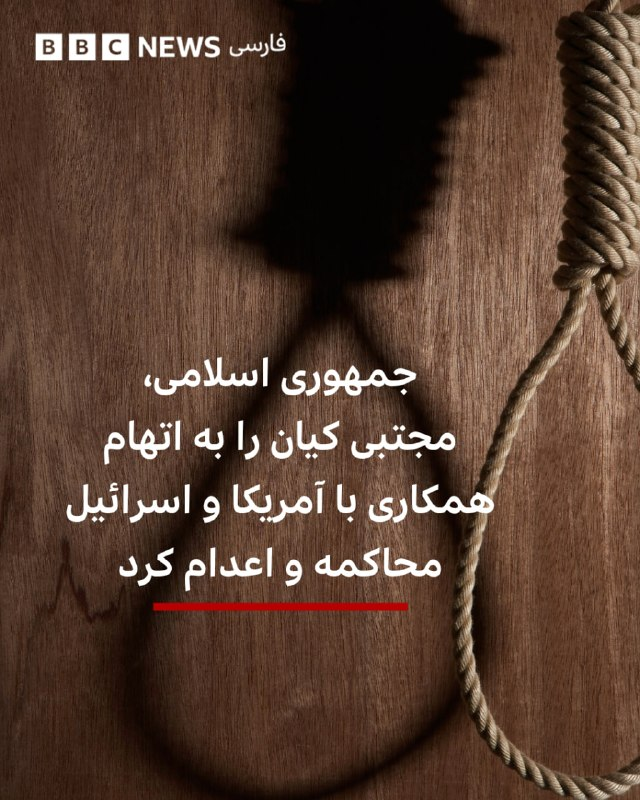

‌ ‌ ‌ ‌
خبرگزاری میزان، وابسته به قوه‌ قضائیه ایران خبر از اعدام مجتبی کیان، به اتهام «فعالیت اطلاعاتی» برای اسرائیل و آمریکا در جنگ اخیر داده است.

قوه قضائیه جمهوری اسلامی گفته که مجتبی کیان «در طول جنگ رمضان اقدام به ارسال اطلاعات مرتبط با واحد‌های صنایع دفاعی کشور به دشمن می‌کرد.»

به گفته رسانه دستگاه قضایی آقای کیان در طول جنگ اخیر «پیام‌های متعددی را به شبکه‌های معاند» ارسال می‌کرده «که از جمله آنها، مختصات و اطلاعات محل واحد‌های تولید قطعات مرتبط با صنایع دفاعی کشور بود.»

میزان تاکید کرده که یکی از دلایل صدور حکم اعدام برای آقای کیان «اعترافات» او پیش از دادگاه و در دادگاه بوده است.

نهادهای حقوق بشر از دادرسی‌های ناعادلانه، نقض حقوق متهم و موج اعدام‌ها بر اساس «اعترافات» زیر شکنجه و فشار برای صدور احکام اعدام در ایران ابراز نگرانی کرده‌اند.

https://bbc.in/4a0m5Ir
📷Getty
@BBCPersian

## BBCPersian — post 281927

🔻سی‌بی‌اس: مظنون تیراندازی در نزدیکی کاخ سفید سابقه درگیری با سرویس مخفی داشت

منابع آگاه به سی‌بی‌اس نیوز شریک خبری بی‌بی‌سی، گفتند که مظنون کشته‌شده در تیراندازی بیرون کاخ سفید، شناسایی شده است و نامش «نصیر بِست» و ۲۱ ساله بود.

https://bbc.in/4wGRQA5
@BBCPersian

## BBCPersian — post 281926

🔻تد کروز: توافقی که به ایران امکان کنترل تنگه هرمز بدهد، اشتباهی فاجعه‌بار است

تد کروز، سناتور جمهوری‌خواه آمریکا، در واکنش به گزارش‌ها درباره توافق احتمالی با ایران، در شبکه اجتماعی ایکس نوشت که نسبت به آنچه «توافق ایران» خوانده می‌شود و به گفته او برخی در دولت آمریکا در حال پیشبرد آن هستند، «عمیقا نگران» است.

او نوشت که تصمیم دونالد ترامپ برای حمله به ایران «مهم‌ترین تصمیم» دوره دوم ریاست‌جمهوری او بود و افزود که آمریکا «نتایج نظامی فوق‌العاده‌ای» به دست آورده است؛ از جمله به گفته او نابودی همه موشک‌ها و پهپادهای ایران و غرق کردن تمام نیروی دریایی آن کشور.

سناتور کروز می‌گوید که اسلامگرایان حاکم بر ایران، همچنان شعار «مرگ بر آمریکا» سر می‌دهند و نوشت که اگر نتیجه این تحولات آن باشد که این حکومت بعد از این توافق «میلیاردها دلار دریافت کند، اورانیوم غنی‌سازی کند و سلاح هسته‌ای توسعه دهد و کنترل موثر بر تنگه هرمز داشته باشد، این یک اشتباه فاجعه‌بار خواهد بود.»

او همچنین نوشت که جزئیات توافق هنوز در حال روشن شدن است، اما این‌که راب مالی، نماینده پیشین دولت جو بایدن در امور ایران، از آن حمایت کرده «دلگرم‌کننده نیست.»

سناتور کروز در پایان گفت که دونالد ترامپ به «صلح از مسیر قدرت» باور دارد و باید به دفاع از آمریکا و اجرای «خطوط قرمز» اعلام‌شده ادامه دهد.

https://bbc.in/4dIXh98
@BBCPersian

## BBCPersian — post 281925

  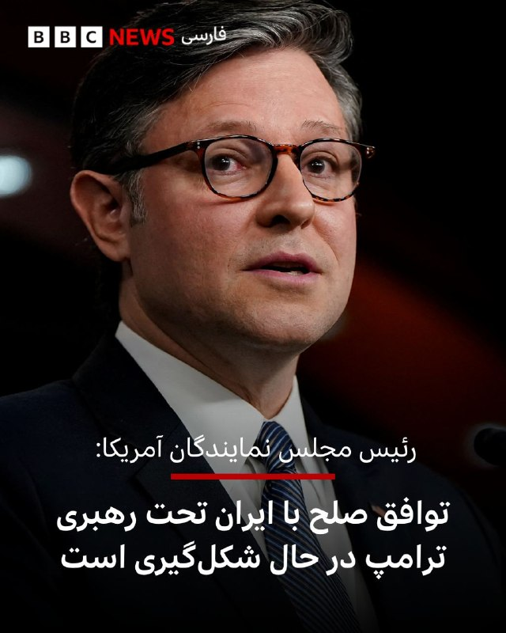

🔻مایک جانسون، رئیس مجلس نمایندگان آمریکا، از توافق در حال شکل‌گیری با ایران حمایت کرد و در شبکه اجتماعی ایکس نوشت تنها دونالد ترامپ می‌توانست ایران را «پای میز مذاکره» بیاورد.

آقای جانسون نوشت: «از این‌که می‌شنویم توافق صلح با ایران در حال شکل‌گیری است، بسیار دلگرم شده‌ایم و منتظریم جزئیات بیشتری درباره آن منتشر شود.»

او همچنین افزود: «تحت رهبری رئیس‌جمهور ترامپ، کشور ما قدرتمندتر، در صحنه جهانی محترم‌تر و امن‌تر از هر زمان دیگری است.»

📸 Reuters

https://bbc.in/4dIXh98
@BBCPersian

## BBCPersian — post 281924

🔻اختلاف جمهوری‌خواهان بر سر توافق احتمالی ترامپ با ایران

اعلام دونالد ترامپ، رئیس جمهور آمریکا مبنی بر «تا حد زیادی مذاکره شدن» توافق با ایران، که به گفته او شامل بازگشایی تنگه هرمز نیز می‌شود، واکنش‌های متفاوتی را در میان جمهوری‌خواهان و متحدان سیاسی او در آمریکا برانگیخته است.

https://bbc.in/4nPu9BJ
@BBCPersian

## BBCPersian — post 281923

🔻دنیس راس: ایران در آینده از تنگه هرمز به‌عنوان اهرم فشار استفاده خواهد کرد

دنیس راس، دیپلمات باسابقه و مذاکره کننده سابق آمریکایی در شبکه اجتماعی ایکس نوشت که توافق در حال شکل‌گیری درباره بازگشایی تنگه هرمز است.

او نوشت: «ما محاصره خود را برمی‌داریم و آن‌ها اجازه عبور همه کشتی‌ها را می‌دهند؛ همان‌طور که پیش از جنگ برقرار بود.»

آقای راس افزود که قرار است طی ۶۰ روز آینده درباره برنامه هسته‌ای ایران مذاکره شود؛ توافقی که هدف آن پایان دادن به این برنامه نیست، بلکه محدود کردن آن است.

او همچنین مدعی شد که ایران در آینده از تنگه هرمز به‌عنوان اهرم فشار استفاده خواهد کرد.

https://bbc.in/4dIXh98
@BBCPersian

## BBCPersian — post 281922

🔻لیندزی گراهام: توافقی که به بقای حکومت ایران منجر شود بر درگیری‌های منطقه بنزین می‌ریزد

لیندزی گراهام، سناتور ارشد جمهوری‌خواه آمریکا، در پیامی در شبکه اجتماعی ایکس نوشت که اگر در منطقه چنین برداشت شود که توافق با ایران به حکومت آن کشور امکان بقا و قدرتمندتر شدن در گذر زمان را می‌دهد، در واقع «بر درگیری‌های لبنان و عراق بنزین ریخته‌ایم.»

او افزود توافقی که این تصور را ایجاد کند که ایران می‌تواند بقا پیدا کند و در آینده توان کنترل تنگه هرمز را داشته باشد، حزب‌الله در لبنان و شبه‌نظامیان شیعه در عراق را «به‌شدت تقویت خواهد کرد.»

پست سناتور گراهام بعد از آن است که دونالد ترامپ، رئیس جمهور آمریکا اعلام کرد که گفت‌وگوهای «بسیار خوبی» با شماری از رهبران منطقه داشته است اما جنبه‌ها و جزئیات نهایی توافق با ایران همچنان در حال بررسی است و «به‌زودی» اعلام خواهد شد.

آقای ترامپ همچنین گفت که در چارچوب این توافق، تنگه هرمز بازگشایی خواهد شد.

https://bbc.in/4dIXh98
@BBCPersian

## BBCPersian — post 281921

  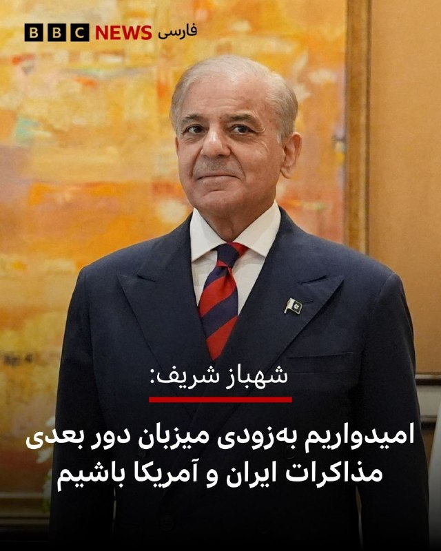

به‌گزارش خبرگزاری فرانسه، شهباز شریف، نخست‌وزیر پاکستان، ابراز امیدواری کرد که کشورش به‌زودی میزبان دور بعدی مذاکرات صلح میان ایران و آمریکا باشد.

آقای شریف در پیامی در شبکه اجتماعی ایکس نوشت: «پاکستان با نهایت صداقت به تلاش‌های صلح خود ادامه خواهد داد و امیدواریم خیلی زود میزبان دور بعدی گفت‌وگوها باشیم.»

به گزارش خبرگزاری رویترز، نخست‌وزیر پاکستان همچنین از دونالد ترامپ به‌دلیل «تلاش‌های فوق‌العاده برای پیگیری صلح»، تقدیر کرد و گفت که گفت‌وگوی تلفنی آقای ترامپ با رهبران عربستان سعودی، قطر، ترکیه، مصر، امارات متحده عربی، اردن و پاکستان «بسیار مفید و سازنده» بوده است.

به گفته آقای شریف، فیلد مارشال عاصم منیر، فرمانده کل ارتش و نیروهای مسلح پاکستان، نماینده آن کشور در تماس تلفنی با آقای ترامپ بود و از «تلاش‌های خستگی‌ناپذیر» او در تمام روند مذاکرات قدردانی کرد.

نخست‌وزیر پاکستان افزود که این گفت‌وگوها فرصتی برای تبادل نظر درباره وضعیت کنونی منطقه و پیشبرد تلاش‌ها برای دستیابی به صلحی پایدار فراهم کرده است.

📸 Reuters

https://bbc.in/4dIXh98
@BBCPersian

## BBCPersian — post 281919

🔻اسماعیل بقائی، سخنگوی وزارت امور خارجه، در پیامی در شبکه اجتماعی ایکس با درج تصویر سنگ‌نگاره پیروزی شاپور اول ساسانی بر امپراتور روم، نوشت: «وقتی ایرانیان مهاجمان متوهم را ناکام گذاشتند.»

او در این پیام که کنایه‌ای است به محاصره دریایی بنادر ایران توسط آمریکا نوشت: «رومیان تصور می‌کردند که رم مرکز عالم است؛ اما ایرانیان این توهم را در هم شکستند.»

پیام آقای بقایی که به نحو گسترده‌ای در کانال‌های تلگرامی رسانه‌های حکومتی ایران بازنشر شده است به نظر می‌رسد که با استفاده از سنگ‌نگاره پیروزی شاپور بر امپراتوران روم در نقش رستم استان فارس بازنقش شده است.

آقای بقایی که اخیرا با حکم محمدباقر قالیباف به عنوان سخنگوی هیئت مذاکره‌کننده ایران هم منصوب شده است با اشاره به لشگرکشی مارکوس یولیوس فیلیپوس معروف به فیلیپ عرب، امپراتور روم، علیه امپراتوری ساسانیان، نوشت که لشگرکشی او «منجر به پیروزی رومیان نشد بلکه به صلحی با شروط شاپور اول ختم شد؛ امپراتور ناچار شد با واقعیت کنار بیاید.»

📸 REUTERS/ IRIMFA_SPOX

https://bbc.in/4dIXh98
@BBCPersian

## BBCPersian — post 281918

  

🔻ایران در جریان جام جهانی امسال، اردوی تیم ملی خود را در شهر مرزی تیخوانا در مکزیک برپا خواهد کرد. این اقدام پس از آن‌ است که فیفا با درخواست انتقال محل اردو از ایالت آریزونا موافقت کرد.

به گزارش رویترز مهدی تاج، رئیس فدراسیون فوتبال ایران، در ویدیویی که در حساب تلگرام فدراسیون منتشر شد گفت: «ما در کمپ تیخوانا مستقر خواهیم شد؛ جایی در نزدیکی اقیانوس آرام و در مرز مکزیک و آمریکا.»

او افزود که این تغییر می‌تواند از مشکلات مربوط به ویزا جلوگیری کند و اعضای تیم خواهند توانست با پروازهای مستقیم ایران‌ایر به مکزیک سفر کنند.

رویترز می‌گوید که فیفا به درخواستش برای اظهار نظر پاسخ نداده است.

ایران نخستین دو مسابقه خود در گروه جی را در لس‌آنجلس برگزار خواهد کرد؛ برابر نیوزیلند در ۲۵ خرداد و بلژیک در ۳۱ خرداد، و سپس ۵ تیر در سیاتل به مصاف مصر خواهد رفت.

مهدی تاج گفت که فاصله پروازی میان تیخوانا و محل بازی‌های تیم در لس‌آنجلس حدود ۵۵ دقیقه است و این شهر نسبت به اردوی قبلی برنامه‌ریزی‌شده در آریزونا به محل مسابقات نزدیک‌تر است.

📸 Reuters

https://bbc.in/4dIXh98
@BBCPersian

## alonews — post 122222

  <a href="telegram/content/alonews_122222_1779602671.mp4" target="_blank">🎬 Download video</a>

👈چندین آتش‌سوزی بزرگ در کی‌یف، اوکراین، پس از حمله موشکی گسترده روسیه مشاهده می‌شود.

✅ @AloNews خبر جنگ

## alonews — post 122221

  <a href="telegram/content/alonews_122221_1779602673.webm" target="_blank">🎬 Download video</a>

👈رویترز به نقل از وزیر امور خارجه پاکستان: تماس تلفنی مهم رئیس جمهور ترامپ گامی اساسی در جهت دستیابی به صلح منطقه‌ای است.

✅ @AloNews خبر جنگ

## alonews — post 122220

  <a href="telegram/content/alonews_122220_1779602673.webm" target="_blank">🎬 Download video</a>

👈سرویس مخفی اعلام کرده است که مظنون ۲۱ ساله تیراندازی نزدیک کاخ سفید در اثر آتش متقابل جان خود را از دست داده است.

🔴مقامات اجرای قانون به سی‌ان‌ان گفته‌اند که تیرانداز مظنون نزدیک کاخ سفید قبلاً توسط سرویس مخفی شناخته شده بود و چندین بار تلاش کرده بود وارد محوطه کاخ سفید شود، اگرچه در آن حوادث قبلی نه مسلح بود و نه خشونت‌آمیز.

🔴مظنون به عنوان فردی که ممکن است «دارای اختلالات عاطفی» باشد توصیف شده است

✅ @AloNews خبر جنگ

## alonews — post 122219

  <a href="telegram/content/alonews_122219_1779602673.webm" target="_blank">🎬 Download video</a>

👈مواضع رسانه‌های عبری نسبت به توافق احتمالی واشنگتن و تهران

🔴کانال ۱۲: ساعات آینده تعیین‌کننده است و جزئیات راه‌حل در حال شکل‌گیری میان ایران و ایالات متحده به نفع اسرائیل به نظر نمی‌رسد.

🔴یدیعوت آحارونوت: نگرانی فزاینده در اسرائیل از تفاهمات در حال شکل‌گیری میان ایالات متحده و ایران شکل گرفته

🔴معاریو: پیروزی ایران نزدیک است و اسرائیل باید محاسبات خود را از سر بگیرد، جایگاه خود را در منطقه مشخص کند و ائتلاف‌های تازه‌ای شکل دهد.

🔴برخی دیگر از رسانه‌های اسرائیلی «سکوت مطلق» نخست‌وزیر و دفتر او را نسبت به اخبار مربوط به نزدیکی امضای توافق میان ایران و ایالات متحده محکوم کرده‌اند.

✅ @AloNews خبر جنگ

## alonews — post 122218

  <a href="telegram/content/alonews_122218_1779602673.webm" target="_blank">🎬 Download video</a>

👈رسایی، از رهبران بولشویک‌ها:
هر توافق یا صحبتی بدون تایید مجلس فاقد اعتبار هست

✅ @AloNews خبر جنگ

## alonews — post 122217

  <a href="telegram/content/alonews_122217_1779602674.webm" target="_blank">🎬 Download video</a>

👈تنگه هرمز قراره باز بشه و هیچ گونه عوارضی هم گرفته نشه و ایران صرفا یک مدیریت نمایشی(نگاه کردن) داشته باشه

✅ @AloNews خبر جنگ

## alonews — post 122216

  <a href="telegram/content/alonews_122216_1779602674.webm" target="_blank">🎬 Download video</a>

👈حمله تند سخنگوی کاخ سفید به پمپئو: «دهان احمقانه‌ات را ببند»

🔴استیون چونگ، مدیر ارتباطات کاخ سفید، بهشدت به مایک پمپئو، وزیر خارجه پیشین آمریکا، حمله کرد و گفت: «مایک پمپئو هیچ ایده ای از آنچه درباره آن حرف می زند، ندارد. او به اطلاعات جاری دسترسی ندارد، پس از کجا می داند؟ باید دهان احمقانه اش را ببندد و کار را به حرفه ای ها بسپارد.»

🔴این تنش پس از آن رخ داد که پمپئو توافق احتمالی ترامپ با ایران را به شدت نقد کرد و آن را مشابه توافق هسته ای دولت اوباما خواند.

🔴 پمپئو در شبکه اجتماعی ایکس نوشت که ایالات متحده باید «تنگه هرمز را باز کند، دست ایران را از پول کوتاه کند و توانایی کافی از ایران بگیرد». در مقابل، ترامپ اعلام کرده که توافق با ایران «تا حد زیادی نهایی شده» و شامل باز شدن تنگه هرمز خواهد بود

✅ @AloNews خبر جنگ

## alonews — post 122215

  <a href="telegram/content/alonews_122215_1779602674.webm" target="_blank">🎬 Download video</a>

👈مایک پمپئو، مدیر سابق سیا و وزیر امور خارجه: توافقی که با ایران مطرح شده به نظر می‌رسد مستقیماً از کتاب بازی وندی شرمن، رابرت مالی و بن رودز باشد: به سپاه پاسداران پول بدهید تا برنامه سلاح‌های کشتار جمعی بسازد و جهان را ترور کند.

🔴این اصلاً اول آمریکا نیست. واضح است: تنگه لعنتی را باز کنید. دسترسی ایران به پول را قطع کنید. توانایی ایران را به اندازه‌ای کاهش دهید که نتواند به متحدان ما در منطقه تهدیدی ایجاد کند.

🔴مدت‌هاست که باید انجام می‌شد. بزن بریم.

✅ @AloNews خبر جنگ

## alonews — post 122214

  <a href="telegram/content/alonews_122214_1779602674.webm" target="_blank">🎬 Download video</a>

👈وزیر خارجه پاکستان: تماس مهم دونالد ترمپ، رئیس‌جمهور آمریکا، با رهبران پاکستان، عربستان، ترکیه، قطر، مصر، امارات و اردن، گامی اساسی به سوی تحقق صلح منطقه‌ای محسوب می‌شود.

🔴آنچه مذاکرات به دست آورده، باعث خوشبینی نسبت به امکان دستیابی به نتیجه‌ای مثبت و پایدار است.

✅ @AloNews خبر جنگ

## alonews — post 122213

  <a href="telegram/content/alonews_122213_1779602674.webm" target="_blank">🎬 Download video</a>

👈طبق آمار، میزان ازدواج‌ها نسبت به زمان مشابه پارسال 60% کاهش یافته

✅ @AloNews خبر جنگ

## alonews — post 122212

  <a href="telegram/content/alonews_122212_1779602674.webm" target="_blank">🎬 Download video</a>

👈جمعیت مجردهای کشور از مرز 13 میلیون نفر گذشت

🔴بیش از 7.2 میلیون زن زیر 40 سال هرگز ازدواج نکرده‌اند.

🔴 بیش از 9.3 میلیون مرد زیر 40 سال هرگز ازدواج نکرده‌اند.

🔴کاهش مستمر نرخ ازدواج در کنار روند صعودی طلاق است

✅ @AloNews خبر جنگ

## alonews — post 122211

  <a href="telegram/content/alonews_122211_1779602675.webm" target="_blank">🎬 Download video</a>

👈تک‌تیراندازهای سرویس مخفی روی سقف کاخ سفید

✅ @AloNews خبر جنگ

## alonews — post 122210

  <a href="telegram/content/alonews_122210_1779602675.webm" target="_blank">🎬 Download video</a>

👈اکسیوس، به نقل از یک مقام آمریکایی:
این توافق، بازگشایی تنگه هرمز را در طول دوره تمدید آتش‌بس ۶۰ روزه تصریح می‌کند.

✅ @AloNews خبر جنگ

## alonews — post 122209

  <a href="telegram/content/alonews_122209_1779602675.webm" target="_blank">🎬 Download video</a>

👈روزنامه خراسان: اگر منظور از قطع اینترنت بین‌الملل مسائل امنیتی است، بدانید که کاربران با فیلترشکن به هر قیمتی به آن وصل می‌شوند

✅ @AloNews خبر جنگ

## alonews — post 122208

  <a href="telegram/content/alonews_122208_1779602675.webm" target="_blank">🎬 Download video</a>

👈وزیر دفاع پاکستان: به نتایج مثبت برای پایان جنگ خاورمیانه نزدیک می‌شویم

🔴 مسائل در شرف حل شدن است

🔴 همه طرف‌ها در تدارک یک فرجام شایسته برای اوضاع جاری هستند

✅ @AloNews خبر جنگ

## alonews — post 122207

  <a href="telegram/content/alonews_122207_1779602675.mp4" target="_blank">🎬 Download video</a>

👈لحظه‌ای که صدای تیراندازی بیرون کاخ سفید به گوش رسید.

✅ @AloNews خبر جنگ

## alonews — post 122206

  <a href="telegram/content/alonews_122206_1779602676.webm" target="_blank">🎬 Download video</a>

👈طبق گزارش NBC News، صدای تیراندازی در خارج از کاخ سفید شنیده شد، با حدود ۲۰ تا ۳۰ گلوله شلیک شده. سرویس مخفی به خبرنگاران دستور داده است که برای حفظ جانشان به داخل اتاق جلسه بروند 
✅ @AloNews خبر جنگ

## alonews — post 122205

  <a href="telegram/content/alonews_122205_1779602676.webm" target="_blank">🎬 Download video</a>

👈نیویورک تایمز: ایران موافقت کرده است که ذخیره اورانیوم غنی‌شده خود را به عنوان بخشی از توافق برای پایان دادن به جنگ واگذار کند

✅ @AloNews خبر جنگ

## alonews — post 122204

  <a href="telegram/content/alonews_122204_1779602676.webm" target="_blank">🎬 Download video</a>

👈پزشکیان: خرمشهر امروز ایران، خلیج‌فارس و تنگۀ هرمز است

🔴ملت ما امروز هم‌چنان مردم رزم ندیده اما دلیر خرمشهرند که روزها در مقابل ارتش متجاوز ایستادند تا قدرت مردم ایران را به رخ جهانیان بکشند.

🔴مقاومت، ایثار و دفع تجاوز، ریشه در فرهنگ این سرزمین دارد.

✅ @AloNews خبر جنگ

---
📅 بروزرسانی: 1405/03/03 05:05
---

## VahidOOnLine — post 241850

  

شهباز شریف، نخست‌وزیر پاکستان، تلاش‌های ترامپ برای پیگیری صلح و برگزاری تماس با کشورهای منطقه را به او تبریک گفت و ابراز امیدواری کرد پاکستان به‌زودی میزبان دور بعدی گفت‌وگوهای تهران و واشینگتن باشد.
شریف در ایکس با اشاره به تماس ترامپ با رهبران عربستان سعودی، قطر، ترکیه، مصر، امارات متحده عربی، اردن و پاکستان، گفت: «این گفت‌وگوها فرصت مفیدی برای تبادل نظر درباره وضعیت کنونی منطقه و چگونگی پیشبرد تلاش‌های جاری برای صلح به منظور دستیابی به صلحی پایدار در منطقه فراهم کرد.»

‌🏁 🇬🇧 IranintlTV

🤖 @VahidOOnLine

## VahidOOnLine — post 241849

  

♦️شهباز شریف، نخست‌وزیر پاکستان، با انتشار پیامی در اکس، ضمن تبریک به دونالد ترامپ برای پیشبرد فرآیند صلح در منطقه نوشت: «به رئیس‌جمهور دونالد ترامپ برای تلاش‌های فوق‌العاده‌اش در مسیر دستیابی به صلح و همچنین برگزاری تماس تلفنی بسیار مفید و ثمر‌بخش امروز با رهبران عربستان سعودی، قطر، ترکیه، مصر، امارات متحده عربی، اردن و پاکستان تبریک می‌گویم؛ عاصم منیر به نمایندگی از پاکستان در این تماس تلفنی حضور داشت و من از تلاش‌های خستگی‌ناپذیر او در طول این فرآیند بسیار سپاسگزارم.» نخست‌وزیر پاکستان در ادامه با اشاره به ماهیت این گفتگوهای چندجانبه افزود: «این رایزنی‌ها فرصت مفیدی را برای تبادل نظر درباره وضعیت فعلی منطقه و چگونگی پیشبرد تلاش‌های جاری صلح جهت ایجاد صلح پایدار در منطقه فراهم کرد؛ پاکستان با صمیمیت کامل به تلاش‌های صلح‌آمیز خود ادامه خواهد داد و امیدواریم به‌زودی میزبان دور بعدی گفتگوها باشیم.»
‌🇸🇦 Indypersian

🤖 @VahidOOnLine

## VahidOOnLine — post 241848

  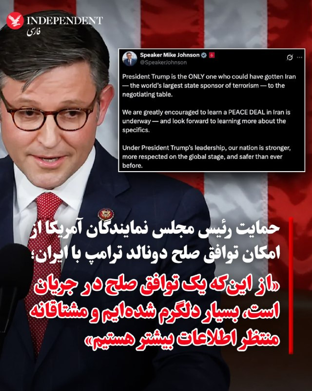

♦️مایک جانسون، رئیس مجلس نمایندگان ایالات متحده، با انتشار پیامی در اکس، ضمن حمایت از سیاست‌های دولت دونالد ترامپ نوشت: «رئیس‌جمهور ترامپ تنها کسی است که می‌توانست ایران، بزرگ‌ترین دولت حامی تروریسم در جهان، را به میز مذاکره بکشاند؛ ما از این‌که متوجه شدیم یک توافق صلح با ایران در جریان است، بسیار دلگرم شده‌ایم و مشتاقانه منتظر کسب اطلاعات بیشتر درباره جزئیات آن هستیم.» جانسون در ادامه پیام خود با تمجید از عملکرد رئیس‌جمهوری آمریکا افزود که تحت رهبری ترامپ، ملت آمریکا قوی‌تر، در عرصه جهانی محترم‌تر و امن‌تر از هر زمان دیگری است.
‌🇸🇦 Indypersian

🤖 @VahidOOnLine

## VahidOOnLine — post 241847

  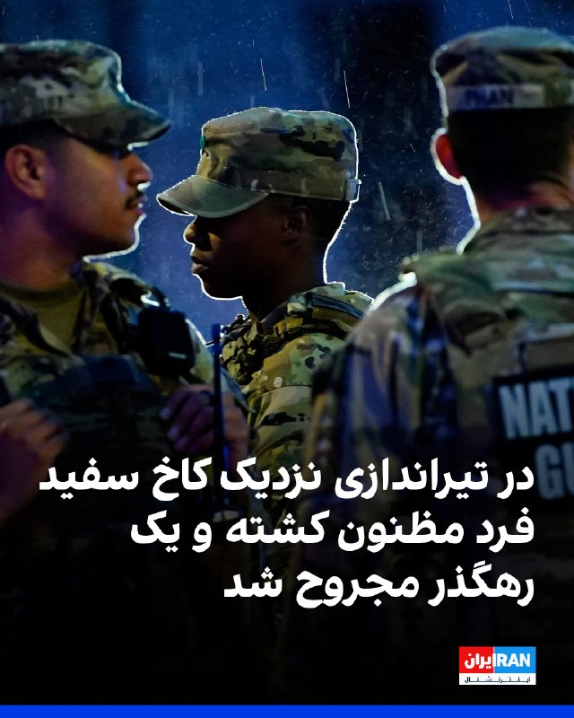

سرویس مخفی آمریکا در بیانیه‌ای اعلام کرد در تیراندازی نزدیک کاخ سفید فرد مظنون کشته و یک رهگذر مجروح شد.
طبق این بیانیه، ترامپ هنگام وقوع این حادثه در کاخ سفید حضور داشت، اما هیچ‌یک از افراد تحت حفاظت سرویس مخفی و همچنین فعالیت‌های حفاظتی تحت تاثیر این رویداد قرار نگرفتند.
طبق اعلام سرویس مخفی آمریکا، عصر شنبه فردی در محدوده خیابان هفدهم و خیابان پنسیلوانیا، نزدیک کاخ سفید، سلاحی را از کیف خود خارج کرد و شروع به تیراندازی کرد، اما ماموران با تیراندازی فرد مظنون را هدف قرار دادند.
این بیانیه افزود فرد مظنون به یکی از بیمارستان‌های منطقه منتقل شد، اما در آنجا مرگ او اعلام شد. در جریان این تیراندازی، یک رهگذر نیز بر اثر اصابت گلوله مجروح شد.

‌🏁 🇬🇧 IranintlTV

🤖 @VahidOOnLine

## VahidOOnLine — post 241846

  

♦️به گزارش «اسکای نیوز» فرد مهاجم در حادثه تیراندازی مجاورت کاخ سفید پس از نزدیک شدن به ایست بازرسی امنیتی در تقاطع خیابان هفدهم و پنسیلوانیا، سلاح خود را از کیف خارج کرده و به سوی ماموران سرویس مخفی شلیک کرده است که در پی پاسخ متقابل نیروهای امنیتی، ضارب و یک عابر پیاده زخمی شدند. سرویس مخفی ایالات متحده با انتشار بیانیه‌ای تایید کرد که فرد مسلح بر اثر شدت جراحات ناشی از این تبادل آتش، در بیمارستان جان باخته است.
این گزارش حاکی از آن است که در زمان وقوع حادثه و شلیک ۱۵ تا ۳۰ گلوله که موجی از وحشت را در میان خبرنگاران مستقر در بخش غربی کاخ سفید ایجاد کرد، دونالد ترامپ در محل اقامت خود حضور داشته است. این حادثه تنها سه هفته پس از حادثه تیراندازی در ضیافت شام انجمن خبرنگاران کاخ سفید رخ می‌دهد. براساس این گزارش، هیچ یک از نیروهای سرویس مخفی در این درگیری آسیب ندیده‌اند و تحقیقات گسترده پلیس در محل حادثه آغاز شده است.
‌🇸🇦 Indypersian

🤖 @VahidOOnLine

## VahidOOnLine — post 241845

  

در پی اعتراضات دانش‌آموزی به برگزاری امتحانات به صورت حضوری، سعید شاهرخی، استاندار لرستان، با اشاره ‌به شرایط کنونی و با تاکید بر حفظ امنیت در استان، دستور داد امتحانات پایه‌های هفتم تا دهم غیرحضوری برگزار شود.
شورای هماهنگی تشکل‌های صنفی فرهنگیان ایران به نقل از مدیرکل آموزش‌وپرورش لرستان اعلام کرد اعتراض دانش‌آموزان این استان نتیجه داد و امتحانات نوبت دوم در لرستان به‌صورت مجازی برگزار می‌شود.
طبق این گزارش مدیرکل آموزش‌وپرورش لرستان در جمع دانش‌آموزان گفت: «صدای اعتراضات شما را شنیدیم» و آزمون‌ها غیرحضوری خواهد بود.

‌🏁 🇬🇧 IranintlTV

🤖 @VahidOOnLine

## VahidOOnLine — post 241844

  

در پی اعتراضات دانش‌آموزی به برگزاری امتحانات به صورت حضوری، سعید شاهرخی، استاندار لرستان، با اشاره ‌به شرایط کنونی و با تاکید بر حفظ امنیت در استان، دستور داد امتحانات پایه‌های هفتم تا دهم غیرحضوری برگزار شود.
شورای هماهنگی تشکل‌های صنفی فرهنگیان ایران به نقل از مدیرکل آموزش‌وپرورش لرستان اعلام کرد اعتراض دانش‌آموزان این استان نتیجه داد و امتحانات نوبت دوم در لرستان به‌صورت مجازی برگزار می‌شود.
طبق این گزارش مدیرکل آموزش‌وپرورش لرستان در جمع دانش‌آموزان گفت: «صدای اعتراضات شما را شنیدیم» و آزمون‌ها غیرحضوری خواهد بود.

‌🏁 🇬🇧 IranintlTV

🤖 @VahidOOnLine

## VahidOOnLine — post 241843

  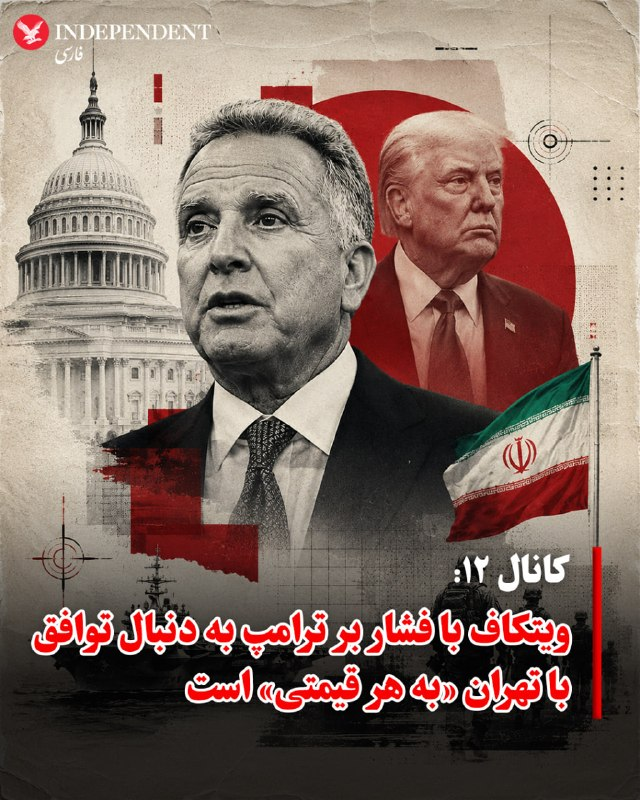

♦️کانال ۱۲ اسرائیل گزارش داد که بنیامین نتانیاهو، نخست‌وزیر این کشور، در پی انتشار جزئیاتی از پیشرفت پیش‌نویس تفاهم میان ایالات متحده و ایران، نشست محدودی را با روسای احزاب ائتلاف و مقامات ارشد امنیتی برگزار کرده است؛ مقامات تل‌آویو با ابراز نگرانی شدید از مفاد این تفاهم محتمل، استیو ویتکاف، فرستاده ویژه دونالد ترامپ در خاورمیانه را متهم کرده‌اند که به دنبال دستیابی به یک توافق «به هر قیمتی» است و فشار سنگینی بر ترامپ وارد می‌کند تا مانع از بازگشت به درگیری‌های نظامی شود. بر اساس این گزارش، نگرانی اصلی اسرائیل از کلیات این توافق است که در آن، واشنگتن امتیازات نقد به تهران واگذار می‌کند اما مابه‌ازای آن را به صورت نسیه دریافت خواهد کرد؛ به طوری که در گام نخست بر سر بازگشایی تنگه هرمز توافق می‌شود و دارایی‌های بلوکه‌شده ایران به تدریج آزاد خواهد شد، در حالی که موضوع غنی‌سازی و تسلیحات هسته‌ای به مراحل نامعلوم بعدی موکول می‌گردد.
این شبکه تلویزیونی با استناد به گزارش روزنامه نیویورک‌تایمز اشاره کرد که اسرائیل از روند مراجع اطلاعاتی و مذاکرات مستقیم میان واشنگتن و تهران کنار گذاشته شده و ناچار است جزئیات را از طریق کشورهای ثالث یا تحرکات جاسوسی و اطلاعاتی کسب کند؛ این وضعیت با مواضع عمومی نتانیاهو و ترامپ در تضاد است، هرچند نزدیکان نخست‌وزیر اسرائیل می‌گویند هماهنگی‌ها میان دو طرف همچنان نزدیک و مستحکم باقی مانده است. این گزارش در شرایطی منتشر می‌شود که برخی رسانه‌ها مدعی شده‌اند پیش‌نویس این توافق که با میانجی‌گری پاکستان تدوین شده، ممکن است طی ۴۸ ساعت آینده نهایی شود؛ موضوعی که در صورت تحقق، به گفته تحلیل‌گران اسرائیلی یک چالش امنیتی بزرگ برای تل‌آویو خواهد بود.
‌🇸🇦 Indypersian

🤖 @VahidOOnLine

## VahidOOnLine — post 241842

  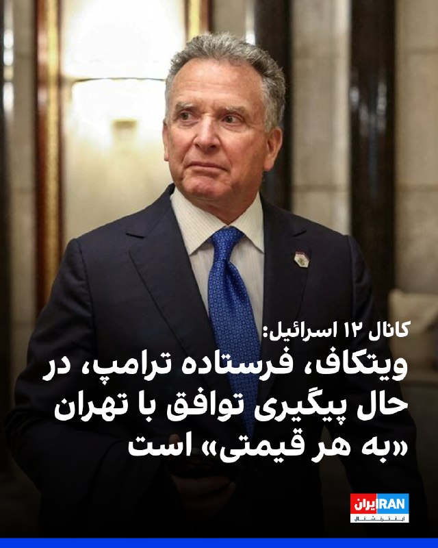

کانال ۱۲ اسرائیل به نقل از یک مقام اسرائیلی گزارش داد استیو ویتکاف، فرستاده ویژه ترامپ، در حال پیگیری یک توافق دیپلماتیک با تهران «به هر قیمتی» است و ترامپ را تحت فشار قرار می‌دهد تا عملیات نظامی را از سر نگیرد.

این گزارش در شرایطی منتشر می‌شود که برخی قانون‌گذاران جمهوری‌خواه و مقام‌های حوزه امنیت ملی آمریکا همچنان درباره پیامدهای هرگونه توافقی که به جمهوری اسلامی امکان بازسازی سیاسی و نظامی بدهد، هشدار می‌دهند.
‌🏁 🇬🇧 IranintlTV

🤖 @VahidOOnLine

## VahidOOnLine — post 241839

  <a href="telegram/content/VahidOOnLine_241839_1779586538.mp4" target="_blank">🎬 Download video</a>

ویدیوی منتشرشده از یک خبرنگار سی‌بی‌اس، لحظات دلهره‌آور تیراندازی در نزدیکی کاخ سفید را در روز شنبه دوم خرداد نشان می‌دهد.
خبرگزاری رویترز به نقل از یک مقام پلیس نوشت که مظنون تیراندازی در نزدیکی کاخ سفید دستگیر و به بیمارستان منتقل شده است. او گفت که مظنون به ایست بازرسی نزدیک کاخ سفید نزدیک شد و به سمت ماموران شلیک کرد. به گفته این مقام پلیس، هیچ یک از ماموران آسیب ندیدند.
‌🏁 🇬🇧 IranintlTV

🤖 @VahidOOnLine

## VahidOOnLine — post 241838

  

♦️لیندسی گراهام، سناتور جمهوری‌خواه آمریکا، با انتشار پیامی در اکس درباره توافق احتمالی با تهران نوشت: «اگر در منطقه این‌گونه برداشت شود که توافق با ایران به این رژیم اجازه می‌دهد بقای خود را حفظ کند و به مرور زمان قدرتمندتر شود، ما روی آتش درگیری‌ها در لبنان و عراق بنزین ریخته‌ایم.» گراهام با تاکید بر پیامدهای منطقه‌ای این تصمیم افزود: «توافقی که تصور شود به رژیم ایران اجازه بقا می‌دهد و توانایی کنترل تنگه هرمز را در آینده برای آن حفظ می‌کند، حزب‌الله در لبنان و شبه‌نظامیان شیعه در عراق را به شدت تقویت خواهد کرد.»
‌🇸🇦 Indypersian

🤖 @VahidOOnLine

## VahidOOnLine — post 241837

  

لیندزی گراهام، سناتور جمهوری‌خواه، هشدار داد هر توافقی که به بقای حکومت ایران و بازگشت تدریجی نفوذ منطقه‌ای آن منجر شود، می‌تواند خاورمیانه را بی‌ثبات‌تر کرده و گروه‌های نیابتی تهران را تقویت کند.
او در شبکه ایکس نوشت اگر در منطقه چنین برداشت شود که توافق با حکومت ایران به این رژیم اجازه می‌دهد زنده بماند و قدرتمندتر شود، «بنزین روی آتش درگیری‌ها در لبنان و عراق ریخته‌ایم» و حزب‌الله لبنان و شبه‌نظامیان شیعه در عراق به‌شدت تقویت خواهند شد.
گراهام با تاکید بر اینکه ادامه فشار بر تهران برای مهار گروه‌های نیابتی آن ضروری است، هشدار داد جمهوری اسلامی ممکن است از مذاکرات برای تجدید قوا استفاده کند.

‌🏁 🇬🇧 IranintlTV

🤖 @VahidOOnLine

## FoxNewsTwitter — post 342177

  

Fox News (Twitter/X)

BREAKING: The gunman who opened fire near the White House on Saturday afternoon has been identified as 21-year-old Nasire Best of Maryland. He was shot by Secret Service agents and died on the way to the hospital.

Best allegedly had multiple prior encounters with the Secret Service and had a history of mental health issues.

Best was detained by Secret Service on June 26, 2025, for flagging down agents and making threats, and again on July 10, 2025 for entering a restricted area, FOX News has learned.

## FoxNewsTwitter — post 342176

‌Fox News (Twitter/X)

Federal officials have served subpoenas to Marxist political influencer Hasan Piker and CodePink cofounder Susan Medea Benjamin as part of a wider investigation into whether U.S. organizations and leaders violated U.S. laws and sanctions in supporting Cuba's communist regime, Fox News Digital has learned.

## FoxNewsTwitter — post 342175

  <a href="telegram/content/FoxNewsTwitter_342175_1779586542.mp4" target="_blank">🎬 Download video</a>

Fox News (Twitter/X)

NEW: The suspect in the shooting near the White House is dead, and one bystander was wounded, according to the White House. FOX News' Alex Hogan breaks down the moments leading up to the incident.

## FoxNewsTwitter — post 342174

  <a href="telegram/content/FoxNewsTwitter_342174_1779586544.mp4" target="_blank">🎬 Download video</a>

Fox News (Twitter/X)

JUST IN: FOX News' Chad Pergram reports that two people were wounded in a shooting near the White House, and that the lockdown has been lifted.

## VahidOnline — post 75668

  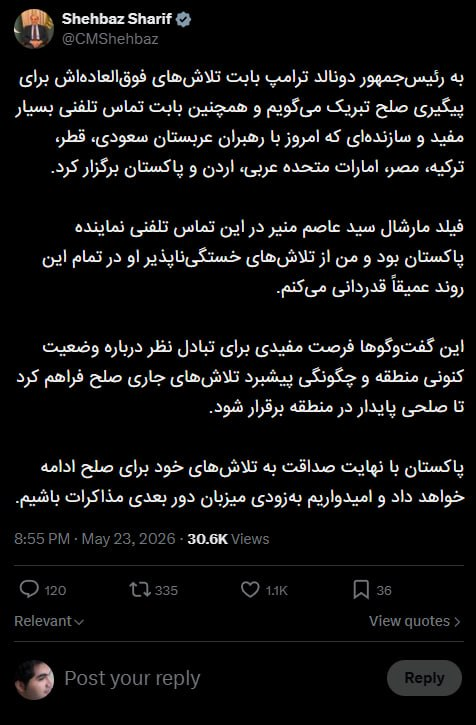

توییت شهباز شریف نخست‌وزیر پاکستان:
CMShehbaz

📡 @VahidOnline

## VahidOnline — post 75666

توییت‌های تد کروز و لیندسی گراهام در واکنش به اخبار منتشر شده درباره توافق احتمالی
tedcruz, LindseyGrahamSC

📡 @VahidOnline

## VahidOnline — post 75665

  <a href="telegram/content/VahidOnline_75665_1779586547.mp4" target="_blank">🎬 Download video</a>

شنبه عصر، یک تیراندازی در حوالی کاخ سفید خبر روی داد که طی آن دو نفر از جمله یک عابر و فرد مظنون تیر خوردند.

سرویس مخفی ایالات متحده، در گزارشی اعلام کرد که اندکی پس از ساعت ۶ عصر روز شنبه، فردی در محدوده خیابان ۱۷ و خیابان پنسیلوانیا، (شمال غربی) سلاحی را از کیف خود خارج کرد و شروع به تیراندازی کرد.

سرویس مخفی ایالات متحده افزود پلیس سرویس مخفی به تیرانازی او پاسخ داد و به مظنون شلیک کرد.

به گفته سرویس مخفی،‌مظنون به یک بیمارستان محلی منتقل شد، اما در آنجا اعلام شد که جان باخته است.

به گفته این نهاد امنیی، در جریان این تیراندازی، یک عابر نیز مورد اصابت گلوله قرار گرفت و هیچ‌یک از مأموران آسیب ندیدند.

سرویس مخفی که وظیفه حفاظت از رئیس‌جمهوری آمریکا را دارد افزود دونالد ترامپ، رئیس‌جمهوری آمریکا، در زمان حادثه در کاخ سفید حضور داشت.
@VahidHeadline

📡 @VahidOnline

## IranIntlTV — post 338683

  

شهباز شریف، نخست‌وزیر پاکستان، تلاش‌های ترامپ برای پیگیری صلح و برگزاری تماس با کشورهای منطقه را به او تبریک گفت و ابراز امیدواری کرد پاکستان به‌زودی میزبان دور بعدی گفت‌وگوهای تهران و واشینگتن باشد.
شریف در ایکس با اشاره به تماس ترامپ با رهبران عربستان سعودی، قطر، ترکیه، مصر، امارات متحده عربی، اردن و پاکستان، گفت: «این گفت‌وگوها فرصت مفیدی برای تبادل نظر درباره وضعیت کنونی منطقه و چگونگی پیشبرد تلاش‌های جاری برای صلح به منظور دستیابی به صلحی پایدار در منطقه فراهم کرد.»

https://iranintl.com/202605243916

## IranIntlTV — post 338682

  

سرویس مخفی آمریکا در بیانیه‌ای اعلام کرد در تیراندازی نزدیک کاخ سفید فرد مظنون کشته و یک رهگذر مجروح شد.
طبق این بیانیه، ترامپ هنگام وقوع این حادثه در کاخ سفید حضور داشت، اما هیچ‌یک از افراد تحت حفاظت سرویس مخفی و همچنین فعالیت‌های حفاظتی تحت تاثیر این رویداد قرار نگرفتند.
طبق اعلام سرویس مخفی آمریکا، عصر شنبه فردی در محدوده خیابان هفدهم و خیابان پنسیلوانیا، نزدیک کاخ سفید، سلاحی را از کیف خود خارج کرد و شروع به تیراندازی کرد، اما ماموران با تیراندازی فرد مظنون را هدف قرار دادند.
این بیانیه افزود فرد مظنون به یکی از بیمارستان‌های منطقه منتقل شد، اما در آنجا مرگ او اعلام شد. در جریان این تیراندازی، یک رهگذر نیز بر اثر اصابت گلوله مجروح شد.

https://iranintl.com/202605246930

## IranIntlTV — post 338681

  

در پی اعتراضات دانش‌آموزی به برگزاری امتحانات به صورت حضوری، سعید شاهرخی، استاندار لرستان، با اشاره ‌به شرایط کنونی و با تاکید بر حفظ امنیت در استان، دستور داد امتحانات پایه‌های هفتم تا دهم غیرحضوری برگزار شود.
شورای هماهنگی تشکل‌های صنفی فرهنگیان ایران به نقل از مدیرکل آموزش‌وپرورش لرستان اعلام کرد اعتراض دانش‌آموزان این استان نتیجه داد و امتحانات نوبت دوم در لرستان به‌صورت مجازی برگزار می‌شود.
طبق این گزارش مدیرکل آموزش‌وپرورش لرستان در جمع دانش‌آموزان گفت: «صدای اعتراضات شما را شنیدیم» و آزمون‌ها غیرحضوری خواهد بود.

https://iranintl.com/202605249059

## IranIntlTV — post 338680

  

در پی اعتراضات دانش‌آموزی به برگزاری امتحانات به صورت حضوری، سعید شاهرخی، استاندار لرستان، با اشاره ‌به شرایط کنونی و با تاکید بر حفظ امنیت در استان، دستور داد امتحانات پایه‌های هفتم تا دهم غیرحضوری برگزار شود.
شورای هماهنگی تشکل‌های صنفی فرهنگیان ایران به نقل از مدیرکل آموزش‌وپرورش لرستان اعلام کرد اعتراض دانش‌آموزان این استان نتیجه داد و امتحانات نوبت دوم در لرستان به‌صورت مجازی برگزار می‌شود.
طبق این گزارش مدیرکل آموزش‌وپرورش لرستان در جمع دانش‌آموزان گفت: «صدای اعتراضات شما را شنیدیم» و آزمون‌ها غیرحضوری خواهد بود.

https://iranintl.com/202605249059

## IranIntlTV — post 338679

  

کانال ۱۲ اسرائیل به نقل از یک مقام اسرائیلی گزارش داد استیو ویتکاف، فرستاده ویژه ترامپ، در حال پیگیری یک توافق دیپلماتیک با تهران «به هر قیمتی» است و ترامپ را تحت فشار قرار می‌دهد تا عملیات نظامی را از سر نگیرد.

این گزارش در شرایطی منتشر می‌شود که برخی قانون‌گذاران جمهوری‌خواه و مقام‌های حوزه امنیت ملی آمریکا همچنان درباره پیامدهای هرگونه توافقی که به جمهوری اسلامی امکان بازسازی سیاسی و نظامی بدهد، هشدار می‌دهند.
https://iranintl.com/202605240801

## IranIntlTV — post 338678

  

کانال ۱۲ اسرائیل به نقل از یک مقام اسرائیلی گزارش داد استیو ویتکاف، فرستاده ویژه ترامپ، در حال پیگیری یک توافق دیپلماتیک با تهران «به هر قیمتی» است و ترامپ را تحت فشار قرار می‌دهد تا عملیات نظامی را از سر نگیرد.

این گزارش در شرایطی منتشر می‌شود که برخی قانون‌گذاران جمهوری‌خواه و مقام‌های حوزه امنیت ملی آمریکا همچنان درباره پیامدهای هرگونه توافقی که به جمهوری اسلامی امکان بازسازی سیاسی و نظامی بدهد، هشدار می‌دهند.
https://iranintl.com/202605240801

## IranIntlTV — post 338677

  <a href="telegram/content/IranIntlTV_338677_1779586553.mp4" target="_blank">🎬 Download video</a>

ویدیوی منتشرشده از یک خبرنگار سی‌بی‌اس، لحظات دلهره‌آور تیراندازی در نزدیکی کاخ سفید را در روز شنبه دوم خرداد نشان می‌دهد.
خبرگزاری رویترز به نقل از یک مقام پلیس نوشت که مظنون تیراندازی در نزدیکی کاخ سفید دستگیر و به بیمارستان منتقل شده است. او گفت که مظنون به ایست بازرسی نزدیک کاخ سفید نزدیک شد و به سمت ماموران شلیک کرد. به گفته این مقام پلیس، هیچ یک از ماموران آسیب ندیدند.

## IranIntlTV — post 338676

  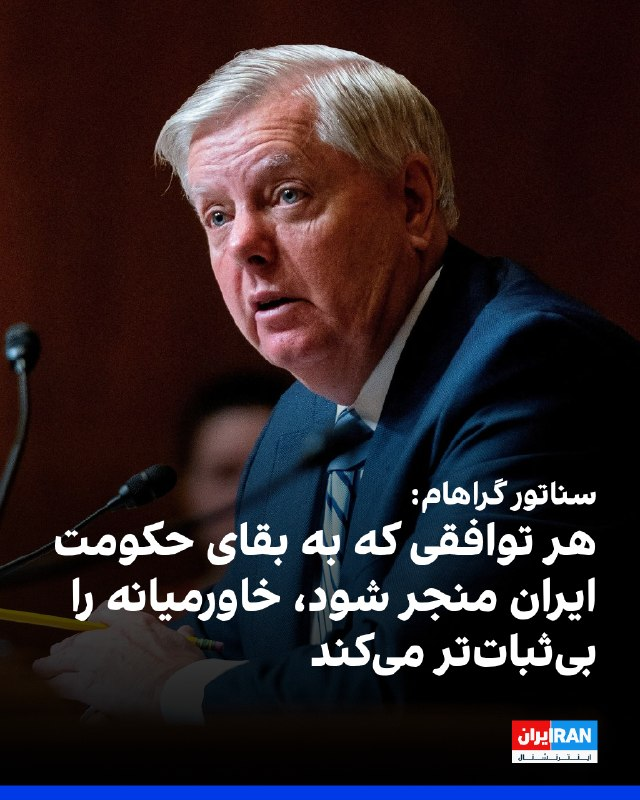

لیندزی گراهام، سناتور جمهوری‌خواه، هشدار داد هر توافقی که به بقای حکومت ایران و بازگشت تدریجی نفوذ منطقه‌ای آن منجر شود، می‌تواند خاورمیانه را بی‌ثبات‌تر کرده و گروه‌های نیابتی تهران را تقویت کند.
او در شبکه ایکس نوشت اگر در منطقه چنین برداشت شود که توافق با حکومت ایران به این رژیم اجازه می‌دهد زنده بماند و قدرتمندتر شود، «بنزین روی آتش درگیری‌ها در لبنان و عراق ریخته‌ایم» و حزب‌الله لبنان و شبه‌نظامیان شیعه در عراق به‌شدت تقویت خواهند شد.
گراهام با تاکید بر اینکه ادامه فشار بر تهران برای مهار گروه‌های نیابتی آن ضروری است، هشدار داد جمهوری اسلامی ممکن است از مذاکرات برای تجدید قوا استفاده کند.

https://iranintl.com/202605237902

## ManotoTV — post 105790

  <a href="telegram/content/ManotoTV_105790_1779586555.mp4" target="_blank">🎬 Download video</a>

تماسی از امارات
«می‌گفت مردم ایران عوض شده‌اند…
و این بار باید هوشیارتر، عاقل‌تر و متفاوت‌تر عمل کنند.»

## FarsiVOA — post 218487

  <a href="telegram/content/FarsiVOA_218487_1779586557.mp4" target="_blank">🎬 Download video</a>

⚡️ماموران امنیتی و خبرنگاران در خیابان ۱۸ام و پنسیلوانیا (شمال غربی) در واشنگتن دی‌سی، در پی تیراندازی شنبه عصر در نزدیکی کاخ سفید، در منطقه حضور دارند. فرد مظنون در این تیراندازی کشته شد.
@FarsiVOA

## FarsiVOA — post 218486

⚡️اولین تصاویر از چمن شمالی کاخ سفید پس از آن‌که در پی حادثه تیراندازی عصر شنبه، به خبرنگاران اجازه بازگشت به محوطه داده شد.
@FarsiVOA

## FarsiVOA — post 218485

🔺گزارش‌ها از تیراندازی در نزدیکی کاخ سفید؛ سرویس مخفی می‌گوید مظنون کشته شد و یک عابر تیر خورد

▪️شنبه عصر، یک تیراندازی در حوالی کاخ سفید خبر روی داد که طی آن دو نفر از جمله یک عابر و یک فرد مظنون تیر خوردند.

⬇️ بیشتر بخوانید:
https://ir.voanews.com/a/8153104.html
@FarsiVOA

## FarsiVOA — post 218484

  <a href="telegram/content/FarsiVOA_218484_1779586558.mp4" target="_blank">🎬 Download video</a>

⚡️گزارش مایکل لیپین، خبرنگار صدای آمریکا از تیراندازی شنبه عصر در اطراف کاخ سفید
@FarsiVOA

## FarsiVOA — post 218483

🔺گزارش خبرنگار صدای آمریکا از محل تیراندازی در اطراف کاخ سفید؛ صدای ده‌ها گلوله شنیده شد

▪️خبرنگار صدای آمریکا در حوزه کاخ سفید، مایکل لیپین، عصر شنبه از نزدیکی محل تیراندازی در اطراف کاخ سفید گزارش کرد.

⬇️ بیشتر بخوانید:
https://ir.voanews.com/a/8153117.html
@FarsiVOA

## Persian_Trend_Official — post 14811

🔴 فوری | گزارش تیراندازی در اطراف کاخ سفید شبکه CBS گزارش داده صدای تیراندازی در اطراف کاخ سفید شنیده شده است. بر اساس گزارش اولیه: ▪️ سرویس مخفی آمریکا از خبرنگاران حاضر در ورودی کاخ سفید خواسته فوراً به اتاق توجیه خبری منتقل شوند ▪️ هنوز جزئیاتی درباره…

## Persian_Trend_Official — post 14810

💢گوشه ای از پیش بینی های نخبگان نظامی جمهوری اسلامی ...

💢شب شما بخیر 🫶

🫆:Tony

📌 @persian_trend_official
پرشین ترند | متفاوت‌ترین کانال نظامی

## Persian_Trend_Official — post 14809

  

🔴لیندزی گراهام، سناتور جمهوری‌خواه،

💢هشدار داد هر توافقی که به بقای حکومت ایران و بازگشت تدریجی نفوذ منطقه‌ای آن منجر شود، می‌تواند خاورمیانه را بی‌ثبات‌تر کرده و گروه‌های نیابتی تهران را تقویت کند.

💢او در شبکه ایکس نوشت اگر در منطقه چنین برداشت شود که توافق با حکومت ایران به این رژیم اجازه می‌دهد زنده بماند و قدرتمندتر شود، «بنزین روی آتش درگیری‌ها در لبنان و عراق ریخته‌ایم» و حزب‌الله لبنان و شبه‌نظامیان شیعه در عراق به‌شدت تقویت خواهند شد.

💢گراهام با تاکید بر اینکه ادامه فشار بر تهران برای مهار گروه‌های نیابتی آن ضروری است، هشدار داد جمهوری اسلامی ممکن است از مذاکرات برای تجدید قوا استفاده کند.

🫆:Tony

📌 @persian_trend_official
پرشین ترند | متفاوت‌ترین کانال نظامی

## BBCPersian — post 281910

🖌بی‌بی‌سی موندو:

🔻اف‌بی‌آی به تازگی اعلام کرده است که برای دریافت اطلاعات منجر به بازداشت و محاکمه مونیکا ویت، عضو پیشین نیروهای مسلح و مامور سابق ضدجاسوسی آمریکا، ۲۰۰ هزار دلار جایزه تعیین کرده است.

مونیکا ویت در فوریه ۲۰۱۹ از سوی یک هیئت منصفه فدرال در واشنگتن به جاسوسی، از جمله از طریق انتقال اطلاعات مربوط به دفاع ملی به حکومت ایران، متهم شد.

اف‌بی‌آی در بیانیه‌ای در ۱۴ مه ۲۰۲۶ اعلام کرد که همچنان در تلاش برای یافتن این فرد است که بر اساس اطلاعات موجود در کیفرخواست او، در سال ۲۰۱۳ به ایران پناهنده شده است.

📸GettyImages/ FBI

https://bbc.in/4dFATNH
@BBCPersian

## BBCPersian — post 281909

🔻خبرنگاران در پی شنیده‌شدن تیراندازی احتمالی در نزدیکی کاخ سفید به پناهگاه رفتند

چند خبرنگار حاضر در کاخ سفید از شنیده شدن صدای احتمالی تیراندازی در نزدیکی این ساختمان خبر داده‌اند.

https://bbc.in/3PUAMWO
@BBCPersian

## manototv — post 105790

  <a href="telegram/content/manototv_105790_1779586560.mp4" target="_blank">🎬 Download video</a>

تماسی از امارات
«می‌گفت مردم ایران عوض شده‌اند…
و این بار باید هوشیارتر، عاقل‌تر و متفاوت‌تر عمل کنند.»

---
📅 بروزرسانی: 1405/03/03 03:04
---

## VahidOOnLine — post 241836

  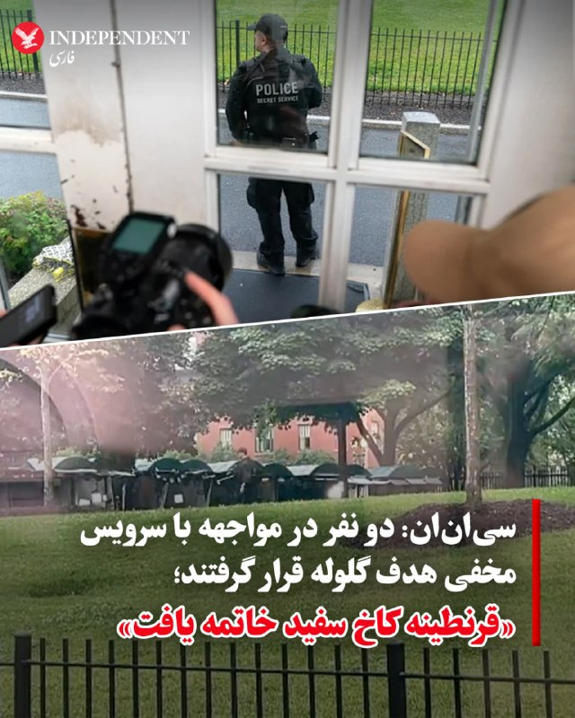

♦️به گزارش «سی‌ان‌ان»، یک مقام مجری قانون اعلام کرد که در پی تیراندازی عصر شنبه در تقاطع خیابان هفدهم و پنسیلوانیا در مجاورت کاخ سفید، دو نفر در جریان مواجهه با ماموران سرویس مخفی آمریکا هدف گلوله قرار گرفته‌اند؛ این حادثه که منجر به برقراری وضعیت قرنطینه امنیتی و واکنش فوری نیروهای امنیتی، ماموران اف‌بی‌آی و استقرار نیروهای مسلح به سلاح‌های تهاجمی در چمن شمالی شد، پس از پناه گرفتن اضطراری خبرنگاران در اتاق نشست مطبوعاتی و با لغو قرنطینه در ساعت ۶:۴۵ عصر به وقت محلی خاتمه یافت. کاش پاتل، رئیس اف‌بی‌آی، با تایید حضور مأموران این سازمان در صحنه از پشتیبانی کامل از سرویس مخفی خبر داد؛ این در حالی است که در زمان وقوع حادثه دونالد ترامپ در محل اقامت خود در کاخ سفید حضور داشت و این تیراندازی دقیقا کمتر از یک ماه پس از حادثه سوءقصد نافرجام کول توماس آلن به ترامپ در جریان شام انجمن خبرنگاران، بار دیگر واشنگتن را در وضعیت هشدار بالایی قرار داده است.
‌🇸🇦 Indypersian

🤖 @VahidOOnLine

## VahidOOnLine — post 241835

  

یک مقام ارشد پلیس آمریکا درباره تیراندازی در اطراف کاخ سفید گفت: یک مظنون به ایست بازرسی اطراف کاخ سفید نزدیک شد و به سوی ماموران شلیک کرد، اما او هدف گلوله قرار گرفت و به بیمارستان منتقل شد.
‌🏁 🇬🇧 IranintlTV

🤖 @VahidOOnLine

## VahidOOnLine — post 241834

♦️تصاویر منتشر شده توسط خبرنگار شبکه «سی‌ان‌ان»، لحظات شلیک گلوله در نزدیکی کاخ سفید در واشنگتن دی‌سی را نشان می‌دهد. بر اساس گزارش‌های اولیه، دو نفر در ضلع غربی کاخ سفید و در نزدیکی «گیت ۱۷» با سلاح کمری به سمت ساختمان کاخ سفید شلیک کرد. در پی این اقدام، ماموران سرویس مخفی ایالات متحده بلافاصله وارد عمل شدند، به این تیراندازی پاسخ دادند و ضاربان را هدف قرار داده‌اند و مهار کردند.
گزارش‌ها حاکی از آن است که در مجموع حدود ۳۰ گلوله در خارج از محوطه شلیک شده است. ماموران سرویس مخفی با حمل سلاح‌های خود در محوطه چمن شمالی مستقر شدند و خبرنگارانی را که در این بخش حضور داشتند، به سمت اتاق کنفرانس مطبوعاتی هدایت کردند تا پناه بگیرند.
‌🇸🇦 Indypersian

🤖 @VahidOOnLine

## VahidOOnLine — post 241833

  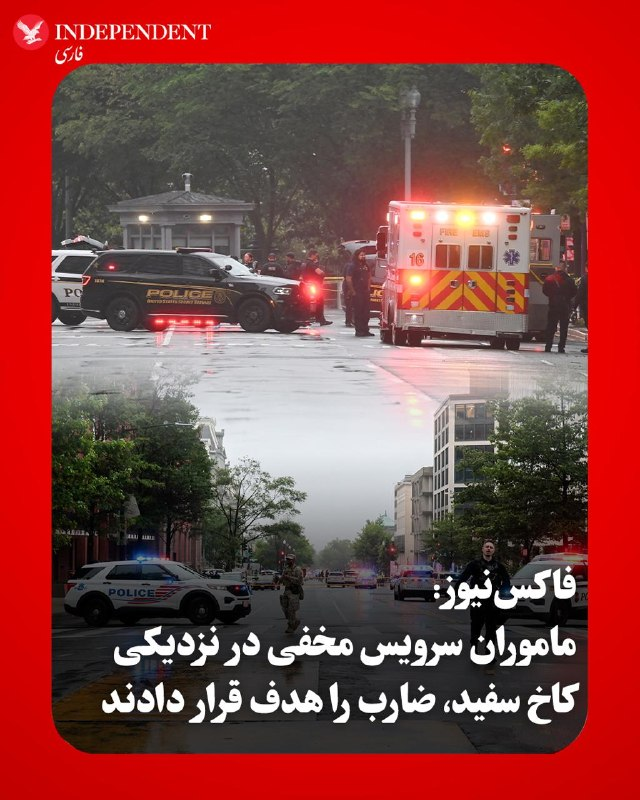

♦️خبرنگار «فاکس‌نیوز» در گزارشی درباره تیراندازی در نزدیکی کاخ سفید اعلام کرد که یک فرد مسلح در ضلع غربی کاخ سفید و در نزدیکی «گیت ۱۷» با سلاح کمری به سمت ساختمان کاخ سفید شلیک کرده است. به گفته او، این فرد مسلح سه بار اقدام به تیراندازی کرد و در پی آن، ماموران سرویس مخفی ایالات متحده به این تیراندازی پاسخ دادند و ضارب را هدف قرار داده و مهار کردند. هنوز آماری از تعداد دقیق گلوله‌های شلیک‌شده از سوی مأموران اعلام نشده است.
‌🇸🇦 Indypersian

🤖 @VahidOOnLine

## VahidOOnLine — post 241832

  

♦️رئیس اف‌بی‌آی اعلام کرد ماموران این سازمان به همراه نیروهای سرویس مخفی در پی تیراندازی در نزدیکی کاخ سفید، در محل حادثه حضور یافته‌اند؛ همزمان خبرگزاری فرانسه نیز از حضور گسترده پلیس و نیروهای امنیتی در اطراف این عمارت خبر داد و گزارش داد که ماموران امنیتی تمام مسیرهای منتهی به کاخ سفید را مسدود کرده و نیروهای گارد ملی از ورود خبرنگاران به منطقه جلوگیری می‌کنند. این تیراندازی در شرایطی رخ داد که دونالد ترامپ، رئیس‌جمهوری آمریکا، برای رایزنی درباره توافق با ایران در محل اقامت خود در کاخ سفید حضور داشت و به دنبال شنیده شدن صدای شلیک ده‌ها گلوله، خبرنگاران مستقر در چمن شمالی با دستور اضطراری نیروهای امنیتی به داخل اتاق نشست مطبوعاتی کاخ سفید منتقل شدند و پناه گرفتند.
‌🇸🇦 Indypersian

🤖 @VahidOOnLine

## VahidOOnLine — post 241831

♦️در برنامه‌ای در صداوسیما، زنی که ادعا می‌کند همسایه بیت علی خامنه‌ای، رهبر کشته‌شده جمهوری اسلامی معرفی شد، در پاسخ به پرسشی درباره وضعیت محل اقامت او گفت: «از پشت‌بام که نگاه می‌کنی، تلی از خاک می‌بینی.»
این زن در ادامه تاکید کرد: «منطقه آقا خیلی سرسبز بود، اما حالا تبدیل به بیابان شده است؛ بیابانی بدون درخت و بدون سبزه که فقط خاک در آن دیده می‌شود.» مجری برنامه نیز در واکنش به این توضیحات اشاره کرد که با این توصیف، کاملا مشخص است چه اتفاقی برای ساختمان رخ داده است.
‌🇸🇦 Indypersian

🤖 @VahidOOnLine

## VahidOOnLine — post 241830

  

سخنگوی سرویس مخفی آمریکا در بیانیه‌ای به سی‌بی‌اس نیوز گفت این نهاد از «گزارش‌هایی درباره شلیک گلوله در نزدیکی خیابان هفدهم و خیابان پنسیلوانیا شمال غربی» آگاه است و «در حال بررسی و تایید این اطلاعات با نیروهای مستقر در محل» است.
‌🏁 🇬🇧 IranintlTV

🤖 @VahidOOnLine

## VahidOOnLine — post 241828

  

سخنگوی سرویس مخفی آمریکا در بیانیه‌ای به سی‌بی‌اس نیوز گفت این نهاد از «گزارش‌هایی درباره شلیک گلوله در نزدیکی خیابان هفدهم و خیابان پنسیلوانیا شمال غربی» آگاه است و «در حال بررسی و تایید این اطلاعات با نیروهای مستقر در محل» است.
‌🏁 🇬🇧 IranintlTV

🤖 @VahidOOnLine

## VahidOOnLine — post 241825

  

♦️«سی‌ان‌ان» عصر شنبه، دوم خردادماه، گزارش داد، شنیده شدن صدای ده‌ها شلیک احتمالی گلوله در نزدیکی کاخ سفید، منجر به برقراری وضعیت قرنطینه و واکنش سریع سرویس مخفی آمریکا شد. یک مقام سرویس مخفی به سی‌ان‌ان گفت که این آژانس در حال بررسی گزارش‌های مربوط به شلیک گلوله در تقاطع خیابان هفدهم و خیابان پنسیلوانیا در مجاورت محوطه کاخ سفید است؛ در همین حال، ماموران سرویس مخفی با فریادهای «بشینید» و هشدار درباره تیراندازی، خبرنگاران مستقر در چمن شمالی را به سرعت به داخل اتاق کنفرانس مطبوعاتی هدایت کرده و از آن‌ها خواستند در مکان‌های خود پناه بگیرند. به گفته یکی از خبرنگاران، صداها از سمت ساختمان اداری اجرایی آیزنهاور به گوش رسیده است و در پی این حادثه، ماموران سرویس مخفی مسلح به سلاح‌های تهاجمی در چمن شمالی مستقر شده و ورودی‌های اتاق کنفرانس مطبوعاتی کاخ سفید را مسدود کردند.
‌🇸🇦 Indypersian

🤖 @VahidOOnLine

## VahidOOnLine — post 241824

  <a href="telegram/content/VahidOOnLine_241824_1779579270.mp4" target="_blank">🎬 Download video</a>

ویدیوی دریافت‌شده نشان می‌دهد جمعی از ایرانیان مقیم هلیفکس کانادا، روز شنبه دوم خرداد، در همبستگی با انقلاب شیر و خورشید تجمع اعتراضی در سکوت برگزار کردند. آن‌ها با این سکوت تلاش کردند درباره قطعی اینترنت در ایران اطلاع‌رسانی کنند.
‌🏁 🇬🇧 IranintlTV

🤖 @VahidOOnLine

## VahidOOnLine — post 241823

  

♦️به گزارش «ای‌بی‌سی نیوز»، سرویس مخفی آمریکا عصر شنبه، دوم خردادماه، در پی شنیده شدن صدایی شبیه به شلیک گلوله، چمن شمالی کاخ سفید را به طور کامل تخلیه و پاکسازی کرد. بر اساس این گزارش، از خبرنگاران مستقر در محل خواسته شد تا به سرعت به سمت اتاق نشست مطبوعاتی کاخ سفید دویده و پناه بگیرند.
‌🇸🇦 Indypersian

🤖 @VahidOOnLine

## VahidOOnLine — post 241822

  <a href="telegram/content/VahidOOnLine_241822_1779579274.mp4" target="_blank">🎬 Download video</a>

♦️تصاویر منتشر شده توسط سلینا وانگ، خبرنگار ارشد شبکه «ای‌بی‌سی نیوز»، لحظات شلیک گلوله در نزدیکی کاخ سفید در واشنگتن دی‌سی را نشان می‌دهد. بر اساس گزارش‌های اولیه، حدود ۳۰ گلوله در خارج از محوطه کاخ سفید شلیک شده و نیروهای سرویس مخفی آمریکا بلافاصله وارد عمل شدند و خبرنگارانی را که در چمن شمالی مستقر بودند، به سمت اتاق کنفرانس مطبوعاتی هدایت کردند تا پناه بگیرند. این ویدیو نشان می‌دهد سلینا وانگ در حالی که در حال ضبط گزارش زنده خود درباره توافق احتمالی با ایران بود، با شنیدن صدای شلیک گلوله‌ها ناچار به قطع گزارش و تخلیه اضطراری محل می‌شود. هنوز جزییات بیشتری از این تیراندازی منتشر نشده است.
‌🇸🇦 Indypersian

🤖 @VahidOOnLine

## VahidOOnLine — post 241821

  

گزارش‌ها از شنیده شدن ده‌ها صدای تیراندازی در نزدیکی کاخ سفید خبر می‌دهد. به گزارش رسانه‌های آمریکایی، خبرنگاران در داخل کاخ سفید در محل امن مستقر شدند و ماموران سرویس مخفی در چمن شمالی کاخ سفید در حالی دیده می‌شوند که تفنگ در دست دارند.
‌🏁 🇬🇧 IranintlTV

🤖 @VahidOOnLine

## WithYashar — post 12281

تیرانداز به هلاکت رسید و فرد حاضر زنده و هوشیار است. هر دو به بیمارستان منتقل شده‌اند.
@withyashar

## WithYashar — post 12280

  

سرویس مخفی پس از شروع تیراندازی در سمت غرب کاخ سفید به یک مظنون مسلح شلیک کرد، به گزارش فاکس نیوز.

یک عابر پیاده در این حادثه زخمی شد و تأیید شده است که رئیس‌جمهور ترامپ در امنیت است.
@withyashar

## WithYashar — post 12279

بی‌بی‌اس نیوز گزارش داد: در تیراندازی نزدیک کاخ سفید دو نفر زخمی شدند که یکی از آن‌ها مظنون است.
@withyashar

## WithYashar — post 12278

  <a href="telegram/content/WithYashar_12278_1779579279.mp4" target="_blank">🎬 Download video</a>

@withyashar تیرندازی از دیدی دیگر

## WithYashar — post 12277

  

صحنه هایی از خارج از کاخ سفید.
@withyashar

## WithYashar — post 12276

مدیر اف‌بی‌آی کاش پاتل:

اف‌بی‌آی در محل حاضر است و از سرویس مخفی که به شلیک‌های نزدیک محوطه کاخ سفید پاسخ می‌دهد، حمایت می‌کند, ما به محض امکان، به‌روزرسانی‌های لازم را به عموم ارائه خواهیم داد
@withyashar

## WithYashar — post 12275

  <a href="telegram/content/WithYashar_12275_1779579282.mp4" target="_blank">🎬 Download video</a>

@withyashar

## WithYashar — post 12274

  <a href="telegram/content/WithYashar_12274_1779579285.mp4" target="_blank">🎬 Download video</a>

طبق گزارش‌ها، تیم‌های تک‌تیرانداز سرویس مخفی اکنون بر روی پشت‌بام کاخ سفید قابل مشاهده هستند.

این یک واکنش حفاظتی استاندارد پس از یک حادثه امنیتی است که در آن تیم‌ها برای ایمن‌سازی محوطه به موقعیت‌های مرتفع اعزام می‌شوند.

این با وضعیت فعال پس از گزارش‌های قبلی تیراندازی و انتقال خبرنگاران به داخل کاخ مطابقت دارد.
@withyashar

## WithYashar — post 12273

  <a href="telegram/content/WithYashar_12273_1779579288.mp4" target="_blank">🎬 Download video</a>

فیلمی از اخبار ABC لحظه‌ای را ثبت می‌کند که تیراندازی در خارج از کاخ سفید رخ داد.
@withyashar
🚨🚨🚨🚨🚨🚨🚨

## mwarmonitor — post 9603

📝عجب شاهکار کمدی-استراتژیکی! آقای «کله زرد» بعد از این همه خط‌ونشان و هزینه‌های نجومی روی دست مالیات‌دهندگان آمریکایی، عملاً خاورمیانه را شخم زد تا دوباره همه‌چیز را برگرداند به پله اول؛ منتها با چند صفر اضافه‌تر در حساب بانکی تهران. 🔸این بیانیه هالیوودی…

## mwarmonitor — post 9602

🔹یک مقام سرویس مخفی به CNN گفته است که این نهاد در حال بررسی گزارش‌هایی درباره تیراندازی در تقاطع خیابان ۱۷ و خیابان پنسیلوانیا در شمال‌غرب واشینگتن است؛ محلی که درست در خارج از مجموعه کاخ سفید قرار دارد. @mwarmonitor

## mwarmonitor — post 9601

  <a href="telegram/content/mwarmonitor_9601_1779579291.mp4" target="_blank">🎬 Download video</a>

📝بررسی کارنامه مذهبی که بقای خود را در گرو ترور، سرکوب و ویرانی می‌بیند، هیچ شکلی از تردید را باقی نمی‌گذارد. شیعه سانان رافضی که با بی‌رحمی تمام، اینترنت نود میلیون انسان را ماه‌ها قطع می‌کند، دستش به خون چهل و پنج هزار انسان بیگناه آلوده است و با شلیک موشک به چهار گوشه منطقه، امنیت خاورمیانه را به گروگان می‌گیرد، هرگز به کابل‌های ارتباطی جهان و ابزارهای پیوند بشریت رحم نخواهد کرد. این فرقه، نماد عینی دنائت و تهدیدی افسارگسیخته برای تمدن بشری است؛ تفکری مخرب و ذاتاً جنایت‌کار که اگر به سلاح کشتار جمعی و بمب اتم دست یابد، حتی برای نابودی خود و اطرافیانش نیز درنگ نخواهد کرد. دنیا با جانیانی روبه‌روست که منطقشان چیزی جز قطع شریان‌های حیاتی جامعه جهانی و بازگرداندن انسان‌ها به تاریکی و انزوا نیست.

@mwarmonitor

## mwarmonitor — post 9600

  

در حالی که در محوطه شمالی کاخ سفید (North Lawn) مشغول ضبط یک ویدیوی اجتماعی با آیفونم بودم، صدای تیراندازی را شنیدیم. صدایی شبیه شلیک ده‌ها گلوله بود. به ما گفته شد با سرعت به سمت اتاق نشست خبری بدویم و اکنون در آنجا نگه داشته شده‌ایم. خبرنگار ABC @mwarmonitor

## mwarmonitor — post 9599

  <a href="telegram/content/mwarmonitor_9599_1779579294.mp4" target="_blank">🎬 Download video</a>

🚨 گزارش شده که روسیه یک موشک بالستیک میان‌برد «اورشنیک» (Oreshnik) را به سمت اوکراین شلیک کرده است که طبق اعلام نیروی هوایی اوکراین، باعث به صدا درآمدن آژیرهای حمله هوایی در سراسر این کشور شده است. @mwarmonitor

## FoxNewsTwitter — post 342173

  <a href="telegram/content/FoxNewsTwitter_342173_1779579295.mp4" target="_blank">🎬 Download video</a>

Fox News (Twitter/X)

BREAKING: FOX News' Chad Pergram reports on shots fired near the White House, says Secret Service took down shooter.

## FoxNewsTwitter — post 342172

Fox News (Twitter/X)

BREAKING: White House locked down after as many as 30 shots fired in vicinity.

## pm_afshaa — post 91352

  <a href="telegram/content/pm_afshaa_91352_1779579298.webm" target="_blank">🎬 Download video</a>

🔴ان‌بی‌سی نیوز: هم‌اکنون بیرون کاخ سفید حدود 20 تا 30 تا تیر شلیک شده! سرویس مخفی آمریکا خبرنگارهایی که تو محوطه کاخ سفید بودن رو جمع کرده و برده داخل اتاق کنفرانس خبری تا ازشون محافطت کنه. 
💧 Rainbet.com the #1 Non-KYC Crypto Casino & Sportsbook @rainbetcom…

## pm_afshaa — post 91351

  <a href="telegram/content/pm_afshaa_91351_1779579299.webm" target="_blank">🎬 Download video</a>

🔴ان‌بی‌سی نیوز: هم‌اکنون بیرون کاخ سفید حدود 20 تا 30 تا تیر شلیک شده! سرویس مخفی آمریکا خبرنگارهایی که تو محوطه کاخ سفید بودن رو جمع کرده و برده داخل اتاق کنفرانس خبری تا ازشون محافطت کنه. 
💧 Rainbet.com the #1 Non-KYC Crypto Casino & Sportsbook @rainbetcom…

## pm_afshaa — post 91350

  <a href="telegram/content/pm_afshaa_91350_1779579300.mp4" target="_blank">🎬 Download video</a>

🔴ان‌بی‌سی نیوز: هم‌اکنون بیرون کاخ سفید حدود 20 تا 30 تا تیر شلیک شده!

سرویس مخفی آمریکا خبرنگارهایی که تو محوطه کاخ سفید بودن رو جمع کرده و برده داخل اتاق کنفرانس خبری تا ازشون محافطت کنه.

💧 Rainbet.com the #1 Non-KYC Crypto Casino & Sportsbook @rainbetcom

😁 @Pm_Afshaa

## DEJradio — post 4891

⭕️ خبرها از یک سلسله تیراندازی در اطراف کاخ سفید حکایت دارند. ویدئوی منتشر شده، سلینا وانگ، خبرنگار «ای‌بی‌سی نیوز»را در نزدیکی کاخ سفید در واشنگتن دی‌سی نشان می‌دهد. #کاخ_سفید @DEJradio

## DEJradio — post 4890

  <a href="telegram/content/DEJradio_4890_1779579302.mp4" target="_blank">🎬 Download video</a>

⭕️ خبرها از یک سلسله تیراندازی در اطراف کاخ سفید حکایت دارند.
ویدئوی منتشر شده، سلینا وانگ، خبرنگار «ای‌بی‌سی نیوز»را در نزدیکی کاخ سفید در واشنگتن دی‌سی نشان می‌دهد.

#کاخ_سفید
@DEJradio

## IranIntlTV — post 338675

  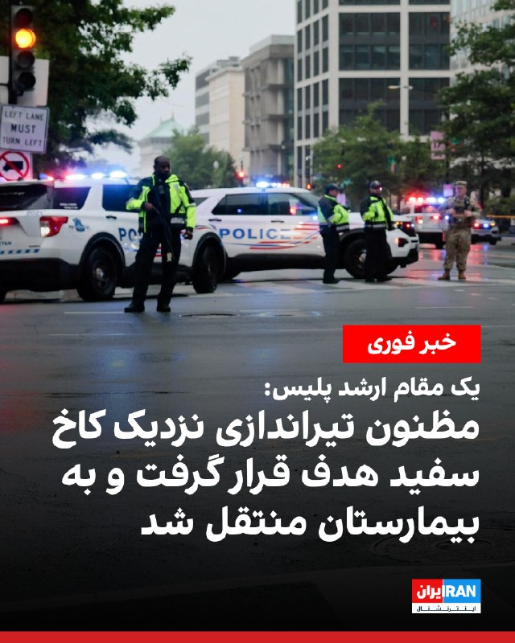

یک مقام ارشد پلیس آمریکا درباره تیراندازی در اطراف کاخ سفید گفت: یک مظنون به ایست بازرسی اطراف کاخ سفید نزدیک شد و به سوی ماموران شلیک کرد، اما او هدف گلوله قرار گرفت و به بیمارستان منتقل شد.
https://iranintl.com/202605234529

## IranIntlTV — post 338674

  

سخنگوی سرویس مخفی آمریکا در بیانیه‌ای به سی‌بی‌اس نیوز گفت این نهاد از «گزارش‌هایی درباره شلیک گلوله در نزدیکی خیابان هفدهم و خیابان پنسیلوانیا شمال غربی» آگاه است و «در حال بررسی و تایید این اطلاعات با نیروهای مستقر در محل» است.
https://iranintl.com/202605237115

## IranIntlTV — post 338673

  

سخنگوی سرویس مخفی آمریکا در بیانیه‌ای به سی‌بی‌اس نیوز گفت این نهاد از «گزارش‌هایی درباره شلیک گلوله در نزدیکی خیابان هفدهم و خیابان پنسیلوانیا شمال غربی» آگاه است و «در حال بررسی و تایید این اطلاعات با نیروهای مستقر در محل» است.
https://iranintl.com/202605237115

## IranIntlTV — post 338672

  

سخنگوی سرویس مخفی آمریکا در بیانیه‌ای به سی‌بی‌اس نیوز گفت این نهاد از «گزارش‌هایی درباره شلیک گلوله در نزدیکی خیابان هفدهم و خیابان پنسیلوانیا شمال غربی» آگاه است و «در حال بررسی و تایید این اطلاعات با نیروهای مستقر در محل» است.
https://iranintl.com/202605237115

## IranIntlTV — post 338671

  <a href="telegram/content/IranIntlTV_338671_1779579308.mp4" target="_blank">🎬 Download video</a>

ایرانیان ساکن شهر تورین ایتالیا برای بیستمین هفته متوالی با برگزاری تجمعی اعتراضی، مخالفت خود را با سرکوب و نقض حقوق بشر در جمهوری اسلامی اعلام کردند.

گزارش صدف باغبانی، خبرنگار ایران‌اینترنشنال و گفت‌وگوی او با دو نفر از شرکت‌کنندگان
@iranintltv

## IranIntlTV — post 338670

  <a href="telegram/content/IranIntlTV_338670_1779579312.mp4" target="_blank">🎬 Download video</a>

ویدیوی دریافت‌شده نشان می‌دهد جمعی از ایرانیان مقیم هلیفکس کانادا، روز شنبه دوم خرداد، در همبستگی با انقلاب شیر و خورشید تجمع اعتراضی در سکوت برگزار کردند. آن‌ها با این سکوت تلاش کردند درباره قطعی اینترنت در ایران اطلاع‌رسانی کنند.

## IranIntlTV — post 338669

  <a href="telegram/content/IranIntlTV_338669_1779579314.mp4" target="_blank">🎬 Download video</a>

مراد ویسی، تحلیل‌گر ارشد ایران‌اینترنشنال، گفت: «خبرگزاری فارس ویدیویی از یک راه‌یافته به مجلس منتشر کرده که در آن پزشکیان متهم به زمینه‌چینی برای کشتن علی خامنه ای و زمینه چینی مجدد برای کشتن مجتبی خامنه ای شده است.»
@iranintltv

## IranIntlTV — post 338668

  <a href="telegram/content/IranIntlTV_338668_1779579317.mp4" target="_blank">🎬 Download video</a>

ایرانیان مقیم تورنتو با سر دادن شعارهایی در حمایت از شاهزاده رضا پهلوی، خواستار توقف اعدام‌ها، دسترسی به اینترنت آزاد و دموکراسی برای مردم ایران شدند.

گزارش مهسا مرتضوی، خبرنگار ایران‌اینترنشنال و گفت‌وگو با یکی از شرکت‌کنندگان
@iranintltv

## IranIntlTV — post 338667

  

گزارش‌ها از شنیده شدن ده‌ها صدای تیراندازی در نزدیکی کاخ سفید خبر می‌دهد. به گزارش رسانه‌های آمریکایی، خبرنگاران در داخل کاخ سفید در محل امن مستقر شدند و ماموران سرویس مخفی در چمن شمالی کاخ سفید در حالی دیده می‌شوند که تفنگ در دست دارند.
https://iranintl.com/202605231953

## IranIntlTV — post 338666

  <a href="telegram/content/IranIntlTV_338666_1779579320.mp4" target="_blank">🎬 Download video</a>

واشینگتن‌پست گزارش داد مقام‌ها و دیپلمات‌های آگاه از مذاکرات میان آمریکا و جمهوری اسلامی ابراز امیدواری کرده‌اند دو طرف پس از بررسی پیش‌نویس تهیه‌شده از سوی پاکستان، طی ۴۸ ساعت آینده تصمیم نهایی خود را اتخاذ کنند.

گفت‌وگو با حسین علیزاده، دیپلمات پیشین
@iranintltv

## IranIntlTV — post 338665

  <a href="telegram/content/IranIntlTV_338665_1779579324.mp4" target="_blank">🎬 Download video</a>

دونالد ترامپ از تماس تلفنی خود با رهبران کشورهای منطقه درباره ایران خبر داد. او تاکید کرد بخش زیادی از چارچوب توافق نهایی شده، اما اجرای آن همچنان به توافق نهایی میان واشینگتن، تهران و برخی کشورهای دخیل در مذاکرات بستگی دارد.

گفت‌وگو با امیر گیتی، عضو تحریریه ایران‌اینترنشنال
@iranintltv

## IranIntlTV — post 338664

  <a href="https://t.me/IranintlTV/338664" target="_blank">📎 Download file</a>

🎧نسخه صوتی سیاست با مراد ویسی: تهدید پزشکیان به استعفا
@iranintlTV

## Shin_Persian — post 6194

  

Shin ✓ @hey_itsmyturn
Sat, 23 May 2026 22:34:08 UTC

𝕏 · @shin_persian

## ManotoTV — post 105789

  <a href="telegram/content/ManotoTV_105789_1779579328.mp4" target="_blank">🎬 Download video</a>

تماسی از سن‌فرانسیسکو:
«می‌گفت با شنیدن صدای شما احساس می‌کنم تو ایرانم…
و از سال‌هایی گفت که با برنامه‌های منوتو خندیده، گریه کرده و زندگی کرده بود.»

## ManotoTV — post 105788

  <a href="telegram/content/ManotoTV_105788_1779579331.mp4" target="_blank">🎬 Download video</a>

تماسی از خارج ایران:
«می‌گفت بسته شدن منوتو برای خیلی‌ها دردناک بود…
و از همراهی و امیدی گفت که این سال‌ها از برنامه‌ها گرفته بودند.

## FarsiVOA — post 218482

  <a href="telegram/content/FarsiVOA_218482_1779579334.mp4" target="_blank">🎬 Download video</a>

⚡️ویدیوی صدای آمریکا از حضور نیروهای امنیتی پس از گزارش‌ها از تیراندازی شنبه عصر در نزدیکی کاخ سفید
@FarsiVOA

## FarsiVOA — post 218480

⚡️نیروهای گارد ملی و دیگر ماموران امنیتی شنبه عصر و در پی گزارش‌ها از تیراندازی در اطراف کاخ سفید، در محل استقرار یافتند.
@FarsiVOA

## FarsiVOA — post 218479

⚡️خط قرمز جدید بغداد: دولت علی الزیدی به دنبال انحلال شبه‌نظامیان وابسته به جمهوری اسلامی
@FarsiVOA

## FarsiVOA — post 218478

🔺گزارش‌ها از تیراندازی در نزدیکی کاخ سفید

▪️رسانه‌های آمریکایی از گزارش‌های مربوط به تیراندازی احتمالی در عصر شنبه در نزدیکی چمن شمالی کاخ سفید خبر دادند.

⬇️ بیشتر بخوانید:
https://ir.voanews.com/a/8153104.html
@FarsiVOA

## Persian_Trend_Official — post 14808

  <a href="telegram/content/Persian_Trend_Official_14808_1779579335.mp4" target="_blank">🎬 Download video</a>

💢همزمان با وقایع امشب روسیه هم با موشک اورشنیک مجهز به کلاهک خوشه ای حمله کرده به کی یف اوکراین

ویدئویی لحظه اصابت موشک بالستیک میان‌برد «اورشنیک» روسیه به کی‌یف.

🫆:Tony

📌 @persian_trend_official
پرشین ترند | متفاوت‌ترین کانال نظامی

## Persian_Trend_Official — post 14807

  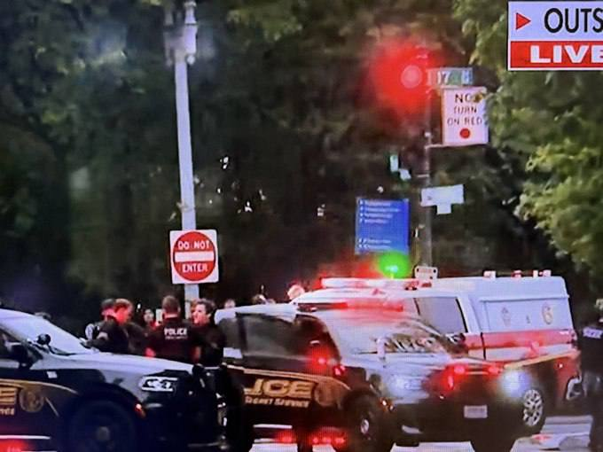

🔴 فوری | گزارش تیراندازی در اطراف کاخ سفید شبکه CBS گزارش داده صدای تیراندازی در اطراف کاخ سفید شنیده شده است. بر اساس گزارش اولیه: ▪️ سرویس مخفی آمریکا از خبرنگاران حاضر در ورودی کاخ سفید خواسته فوراً به اتاق توجیه خبری منتقل شوند ▪️ هنوز جزئیاتی درباره…

## Persian_Trend_Official — post 14806

  <a href="telegram/content/Persian_Trend_Official_14806_1779579339.webm" target="_blank">🎬 Download video</a>

⭕️درگذشت دیپلمات جمهوری آذربایجان در سانحه رانندگی در اتوبان جلفا-تبریز 💢وزارت امور خارجه جمهوری آذربایجان در فضای مجازی از درگذشت دیپلمات خود در شهر تبریز بر اثر تصادف خبر داد. 💢رامیل رضا اوغلو عمرانوف، کنسول جمهوری آذربایجان در جمهوری اسلامی ایران در شهر…

## Persian_Trend_Official — post 14805

🔴 فوری | گزارش تیراندازی در اطراف کاخ سفید شبکه CBS گزارش داده صدای تیراندازی در اطراف کاخ سفید شنیده شده است. بر اساس گزارش اولیه: ▪️ سرویس مخفی آمریکا از خبرنگاران حاضر در ورودی کاخ سفید خواسته فوراً به اتاق توجیه خبری منتقل شوند ▪️ هنوز جزئیاتی درباره…

## Persian_Trend_Official — post 14804

  <a href="telegram/content/Persian_Trend_Official_14804_1779579340.webm" target="_blank">🎬 Download video</a>

💢مدیر اف‌بی‌آی، کش پاتل:

💢اف‌بی‌آی در محل حاضر است و در حال پشتیبانی از سرویس مخفی در واکنش به گزارش تیراندازی در نزدیکی محوطه کاخ سفید است .

هر زمان امکان داشته باشد، اطلاعات جدید را به اطلاع عموم خواهیم رساند.

🫆:Tony

📌 @persian_trend_official
پرشین ترند | متفاوت‌ترین کانال نظامی

## Persian_Trend_Official — post 14803

  <a href="telegram/content/Persian_Trend_Official_14803_1779579340.webm" target="_blank">🎬 Download video</a>

⚡️🇺🇸 سرویس مخفی ایالات متحده:

ما از گزارش‌هایی مبنی بر شلیک تیر در نزدیکی خیابان هفدهم و خیابان پنسیلوانیا در شمال غربی آگاهیم و در حال تأیید این اطلاعات با پرسنل حاضر در محل هستیم. اطلاعات بیشتری به محض در دسترس قرار گرفتن ارائه خواهد شد.

## Persian_Trend_Official — post 14802

  <a href="telegram/content/Persian_Trend_Official_14802_1779579341.webm" target="_blank">🎬 Download video</a>

🔴 فوری | گزارش تیراندازی در اطراف کاخ سفید شبکه CBS گزارش داده صدای تیراندازی در اطراف کاخ سفید شنیده شده است. بر اساس گزارش اولیه: ▪️ سرویس مخفی آمریکا از خبرنگاران حاضر در ورودی کاخ سفید خواسته فوراً به اتاق توجیه خبری منتقل شوند ▪️ هنوز جزئیاتی درباره…

## Persian_Trend_Official — post 14801

  <a href="telegram/content/Persian_Trend_Official_14801_1779579342.mp4" target="_blank">🎬 Download video</a>

💢استوری یکی از شهروندان امریکا از صدای تیر اندازی در نزدیکی کاخ سفید
🫆:Tony

📌 @persian_trend_official
پرشین ترند | متفاوت‌ترین کانال نظامی

## Persian_Trend_Official — post 14800

  <a href="telegram/content/Persian_Trend_Official_14800_1779579344.mp4" target="_blank">🎬 Download video</a>

💢ویدئویی دیگر از صدای ممتد شلیک در اطراف کاخ سفید
🫆:Tony

📌 @persian_trend_official
پرشین ترند | متفاوت‌ترین کانال نظامی

## Persian_Trend_Official — post 14799

  

🔴 فوری | گزارش تیراندازی در اطراف کاخ سفید شبکه CBS گزارش داده صدای تیراندازی در اطراف کاخ سفید شنیده شده است. بر اساس گزارش اولیه: ▪️ سرویس مخفی آمریکا از خبرنگاران حاضر در ورودی کاخ سفید خواسته فوراً به اتاق توجیه خبری منتقل شوند ▪️ هنوز جزئیاتی درباره…

## BBCPersian — post 281908

🔻پایان پوشش زنده روز شنبه

در اینجا پوشش زنده تحولات ایران و آمریکا در روز شنبه دوم خرداد ۱۴۰۵ برابر با ۲۳ مه ۲۰۲۶ به پایان می‌رسد.

https://bbc.in/4dtIPCY
@BBCPersian

## BBCPersian — post 281907

  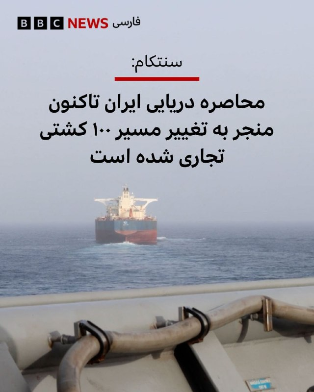

ستاد فرماندهی مرکزی آمریکا (سنتکام) اعلام کرد که در جریان اجرای محاصره دریایی علیه ایران به تغییر مسیر ۱۰۰ کشتی تجاری رسیده‌ است.

سنتکام در پیامی در شبکه اجتماعی ایکس این آمار را منتشر کرد.

ایران نیز در واکنش به جنگ آمریکا و اسرائیل، عبور و مرور کشتی ها از تنگه هرمز را به شدت محدود کرده است.

دو طرف در حال مذاکره بر سر بازگشایی تنگه هرمز و پایان محاصره دریایی ایران هستند وبر اساس گزارش‌های رسمی به «پیشرفت هایی» رسیده‌اند.

📸 X CENTCOM

https://bbc.in/4dtIPCY
@BBCPersian

## Dirty_Kids — post 390056

  <a href="telegram/content/Dirty_Kids_390056_1779579348.webm" target="_blank">🎬 Download video</a>

☢️خفن ترین و‌ قدیمی ترین  انالیزور  ایران ینی دکتر بت 
👍 
🔴هیچ سایت بتی دوست نداره شما کانال دکتر بت رو پیدا کنین چون خیلی سود میکنید🤷‍♂ رایگان بهترین شرط هارو براتون میذاره حتی هزار تومن هم دریافت نمیکنه روزانه میتونی از پیش بینی فوتبال باهاش پول در بیاری…

## Dirty_Kids — post 390055

  <a href="telegram/content/Dirty_Kids_390055_1779579349.webm" target="_blank">🎬 Download video</a>

☢️خفن ترین و‌ قدیمی ترین  انالیزور  ایران ینی دکتر بت 
👍

🔴هیچ سایت بتی دوست نداره شما کانال دکتر بت رو پیدا کنین چون خیلی سود میکنید🤷‍♂

رایگان بهترین شرط هارو براتون میذاره
حتی هزار تومن هم دریافت نمیکنه
روزانه میتونی از پیش بینی فوتبال باهاش پول در بیاری 👌
A2
اگ اهل پیش بینی فوتبالی این کانال اصلا از دست ندین👇

✅https://t.me/+4_ADqwB9e-QwYjlk

✅https://t.me/+4_ADqwB9e-QwYjlk

## Dirty_Kids — post 390054

  

#بخوابیم

@Dirty_Kids 👻

## Dirty_Kids — post 390053

  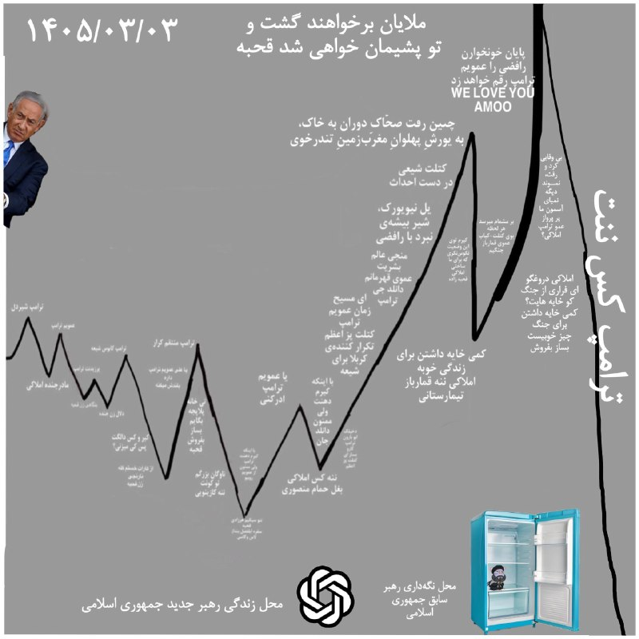

آخرین آپدیت از نمودار محبوبیت ترامپ:

@Dirty_Kids 👻

## Dirty_Kids — post 390052

جدی مملکت عالیه. در ۴-۵ ماه اخیر هرکس اندازه بضاعت خودش کیر شد. هیچ دسته یا گروهی رو نمیتونی پیدا کنی که کیر نشده باشه.

@Dirty_Kids 👻

## Dirty_Kids — post 390051

شما اگه امیدوار باشی ایران بهترین جا برای کیر شدنه…

@Dirty_Kids 👻

## Dirty_Kids — post 390050

‏می‌رفتی عروسی پسرت به قر می‌دادی جای این کسشرا!

@Dirty_Kids 👻

## Dirty_Kids — post 390049

  

اتاق جنگ اسرائیل:
ایرانِ آزاد 🦁☀️

@Dirty_Kids 👻

## Dirty_Kids — post 390048

  

نظرات عرزشی‌ها؛
باز شروع شد زجه زدن

@Dirty_Kids 👻

## Dirty_Kids — post 390047

  

چه گوه‌خوریا، مارو درجریان بزارید 😂😂
هنوز نفهمیدن فقط برای صیغه شدنن

@Dirty_Kids 👻

## Dirty_Kids — post 390046

  <a href="telegram/content/Dirty_Kids_390046_1779579353.mp4" target="_blank">🎬 Download video</a>

بیرون کاخ سفید حدود 20 تا 30 تا تیر شلیک شده!

سرویس مخفی آمریکا هم سریع خبرنگارایی که تو محوطه کاخ سفید بودن رو جمع کرده و برده داخل اتاق کنفرانس خبری تا ازشون محافطت کنه.

@Dirty_Kids 👻

## manototv — post 105789

  <a href="telegram/content/manototv_105789_1779579356.mp4" target="_blank">🎬 Download video</a>

تماسی از سن‌فرانسیسکو:
«می‌گفت با شنیدن صدای شما احساس می‌کنم تو ایرانم…
و از سال‌هایی گفت که با برنامه‌های منوتو خندیده، گریه کرده و زندگی کرده بود.»

## manototv — post 105788

  <a href="telegram/content/manototv_105788_1779579359.mp4" target="_blank">🎬 Download video</a>

تماسی از خارج ایران:
«می‌گفت بسته شدن منوتو برای خیلی‌ها دردناک بود…
و از همراهی و امیدی گفت که این سال‌ها از برنامه‌ها گرفته بودند.

---
📅 بروزرسانی: 1405/03/03 01:59
---

## VahidOOnLine — post 241820

  

♦️روزنامه «فایننشال تایمز» در گزارشی اختصاصی نوشت که ایالات متحده به ژاپن اطلاع داده است تحویل ۴۰۰ موشک کروز «تاماهاک» به این کشور به دلیل اولویت پنتاگون برای بازسازی ذخایر تسلیحاتی خود پس از جنگ با ایران، با تاخیر مواجه خواهد شد. بر اساس این گزارش، پیت هگست، وزیر جنگ آمریکا، در تماس تلفنی اوایل ماه مه این موضوع را به همتای ژاپنی خود، شینجیرو کویزومی، اطلاع داده و واشنگتن گفته است که این موشک‌ها ممکن است با تاخیر دو ساله تحویل داده شوند. بر اساس ارزیابی مرکز مطالعات استراتژیک و بین‌المللی (CSIS)، ارتش آمریکا در طول پنج هفته عملیات نظامی علیه ایران، بیش از ۱۰۰۰ موشک تاماهاک را از مجموع ذخیره پیش از جنگ خود شلیک کرده است. براساس این گزارش، این تاخیر می‌تواند ضربه بزرگی به استراتژی دفاعی توکیو وارد کند، چرا که ژاپن این موشک‌های ۲.۳۵ میلیارد دلاری را با هدف تقویت توان بازدارندگی و ایجاد قابلیت «حمله متقابل» علیه چین سفارش داده بود.
‌🇸🇦 Indypersian

🤖 @VahidOOnLine

## VahidOOnLine — post 241819

  <a href="telegram/content/VahidOOnLine_241819_1779575354.mp4" target="_blank">🎬 Download video</a>

تجمع ایرانیان ساکن کپنهاگ، دوم خرداد ۱۴۰۵
‌🏁 🇬🇧 ManotoTV

🤖 @VahidOOnLine

## VahidOOnLine — post 241818

  <a href="telegram/content/VahidOOnLine_241818_1779575356.mp4" target="_blank">🎬 Download video</a>

♦️کریم بنزما، مهاجم باشگاه الهلال عربستان سعودی، با انتشار ویدیویی در صفحه اینستاگرام خود، حضورش در «مناسک حج» را به اشتراک گذاشت. این ستاره فوتبال با انتشار تصویری از خود در حال طواف به دور کعبه، این لحظات مذهبی را با مخاطبانش به اشتراک گذاشت و عبارت «الحمدلله برای همه‌چیز» را به عنوان پیام خود منتشر کرد.
‌🇸🇦 Indypersian

🤖 @VahidOOnLine

## VahidOOnLine — post 241817

  

خبرگزاری فارس، وابسته به سپاه، گزارش داد بر اساس پیگیری‌های خبرنگار این رسانه، اظهارات جدید ترامپ مبنی بر بازگشت تنگه هرمز به وضعیت پیشین و آماده‌سازی برای امضای توافق‌نامه «با واقعیت‌ها فاصله دارد».
فارس افزود: براساس آخرین متن ردوبدل‌شده بین آمریکا و جمهوری اسلامی، در صورت توافق احتمالی، تنگه هرمز کماکان تحت مدیریت حکومت ایران خواهد بود.
طبق این گزارش، اگرچه جمهوری اسلامی موافقت کرده است که اجازه دهد تعداد کشتی‌های عبوری به میزان قبل از جنگ بازگردد، اما این به‌هیچ‌عنوان به معنای «تردد آزاد» به وضعیت پیش از جنگ نیست.
خبرگزاری فارس تاکید کرد: «مدیریت تنگه، تعیین مسیر، زمان، نحوه عبور و صدور مجوز، کماکان در انحصار و با تدبیر جمهوری اسلامی خواهد بود. بنابراین ادعای ترامپ در این خصوص ناقص و فاقد انطباق با واقعیت است.»
این گزارش افزود مقام‌های آمریکایی در پیام‌های متعدد به تهران گفته‌اند که توییت‌های ترامپ عمدتاً جنبه تبلیغاتی و مصرف رسانه‌ای در داخل آمریکا دارد و توصیه کرده‌اند که به این اظهارات توجهی نشود.

‌🏁 🇬🇧 IranintlTV

🤖 @VahidOOnLine

## VahidOOnLine — post 241816

  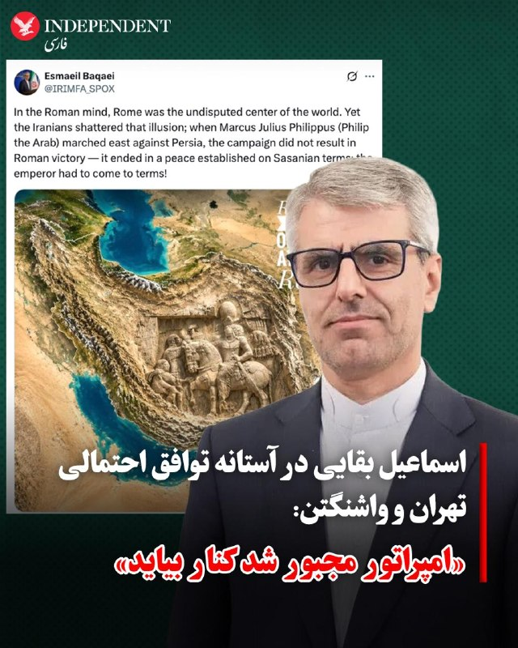

♦️اسماعیل بقایی، سخنگوی وزارت امور خارجه جمهوری اسلامی ایران، با انتشار پیامی در اکس با اشاره به مواجهه تاریخی ایران و روم نوشت: «در ذهن رومیان، رم مرکز بلامنازع جهان بود، اما ایرانیان آن توهم را در هم شکستند. زمانی که مارکوس ژولیوس فیلیپوس، مشهور به فیلیپ عرب، برای جنگ با ایران به شرق لشکر کشید، این نبرد به پیروزی روم ختم نشد، بلکه با صلحی پایان یافت که بر اساس شروط ساسانیان شکل گرفت. امپراتور مجبور شد کنار بیاید!» این پیام همزمان با انتشار اخبار مربوط به پیش‌نویس توافق صلح واشنگتن و تهران منتشر شد.
‌🇸🇦 Indypersian

🤖 @VahidOOnLine

## VahidOOnLine — post 241815

  

♦️فارس، خبرگزاری وابسته به سپاه، روز شنبه، دوم خردادماه، در واکنش به پیام دونالد ترامپ، رئیس‌جمهوری آمریکا مبنی بر نزدیک شدن به توافق با ایران و بازگشایی تنگه هرمز نوشت: «این ادعا نیز با واقعیت‌ها فاصله دارد». فارس در ادامه نوشت: «برخلاف ادعای لحظات قبل دونالد ترامپ در شبکه اجتماعی تروث سوشال مبنی بر بازگشت تنگه هرمز به وضعیت پیشین و آماده‌سازی برای امضای توافق‌نامه، پیگیری‌های خبرنگار فارس نشان می‌دهد که این ادعا نیز با واقعیت‌ها فاصله دارد؛ چرا که بر اساس آخرین متن ردوبدل‌شده، در صورت توافق احتمالی، تنگه هرمز کماکان تحت مدیریت ایران خواهد بود و اگرچه ایران موافقت کرده اجازه دهد تعداد کشتی‌های عبوری به میزان قبل از جنگ بازگردد، اما این به‌هیچ‌عنوان به معنای تردد آزاد به وضعیت قبل از جنگ نیست و مدیریت تنگه، تعیین مسیر، زمان، نحوه عبور و صدور مجوز، کماکان در انحصار و با تدبیر جمهوری اسلامی ایران خواهد بود.»
خبرگزاری سپاه در ادامه مدعی شد که برخلاف شروط پیشین ترامپ مبنی بر گنجاندن برنامه هسته‌ای در توافق، «هیچ تعهدی از سوی ایران داده نشده و پرونده هسته‌ای اساسا در این مرحله مورد بحث قرار نگرفته است.» فارس همچنین ادعا کرد که «مقامات آمریکایی در پیغام‌های متعدد به ایران اذعان داشته‌اند که توییت‌های ترامپ عمدتا جنبه تبلیغاتی و مصرف رسانه‌ای در داخل آمریکا دارد و توصیه کرده‌اند که به این اظهارات توجهی نشود».
‌🇸🇦 Indypersian

🤖 @VahidOOnLine

## VahidOOnLine — post 241814

  

♦️خبرنگار الجزیره به نقل از «منابع خود»، مفاد کلیدی پیش‌نویس توافقی را که قرار است میان واشنگتن و تهران نهایی شود را اعلام کرد. خبرنگار الجزیره مدعی شد، توافق پیشنهادی شامل «پایان جنگ در تمامی جبهه‌ها از جمله لبنان»، «آزادسازی چندین میلیارد دلار از دارایی‌های مسدودشده ایران»، «رفع محاصره دریایی آمریکا و بازگشایی تنگه هرمز» و همچنین «عقب‌نشینی نیروهای آمریکایی از مجاورت مرزهای ایران» است. پس از اجرای این گام‌ها، طرفین یک مهلت ۳۰ روزه، که با توافق دوطرفه قابل تمدید است، خواهند داشت تا درباره مسئله هسته‌ای به توافق برسند که در طول این مدت نیز تردد از تنگه هرمز تسهیل خواهد شد. به گفته این خبرنگار، از نظر ایران، مدیریت تنگه هرمز یک موضوع دوجانبه میان تهران و مسقط تلقی می‌شود و گفتگوها در این زمینه با عمان در جریان است.
‌🇸🇦 Indypersian

🤖 @VahidOOnLine

## WithYashar — post 12272

طبق گزارش NBC News، صدای تیراندازی در خارج از کاخ سفید شنیده شد، با حدود ۲۰ تا ۳۰ گلوله شلیک شده. سرویس مخفی به اعضای مطبوعات که در چمن شمالی جمع شده‌اند دستور داده است که به داخل اتاق جلسه بروند.
@withyashar

## WithYashar — post 12271

  <a href="telegram/content/WithYashar_12271_1779575362.mp4" target="_blank">🎬 Download video</a>

وضعیت اعصاب و روان من الان 👺
@withyashar

## WithYashar — post 12270

الحدث: ایران و آمریکا به دشمنی طولانی مدتشون پایان دادن!
@withyashar

## WithYashar — post 12269

## WithYashar — post 12268

«نیویورک تایمز به نقل از سه مقام ایرانی: در این توافق موضوع هسته‌ای را به مرحله‌ای بعدی موکول می‌کند.
ولی این توافق به آزادسازی ۲۵ میلیارد دلار از دارایی‌های مسدودشده در خارج از کشور منجر خواهد شد.
@withyashar

## WithYashar — post 12267

المیادین: آنچه پیشنهاد می شود یک توافق نهایی نیست، بلکه یک یادداشت تفاهم است.
این یادداشت تفاهم شامل هیچ بند مرتبط با پرونده هسته ای ایران نمی شود.
این یادداشت بر پایان جنگ و ترتیبات آتش بس متمرکز است. این تفاهم نامه شامل تسهیل دریانوردی در تنگه هرمز است.

این تفاهم نامه شامل خروج ناوگان آمریکایی از مجاورت ایران است.

این تفاهم نامه شامل آزادسازی نیمی از وجوه مسدود شده ایران است که بالغ بر 12 میلیارد دلار است.

این یادداشت شامل پایان محاصره نظامی دریایی ایالات متحده است. مهلت 30 روزه برای دستیابی به توافق هسته ای پس از امضای چارچوب توافق داده شد.
@withyashar

## WithYashar — post 12266

فارس : ایران هیچ توافق هسته ای هم با امریکا نداشته
@withyashar

## mwarmonitor — post 9598

  <a href="telegram/content/mwarmonitor_9598_1779575364.mp4" target="_blank">🎬 Download video</a>

در حالی که در محوطه شمالی کاخ سفید (North Lawn) مشغول ضبط یک ویدیوی اجتماعی با آیفونم بودم، صدای تیراندازی را شنیدیم. صدایی شبیه شلیک ده‌ها گلوله بود. به ما گفته شد با سرعت به سمت اتاق نشست خبری بدویم و اکنون در آنجا نگه داشته شده‌ایم. خبرنگار ABC

@mwarmonitor

## mwarmonitor — post 9597

  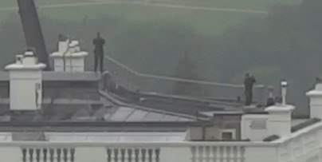

🚨به گزارش NBC، صدای تیراندازی در خارج از کاخ سفید شنیده شده و حدود ۲۰ تا ۳۰ گلوله شلیک شده است. سرویس مخفی به خبرنگارانی که در محوطه شمالی کاخ سفید (North Lawn) جمع شده بودند دستور داده فوراً به داخل اتاق توجیه خبری بروند.

@mwarmonitor

## mwarmonitor — post 9596

🔸هنوز مشخص نشده که امتیازهای ایران چه خواهد بود، جز بازگشایی تنگه (که خودِ ایران هم از آن منتفع می‌شود).

🔹ممکن است به این دلیل باشد که درز اطلاعات فقط از یک طرف صورت می‌گیرد، یا اینکه اساساً امتیاز دیگری در کار نیست. در حال حاضر قضاوت قطعی غیرممکن است. خبرنگار نیویورک پست

@mwarmonitor

## mwarmonitor — post 9595

🚨 گزارش شده که روسیه یک موشک بالستیک میان‌برد «اورشنیک» (Oreshnik) را به سمت اوکراین شلیک کرده است که طبق اعلام نیروی هوایی اوکراین، باعث به صدا درآمدن آژیرهای حمله هوایی در سراسر این کشور شده است.

@mwarmonitor

## mwarmonitor — post 9594

🔴نیویورک تایمز به نقل از ۳ مقام ایرانی: ایران با یک یادداشت تفاهم موافقت کرده است که بر اساس آن، درگیری‌ها در تمامی جبهه‌ها از جمله لبنان متوقف خواهد شد، تنگه هرمز بازگشایی می‌شود، محاصره دریایی آمریکا لغو می‌گردد، عبور و مرور تجاری آزاد خواهد شد و ۲۵ میلیارد دلار از دارایی‌های بلوکه‌شده ایران در خارج از کشور آزاد می‌شود. مسائل هسته‌ای طی ۳۰ تا ۶۰ روز آینده مورد مذاکره قرار خواهد گرفت .

@mwarmonitor

## mwarmonitor — post 9593

  

✈️یک فروند هواپیمای هشدار زودهنگام و کنترل هوابرد E-3B Sentry متعلق به نیروی هوایی آمریکا در حال حاضر پس از برخاستن از پایگاه هوایی «شاهزاده سلطان»، بر فراز شرق عربستان سعودی در حال پرواز است.

✈️همچنین یک فروند هواپیمای هشدار زودهنگام و کنترل هوابرد Saab GlobalEye متعلق به نیروی هوایی سلطنتی عربستان نیز به‌تازگی از همین پایگاه برخاسته و به سمت شمال‌شرق در حال حرکت است.

@mwarmonitor

## mwarmonitor — post 9591

📝عجب شاهکار کمدی-استراتژیکی! آقای «کله زرد» بعد از این همه خط‌ونشان و هزینه‌های نجومی روی دست مالیات‌دهندگان آمریکایی، عملاً خاورمیانه را شخم زد تا دوباره همه‌چیز را برگرداند به پله اول؛ منتها با چند صفر اضافه‌تر در حساب بانکی تهران.

🔸این بیانیه هالیوودی ترامپ بیشتر شبیه تیتراژ پایانی یک فیلم ابرقهرمانی است که در آن از شیر مرغ تا جان آدمیزاد—از محمد بن سلمان تا فیلد مارشال پاکستانی—را قطار کرده تا بگوید «من بزرگ‌ترین معامله تاریخ را کردم». اما خروجی واقعی این «هنر معامله»، بازگشت به چیزی شبیه به برجام است، با این تفاوت که میلیاردها دلار دارایی مسدودشده را آزاد کرده، مدیریت مهم‌ترین آبراه جهان را به ترکیب ایران-عمان سپرده و یک حکومت سرسخت‌تر و جسورتر را در منطقه تثبیت کرده است. این وسط، سهم مردم داخل ایران و ثبات منطقه مثل همیشه نادیده گرفته شده و آن مهلت ۳۰ روزه هسته‌ای هم بیشتر به یک وقت استراحت برای بازیابی قوا شباهت دارد. ترامپ با این کار، خود را مضحکه عام و خاص کرد؛ چرا که بعد از یک دور باطلِ خونین و پرهزینه، ثابت کرد واشنگتن در نهایت استادِ خریدنِ معامله‌های اضطراریِ دقیقه‌نودی به قیمت گزاف است، بی‌آنکه موازنه قدرت را سر سوزنی به نفع خود تغییر داده باشد.

@mwarmonitor

## mwarmonitor — post 9590

🔸خبرگزاری فارس ایران ادعای ترامپ مبنی بر اینکه تنگه هرمز به وضعیت پیش از جنگ بازخواهد گشت را رد کرده و گفته است هر توافق احتمالی فقط اجازه می‌دهد حجم تردد به سطح قبلی برگردد، در حالی که کنترل مسیرهای عبور، زمان‌بندی و صدور مجوزها همچنان در اختیار ایران خواهد بود.

@mwarmonitor

## pm_afshaa — post 91349

#مهم عزیزای دلم همگی الان چنل زاپاس‌مون رو جوین بشید کانال تحت ریپورت شدیده اگه چیزی شد زاپاس رو داشته باشید فعالیت میاد اونور
👇 https://t.me/Pm_Zapas https://t.me/Pm_Zapas

## pm_afshaa — post 91348

یا شروط توافق این که میگن نیست یا ترامپ کلکی تو کارِشه منطقی نیست اصلا اینو تو دنیا به عنوان شکست ترامپ میدونن

## pm_afshaa — post 91347

  <a href="telegram/content/pm_afshaa_91347_1779575367.webm" target="_blank">🎬 Download video</a>

🔴علی هاشم، خبرنگار الجزیره: طبق گفته منابع، پیش‌نویس پیشنهادی که قراره نهایی بشه شامل موارد زیر است: - پایان جنگ در همه جبهه‌ها از جمله لبنان - آزاد شدن میلیاردها دلار از دارایی‌های مسدود شده ایران - لغو محاصره دریایی آمریکا و گشایش تنگه هرمز - خروج نیروهای…

## pm_afshaa — post 91346

  <a href="telegram/content/pm_afshaa_91346_1779575368.webm" target="_blank">🎬 Download video</a>

🔴نیویورک تایمز به نقل از 3 مقام ایرانی: با یادداشت تفاهمی به توافق رسیدیم که جنگ متوقف بشه و تنگه هرمز هم باز بشه. این توافق منجر به آزادسازی 25 میلیارد دلار دارایی مسدود شده در خارج از کشور میشه! 
💧 Rainbet.com the #1 Non-KYC Crypto Casino & Sportsbook…

## pm_afshaa — post 91345

خبر اکسیوس که گفته هم‌اکنون متن توافقنامه توسط ایران و آمریکا امضا شد رو چک کردم من ندیدم گذاشته باشه. خبر فیکه داره پخش میشه تو چنلا

## pm_afshaa — post 91343

  <a href="telegram/content/pm_afshaa_91343_1779575369.webm" target="_blank">🎬 Download video</a>

🔴نیویورک تایمز به نقل از 3 مقام ایرانی: با یادداشت تفاهمی به توافق رسیدیم که جنگ متوقف بشه و تنگه هرمز هم باز بشه. این توافق منجر به آزادسازی 25 میلیارد دلار دارایی مسدود شده در خارج از کشور میشه! 
💧 Rainbet.com the #1 Non-KYC Crypto Casino & Sportsbook…

## pm_afshaa — post 91342

خبر اکسیوس که گفته هم‌اکنون متن توافقنامه توسط ایران و آمریکا امضا شد رو چک کردم من ندیدم گذاشته باشه. خبر فیکه داره پخش میشه تو چنلا

## pm_afshaa — post 91341

  <a href="telegram/content/pm_afshaa_91341_1779575370.webm" target="_blank">🎬 Download video</a>

🔴نیویورک تایمز به نقل از 3 مقام ایرانی:
با یادداشت تفاهمی به توافق رسیدیم که جنگ متوقف بشه و تنگه هرمز هم باز بشه.

این توافق منجر به آزادسازی 25 میلیارد دلار دارایی مسدود شده در خارج از کشور میشه!

💧 Rainbet.com the #1 Non-KYC Crypto Casino & Sportsbook @rainbetcom

😁 @Pm_Afshaa

## pm_afshaa — post 91340

  <a href="telegram/content/pm_afshaa_91340_1779575371.webm" target="_blank">🎬 Download video</a>

🔴تتر بعد از خبر توافق احتمالی بین آمریکا و جمهوری اسلامی تا 170 هزار تومن ریزش کرد 
💧 Rainbet.com the #1 Non-KYC Crypto Casino & Sportsbook @rainbetcom 
😁 @Pm_Afshaa

## pm_afshaa — post 91339

  <a href="telegram/content/pm_afshaa_91339_1779575371.webm" target="_blank">🎬 Download video</a>

🔴ترامپ در تروث سوشال: من اکنون در دفتر بیضی کاخ سفید هستم؛ جایی که همین حالا گفت‌وگوی بسیار خوبی با محمد بن سلمان آل سعود، عربستان سعودی؛ محمد بن زاید آل نهیان، امارات متحده عربی؛ امیر تمیم بن حمد آل ثانی، نخست‌وزیر محمد بن عبدالرحمن بن جاسم آل ثانی و وزیر…

## VahidOnline — post 75664

  

فارس، خبرگزاری وابسته به سپاه، در واکنش به پیام دونالد ترامپ، رئیس‌جمهوری آمریکا مبنی بر نزدیک شدن به توافق با ایران و بازگشایی تنگه هرمز نوشت: «این ادعا نیز با واقعیت‌ها فاصله دارد».

فارس در ادامه نوشت: «برخلاف ادعای لحظات قبل دونالد ترامپ در شبکه اجتماعی تروث سوشال مبنی بر بازگشت تنگه هرمز به وضعیت پیشین و آماده‌سازی برای امضای توافق‌نامه، پیگیری‌های خبرنگار فارس نشان می‌دهد که این ادعا نیز با واقعیت‌ها فاصله دارد؛ چرا که بر اساس آخرین متن ردوبدل‌شده، در صورت توافق احتمالی، تنگه هرمز کماکان تحت مدیریت ایران خواهد بود و اگرچه ایران موافقت کرده اجازه دهد تعداد کشتی‌های عبوری به میزان قبل از جنگ بازگردد، اما این به‌هیچ‌عنوان به معنای تردد آزاد به وضعیت قبل از جنگ نیست و مدیریت تنگه، تعیین مسیر، زمان، نحوه عبور و صدور مجوز، کماکان در انحصار و با تدبیر جمهوری اسلامی ایران خواهد بود.»

خبرگزاری سپاه در ادامه مدعی شد که برخلاف شروط پیشین ترامپ مبنی بر گنجاندن برنامه هسته‌ای در توافق، «هیچ تعهدی از سوی ایران داده نشده و پرونده هسته‌ای اساسا در این مرحله مورد بحث قرار نگرفته است.»

فارس همچنین ادعا کرد که «مقامات آمریکایی در پیغام‌های متعدد به ایران اذعان داشته‌اند که توییت‌های ترامپ عمدتا جنبه تبلیغاتی و مصرف رسانه‌ای در داخل آمریکا دارد و توصیه کرده‌اند که به این اظهارات توجهی نشود».
@VahidOOnLine

📡 @VahidOnline

## VahidOnline — post 75663

  

خبرنگار الجزیره به نقل از «منابع خود»، مفاد کلیدی پیش‌نویس توافقی را که قرار است میان واشنگتن و تهران نهایی شود را اعلام کرد.

خبرنگار الجزیره مدعی شد، توافق پیشنهادی شامل «پایان جنگ در تمامی جبهه‌ها از جمله لبنان»، «آزادسازی چندین میلیارد دلار از دارایی‌های مسدودشده ایران»، «رفع محاصره دریایی آمریکا و بازگشایی تنگه هرمز» و همچنین «عقب‌نشینی نیروهای آمریکایی از مجاورت مرزهای ایران» است.

پس از اجرای این گام‌ها، طرفین یک مهلت ۳۰ روزه، که با توافق دوطرفه قابل تمدید است، خواهند داشت تا درباره مسئله هسته‌ای به توافق برسند که در طول این مدت نیز تردد از تنگه هرمز تسهیل خواهد شد.
به گفته این خبرنگار، از نظر ایران، مدیریت تنگه هرمز یک موضوع دوجانبه میان تهران و مسقط تلقی می‌شود و گفتگوها در این زمینه با عمان در جریان است.
@VahidOOnLine

📡 @VahidOnline

## kianmeli1 — post 87622

  <a href="https://t.me/kianmeli1/87622" target="_blank">📎 Download file</a>

https://t.me/kianmeli1

## kianmeli1 — post 87621

  <a href="telegram/content/kianmeli1_87621_1779575375.mp4" target="_blank">🎬 Download video</a>

🔴فاطی کماندو با موزیک رقص مردگان
https://t.me/kianmeli1

## IranIntlTV — post 338663

  <a href="telegram/content/IranIntlTV_338663_1779575377.mp4" target="_blank">🎬 Download video</a>

مراد ویسی، تحلیل‌گر ارشد ایران‌اینترنشنال، گفت: «در راس جمهوری اسلامی اختلاف بر سر توافق با آمریکا یا رفتن به سمت جنگ شدت گرفته است. مسعود پزشکیان در نامه‌ای به مجتبی خامنه‌ای نوشته توان تاب‌آوری نظام رو به پایان است و در صورت ادامه شرایط موجود تهدید به استعفا کرده است.»
@iranintltv

## IranIntlTV — post 338662

  

خبرگزاری فارس، وابسته به سپاه، گزارش داد بر اساس پیگیری‌های خبرنگار این رسانه، اظهارات جدید ترامپ مبنی بر بازگشت تنگه هرمز به وضعیت پیشین و آماده‌سازی برای امضای توافق‌نامه «با واقعیت‌ها فاصله دارد».
فارس افزود: براساس آخرین متن ردوبدل‌شده بین آمریکا و جمهوری اسلامی، در صورت توافق احتمالی، تنگه هرمز کماکان تحت مدیریت حکومت ایران خواهد بود.
طبق این گزارش، اگرچه جمهوری اسلامی موافقت کرده است که اجازه دهد تعداد کشتی‌های عبوری به میزان قبل از جنگ بازگردد، اما این به‌هیچ‌عنوان به معنای «تردد آزاد» مانند وضعیت پیش از جنگ نیست.
خبرگزاری فارس تاکید کرد: «مدیریت تنگه، تعیین مسیر، زمان، نحوه عبور و صدور مجوز، کماکان در انحصار و با تدبیر جمهوری اسلامی خواهد بود. بنابراین ادعای ترامپ در این خصوص ناقص و فاقد انطباق با واقعیت است.»
این گزارش افزود مقام‌های آمریکایی در پیام‌های متعدد به تهران گفته‌اند که توییت‌های ترامپ عمدتاً جنبه تبلیغاتی و مصرف رسانه‌ای در داخل آمریکا دارد و توصیه کرده‌اند که به این اظهارات توجهی نشود.

https://iranintl.com/202605233399

## IranIntlTV — post 338661

  <a href="telegram/content/IranIntlTV_338661_1779575380.mp4" target="_blank">🎬 Download video</a>

مراد ویسی، تحلیل‌گر ارشد ایران‌اینترنشنال، گفت: «ترامپ گفته روز یکشنبه درباره توافق یا جنگ با جمهوری اسلامی تصمیم می‌گیرد و احتمال توافق را ۵۰-۵۰ دانسته، اکنون نگاه‌ها به تصمیم اوست. آخرین پیشنهاد جمهوری اسلامی از طریق عاصم منیر، فرمانده ارتش پاکستان، به آمریکا منتقل شده و او پس از دیدار با مقام‌های تهران از انتقال نظرات نهایی جمهوری اسلامی به آمریکا خبر داده است.»
@iranintltv

## Shin_Persian — post 6193

  <a href="telegram/content/Shin_Persian_6193_1779575382.mp4" target="_blank">🎬 Download video</a>

Selina Wang ✓ @selinawangtv
Sat, 23 May 2026 22:20:24 UTC

I was in the middle of taping on my iPhone for a social video from the White House North Lawn when we heard the shots. It sounded like dozens of gunshots. We were told to sprint to the press briefing room where we are holding now.

فارسی

من در میانه ضبط ویدئویی برای شبکه‌های اجتماعی با آیفون خود در محوطه شمالی کاخ سفید بودم که صدای شلیک‌ها را شنیدیم. صدا شبیه به ده‌ها شلیک گلوله بود. به ما گفته شد که به سرعت به سمت اتاق کنفرانس مطبوعاتی بدویم، جایی که هم‌اکنون در آنجا پناه گرفته‌ایم.

𝕏 · @shin_persian

## Shin_Persian — post 6192

  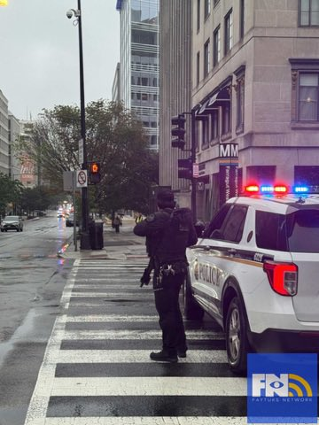

Faytuks Network ✓ @FaytuksNetwork
Sat, 23 May 2026 22:24:37 UTC

Police have created a perimeter around the scene of the shooting close to the White House.

فارسی

پلیس پیرامون صحنه تیراندازی در نزدیکی کاخ سفید، یک کمربند امنیتی ایجاد کرده است.

𝕏 · @shin_persian

## Shin_Persian — post 6191

Shin ✓ @hey_itsmyturn
Sat, 23 May 2026 22:14:55 UTC

Shots fired outside of the White House

فارسی

شلیک گلوله در بیرون از کاخ سفید

𝕏 · @shin_persian

## Shin_Persian — post 6189

🔁 Quoting above tweet:
Shin ✓ @hey_itsmyturn
Sat, 23 May 2026 21:48:53 UTC

The only entity that wants to attack "The President" [and attempted to assassinate his daughter] is the IRGC , dingus. Same people you're "getting close" to make a deal with.
(https://x.com/HouseGOP/status/2058202848093946166)

فارسی

تنها نهادی که قصد حمله به «رئیس‌جمهور» را دارد [و برای ترور دخترش تلاش کرد]، سپاه پاسداران انقلاب اسلامی (IRGC) است، احمق. همان کسانی که برای توافق دارید به آن‌ها «نزدیک» می‌شوید.
(https://x.com/HouseGOP/status/2058202848093946166)

𝕏 · @shin_persian

## Shin_Persian — post 6188

  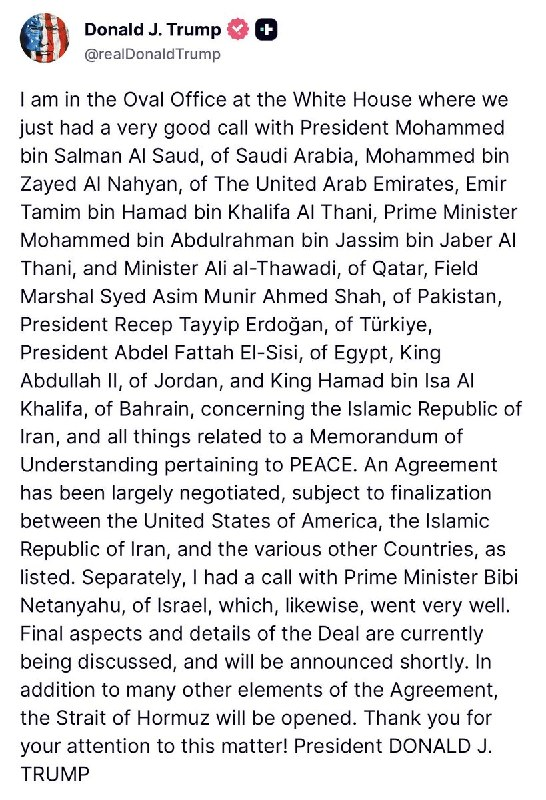

↩️ Quoted tweet: Kaelan Dorr ✓ @Kaelan47 Sat, 23 May 2026 21:02:21 UTC If you find yourself reading this Truth and feeling the need to attack the President for attempting to achieve long lasting peace… Go ahead and delete your account, touch some grass…

## Shin_Persian — post 6187

↩️ Quoted tweet:
Kaelan Dorr ✓ @Kaelan47
Sat, 23 May 2026 21:02:21 UTC

If you find yourself reading this Truth and feeling the need to attack the President for attempting to achieve long lasting peace…

Go ahead and delete your account, touch some grass, and call a loved one. The TDS has set in.

↩️ توییت نقل‌قول شده — برای پاسخ، پست زیر را ببینید.

فارسی

اگر خود را در حال خواندن این «حقیقت» (در Truth Social) می‌بینید و احساس می‌کنید نیاز دارید به رئیس‌جمهور بابت تلاش برای دستیابی به صلحی پایدار حمله کنید...

بفرمایید و حساب کاربری خود را پاک کنید، با دنیای واقعی ارتباط بگیرید (کمی علف لمس کنید) و با یکی از عزیزانتان تماس بگیرید. «سندروم آشفتگی ترامپ» (TDS) در شما ریشه دوانده است.

𝕏 · @shin_persian

## Shin_Persian — post 6184

↩️ Quoted tweet:
Kaelan Dorr ✓ @Kaelan47
Sat, 23 May 2026 21:02:21 UTC

If you find yourself reading this Truth and feeling the need to attack the President for attempting to achieve long lasting peace…

Go ahead and delete your account, touch some grass, and call a loved one. The TDS has set in.

↩️ توییت نقل‌قول شده — برای پاسخ، پست زیر را ببینید.

فارسی

اگر در حال خواندن این «تروث» هستید و احساس می‌کنید باید به رئیس‌جمهور بابت تلاش برای دستیابی به صلحی پایدار حمله کنید...

بفرمایید و حساب کاربری‌تان را پاک کنید، کمی با دنیای واقعی ارتباط بگیرید (touch some grass) و با یکی از عزیزانتان تماس بگیرید. سندرم تنفر از ترامپ (TDS) در شما ریشه دوانده است.

𝕏 · @shin_persian

## ManotoTV — post 105787

  <a href="telegram/content/ManotoTV_105787_1779575386.mp4" target="_blank">🎬 Download video</a>

تجمع ایرانیان ساکن کپنهاگ، دوم خرداد ۱۴۰۵

## FarsiVOA — post 218477

🔺وال‌استریت ژورنال: دونالد ترامپ حق از سرگیری حملات به جمهوری اسلامی را برای خود محفوظ نگه می‌دارد

▪️روزنامه وال‌‌استریت ژورنال عصر شنبه گزارش داد که دونالد ترامپ، رئيس جمهوری آمریکا به دستیاران و همتایان خود گفته است که حق از سرگیری حملات به جمهوری اسلامی را در صورتی که رژیم ایران به «توافق موقت» عمل نکند، برای خود محفوظ نگه می‌دارد.

⬇️ بیشتر بخوانید:
https://ir.voanews.com/a/8153093.html
@FarsiVOA

## Persian_Trend_Official — post 14798

  <a href="telegram/content/Persian_Trend_Official_14798_1779575387.mp4" target="_blank">🎬 Download video</a>

🔴 فوری | گزارش تیراندازی در اطراف کاخ سفید شبکه CBS گزارش داده صدای تیراندازی در اطراف کاخ سفید شنیده شده است. بر اساس گزارش اولیه: ▪️ سرویس مخفی آمریکا از خبرنگاران حاضر در ورودی کاخ سفید خواسته فوراً به اتاق توجیه خبری منتقل شوند ▪️ هنوز جزئیاتی درباره…

## Persian_Trend_Official — post 14797

  <a href="telegram/content/Persian_Trend_Official_14797_1779575389.mp4" target="_blank">🎬 Download video</a>

🔴 فوری | گزارش تیراندازی در اطراف کاخ سفید شبکه CBS گزارش داده صدای تیراندازی در اطراف کاخ سفید شنیده شده است. بر اساس گزارش اولیه: ▪️ سرویس مخفی آمریکا از خبرنگاران حاضر در ورودی کاخ سفید خواسته فوراً به اتاق توجیه خبری منتقل شوند ▪️ هنوز جزئیاتی درباره…

## Persian_Trend_Official — post 14796

  <a href="telegram/content/Persian_Trend_Official_14796_1779575390.mp4" target="_blank">🎬 Download video</a>

شبتون بخیر 🤍

📝 Nick
📌 @persian_trend_official
پرشین ترند | متفاوت‌ترین کانال نظامی

## Persian_Trend_Official — post 14795

🔴 فوری | گزارش تیراندازی در اطراف کاخ سفید شبکه CBS گزارش داده صدای تیراندازی در اطراف کاخ سفید شنیده شده است. بر اساس گزارش اولیه: ▪️ سرویس مخفی آمریکا از خبرنگاران حاضر در ورودی کاخ سفید خواسته فوراً به اتاق توجیه خبری منتقل شوند ▪️ هنوز جزئیاتی درباره…

## Persian_Trend_Official — post 14794

🔴 فوری | گزارش تیراندازی در اطراف کاخ سفید

شبکه CBS گزارش داده صدای تیراندازی در اطراف کاخ سفید شنیده شده است.

بر اساس گزارش اولیه:

▪️ سرویس مخفی آمریکا از خبرنگاران حاضر در ورودی کاخ سفید خواسته فوراً به اتاق توجیه خبری منتقل شوند
▪️ هنوز جزئیاتی درباره عامل تیراندازی یا محل دقیق حادثه منتشر نشده است
▪️ وضعیت امنیتی در اطراف کاخ سفید به‌شدت تشدید شده است

◼️تاکنون هیچ مقام آمریکایی درباره ماهیت حادثه یا احتمال تهدید علیه مقامات ارشد اظهار نظر رسمی نکرده است.

🫆:Tony

📌 @persian_trend_official
پرشین ترند | متفاوت‌ترین کانال نظامی

## Persian_Trend_Official — post 14793

## Persian_Trend_Official — post 14792

  <a href="telegram/content/Persian_Trend_Official_14792_1779575393.webm" target="_blank">🎬 Download video</a>

⭕️درگذشت دیپلمات جمهوری آذربایجان در سانحه رانندگی در اتوبان جلفا-تبریز

💢وزارت امور خارجه جمهوری آذربایجان در فضای مجازی از درگذشت دیپلمات خود در شهر تبریز بر اثر تصادف خبر داد.

💢رامیل رضا اوغلو عمرانوف، کنسول جمهوری آذربایجان در جمهوری اسلامی ایران در شهر تبریز حین انجام فعالیت خدماتی در حوالی شهر مرند در اتوبان جلفا-تبریز بر اثر تصادف خودرویی که با آن در حال رانندگی بود جان خود را از دست داد

🫆:Tony

📌 @persian_trend_official
پرشین ترند | متفاوت‌ترین کانال نظامی

## Persian_Trend_Official — post 14791

اسرائیل نابود شده فقط یک تکون لازمه جولان تصرف بشه ...

## Persian_Trend_Official — post 14790

  <a href="telegram/content/Persian_Trend_Official_14790_1779575393.mp4" target="_blank">🎬 Download video</a>

اسرائیل نابود شده
فقط یک تکون لازمه جولان تصرف بشه ...

## Persian_Trend_Official — post 14788

ادمین هستم، با اجازه از الیاس عزیز. 📝

این صرفا نظر شخصی من هست. 🙏

به نظر من الان همه دارن از اینکه جام جهانی رویداد خیلی مهمی هست و ترامپ قبل از جام جهانی نمیزنه صحبت می‌کنند و میگن اگرم بزنه بعد از جام جهانی میزنه

و فکر میکنم این دقیقا همون تله‌ای هست که شما هم دارید توش می‌افتید

امنیت ملی آمریکا موضوعی نیست که با یک فستیوال بخواد موضوع مهمی مثل ج.ا رو به تعویق بندازه

به نظرم از الان هم دارن توافق رو بولد میکنن تا به جام جهانی که رسیدیم دیگه هیچکس فکرش رو هم نکنه که بخوان وسط جام جهانی بزنن

و خب دقیقا همونجاست که، بوووم‌ 🗿
🐭🐁تباه به ملکوت اعلی می‌پیونده 😂
البته اگر تا الان نپیوسته باشه 😈

گفتم این صرفا نظر شخصی من هست. ❤️🙏

📝 Nick

📌 @persian_trend_official
پرشین ترند | متفاوت‌ترین کانال نظامی

## Persian_Trend_Official — post 14787

  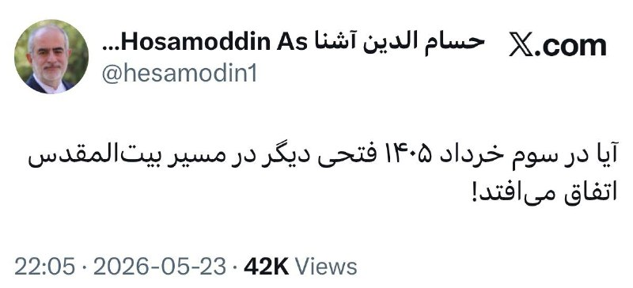

📷 Photo

## IranianMinds — post 20648

  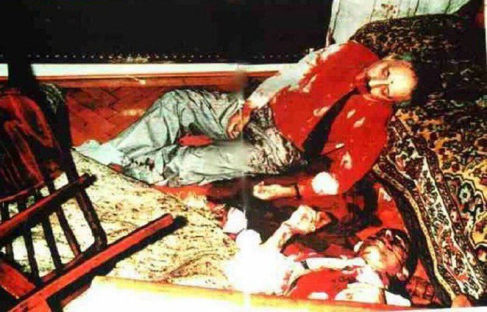

آخرین باری که جمهوری اسلامی مخالفانش را به مذاکره و گفتگو دعوت کرد، چنین اتفاقی افتاد!

عبدالرحمان قاسملو، پای میز مذاکره رفت و ترور شد!

در قاموسِ جمهوری اسلامی، بیائید مذاکره کنیم یعنی بیائید تا شما را به قتل برسانیم.

این نکته را هرگز فراموش نکنید!
و مطمئن باشید اطلاعات آمریکا بیشتر از ماست

@IranianMinds

## IranianMinds — post 20647

ثبت نام کن ۵۰۰ هزارتومان جایزه بگیر
نیازی هم به واریز نیست
تنها سایت مورد #تایید ما با بونوس های واقعی:

🌐 Winro.io

## IranianMinds — post 20646

  

⭕️ تا حالا بدون واریزی روی فوتبال ها شرط بستی؟!

🎉 500 هزارتومن بونوس رایگان فقط با ثبت نام بدون هیچگونه واریزی!

💳 شارژ سریع و امن با درگاه ریالی ، تتر یا ترون فقط با یک کلیک!

⌛ پشتیبانی 24 ساعته

💖تنها سایت مورد اعتماد ما با بونوس های کاملا واقعی و رویایی:

🌐 Winro.io

🌐 Winro.io
کانال بونوس های رایگان aa2

📱 @winro_io

## IranianMinds — post 20645

  

در تاریخ ننگ این دوره را با آب زمزم و کوثر هم نمیشود شست..!

👤 صادق هدایت

@IranianMinds

## BBCPersian — post 281906

  

🔻در پی اعلام دونالد ترامپ مبنی بر این که در چارچوب توافق احتمالی تنگه هرمز بازگشایی خواهد شد، برخی از رسانه‌های حکومتی جمهوری اسلامی به اظهارات او واکنش نشان دادند.

حسین شریعتمداری، مدیر روزنامه کیهان با «گلایه» از برخی دیپملات‌ها و تیم مذاکره‌کننده ایران گفت که «انگار قرار است بعد از پایان جنگ، شرایط و قوانین حاکم بر تنگه هرمز به حالت پیش از جنگ بازگردد.»

او تاکید کرد که «عوارض عبور، حق قانونی ایران اسلامی است و نباید نادیده گرفته شود.»

خبرگزاری فارس، نزدیک به سپاه پاسداران هم نوشت که «ادعای ترامپ در باره بازگشت تنگه هرمز به حالت قبل واقعیت ندارد.»

این رسانه حکومتی نزدیک به سپاه پاسداران مدعی شد که «براساس آخرین متن ردوبدل‌شده، در صورت توافق احتمالی، تنگه هرمز کماکان تحت مدیریت ایران خواهد بود.»

خبرگزاری فارس در عین حال نوشت که «گرچه ایران موافقت کرده اجازه دهد تعداد کشتی‌های عبوری به میزان قبل از جنگ بازگردد، اما این به‌هیچ‌عنوان به معنای «تردد آزاد» به وضعیت قبل از جنگ نیست.»

📸 ایرنا

https://bbc.in/4dtIPCY
@BBCPersian

## BBCPersian — post 281905

  

🔻دونالد ترامپ، رئیس جمهور آمریکا در شبکه اجتماعی تروث سوشال اعلام کرد که گفت‌وگوهای «بسیار خوبی» با شماری از رهبران منطقه داشته است اما جنبه‌ها و جزئیات نهایی توافق با ایران همچنان در حال بررسی است و «به‌زودی» اعلام خواهد شد.

او همچنین گفت که در چارچوب این توافق، تنگه هرمز بازگشایی خواهد شد.

آقای ترامپ می‌گوید که از دفتر بیضی کاخ سفید در باره ایران و «تفاهم‌نامه‌ای مرتبط با صلح» این گفت‌وگوها را انجام داده است.

او گفت که بخش عمده توافق میان آمریکا، ایران و دیگر کشورهای یادشده مورد مذاکره قرار گرفته، اما هنوز نهایی نشده است.

آقای ترامپ افزود که به‌طور جداگانه با بنیامین نتانیاهو، نخست‌وزیر اسرائیل، نیز گفت‌وگو کرده و این تماس هم «بسیار خوب» بوده است.

📸 Getty

https://bbc.in/4dtIPCY
@BBCPersian

## Dirty_Kids — post 390045

  <a href="telegram/content/Dirty_Kids_390045_1779575399.mp4" target="_blank">🎬 Download video</a>

نیرو ویژه آمریکا در کاخ سفید

طبق گزارشات نزدیک کاخ سفید تیراندازی سنگینی رخ داده و 20-30 گلوله شلیک شده!

@Dirty_Kids 👻

## Dirty_Kids — post 390044

  

فارس هم خبردرمانی میکنه بچه شیعه آروم بشه
آخه با قاتل رهبرشون رفتن توافق کردن

@Dirty_Kids 👻

## Dirty_Kids — post 390043

  

۲ دسته عرزشی وجود داره:

@Dirty_Kids 👻

## Dirty_Kids — post 390041

‏اصلا چرا من باید شخصی به نام “عاصم منیر” رو بشناسم؟ کیرم توی این سونوشت جدی. همین که شخصی به نام “عاصم منیر” رو می‌شناسیم یعنی باید رید توی این سرنوشت.

@Dirty_Kids 👻

## manototv — post 105787

  <a href="telegram/content/manototv_105787_1779575402.mp4" target="_blank">🎬 Download video</a>

تجمع ایرانیان ساکن کپنهاگ، دوم خرداد ۱۴۰۵

## alonews — post 122203

  <a href="telegram/content/alonews_122203_1779575403.webm" target="_blank">🎬 Download video</a>

👈طبق گزارش NBC News، صدای تیراندازی در خارج از کاخ سفید شنیده شد، با حدود ۲۰ تا ۳۰ گلوله شلیک شده. سرویس مخفی به خبرنگاران دستور داده است که برای حفظ جانشان به داخل اتاق جلسه بروند

✅ @AloNews خبر جنگ

## alonews — post 122202

  <a href="telegram/content/alonews_122202_1779575404.webm" target="_blank">🎬 Download video</a>

👈وال استریت ژورنال: ترامپ به دستیارانش گفته است که در صورت عدم پایبندی ایران به چارچوب توافق، حق از سرگیری بمباران ایران را برای خود محفوظ می‌دارد.

✅ @AloNews خبر جنگ

## alonews — post 122201

  <a href="telegram/content/alonews_122201_1779575404.webm" target="_blank">🎬 Download video</a>

👈نیویورک تایمز: ۲۵ میلیارد دلار از پولای بلوکه شده‌ی ایران قراره واسشون آزاد بشه

✅ @AloNews خبر جنگ

## alonews — post 122199

  <a href="telegram/content/alonews_122199_1779575404.webm" target="_blank">🎬 Download video</a>

👈نیویورک تایمز به نقل از 3 مقام ایرانی: توافق بر باز کردن تنگه هرمز و رفع محاصره دریایی آمریکا متمرکز است

🔴با یادداشت تفاهمی به توافق رسیدیم که جنگ را متوقف کند و تنگه هرمز را بازگشایی کند

🔴این توافق به جنگ در همه جبهه ها پایان می دهد

🔴توافق پرونده هسته ای را به مرحله بعدی موکول می کند

🔴در این توافقنامه آزادی کشتیرانی در تنگه هرمز بدون اعمال هزینه های ترانزیت قید شده است

✅ @AloNews خبر جنگ

## alonews — post 122198

  <a href="telegram/content/alonews_122198_1779575404.webm" target="_blank">🎬 Download video</a>

👈دلار 163000
🔽

✅ @AloNews خبر جنگ

## alonews — post 122197

  <a href="telegram/content/alonews_122197_1779575405.webm" target="_blank">🎬 Download video</a>

👈منابع موثق به المیادین:

🔴آنچه پیشنهاد می شود یک توافق نهایی نیست، بلکه یک یادداشت تفاهم است.

🔴این یادداشت تفاهم شامل هیچ بند مرتبط با پرونده هسته ای ایران نمی شود.

🔴این یادداشت بر پایان جنگ و ترتیبات آتش بس متمرکز است. این تفاهم نامه شامل تسهیل دریانوردی در تنگه هرمز است.

🔴این تفاهم نامه شامل خروج ناوگان آمریکایی از مجاورت ایران است.

🔴این تفاهم نامه شامل آزادسازی نیمی از وجوه مسدود شده ایران است که بالغ بر 12 میلیارد دلار است.

🔴این یادداشت شامل پایان محاصره نظامی دریایی ایالات متحده است. مهلت 30 روزه برای دستیابی به توافق هسته ای پس از امضای چارچوب توافق داده شد.

✅ @AloNews خبر جنگ

<!-- MSG END -->

<!-- NAV START -->

<a href="https://github.com/Dex316/aio-downloader/blob/main/telegram/content/archive_1.md" style="display:inline-block; padding:6px 12px; margin:0 4px; background-color:#2ea44f; color:white; text-decoration:none; border-radius:4px; font-weight:bold;">صفحه بعد</a>

<!-- NAV END -->
